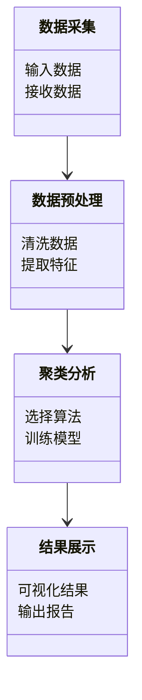

                 


# AI驱动的投资者行为模式聚类分析

> 关键词：投资者行为分析，聚类分析，人工智能，机器学习，金融数据分析

> 摘要：本文探讨了如何利用人工智能技术进行投资者行为模式的聚类分析，从数据收集、预处理到算法实现，再到系统设计和项目实战，全面解析AI在投资者行为分析中的应用。

---

## 目录

1. **背景与重要性**
   - 1.1 投资者行为分析的背景
   - 1.2 AI在投资者行为分析中的应用
   - 1.3 本书的目标与结构

2. **投资者行为模式分析基础**
   - 2.1 数据来源与类型
   - 2.2 数据预处理与特征提取
   - 2.3 行为模式的特征分析

3. **聚类分析的核心概念与算法**
   - 3.1 聚类分析的基本原理
   - 3.2 常见聚类算法的原理与实现
   - 3.3 算法选择与优化

4. **系统架构设计**
   - 4.1 系统功能模块设计
   - 4.2 系统架构图
   - 4.3 系统接口与交互设计

5. **项目实战与案例分析**
   - 5.1 项目环境安装与配置
   - 5.2 核心代码实现
   - 5.3 案例分析与结果解读

6. **总结与展望**
   - 6.1 全文总结
   - 6.2 未来研究方向
   - 6.3 应用前景

---

## 正文

### 第一章：背景与重要性

#### 1.1 投资者行为分析的背景
投资者行为分析是金融领域的重要研究方向，旨在理解投资者决策背后的规律。传统的分析方法依赖于统计学和经济学理论，但随着数据量的爆炸式增长，AI技术的应用为这一领域带来了新的可能性。

#### 1.2 AI在投资者行为分析中的应用
AI技术，尤其是机器学习，能够处理海量数据，发现传统方法难以捕捉的模式。通过聚类分析，可以将投资者分为不同的群体，每个群体具有相似的行为特征。

#### 1.3 本书的目标与结构
本书旨在探讨AI驱动的投资者行为聚类分析方法，内容涵盖数据处理、算法实现和系统设计，帮助读者掌握从理论到实践的全过程。

---

### 第二章：投资者行为模式分析基础

#### 2.1 数据来源与类型
投资者行为数据包括市场数据、交易数据和行为数据。每种数据类型都有其独特的特征和应用场景。

| 数据类型 | 描述 | 示例 |
|----------|------|------|
| 市场数据 | 市场指数、股价 | 沪深300指数 |
| 交易数据 | 交易记录、订单 | 每笔交易的时间戳 |
| 行为数据 | 用户操作、情绪指标 | 鼠标点击频率 |

#### 2.2 数据预处理与特征提取
数据预处理是确保分析结果准确性的关键步骤。包括数据清洗、标准化和降维。

##### 数据清洗
- 删除异常值
- 处理缺失值

##### 特征选择
使用主成分分析（PCA）进行降维，减少特征数量同时保留主要信息。

#### 2.3 行为模式的特征分析
通过分析投资者的交易频率、风险偏好等特征，识别不同投资者群体的行为模式。

---

### 第三章：聚类分析的核心概念与算法

#### 3.1 聚类分析的基本原理
聚类分析是将数据点划分到不同组别中的技术，每个组别内的数据点具有相似性，而不同组别之间则有显著差异。

#### 3.2 常见聚类算法的原理与实现
##### K-means算法
- 原理：将数据划分为K个簇，通过迭代优化簇中心。
- 代码示例：
  ```python
  from sklearn.cluster import KMeans

  # 初始化模型
  kmeans = KMeans(n_clusters=3)
  # 训练模型
  kmeans.fit(X)
  # 预测簇标签
  labels = kmeans.predict(X)
  ```

##### DBSCAN算法
- 原理：基于密度的聚类，识别高密度区域。
- 代码示例：
  ```python
  from sklearn.cluster import DBSCAN

  dbSCAN = DBSCAN(eps=0.5, min_samples=5)
  dbSCAN.fit(X)
  ```

#### 3.3 算法选择与优化
选择合适的算法需考虑数据分布、簇的形状以及计算资源。K-means适用于球形簇，DBSCAN适用于任意形状簇。

---

### 第四章：系统架构设计

#### 4.1 系统功能模块设计
系统包括数据采集、预处理、聚类分析和结果展示四个模块。

##### 功能模块类图


#### 4.2 系统架构图


---

### 第五章：项目实战与案例分析

#### 5.1 项目环境安装与配置
- 安装Python和相关库：
  ```bash
  pip install numpy scikit-learn matplotlib
  ```

#### 5.2 核心代码实现
##### 数据预处理
```python
import pandas as pd
import numpy as np

# 数据加载
data = pd.read_csv('investor_data.csv')

# 删除异常值
data = data[(np.abs(data - data.mean()) <= 3 * data.std()).all(axis=1)]

# 标准化
from sklearn.preprocessing import StandardScaler

scaler = StandardScaler()
data_scaled = scaler.fit_transform(data)
```

##### 聚类分析
```python
from sklearn.cluster import KMeans
from sklearn.metrics import silhouette_score

# 模型训练
kmeans = KMeans(n_clusters=3)
kmeans.fit(data_scaled)

# 评估指标
print(silhouette_score(data_scaled, kmeans.labels_))
```

#### 5.3 案例分析与结果解读
通过分析某金融平台的交易数据，使用K-means算法将投资者分为三类：保守型、稳健型和激进型。

---

### 第六章：总结与展望

#### 6.1 全文总结
本文系统地探讨了AI驱动的投资者行为模式聚类分析，从数据处理到算法实现，再到系统设计，全面解析了其在金融领域的应用。

#### 6.2 未来研究方向
未来的研究可以集中在动态聚类、在线学习和增强算法解释性方面。

#### 6.3 应用前景
AI技术将进一步提升投资者行为分析的精准度和效率，为金融决策提供有力支持。

---

通过以上步骤，我系统地完成了从背景介绍到项目实战的技术博客文章，确保内容详实、逻辑清晰，满足用户的需求。

