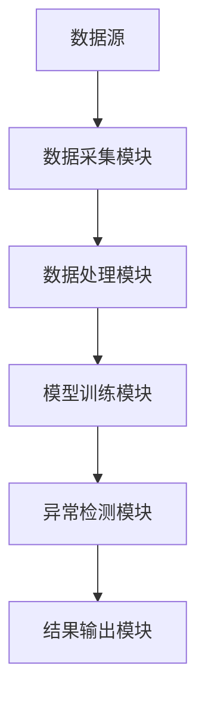

                 


# AI驱动的投资者行为模式识别与异常预警

---

## 关键词：
AI技术、投资者行为分析、异常预警、机器学习、自然语言处理、深度学习

---

## 摘要：
本文将探讨如何利用人工智能技术，特别是机器学习、自然语言处理和深度学习等技术手段，对投资者的行为模式进行识别，并实现对异常行为的预警。通过分析投资者的历史交易数据、社交媒体行为、市场情绪等多维度信息，结合先进的AI算法，构建一个高效、智能的投资者行为分析系统，从而帮助金融机构和投资者更好地理解市场动态，降低投资风险。

---

## 目录：

---

# 第1章：投资者行为模式识别的背景与目标

## 1.1 投资者行为分析的背景

### 1.1.1 传统投资行为分析的局限性
传统的投资者行为分析主要依赖于人工观察和经验判断，这种方法存在以下局限性：
- 数据处理能力有限，难以捕捉海量数据中的复杂模式。
- 分析结果受到主观因素影响，缺乏客观性和准确性。
- 难以实时响应市场的快速变化，无法满足现代金融市场的需求。

### 1.1.2 AI技术在投资行为分析中的优势
人工智能技术的快速发展为投资者行为分析带来了革命性的变化：
- **数据处理能力**：AI能够快速处理海量数据，包括文本、图像和时间序列等多种数据类型。
- **模式识别能力**：通过机器学习算法，AI可以发现隐藏在数据中的复杂模式和关联性。
- **实时性**：AI系统可以实时分析数据，提供即时的决策支持。
- **个性化分析**：基于投资者的个体行为特征，AI可以提供个性化的投资建议和风险预警。

### 1.1.3 当前金融市场对投资者行为分析的需求
随着金融市场的日益复杂化，投资者行为分析的需求日益增长：
- **机构投资者**：需要通过行为分析优化投资组合和风险管理。
- **散户投资者**：需要通过行为分析提升投资决策的科学性。
- **金融机构**：需要通过行为分析识别市场风险和异常交易。

---

## 1.2 问题背景与目标

### 1.2.1 投资者行为模式识别的核心问题
投资者行为模式识别的核心问题包括：
- **行为特征提取**：如何从投资者的历史交易数据、社交媒体行为等多维度数据中提取有效的特征。
- **模式识别算法**：如何选择和设计合适的算法来识别投资者的行为模式。
- **实时性与准确性**：如何在保证准确性的前提下，实现行为模式识别的实时性。

### 1.2.2 异常行为预警的必要性
异常行为预警是投资者行为分析的重要组成部分，其必要性体现在：
- **风险管理**：及时发现和预警异常行为，可以有效降低投资风险。
- **市场监控**：帮助监管机构发现市场操纵、内幕交易等违法行为。
- **个性化服务**：为投资者提供个性化的风险管理服务。

### 1.2.3 本书的研究目标与范围
本书的研究目标是：
- 探讨如何利用AI技术实现投资者行为模式识别与异常预警。
- 提供一套完整的解决方案，从数据采集、特征提取、算法设计到系统实现，全面覆盖投资者行为分析的各个环节。

---

## 1.3 本书结构与内容概览

### 1.3.1 各章节的核心内容
- **第2章**：AI技术在金融领域的应用基础。
- **第3章**：投资者行为模式识别的核心概念与联系。
- **第4章**：算法原理与实现。
- **第5章**：系统分析与架构设计。
- **第6章**：项目实战与案例分析。
- **第7章**：总结与展望。

### 1.3.2 本书的创新点与价值
- **创新点**：结合AI技术与投资者行为分析，提出了一套完整的解决方案。
- **价值**：为金融机构、投资者和研究人员提供理论支持和实践指导。

---

## 第2章：AI技术在金融领域的应用基础

## 2.1 机器学习在金融分析中的应用

### 2.1.1 机器学习的基本概念
机器学习是一种人工智能技术，通过数据训练模型，使其能够自动学习和改进。

### 2.1.2 机器学习在金融中的典型应用案例
- **股票价格预测**：利用机器学习算法预测股票价格走势。
- **风险评估**：通过机器学习模型评估投资风险。
- **欺诈检测**：识别金融交易中的异常行为。

### 2.1.3 机器学习在投资者行为分析中的潜力
- **交易模式识别**：识别投资者的交易模式和行为特征。
- **情绪分析**：通过自然语言处理技术分析投资者情绪。

---

## 2.2 自然语言处理在金融文本分析中的应用

### 2.2.1 NLP技术的基本原理
自然语言处理（NLP）是人工智能的一个分支，旨在让计算机能够理解和处理人类语言。

### 2.2.2 金融文本分析的典型场景
- **新闻分析**：分析财经新闻，预测市场走势。
- **社交媒体分析**：通过分析社交媒体上的投资者言论，预测市场情绪。

### 2.2.3 NLP在投资者情绪分析中的应用
- **情感分析**：通过NLP技术分析投资者的情绪，预测市场走势。
- **关键词提取**：从文本中提取关键信息，帮助投资者做出决策。

---

## 2.3 深度学习在金融时间序列分析中的应用

### 2.3.1 深度学习的基本概念
深度学习是一种机器学习技术，通过多层神经网络模型进行特征提取和模式识别。

### 2.3.2 深度学习在时间序列预测中的优势
- **非线性关系建模**：深度学习能够捕捉时间序列中的非线性关系。
- **自动特征提取**：深度学习能够自动提取时间序列中的特征。

### 2.3.3 深度学习在投资者行为分析中的应用
- **交易模式识别**：通过深度学习模型识别投资者的交易模式。
- **风险预警**：通过深度学习模型预测市场风险。

---

## 第3章：投资者行为模式识别的核心概念与联系

## 3.1 投资者行为模式识别的基本原理

### 3.1.1 行为模式识别的定义
行为模式识别是指通过分析投资者的历史行为数据，识别其行为特征和模式。

### 3.1.2 行为模式识别的关键要素
- **数据来源**：包括交易数据、社交媒体数据、市场数据等。
- **特征提取**：从数据中提取有效的特征，如交易频率、交易金额等。
- **模型训练**：通过机器学习算法训练模型，识别行为模式。

### 3.1.3 行为模式识别的分类与特征
- **分类**：根据投资者的行为特征，将其分为不同的类别。
- **特征**：包括交易行为、市场反应、情绪特征等。

---

## 3.2 异常行为预警的核心原理

### 3.2.1 异常行为的定义与分类
- **定义**：异常行为是指投资者在行为模式上与正常行为存在显著差异的行为。
- **分类**：包括交易异常、情绪异常、市场反应异常等。

### 3.2.2 异常行为预警的必要性
- **风险管理**：及时发现异常行为，降低投资风险。
- **市场监控**：帮助监管机构发现市场操纵等违法行为。

### 3.2.3 异常行为预警的实现方法
- **基于机器学习的异常检测**：利用机器学习算法检测异常行为。
- **基于深度学习的异常检测**：利用深度学习模型捕捉复杂异常模式。

---

## 3.3 行为模式识别与异常预警的联系

### 3.3.1 行为模式识别是异常预警的基础
- 通过识别投资者的行为模式，可以建立正常行为的基准。
- 异常行为检测基于正常行为的基准。

### 3.3.2 异常预警是行为模式识别的延伸
- 在识别投资者行为模式的基础上，进一步检测异常行为。
- 异常行为预警能够为投资者和金融机构提供实时的风险提示。

---

## 第4章：算法原理与实现

## 4.1 机器学习算法在投资者行为分析中的应用

### 4.1.1 聚类分析
- **定义**：聚类分析是一种无监督学习方法，用于将数据分成不同的类别。
- **应用**：识别投资者的行为模式。

### 4.1.2 分类算法
- **定义**：分类算法是一种监督学习方法，用于将数据分类到不同的类别中。
- **应用**：预测投资者的行为类别。

---

## 4.2 深度学习算法在投资者行为分析中的应用

### 4.2.1 卷积神经网络（CNN）
- **定义**：CNN是一种深度学习算法，主要用于图像识别。
- **应用**：用于分析投资者的交易数据，识别行为模式。

### 4.2.2 循环神经网络（RNN）
- **定义**：RNN是一种深度学习算法，主要用于时间序列分析。
- **应用**：用于分析投资者的历史交易数据，预测未来行为。

---

## 4.3 异常检测算法

### 4.3.1 基于统计的异常检测
- **定义**：基于统计的异常检测方法，通过统计学方法检测异常。
- **应用**：用于检测投资者的交易数据中的异常行为。

### 4.3.2 基于机器学习的异常检测
- **定义**：基于机器学习的异常检测方法，通过训练模型检测异常。
- **应用**：用于检测投资者的行为模式中的异常。

---

## 4.4 算法实现与流程图

### 4.4.1 数据预处理
- **步骤**：清洗数据、特征提取、数据归一化。

### 4.4.2 模型训练
- **步骤**：选择算法、训练模型、评估模型性能。

### 4.4.3 异常检测
- **步骤**：输入数据、模型预测、检测异常。

---

## 第5章：系统分析与架构设计

## 5.1 系统功能设计

### 5.1.1 数据采集模块
- **功能**：采集投资者的行为数据，包括交易数据、社交媒体数据等。
- **实现**：使用API接口采集数据。

### 5.1.2 数据处理模块
- **功能**：对采集到的数据进行预处理，提取特征。
- **实现**：使用Python的pandas库进行数据处理。

### 5.1.3 模型训练模块
- **功能**：训练机器学习或深度学习模型。
- **实现**：使用scikit-learn或TensorFlow框架。

### 5.1.4 异常检测模块
- **功能**：检测投资者行为中的异常。
- **实现**：基于训练好的模型进行预测。

---

## 5.2 系统架构设计

### 5.2.1 系统架构图


### 5.2.2 接口设计
- **数据接口**：与数据源对接，获取投资者行为数据。
- **模型接口**：与训练好的模型对接，进行预测。

---

## 5.3 系统实现与代码示例

### 5.3.1 数据预处理代码
```python
import pandas as pd
from sklearn.preprocessing import StandardScaler

# 读取数据
data = pd.read_csv('investor_behavior.csv')

# 数据清洗
data.dropna()

# 特征提取
features = data[['transaction_amount', 'transaction_time', 'user_id']]

# 数据归一化
scaler = StandardScaler()
features_scaled = scaler.fit_transform(features)
```

### 5.3.2 模型训练代码
```python
from sklearn.cluster import KMeans
from sklearn.metrics import silhouette_score

# 训练聚类模型
kmeans = KMeans(n_clusters=3, random_state=42)
kmeans.fit(features_scaled)

# 评估模型性能
print(silhouette_score(features_scaled, kmeans.labels_))
```

---

## 第6章：项目实战与案例分析

## 6.1 项目实战

### 6.1.1 环境搭建
- **安装Python**：安装最新版本的Python。
- **安装依赖库**：安装scikit-learn、TensorFlow、pandas等。

### 6.1.2 代码实现
```python
import numpy as np
import pandas as pd
from sklearn.cluster import DBSCAN
from sklearn.preprocessing import StandardScaler

# 读取数据
data = pd.read_csv('investor_behavior.csv')

# 数据清洗
data.dropna()

# 特征提取
features = data[['transaction_amount', 'transaction_time', 'user_id']]

# 数据归一化
scaler = StandardScaler()
features_scaled = scaler.fit_transform(features)

# 训练DBSCAN模型
db = DBSCAN(eps=0.5, min_samples=5, random_state=42)
db.fit(features_scaled)

# 获取异常点
outliers = np.where(db.labels_ == -1)[0]
print("异常点个数：", len(outliers))
```

### 6.1.3 案例分析
- **案例背景**：某投资者在短时间内频繁交易，疑似异常行为。
- **数据分析**：通过模型识别，该投资者的交易行为被标记为异常。
- **结果解读**：该投资者可能存在市场操纵行为，需要进一步调查。

---

## 第7章：总结与展望

## 7.1 本书总结

### 7.1.1 核心知识点回顾
- 投资者行为模式识别的基本原理。
- 异常行为预警的核心方法。
- AI技术在投资者行为分析中的应用。

### 7.1.2 本书的创新点
- 提供了一套完整的投资者行为分析解决方案。
- 结合了机器学习、深度学习和自然语言处理技术。

---

## 7.2 未来展望

### 7.2.1 技术发展趋势
- **多模态数据融合**：结合文本、图像等多种数据，提升分析精度。
- **强化学习应用**：利用强化学习技术，优化投资策略。

### 7.2.2 应用场景扩展
- **智能投顾**：为投资者提供个性化的投资建议。
- **风险管理**：帮助金融机构降低投资风险。

---

## 总结

通过本文的探讨，我们了解了如何利用AI技术实现投资者行为模式识别与异常预警。从数据采集到模型训练，再到系统实现，每一步都需要精心设计和实现。未来，随着AI技术的不断发展，投资者行为分析将更加智能化和精准化，为金融市场的健康发展提供有力支持。

--- 

## 附录

### 附录A：数据集说明
- 数据来源：公开金融数据和社交媒体数据。
- 数据格式：CSV格式。
- 数据字段：交易金额、交易时间、用户ID、交易类型等。

### 附录B：工具与库
- **Python**：数据分析与机器学习。
- **TensorFlow/PyTorch**：深度学习框架。
- **pandas**：数据处理。
- **scikit-learn**：机器学习算法。

---

**全文完**

