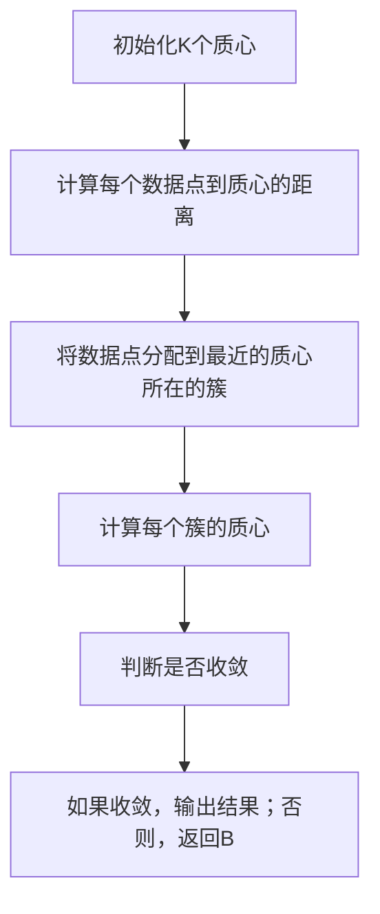
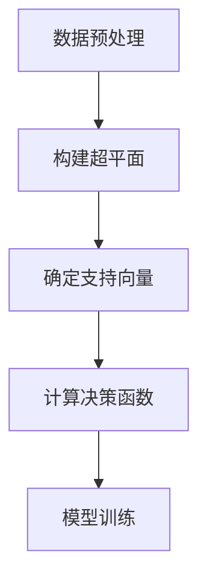
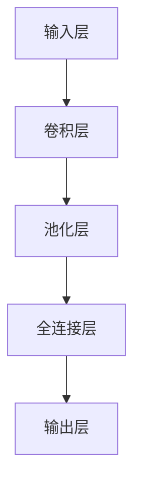
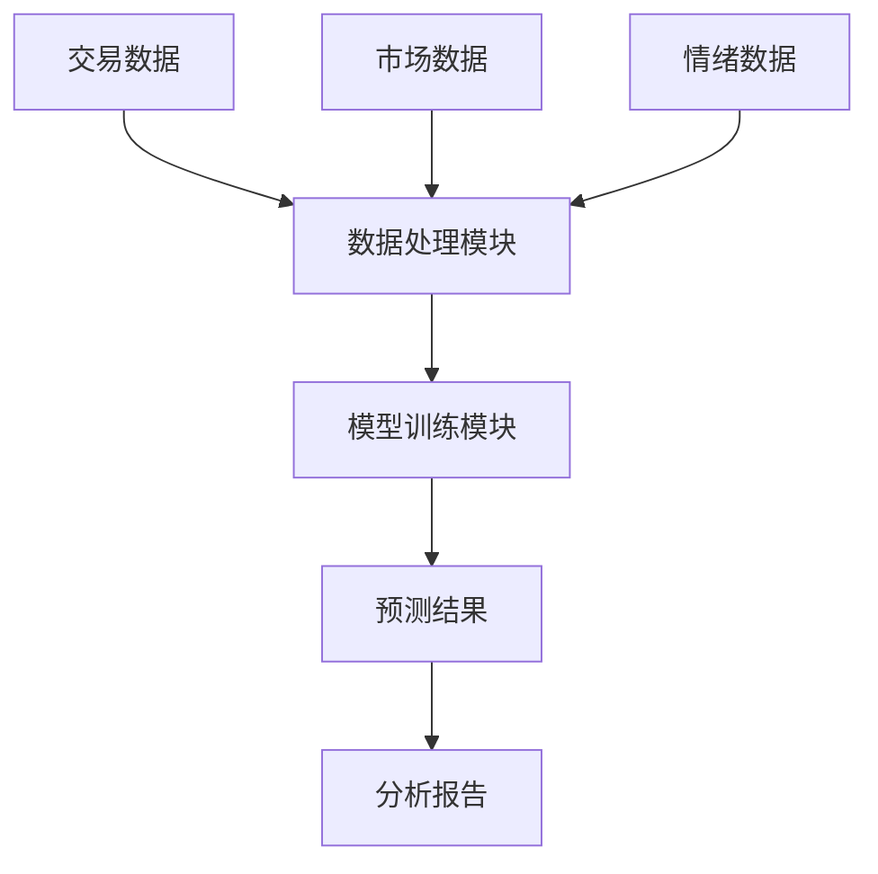

                 


# AI驱动的投资者行为模式识别与预测

> **关键词**：投资者行为分析、AI技术、模式识别、预测模型、深度学习  
>
> **摘要**：本文探讨了如何利用人工智能技术（AI）来识别和预测投资者的行为模式。文章从投资者行为分析的背景与挑战出发，深入分析了AI在投资者行为模式识别中的核心概念、算法原理、系统架构设计以及实际应用案例。通过结合聚类分析、分类算法和深度学习等技术，文章详细阐述了如何构建投资者行为模式识别系统，并通过实际案例展示了系统的实现与优化过程。最后，文章总结了当前的研究成果与未来的发展方向，为投资者行为分析领域提供了新的视角与方法。

---

## 第一部分：投资者行为模式识别的背景与挑战

### 第1章：投资者行为分析的背景与挑战

#### 1.1 投资者行为分析的背景

投资者行为分析是金融领域中的重要研究方向，旨在通过分析投资者的决策过程、交易行为和市场反应，揭示其行为模式和决策规律。传统的投资者行为分析主要依赖于统计学和经济学方法，但随着大数据和人工智能技术的快速发展，AI技术为投资者行为分析提供了更高效、更精准的工具。

近年来，金融市场呈现出高度复杂性和不确定性，投资者行为受多种因素影响，例如市场波动、经济政策、社交媒体情绪等。传统的分析方法难以捕捉这些复杂因素之间的相互作用，而AI技术则可以通过处理海量数据，提取隐含的模式和规律，为投资者行为分析提供新的解决方案。

---

#### 1.2 问题背景与目标

投资者行为模式识别的核心问题是如何从海量数据中提取有用的特征，并构建有效的模型来预测投资者的行为。具体来说，投资者行为模式识别的目标包括以下几点：

1. **行为模式识别**：通过分析投资者的历史交易数据，识别其行为模式，例如高频交易、趋势跟随等。
2. **行为预测**：基于识别出的行为模式，预测投资者在未来市场环境下的决策行为。
3. **风险控制**：通过分析投资者行为的潜在风险，为投资机构提供风险预警和决策支持。

投资者行为模式识别的边界包括投资者的交易数据、市场数据、情绪数据等，但不包括投资者的内部决策过程和非公开信息。

---

## 第二部分：投资者行为模式识别的核心概念

### 第2章：投资者行为模式识别的核心概念

#### 2.1 投资者行为数据的特征分析

投资者行为数据具有以下特征：

1. **时间序列性**：投资者行为数据通常以时间序列的形式存在，例如交易时间、交易频率等。
2. **多样性**：投资者行为数据可能涉及多种类型的数据，例如交易数据、市场数据、社交媒体情绪数据等。
3. **复杂性**：投资者行为受多种因素影响，例如市场环境、投资者情绪等，导致数据具有高度复杂性。

#### 2.2 模式识别与预测的核心要素

模式识别与预测的核心要素包括：

1. **特征提取**：从投资者行为数据中提取有用的特征，例如交易频率、资产配置比例等。
2. **模型构建**：基于提取的特征，构建行为模式识别模型。
3. **预测与验证**：通过模型对投资者行为进行预测，并验证模型的准确性。

---

## 第三部分：AI驱动的投资者行为模式识别算法原理

### 第3章：AI算法在投资者行为模式识别中的应用

#### 3.1 聚类算法在行为模式识别中的应用

聚类算法是一种无监督学习方法，适用于将投资者分成不同的行为类别。以下以K-Means算法为例，详细讲解其原理和实现步骤。

##### K-Means算法原理与流程图

K-Means算法是一种常用的聚类算法，其原理如下：

1. **初始化**：随机选择K个初始质心。
2. **迭代优化**：计算每个质心到数据点的距离，将数据点分配到最近的质心所在的簇。
3. **更新质心**：计算每个簇的质心，并将其作为新的质心。
4. **收敛判断**：当质心不再变化或达到预设的迭代次数时，算法结束。

K-Means算法的流程图如下：



##### K-Means算法的Python实现

以下是K-Means算法的Python实现示例：

```python
import numpy as np
from sklearn.cluster import KMeans

# 生成随机数据
X = np.random.rand(100, 2)

# 初始化K-Means模型
kmeans = KMeans(n_clusters=3, random_state=0)

# 训练模型
kmeans.fit(X)

# 预测簇标签
labels = kmeans.predict(X)

print(labels)
```

---

#### 3.2 分类算法在行为预测中的应用

分类算法是一种监督学习方法，适用于根据投资者的特征数据预测其行为类别。以下以支持向量机（SVM）为例，详细讲解其原理和实现步骤。

##### SVM算法原理与流程图

SVM算法是一种常用的分类算法，其原理如下：

1. **数据预处理**：对数据进行标准化或归一化处理。
2. **构建超平面**：寻找一个超平面，使得正负样本被正确分类。
3. **支持向量确定**：确定支持向量，并计算决策函数。
4. **模型训练**：通过优化算法求解模型参数。

SVM算法的流程图如下：



##### SVM算法的Python实现

以下是SVM算法的Python实现示例：

```python
from sklearn import svm

# 生成随机数据
X = np.random.rand(100, 2)
y = np.random.randint(0, 2, 100)

# 初始化SVM模型
model = svm.SVC()

# 训练模型
model.fit(X, y)

# 预测结果
print(model.predict(X))
```

---

#### 3.3 深度学习模型在行为模式识别中的应用

深度学习模型是一种基于人工神经网络的算法，适用于处理复杂的非线性关系。以下以卷积神经网络（CNN）为例，详细讲解其原理和实现步骤。

##### CNN算法原理与流程图

CNN算法是一种常用的深度学习模型，其原理如下：

1. **输入层**：接收输入数据。
2. **卷积层**：提取数据的特征。
3. **池化层**：降低模型复杂度，提取全局特征。
4. **全连接层**：分类输出。

CNN算法的流程图如下：



##### CNN算法的Python实现

以下是CNN算法的Python实现示例：

```python
import torch
import torch.nn as nn
import torch.optim as optim

# 定义CNN模型
class Net(nn.Module):
    def __init__(self):
        super(Net, self).__init__()
        self.conv1 = nn.Conv2d(1, 6, 5)
        self.pool = nn.MaxPool2d(2, 2)
        self.conv2 = nn.Conv2d(6, 16, 5)
        self.fc1 = nn.Linear(16 * 5 * 5, 120)
        self.fc2 = nn.Linear(120, 10)

    def forward(self, x):
        x = self.pool(F.relu(self.conv1(x)))
        x = self.pool(F.relu(self.conv2(x)))
        x = x.view(-1, 16 * 5 * 5)
        x = F.relu(self.fc1(x))
        x = F.softmax(self.fc2(x), dim=1)
        return x

# 初始化模型和优化器
model = Net()
criterion = nn.NLLLoss()
optimizer = optim.SGD(model.parameters(), lr=0.001)

# 训练模型
for epoch in range(10):
    for inputs, labels in dataloaders:
        outputs = model(inputs)
        loss = criterion(outputs, labels)
        loss.backward()
        optimizer.step()
```

---

## 第四部分：投资者行为模式识别的系统架构设计

### 第4章：投资者行为模式识别的系统架构设计

#### 4.1 系统功能设计

投资者行为模式识别系统的功能设计如下：

1. **数据采集模块**：采集投资者的交易数据、市场数据和情绪数据。
2. **数据处理模块**：对数据进行清洗、转换和特征提取。
3. **模型训练模块**：基于特征数据训练行为模式识别模型。
4. **预测与分析模块**：对投资者行为进行预测，并生成分析报告。

#### 4.2 系统架构设计

投资者行为模式识别系统的架构设计如下：

1. **数据层**：包括交易数据、市场数据和情绪数据。
2. **业务逻辑层**：包括数据处理、模型训练和预测功能。
3. **用户界面层**：包括数据输入、结果展示和报告生成。

系统的数据流图如下：



---

## 第五部分：投资者行为模式识别的实战案例

### 第5章：投资者行为模式识别的实战案例

#### 5.1 环境配置

以下是以Python为例的环境配置：

```bash
# 安装必要的库
pip install numpy pandas scikit-learn torch matplotlib
```

#### 5.2 代码实现

以下是投资者行为模式识别系统的实现代码示例：

```python
import numpy as np
import pandas as pd
from sklearn.cluster import KMeans
from sklearn.svm import SVC
from sklearn.metrics import accuracy_score

# 生成随机数据
X = np.random.rand(100, 2)
y = np.random.randint(0, 2, 100)

# 初始化K-Means模型
kmeans = KMeans(n_clusters=2, random_state=0)
kmeans.fit(X)
labels = kmeans.predict(X)

# 初始化SVM模型
model = SVC()
model.fit(X, y)

# 预测结果
print("聚类结果:", labels)
print("分类结果:", model.predict(X))
print("分类准确率:", accuracy_score(y, model.predict(X)))
```

#### 5.3 案例分析与优化

通过上述代码实现，我们可以分析投资者的行为模式，并验证模型的准确性。例如，聚类结果可以揭示投资者的交易习惯，分类结果可以预测投资者的交易决策。

---

## 第六部分：总结与展望

### 第6章：总结与展望

#### 6.1 本章总结

本文详细探讨了AI驱动的投资者行为模式识别与预测的核心概念、算法原理和系统架构设计。通过结合聚类分析、分类算法和深度学习等技术，本文提出了一种高效的投资者行为模式识别方法，并通过实际案例展示了系统的实现与优化过程。

#### 6.2 未来展望

未来，投资者行为模式识别与预测将朝着以下几个方向发展：

1. **多模态数据融合**：结合交易数据、市场数据、社交媒体情绪数据等多种数据源，提高模型的准确性和鲁棒性。
2. **实时预测与决策**：通过实时数据流处理技术，实现投资者行为的实时预测与决策支持。
3. **个性化投资策略**：基于投资者行为模式的个性化分析，制定差异化的投资策略。

---

**注意事项**：
1. 本文所述的算法和方法仅作为学术研究和技术创新的参考，实际应用中需结合具体场景和法律法规。
2. 投资者行为分析需遵守相关法律法规，保护投资者隐私和数据安全。

**拓展阅读**：
1. 《机器学习实战》
2. 《深度学习入门：基于Python的CNN、RNN、GAN基础》
3. 《金融数据分析与建模》

--- 

**THE END**

