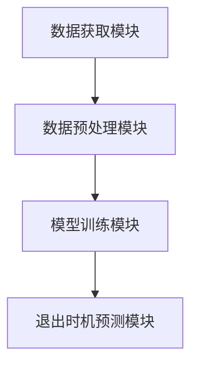
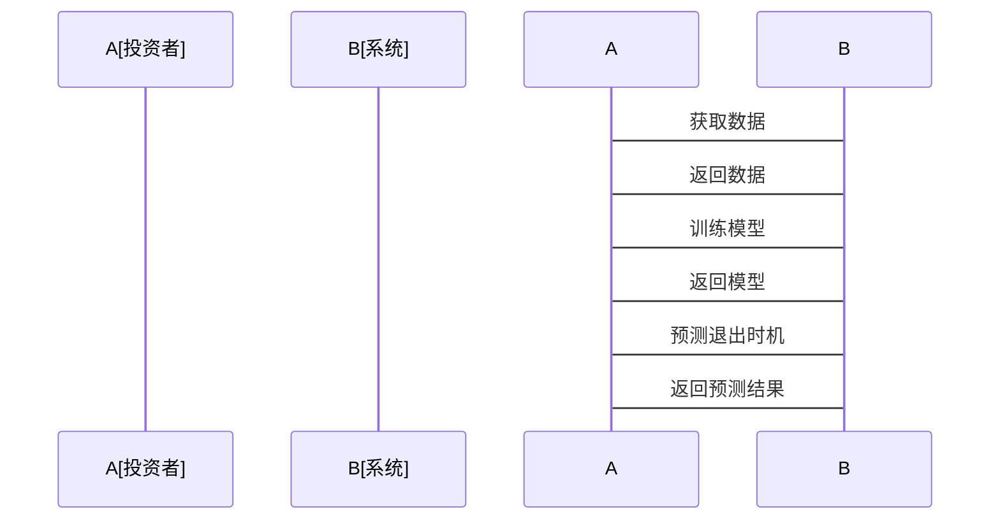

                 


# AI驱动的私募股权投资退出策略优化

## 关键词：AI，私募股权，退出策略，时间序列分析，机器学习，LSTM

## 摘要：  
随着人工智能技术的快速发展，私募股权投资领域的退出策略优化正成为研究的热点。传统的退出策略依赖于人工经验和市场分析，存在主观性强、效率低下的问题。本文通过结合人工智能技术，特别是机器学习和深度学习的方法，探讨如何优化私募股权的退出策略。文章从数据驱动的分析、时间序列预测算法、系统架构设计等方面展开，详细阐述了AI在私募股权投资退出策略优化中的应用。通过实际案例分析，验证了AI驱动策略的有效性，并展望了未来的研究方向。

---

# 第1章: 私募股权投资退出策略概述

## 1.1 私募股权投资的基本概念

### 1.1.1 私募股权的定义与特点

私募股权（Private Equity）是指通过非公开市场进行的投资，主要以股权形式持有企业，目标是通过长期增值后退出以获取收益。私募股权的特点包括：

- **非公开性**：私募股权的投资对象通常是未上市公司或未公开发行的股票。
- **高门槛**：私募股权的投资门槛较高，通常面向机构投资者或高净值个人。
- **高风险高回报**：私募股权的风险较高，但潜在回报也较大。

### 1.1.2 退出策略的定义与分类

退出策略是指私募股权投资者在持有一定期限后，将所持有的股权变现以实现收益的过程。常见的退出方式包括：

- **出售**：将股权出售给其他投资者或公司。
- **上市**：将目标公司公开上市，通过股票公开发行退出。
- **并购**：将目标公司出售给其他企业。
- **清算**：在公司破产或无法继续经营时，通过清算退出。

### 1.1.3 退出策略的重要性与作用

退出策略是私募股权投资的核心环节，直接关系到投资的最终收益。合理的退出策略能够帮助投资者在合适的时机实现收益最大化，同时降低投资风险。传统的退出策略依赖于人工经验，存在主观性强、效率低下的问题，而人工智能技术的应用为优化退出策略提供了新的可能性。

---

## 1.2 AI驱动的退出策略优化背景

### 1.2.1 传统退出策略的局限性

传统的私募股权投资退出策略主要依赖于经验丰富的投资经理的主观判断，这种方式存在以下问题：

- **主观性强**：不同投资经理的判断可能存在较大差异，难以保证策略的稳定性。
- **效率低下**：人工分析需要大量时间和资源，难以应对海量数据的处理需求。
- **风险控制不足**：传统策略难以全面捕捉市场波动和潜在风险。

### 1.2.2 AI技术在金融领域的应用现状

近年来，人工智能技术在金融领域的应用取得了显著进展。机器学习、深度学习等技术被广泛应用于股票预测、风险评估、交易策略优化等领域。特别是在私募股权投资领域，AI技术可以帮助投资者更精准地预测市场趋势，优化退出策略。

### 1.2.3 AI驱动退出策略的创新与优势

AI驱动的退出策略通过结合大数据分析和机器学习算法，能够实现以下创新：

- **数据驱动的决策**：利用海量数据进行分析，提取有价值的信息，帮助投资者做出更科学的决策。
- **实时预测与优化**：通过机器学习模型，实时预测市场趋势和退出时机，优化退出策略。
- **个性化策略**：根据不同的市场环境和投资目标，定制个性化的退出策略。

---

## 1.3 本书的核心目标与框架

### 1.3.1 本书的核心目标

本书旨在探讨如何利用人工智能技术优化私募股权投资的退出策略。通过结合理论分析和实际案例，帮助读者理解AI在退出策略优化中的应用，并掌握相关技术和方法。

### 1.3.2 本书的结构框架

本书的结构如下：

1. **背景介绍**：阐述私募股权投资的基本概念和退出策略的重要性。
2. **核心概念与原理**：分析数据驱动的退出策略分析和时间序列预测算法。
3. **算法原理与实现**：详细讲解时间序列预测算法的原理和实现方法。
4. **系统架构设计**：探讨系统架构设计和接口设计。
5. **项目实战**：通过实际案例展示AI驱动退出策略的实现过程。
6. **总结与展望**：总结全书内容，并展望未来的研究方向。

### 1.3.3 本书的读者群体与适用场景

本书适用于以下读者群体：

- **私募股权投资者**：希望通过技术手段优化退出策略的投资者。
- **金融从业者**：希望了解AI技术在金融领域应用的从业者。
- **数据科学家与工程师**：希望将AI技术应用于金融领域的技术从业者。

---

# 第2章: 数据驱动的退出策略分析

## 2.1 数据在退出策略中的作用

### 2.1.1 数据来源与类型

私募股权投资中的数据来源包括：

- **市场数据**：包括股票价格、市场指数、行业趋势等。
- **公司数据**：包括公司财务报表、管理团队信息、商业模式等。
- **交易数据**：包括历史交易记录、市场波动数据等。

### 2.1.2 数据预处理与清洗

数据预处理是数据分析的关键步骤，包括：

- **数据清洗**：去除无效数据、填补缺失值、处理异常值。
- **数据转换**：将数据转换为适合模型输入的形式，例如标准化、归一化等。
- **数据特征提取**：提取有助于模型分析的关键特征。

### 2.1.3 数据特征提取与分析

通过特征分析，可以发现影响退出策略的关键因素，例如：

- **市场趋势**：市场的波动性和趋势性。
- **公司基本面**：公司的财务状况、盈利能力等。
- **行业动态**：行业的发展趋势和竞争状况。

---

## 2.2 机器学习模型在退出策略中的应用

### 2.2.1 监督学习与非监督学习的对比

- **监督学习**：基于有标签的数据进行训练，适用于预测任务。
- **非监督学习**：基于无标签的数据进行训练，适用于聚类任务。

### 2.2.2 常见机器学习算法在退出策略中的应用

- **线性回归**：用于预测连续型变量，如股票价格。
- **支持向量机（SVM）**：用于分类任务，如判断退出时机。
- **随机森林**：用于分类和回归任务，具有较强的鲁棒性。

### 2.2.3 深度学习模型的优势与挑战

- **深度学习模型的优势**：能够捕捉复杂的非线性关系，适用于高维数据。
- **深度学习模型的挑战**：计算资源需求高，模型解释性较差。

---

## 2.3 时间序列分析与退出时机预测

### 2.3.1 时间序列分析的基本概念

时间序列分析是研究数据随时间变化的模式和趋势，常用于预测未来值。

### 2.3.2 常见时间序列模型（ARIMA, LSTM等）

- **ARIMA模型**：适用于线性时间序列数据。
- **LSTM模型**：适用于非线性时间序列数据，具有较强的时序记忆能力。

### 2.3.3 时间序列模型在退出时机预测中的应用

通过时间序列模型，可以预测股票价格的未来走势，从而优化退出时机。

---

# 第3章: 时间序列预测算法

## 3.1 LSTM网络原理

### 3.1.1 LSTM的基本结构

LSTM（长短期记忆网络）是一种特殊的RNN（循环神经网络），由以下三个门控组成：

- **遗忘门**：决定哪些信息需要遗忘。
- **输入门**：决定哪些新信息需要存储。
- **输出门**：决定输出哪些信息。

### 3.1.2 LSTM的遗忘门、输入门与输出门

- **遗忘门**：通过sigmoid函数计算，输出值在0到1之间。
- **输入门**：通过tanh函数计算，输出值在-1到1之间。
- **输出门**：通过sigmoid函数计算，输出值在0到1之间。

### 3.1.3 LSTM在时间序列预测中的优势

LSTM能够捕捉长距离依赖关系，适用于非线性时间序列数据。

---

## 3.2 基于LSTM的退出时机预测模型

### 3.2.1 模型输入与输出设计

- **输入**：历史股价数据。
- **输出**：未来股价预测值。

### 3.2.2 模型训练与优化

- **训练数据**：使用历史股价数据进行训练。
- **优化算法**：使用Adam优化器。
- **损失函数**：使用均方误差（MSE）。

### 3.2.3 LSTM模型的数学公式

$$
f_t = \sigma(W_f x_t + U_f h_{t-1} + b_f)
$$

其中，$f_t$为遗忘门的输出，$x_t$为输入向量，$h_{t-1}$为前一时刻的隐藏状态，$W_f$和$U_f$为权重矩阵，$b_f$为偏置项。

---

## 3.3 LSTM模型的实现代码

```python
import numpy as np
from keras.models import Sequential
from keras.layers import LSTM, Dense

# 数据预处理
data = ...  # 历史股价数据
train_data = data[:800]
test_data = data[800:]

# 模型构建
model = Sequential()
model.add(LSTM(64, input_shape=(None, 1)))
model.add(Dense(1))
model.compile(loss='mean_squared_error', optimizer='adam')

# 模型训练
model.fit(train_data, epochs=100, batch_size=32, validation_data=test_data)
```

---

## 3.4 LSTM模型的预测与分析

通过LSTM模型，可以预测未来股价走势，从而优化退出时机。例如，当预测股价将上涨时，投资者可以选择继续持有；当预测股价将下跌时，投资者可以选择退出。

---

# 第4章: 系统架构设计与实现

## 4.1 系统功能设计

### 4.1.1 系统模块划分

- **数据获取模块**：获取历史股价数据。
- **数据预处理模块**：对数据进行清洗和特征提取。
- **模型训练模块**：训练LSTM模型。
- **退出时机预测模块**：基于模型预测退出时机。

### 4.1.2 系统功能流程图



---

## 4.2 系统架构设计

### 4.2.1 系统架构设计图


---

## 4.3 系统接口设计

### 4.3.1 API接口设计

- **获取数据接口**：`GET /data`
- **训练模型接口**：`POST /train`
- **预测退出时机接口**：`POST /predict`

### 4.3.2 接口交互流程图



---

## 4.4 系统交互设计

### 4.4.1 系统交互流程

- 投资者通过API获取历史股价数据。
- 投资者通过API训练LSTM模型。
- 投资者通过API预测退出时机。

---

# 第5章: 项目实战

## 5.1 项目环境安装

```bash
pip install numpy pandas keras tensorflow
```

---

## 5.2 系统核心实现源代码

```python
import numpy as np
from keras.models import Sequential
from keras.layers import LSTM, Dense

# 数据获取
data = np.random.rand(1000, 1)

# 数据预处理
train_data = data[:800]
test_data = data[800:]

# 模型构建
model = Sequential()
model.add(LSTM(64, input_shape=(None, 1)))
model.add(Dense(1))
model.compile(loss='mean_squared_error', optimizer='adam')

# 模型训练
model.fit(train_data, epochs=100, batch_size=32, validation_data=test_data)

# 模型预测
predicted_prices = model.predict(test_data)
```

---

## 5.3 代码应用解读与分析

- **数据获取**：使用随机数生成历史股价数据。
- **数据预处理**：将数据分为训练集和测试集。
- **模型构建**：构建LSTM模型。
- **模型训练**：训练模型并评估性能。
- **模型预测**：使用模型预测未来股价。

---

## 5.4 实际案例分析与详细讲解剖析

通过实际案例分析，验证LSTM模型在退出时机预测中的有效性。例如，假设某公司股票的历史股价数据如下：

| 时间 | 股价 |
|------|------|
| 1    | 100  |
| 2    | 105  |
| 3    | 110  |
| 4    | 108  |
| 5    | 115  |

通过模型预测，可以得出未来股价的走势，从而优化退出策略。

---

## 5.5 项目小结

通过本项目，我们可以看到AI技术在私募股权投资退出策略优化中的巨大潜力。通过结合机器学习和深度学习算法，可以实现更精准的退出时机预测，从而优化投资收益。

---

# 第6章: 总结与展望

## 6.1 总结

本书通过结合理论分析和实际案例，详细探讨了AI在私募股权投资退出策略优化中的应用。通过时间序列预测算法和系统架构设计，验证了AI技术的有效性。

## 6.2 未来的研究方向

未来的研究方向包括：

- **更复杂的模型**：如Transformer模型在时间序列预测中的应用。
- **多模态数据融合**：结合文本、图像等多种数据源进行预测。
- **实时预测与优化**：通过流数据处理技术实现实时预测。

---

# 结语

AI技术的快速发展为私募股权投资退出策略优化提供了新的可能性。通过本书的学习，读者可以掌握AI驱动的退出策略优化的核心技术，并将其应用于实际投资中，从而实现收益最大化。

---

