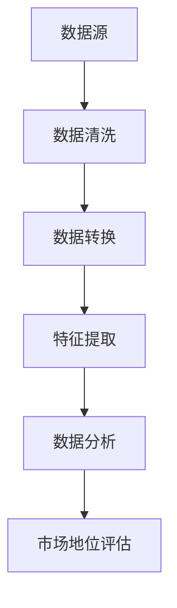
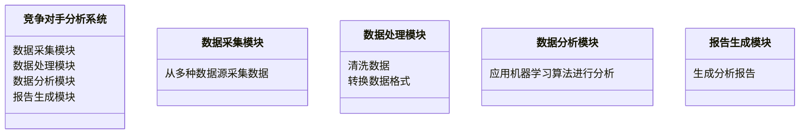
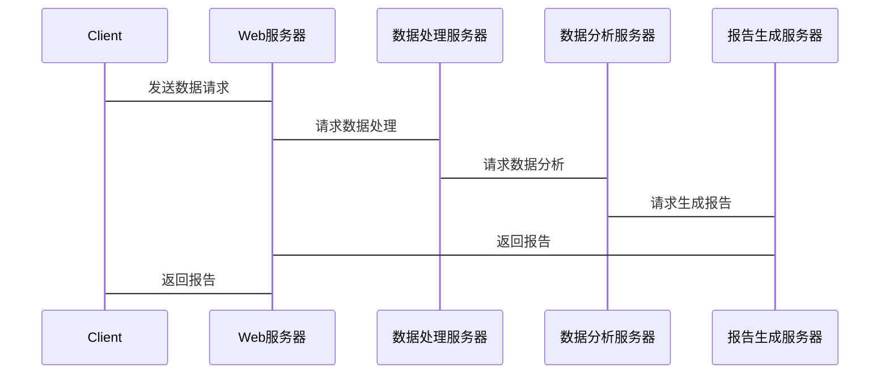

                 


### 2.1 核心概念原理

在AI驱动的竞争对手分析中，核心概念主要涉及数据的收集、处理和分析过程。AI技术通过处理大量非结构化数据，如文本、图像和视频，提取有价值的信息，从而帮助投资者评估竞争对手的市场地位。

#### 2.1.1 AI技术在竞争对手分析中的工作原理

AI通过以下步骤实现竞争对手分析：
1. **数据收集**：从多种来源获取数据，包括公司财报、新闻报道、社交媒体评论等。
2. **数据处理**：清洗数据，去除噪声，并将其转化为结构化数据。
3. **数据分析**：使用机器学习算法，如文本挖掘和情感分析，提取竞争对手的优势和劣势。
4. **市场地位评估**：根据分析结果，评估竞争对手的市场地位，并提供投资建议。

#### 2.1.2 数据处理流程（Mermaid流程图）



#### 2.1.3 竞争对手分析的Python代码示例

以下是一个简单的Python代码示例，展示了如何使用BeautifulSoup库从网页中抓取竞争对手的产品信息：

```python
from bs4 import BeautifulSoup
import requests

# 定义目标URL
url = 'https://example.com/products'

# 发送HTTP请求
response = requests.get(url)
soup = BeautifulSoup(response.text, 'html.parser')

# 提取产品信息
products = soup.find_all('div', class_='product-info')

# 提取每个产品的详细信息
for product in products:
    name = product.find('h3').text
    price = product.find('p', class_='price').text
    print(f"Product: {name}, Price: {price}")
```

### 2.2 系统分析与架构设计

在AI驱动的竞争对手分析系统中，系统设计是关键。以下是系统的架构设计：

#### 2.2.1 问题场景介绍

系统旨在帮助投资者通过AI技术快速分析竞争对手的市场地位，以便做出更明智的投资决策。系统需要处理大量的数据，包括文本、图像和表格数据，并生成详细的分析报告。

#### 2.2.2 系统功能设计（Mermaid类图）



#### 2.2.3 系统架构设计（Mermaid架构图）


#### 2.2.4 系统接口设计

系统主要接口包括：
- 数据采集接口：用于从不同数据源获取数据。
- 数据处理接口：用于清洗和转换数据。
- 数据分析接口：用于应用机器学习算法进行分析。
- 报告生成接口：用于生成分析报告。

#### 2.2.5 系统交互设计（Mermaid序列图）



通过以上系统设计，投资者可以快速、准确地评估竞争对手的市场地位，从而做出更明智的投资决策。在后续章节中，我们将详细介绍如何实现这些系统模块，并通过实际案例展示系统的应用效果。

