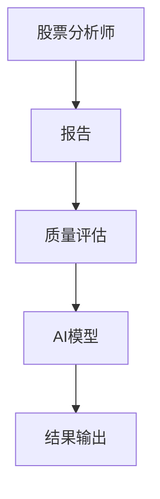
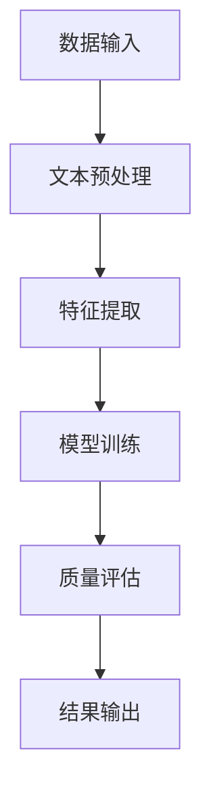
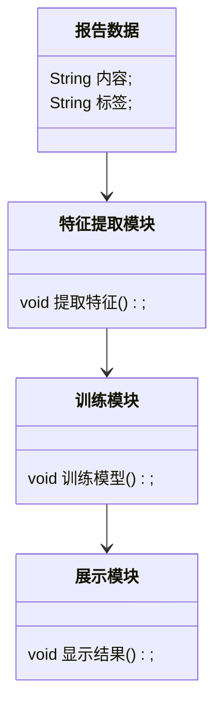
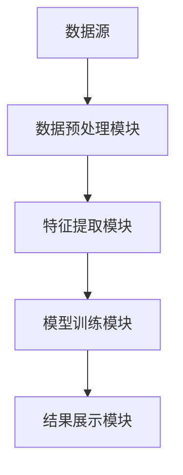
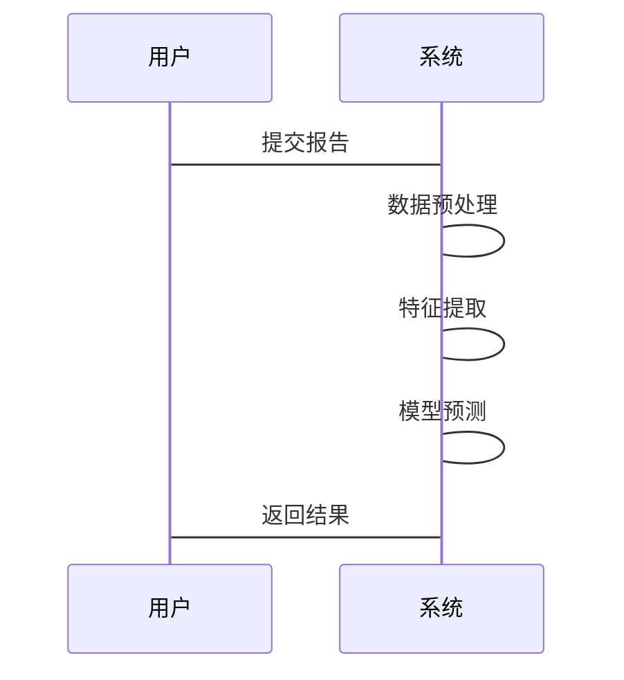

                 


# AI驱动的股票分析师报告质量评估

> 关键词：AI，股票分析师，报告质量，自然语言处理，机器学习，深度学习

> 摘要：本文探讨了如何利用人工智能技术，特别是自然语言处理和机器学习，来评估股票分析师报告的质量。通过分析报告的文本内容、情感倾向和数据准确性，AI系统能够帮助投资者更高效地筛选和评估分析报告，从而做出更明智的投资决策。

---

# 第一章: 背景介绍

## 1.1 问题背景

### 1.1.1 股票分析师报告的重要性
股票分析师的报告是投资者决策的重要依据。这些报告通常包含对市场趋势、个股分析、行业研究等内容，帮助投资者评估投资机会和风险。

### 1.1.2 传统报告质量评估的局限性
传统的报告质量评估依赖于人工阅读和分析，耗时且容易受到主观因素影响。此外，分析师可能因经验不足或利益驱动，提供质量参差不齐的报告。

### 1.1.3 AI技术在金融分析中的潜力
AI技术能够快速处理大量文本数据，提取关键信息，并通过机器学习模型预测报告的质量。这为投资者提供了更高效、客观的评估工具。

## 1.2 问题描述

### 1.2.1 报告质量评估的核心要素
报告质量评估的核心要素包括信息的准确性、逻辑性、深度分析和客观性。

### 1.2.2 AI驱动评估的目标与范围
AI驱动的报告质量评估目标是通过自动化手段，对报告的内容、结构和逻辑进行分析，提供客观的质量评分。

### 1.2.3 报告质量评估的边界与外延
报告质量评估的边界包括文本内容分析、数据来源验证和模型预测能力。其外延则涉及报告的可读性和信息的完整性。

## 1.3 问题解决

### 1.3.1 AI驱动评估的优势
AI能够快速处理大量数据，提供客观的评估结果，并通过不断学习提升评估精度。

### 1.3.2 技术实现的关键步骤
AI驱动的报告质量评估需要经过数据收集、文本预处理、特征提取、模型训练和结果分析等步骤。

### 1.3.3 报告质量提升的路径
通过AI技术优化报告生成流程，提供反馈机制，帮助分析师提升报告质量。

## 1.4 本章小结

---

# 第二章: 核心概念与联系

## 2.1 核心概念原理

### 2.1.1 自然语言处理在报告分析中的应用
自然语言处理技术用于解析报告文本，提取关键词和主题，帮助评估报告的内容深度。

### 2.1.2 机器学习在质量评估中的作用
机器学习模型能够根据历史数据，学习报告质量的特征，预测新的报告质量。

### 2.1.3 情感分析与文本挖掘的结合
情感分析帮助判断报告中的情感倾向，文本挖掘则提取有价值的信息，两者结合提升评估的准确性。

## 2.2 核心概念属性特征对比

| 特征 | 传统评估方法 | AI驱动评估 |
|------|----------------|------------|
| 评估速度 | 慢 | 快 |
| 评估准确性 | 受主观影响 | 客观 |
| 评估范围 | 有限 | 全面 |

## 2.3 ER实体关系图架构



## 2.4 本章小结

---

# 第三章: 算法原理讲解

## 3.1 算法流程



## 3.2 算法实现代码

### 3.2.1 文本预处理

```python
import numpy as np
from sklearn.feature_extraction.text import TfidfVectorizer

def preprocess(text):
    # 分词
    words = text.split()
    # 转换为小写
    words_lower = [word.lower() for word in words]
    return ' '.join(words_lower)
```

### 3.2.2 特征提取

```python
vectorizer = TfidfVectorizer()
X = vectorizer.fit_transform(texts)
```

### 3.2.3 模型训练

```python
from sklearn.svm import SVC
model = SVC()
model.fit(X, y)
```

### 3.2.4 质量评估

```python
y_pred = model.predict(X_test)
accuracy = np.mean(y_pred == y_test)
print(f'准确率: {accuracy}')
```

## 3.3 算法的数学模型和公式

### 3.3.1 TF-IDF计算公式
$$
TF-IDF = TF \times IDF
$$

其中，
$$
TF = \frac{\text{词项在文档中的出现次数}}{\text{文档总词数}}
$$

$$
IDF = \log\left(1 + \frac{\text{总文档数}}{\text{词项出现的文档数}}\right)
$$

### 3.3.2 支持向量机模型
$$
\text{目标函数: } \min \frac{1}{2}\|w\|^2 + C \sum_{i=1}^{n} \xi_i
$$

### 3.3.3 朴素贝叶斯分类
$$
P(y|X) = \frac{P(X|y)P(y)}{P(X)}
$$

## 3.4 实际案例分析

### 3.4.1 数据集准备
使用股票分析师报告的文本数据集，包括正面、中性和负面的报告。

### 3.4.2 模型训练与测试
将数据集分为训练集和测试集，训练模型并测试准确率。

### 3.4.3 结果分析
分析模型的预测结果，评估其对报告质量的判断能力。

## 3.5 本章小结

---

# 第四章: 系统分析与架构设计方案

## 4.1 问题场景介绍

### 4.1.1 系统功能设计
系统需要实现数据采集、特征提取、模型训练和结果展示等功能。



### 4.1.2 系统架构设计



### 4.1.3 系统接口设计
定义数据输入、特征提取和模型预测的接口。

### 4.1.4 系统交互流程



## 4.2 本章小结

---

# 第五章: 项目实战

## 5.1 环境安装

### 5.1.1 安装Python
```bash
python --version
pip install --upgrade pip
```

### 5.1.2 安装所需库
```bash
pip install numpy scikit-learn matplotlib
```

## 5.2 系统核心实现源代码

### 5.2.1 数据预处理

```python
import pandas as pd

data = pd.read_csv('reports.csv')
data['内容'] = data['内容'].apply(lambda x: preprocess(x))
```

### 5.2.2 特征提取

```python
from sklearn.feature_extraction.text import TfidfVectorizer

vectorizer = TfidfVectorizer()
X = vectorizer.fit_transform(data['内容'])
```

### 5.2.3 模型训练

```python
from sklearn.model_selection import train_test_split
from sklearn.metrics import accuracy_score

X_train, X_test, y_train, y_test = train_test_split(X, data['标签'], test_size=0.2)
model = SVC()
model.fit(X_train, y_train)
```

### 5.2.4 结果展示

```python
y_pred = model.predict(X_test)
print(f'准确率: {accuracy_score(y_test, y_pred)}')
```

## 5.3 实际案例分析

### 5.3.1 数据清洗与特征工程
对文本数据进行清洗，去除停用词，提取关键词。

### 5.3.2 模型训练与调优
使用交叉验证优化模型参数，提升预测准确率。

### 5.3.3 结果分析
分析模型的混淆矩阵和分类报告，找出误分类的案例。

## 5.4 本章小结

---

# 第六章: 最佳实践

## 6.1 成果总结

### 6.1.1 AI驱动评估的优势
AI能够显著提高报告质量评估的效率和准确性，帮助投资者做出更明智的决策。

### 6.1.2 实际应用中的注意事项
数据质量和模型选择对评估结果影响重大，需谨慎处理。

## 6.2 未来研究方向

### 6.2.1 更复杂的模型
探索深度学习模型，如BERT，提升文本理解能力。

### 6.2.2 多模态数据融合
结合市场数据和文本数据，构建更全面的评估系统。

## 6.3 注意事项

### 6.3.1 数据隐私
确保数据处理符合隐私保护法规。

### 6.3.2 模型解释性
提升模型的可解释性，便于用户理解和信任。

## 6.4 拓展阅读

### 6.4.1 推荐书籍
- 《Python机器学习》
- 《自然语言处理实战》

### 6.4.2 推荐博客
- [机器学习博客](example.com/ml-blog)
- [自然语言处理博客](example.com/nlp-blog)

## 6.5 本章小结

---

# 结语

通过本文的详细讲解，读者可以系统地了解AI在股票分析师报告质量评估中的应用。从背景介绍到算法实现，再到系统设计和项目实战，每一部分都为读者提供了深入的知识和实践指导。希望这本书能够帮助投资者和分析师更好地利用AI技术，提升报告质量，做出更明智的投资决策。

--- 

以上是《AI驱动的股票分析师报告质量评估》的完整目录和内容概要。

