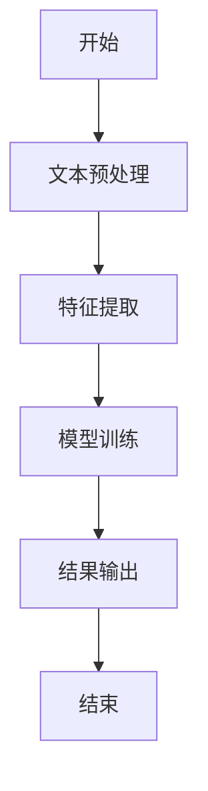

                 


# AI驱动的股票分析师报告质量评估

## 关键词：AI，股票分析，自然语言处理，文本相似度，深度学习，金融分析

## 摘要：本文探讨了如何利用人工智能和自然语言处理技术来评估股票分析师报告的质量。通过分析报告文本，结合先进的AI算法，我们提出了一个系统化的解决方案，从文本预处理、特征提取到模型训练，再到实际应用，全面展示了如何用技术手段提高金融分析的效率和准确性。

---

# 第一部分: AI驱动的股票分析师报告质量评估背景与基础

## 第1章: AI驱动的股票分析师报告质量评估背景介绍

### 1.1 问题背景与描述

#### 1.1.1 股票分析师报告的重要性
股票市场的复杂性和不确定性使得分析师报告在投资决策中扮演着至关重要的角色。这些报告通常包含对市场趋势、公司基本面、行业动态的深入分析，以及对股票估值的预测。然而，分析师报告的质量参差不齐，如何客观、高效地评估报告的质量成为一个亟待解决的问题。

#### 1.1.2 传统报告评估的局限性
传统的报告评估主要依赖人工阅读和主观判断，这种方法不仅耗时费力，还容易受到主观因素的影响。此外，面对海量的报告，人工评估的效率和准确性都难以满足市场需求。

#### 1.1.3 AI技术在金融分析中的应用潜力
人工智能和自然语言处理技术的快速发展为金融分析带来了新的可能性。通过AI技术，我们可以自动化地分析报告内容，提取关键信息，并量化报告的质量，从而为投资者提供更可靠的支持。

---

### 1.2 问题解决与边界

#### 1.2.1 AI驱动评估的核心目标
我们的目标是通过AI技术，建立一个自动化的报告质量评估系统，能够从报告的文本内容中提取特征，评估其信息量、逻辑性和准确性，并最终给出质量评分。

#### 1.2.2 问题解决的边界与外延
- 边界：仅关注报告文本内容，不涉及外部数据（如实时市场数据）。
- 外延：可扩展至多模态数据（如图像、图表）的分析。

#### 1.2.3 核心要素与概念组成
- **报告文本**：包括标题、摘要、正文、结论等部分。
- **评估指标**：如信息量、逻辑性、准确性、语言表达等。
- **AI模型**：如NLP模型、深度学习模型等。

---

### 1.3 核心概念与联系

#### 1.3.1 问题场景介绍
我们假设有一个股票分析师团队，他们定期发布报告。我们需要建立一个系统，对每份报告进行质量评估，并生成相应的反馈。

#### 1.3.2 核心概念原理
- **文本分析**：通过对报告文本的分析，提取关键词、主题、情感倾向等特征。
- **质量评估**：基于提取的特征，利用模型对报告的质量进行评分。

#### 1.3.3 概念属性特征对比表格
| 概念       | 属性       | 特征描述                                                                 |
|------------|------------|--------------------------------------------------------------------------|
| 报告文本   | 内容       | 包括市场分析、公司基本面、行业动态等内容                                         |
| 评估指标   | 信息量     | 报告中提供的信息是否全面、是否有新见解                                           |
|            | 逻辑性     | 报告的结构是否清晰、论证是否合理                                               |
|            | 准确性     | 报告中的数据和观点是否准确                                                   |
|            | 语言表达   | 语言是否通顺、专业术语使用是否恰当                                           |

#### 1.3.4 ER实体关系图
```mermaid
entity 报告 (Report) {
  id
  content
  author
}
entity 评估指标 (EvaluationMetric) {
  id
  name
  value
}
entity 分析模型 (AnalysisModel) {
  id
  name
  type
}
```

---

## 第2章: AI与NLP基础

### 2.1 AI在金融分析中的应用

#### 2.1.1 人工智能在金融领域的核心应用
- **股票预测**：通过历史数据和市场信息预测股票价格走势。
- **风险评估**：利用机器学习模型评估投资组合的风险。
- **新闻情感分析**：分析新闻文本的情感倾向，预测市场反应。

#### 2.1.2 自然语言处理在文本分析中的作用
- **文本分类**：将报告分为不同类别（如看多、看空、中性）。
- **实体识别**：识别报告中提到的公司、行业等实体。
- **文本摘要**：提取报告的核心观点。

#### 2.1.3 大模型在金融文本处理中的优势
- **预训练模型**：如BERT、GPT等模型在金融文本分析中表现出色。
- **多任务学习**：模型可以在多种任务上进行联合优化。

---

### 2.2 NLP基础与文本处理

#### 2.2.1 文本预处理方法
- **分词**：将文本分割成词语或短语。
- **去停用词**：去除无意义的词汇（如“的”、“是”等）。
- **词干提取**：将词语还原为词干。

#### 2.2.2 分词与词向量表示
- **分词工具**：如jieba（中文）、spaCy（英文）。
- **词向量模型**：如Word2Vec、GloVe。

#### 2.2.3 常见NLP任务与模型
| 任务         | 示例模型           |
|--------------|--------------------|
| 文本分类     | SVM、随机森林、深度学习模型（如BERT） |
| 文本相似度   | 余弦相似度、BM25    |
| 实体识别     | CRF、LSTM          |

---

### 2.3 金融文本分析的挑战与解决方案

#### 2.3.1 金融文本的复杂性
- **领域术语多**：如“市盈率”、“ROE”等专业术语。
- **文本长度不一**：报告可能长短不一，从几百字到数千字不等。

#### 2.3.2 多模态数据的融合
- **文本与数据**：结合报告中的文本和市场数据（如股价、成交量等）。
- **文本与图像**：分析报告中的图表信息。

#### 2.3.3 模型调优与优化策略
- **数据增强**：通过数据增强技术（如同义词替换）提高模型的泛化能力。
- **模型微调**：在特定领域数据上对模型进行微调。

---

## 第3章: 报告质量评估的核心算法原理

### 3.1 算法原理概述

#### 3.1.1 基于NLP的文本相似度计算
- **文本相似度**：通过计算两份报告之间的相似度，评估其内容的重复性或一致性。

#### 3.1.2 基于深度学习的文本分类
- **文本分类**：将报告分为不同类别（如积极、消极、中性）。

#### 3.1.3 多任务学习与联合优化
- **多任务学习**：同时优化多个任务（如文本分类和实体识别）。

---

### 3.2 算法流程图



---

### 3.3 数学模型与公式

#### 3.3.1 TF-IDF计算公式
$$ TF-IDF = \frac{TF \times ID}{\text{总文档数}} $$

其中，TF是词项在文档中的词频，ID是逆文档频率。

#### 3.3.2 余弦相似度计算公式
$$ \cos\theta = \frac{\sum_{i=1}^{n} w_i w'_i}{\sqrt{\sum_{i=1}^{n} w_i^2} \times \sqrt{\sum_{i=1}^{n} w'_i^2}} $$

其中，$w_i$和$w'_i$分别是两份文本中第$i$个词的权重。

#### 3.3.3 SVM分类器数学模型
$$ y = \text{sign}(\sum_{i=1}^{n} w_i x_i + b) $$

其中，$w_i$是权重，$x_i$是输入特征，$b$是偏置项。

---

### 3.4 代码实现与解读

#### 3.4.1 环境安装
```bash
pip install numpy scikit-learn
```

#### 3.4.2 核心代码实现
```python
from sklearn.feature_extraction.text import TfidfVectorizer
from sklearn.svm import SVC
from sklearn.metrics import accuracy_score

# 示例文本
texts = ["The company's revenue increased by 10% last quarter", 
         "The company's revenue decreased by 5% last quarter"]

# TF-IDF特征提取
vectorizer = TfidfVectorizer()
X = vectorizer.fit_transform(texts)

# SVM分类器训练
model = SVC()
model.fit(X, [1, 0])

# 预测
test_text = "The company's revenue remained stable last quarter"
test_X = vectorizer.transform([test_text])
predicted = model.predict(test_X)
print(predicted)  # 输出：[1]
```

---

## 总结

本文详细介绍了如何利用AI技术评估股票分析师报告的质量，从背景介绍到算法实现，再到系统架构设计，为读者提供了一个全面的解决方案。通过结合NLP技术和深度学习模型，我们可以实现自动化、高效的报告质量评估，从而帮助投资者做出更明智的决策。

---

### 最佳实践 Tips
1. 在实际应用中，建议结合多模态数据（如市场数据、图表信息）进行更全面的分析。
2. 定期更新模型，以适应市场变化和报告风格的演变。
3. 注意数据隐私问题，确保符合相关法律法规。

---

### 下一步
接下来，我们将详细介绍系统架构设计和项目实战部分，展示如何将理论付诸实践，实现一个完整的报告质量评估系统。

