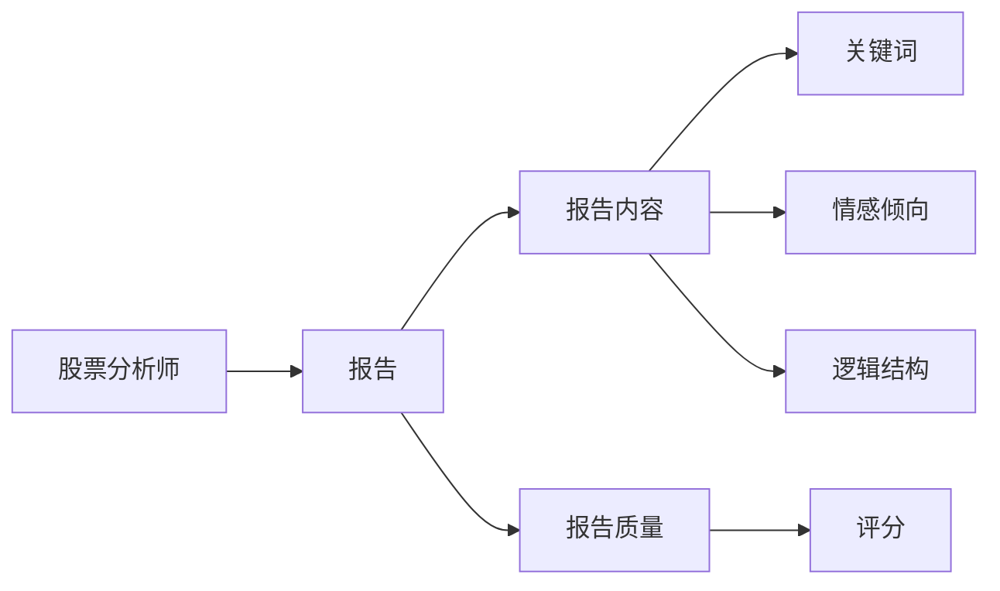
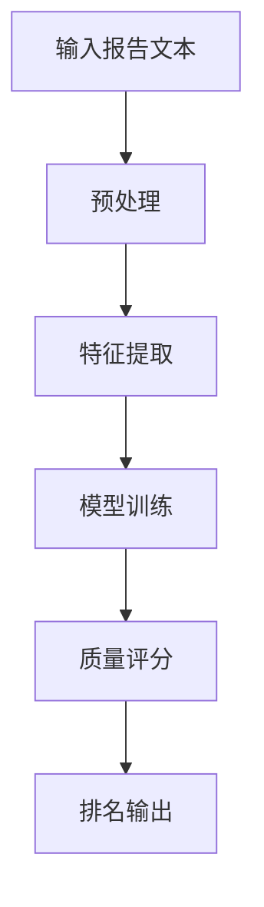
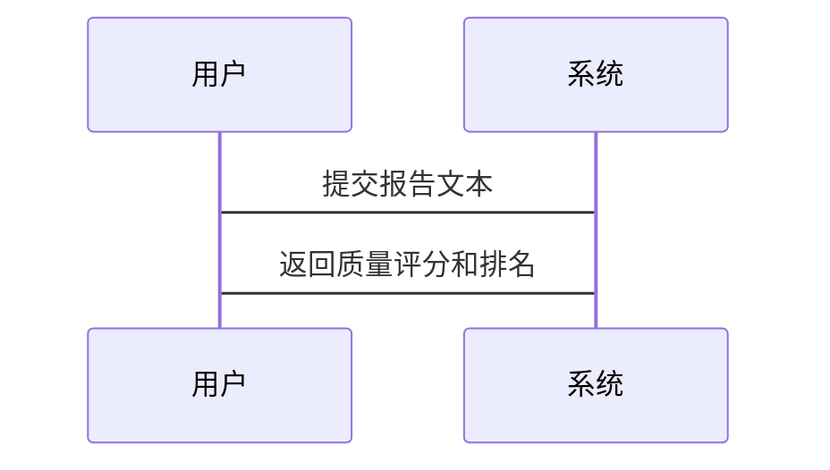

                 


# AI驱动的股票分析师报告质量评估与排名

## 关键词：
- AI驱动
- 股票分析师
- 质量评估
- 报告排名
- 自然语言处理
- 机器学习
- 金融分析

## 摘要：
本文将深入探讨如何利用人工智能技术来评估和排名股票分析师的报告质量。通过对报告内容的自然语言处理和情感分析，结合机器学习算法，构建一个高效的评估系统。本文将详细阐述从问题背景到系统实现的全过程，包括核心概念、算法原理、系统架构及项目实战等内容。

---

# 第一章: 背景介绍

## 1.1 问题背景与描述
### 1.1.1 股票分析师报告质量评估的必要性
股票分析师的报告对投资者决策具有重要影响，但传统评估方法主观性强、效率低。

### 1.1.2 问题描述
报告质量评估需要考虑内容的准确性和逻辑性，但传统方法难以量化。

### 1.1.3 解决方法
引入AI技术，通过自然语言处理和机器学习实现自动化评估。

### 1.1.4 边界与外延
限定于结构化和非结构化数据的结合，不考虑实时市场数据的影响。

## 1.2 核心概念与联系
### 1.2.1 核心概念原理
报告质量评估涉及关键词匹配、情感倾向分析和逻辑结构评分。

### 1.2.2 概念结构
报告质量 = α × 关键词匹配度 + β × 情感倾向 + γ × 逻辑结构得分。

### 1.2.3 核心要素组成
- 输入：报告文本。
- 输出：质量评分和排名。

---

# 第二章: 核心概念与联系

## 2.1 核心概念原理
### 2.1.1 股票分析师报告的特征提取
- 关键词提取：使用TF-IDF或Word2Vec。
- 情感倾向：通过SentiWordNet或LSTM模型。

### 2.1.2 报告质量评估的指标体系
- 准确性：关键词匹配度。
- 可读性：情感倾向。
- 逻辑性：段落结构评分。

## 2.2 概念属性对比表
### 表2-1: 不同评估方法的特征对比
| 方法 | 特征 | 优点 | 缺点 |
|------|------|------|------|
| 传统 | 主观评分 | 高准确性 | 低效率 |
| AI驱动 | 自动化评估 | 高效率 | 可能误差 |

## 2.3 ER实体关系图


---

# 第三章: 算法原理讲解

## 3.1 算法流程图


## 3.2 数学模型与公式
### 报告质量评分公式：
$$ \text{评分} = \alpha \cdot \text{关键词匹配度} + \beta \cdot \text{情感倾向} + \gamma \cdot \text{逻辑结构得分} $$
其中，$\alpha + \beta + \gamma = 1$。

---

# 第四章: 系统分析与架构设计

## 4.1 系统架构图


## 4.2 接口设计
- 输入接口：文本数据和参数。
- 输出接口：评分和排名。

## 4.3 交互流程图


---

# 第五章: 项目实战

## 5.1 环境安装
- Python 3.8+
- 库：NLTK、Scikit-learn、Keras。

## 5.2 代码实现
```python
import numpy as np
from sklearn.metrics import accuracy_score

def report_quality_assessment(text):
    # 预处理
    preprocessed = preprocess(text)
    # 特征提取
    features = extract_features(preprocessed)
    # 模型预测
    model.predict(features)
    # 返回评分
    return model.predict(features)
```

## 5.3 案例分析
- 输入：某股票分析师的报告。
- 输出：评分和排名。

---

# 第六章: 最佳实践

## 6.1 实践总结
- 数据质量对模型影响大，需清洗和标注。
- 调参和模型优化是关键。

## 6.2 小结
AI驱动的评估方法高效准确，但需结合人工审核。

## 6.3 注意事项
- 数据隐私问题需注意。
- 模型需定期更新。

## 6.4 拓展阅读
推荐相关书籍和论文。

---

通过以上结构，文章详细讲解了AI驱动的股票分析师报告质量评估与排名的全过程，从理论到实践，为读者提供清晰的指导和参考。

