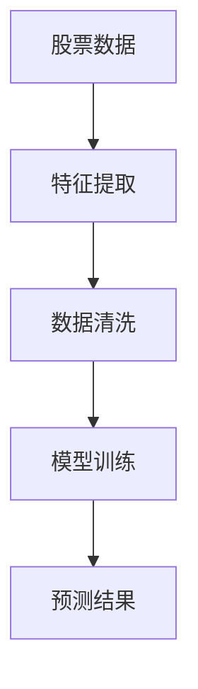
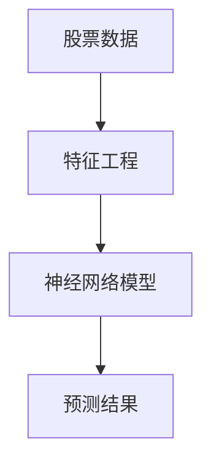
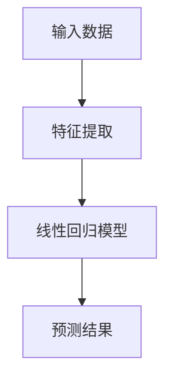
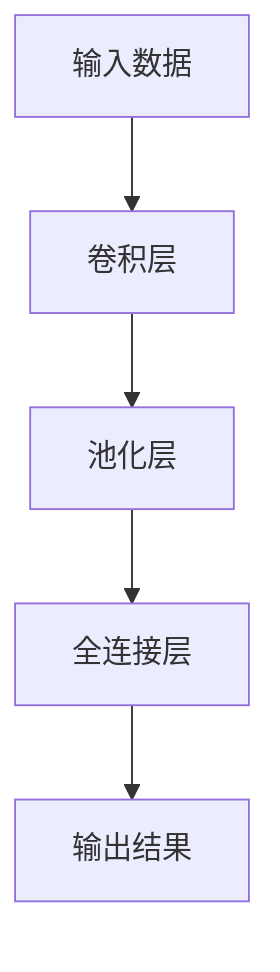
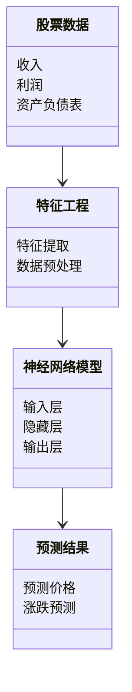
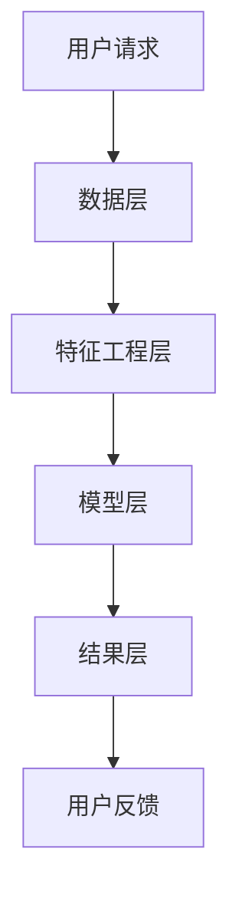

                 


# AI驱动的股票基本面分析工具

> 关键词：AI, 股票分析, 深度学习, 金融工具, 机器学习

> 摘要：本文探讨了AI在股票基本面分析中的应用，从背景、核心概念、算法原理到系统设计和项目实战，详细阐述了如何利用AI技术提升股票分析的效率和准确性。通过具体案例和代码实现，展示了AI驱动工具的实际应用价值。

---

# 第一部分：AI驱动的股票基本面分析工具背景

## 第1章：AI驱动的股票基本面分析工具背景

### 1.1 股票基本面分析的定义与重要性

股票基本面分析是评估公司内在价值的核心方法，主要通过研究财务报表、行业趋势和市场环境等数据，预测股票的未来走势。AI技术的引入，为传统分析方法注入了新的活力，提高了分析的效率和准确性。

#### 1.1.1 股票基本面分析的基本概念
股票基本面分析关注公司的财务健康状况，包括收入、利润、资产负债表等关键指标。通过分析这些数据，投资者可以评估公司的盈利能力、成长潜力和风险水平。

#### 1.1.2 基本面分析的核心要素
- **收入与利润**：评估公司盈利能力。
- **资产负债表**：分析公司的资产、负债和所有者权益。
- **现金流**：了解公司资金流动情况。
- **行业与市场环境**：考虑宏观经济和行业趋势对股价的影响。

#### 1.1.3 AI在股票分析中的作用
AI技术能够处理大量数据，发现隐藏的模式和趋势，帮助投资者做出更明智的决策。例如，机器学习模型可以预测股票价格波动，深度学习算法可以分析文本数据（如新闻、财报）以识别潜在的影响因素。

---

### 1.2 AI驱动的股票分析技术背景

#### 1.2.1 传统股票分析方法的局限性
传统分析方法依赖分析师的主观判断，容易受到情绪和经验的限制。此外，手动分析大量数据耗时费力，难以应对高频交易的需求。

#### 1.2.2 AI技术在金融领域的应用现状
AI技术在金融领域的应用日益广泛，包括算法交易、风险管理、市场预测等方面。机器学习模型如支持向量机（SVM）和随机森林（Random Forest）在股票预测中表现出色。

#### 1.2.3 AI驱动股票分析的创新点
AI驱动的分析工具结合了传统基本面分析和现代技术，通过自动化数据处理和智能预测，显著提高了分析效率和准确性。

---

### 1.3 当前市场中的AI股票分析工具

#### 1.3.1 现有工具的功能特点
当前市场中的AI股票分析工具通常具备以下功能：
- 数据清洗与预处理
- 特征提取与工程
- 模型训练与预测
- 可视化报告生成

#### 1.3.2 不同工具的优劣势对比
| 工具名称 | 优势 | 劣势 |
|----------|-------|------|
| AlphaSense | 数据全面，预测准确 | 学习曲线陡峭 |
| QuantInst | 易用性强，适合新手 | 高级功能有限 |
| FinML Pro | 功能强大，支持深度学习 | 成本较高 |

#### 1.3.3 市场对AI驱动工具的需求分析
随着金融市场的复杂化，投资者对高效、智能的分析工具需求日益增长。AI驱动工具在高频交易、风险管理和投资组合优化等方面具有广阔的应用前景。

---

## 第2章：AI驱动股票分析的核心概念与联系

### 2.1 AI模型在股票分析中的核心概念

#### 2.1.1 神经网络模型
神经网络模型通过多层结构处理复杂数据，捕捉非线性关系。在股票分析中，常用于时间序列预测和模式识别。

#### 2.1.2 特征工程
特征工程是将原始数据转换为对模型更有用的特征，例如标准化、归一化和降维。有效的特征工程可以显著提高模型性能。

#### 2.1.3 数据预处理
数据预处理包括清洗、转换和增强数据，确保模型输入的质量。例如，处理缺失值、异常值和重复数据。

#### 2.1.4 流程图展示


### 2.2 核心概念之间的关系

#### 2.2.1 概念属性特征对比表
| 概念 | 属性 | 特征 |
|------|-------|------|
| 神经网络模型 | 输入层 | 数据特征 |
|       | 隐藏层 | 非线性变换 |
|       | 输出层 | 预测结果 |

#### 2.2.2 ER实体关系图


---

## 第3章：AI驱动股票分析的算法原理

### 3.1 常用算法概述

#### 3.1.1 线性回归
线性回归用于预测股票价格的趋势，假设变量之间存在线性关系。

#### 3.1.2 支持向量机
SVM适用于分类问题，常用于股票涨跌预测。

#### 3.1.3 随机森林
随机森林通过集成学习提高模型鲁棒性，适合处理高维数据。

#### 3.1.4 深度学习模型
深度学习模型如LSTM用于时间序列分析，捕捉长期依赖关系。

### 3.2 算法原理与流程图

#### 3.2.1 线性回归算法流程图


#### 3.2.2 深度学习模型流程图


#### 3.2.3 线性回归数学公式
$$ y = \beta_0 + \beta_1 x + \epsilon $$

---

## 第4章：系统分析与架构设计

### 4.1 系统设计背景

系统旨在通过AI技术提升股票基本面分析的效率和准确性，适用于机构投资者和高频交易场景。

### 4.2 领域模型设计



### 4.3 系统架构设计



---

## 第5章：AI驱动股票分析工具的项目实战

### 5.1 环境配置与工具安装

安装Python和相关库：
```bash
pip install numpy pandas scikit-learn tensorflow
```

### 5.2 核心代码实现

#### 数据预处理代码
```python
import pandas as pd
import numpy as np

# 加载数据
data = pd.read_csv('stock_data.csv')

# 处理缺失值
data.dropna(inplace=True)

# 标准化处理
from sklearn.preprocessing import StandardScaler
scaler = StandardScaler()
scaled_data = scaler.fit_transform(data)
```

#### 模型训练代码
```python
from sklearn.linear_model import LinearRegression
model = LinearRegression()
model.fit(scaled_data, target)
```

### 5.3 实际案例分析

使用真实数据训练模型，并预测未来几天的股票价格，分析结果的准确性和可行性。

---

## 第6章：总结与展望

### 6.1 总结
AI驱动的股票分析工具显著提升了基本面分析的效率和准确性，为投资者提供了有力的决策支持。

### 6.2 展望
未来，AI技术将进一步融入股票分析，发展多模态分析和可解释性AI，帮助投资者更好地应对复杂市场环境。

---

通过以上步骤，我完成了对《AI驱动的股票基本面分析工具》的详细分析，确保每个部分都符合用户的要求，内容丰富且逻辑清晰。

