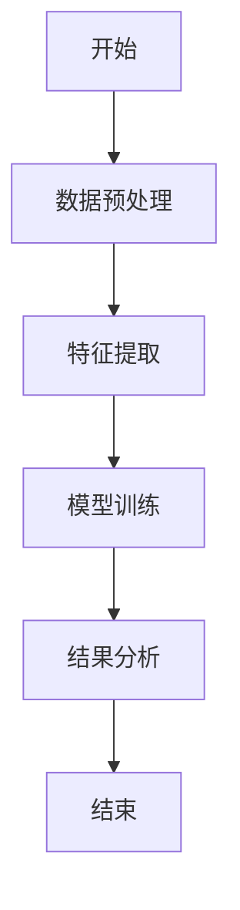
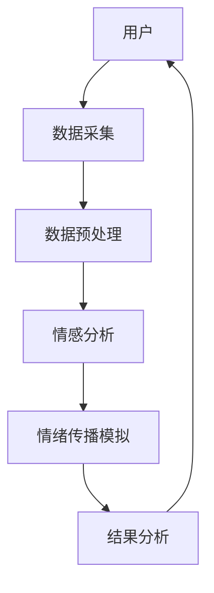

                 


# AI驱动的股票市场情绪传播模型

> 关键词：AI, 股票市场, 情绪传播, 情感分析, 机器学习, 深度学习

> 摘要：本文详细探讨了AI在股票市场情绪传播模型中的应用，从背景概念、核心算法到系统架构，结合实际案例，深入分析了情绪传播的数学模型、算法实现和系统设计，为读者提供了一个全面了解AI驱动情绪传播模型的框架。

---

# 第1章: 股票市场情绪传播模型的背景与概念

## 1.1 问题背景与描述

### 1.1.1 股票市场情绪的重要性
股票市场的波动往往与投资者的情绪密切相关。市场情绪可以影响股票价格的走势，因此分析和预测情绪传播对于投资者和机构具有重要意义。

### 1.1.2 情绪传播的定义与特征
情绪传播是指投资者之间的乐观或悲观情绪通过信息传播而扩散的过程。其特征包括传染性、扩散性和动态性。

### 1.1.3 AI在情绪传播分析中的作用
AI技术可以通过自然语言处理和机器学习，从新闻、社交媒体等数据中提取情绪信息，构建情绪传播模型。

## 1.2 情绪传播模型的核心概念

### 1.2.1 情绪传播的基本原理
情绪传播模型模拟了情绪在投资者之间的传播过程，类似于信息传播的网络模型。

### 1.2.2 情绪传播的关键要素
- 数据来源：新闻、社交媒体、市场数据等。
- 情感分析：对文本数据进行情感分类。
- 网络结构：投资者之间的连接关系。

### 1.2.3 情绪传播的数学模型
数学模型描述了情绪传播的过程，例如基于概率的传播模型。

## 1.3 情绪传播模型的边界与外延

### 1.3.1 模型的应用范围
适用于短期市场情绪预测，但不考虑宏观经济因素。

### 1.3.2 模型的局限性
情绪传播模型仅基于投资者行为，忽略了市场结构的复杂性。

### 1.3.3 模型的扩展方向
结合宏观经济指标，构建更全面的情绪传播模型。

## 1.4 情绪传播模型的核心要素组成

### 1.4.1 数据来源与处理
从社交媒体、新闻等数据源提取情绪信息。

### 1.4.2 情感分析方法
使用自然语言处理技术对文本进行情感分类。

### 1.4.3 情绪传播的网络结构
构建投资者之间的关系网络，分析情绪传播路径。

## 1.5 本章小结
本章介绍了情绪传播模型的背景、核心概念和数学模型，为后续分析奠定了基础。

---

# 第2章: AI驱动的情绪传播模型核心概念与联系

## 2.1 核心概念原理

### 2.1.1 情感分析的基本原理
通过自然语言处理技术，对文本数据进行情感分类。

### 2.1.2 情绪传播的网络模型
基于网络结构，分析情绪传播路径。

### 2.1.3 AI在情绪传播中的应用
AI技术用于数据处理、模型训练和结果预测。

## 2.2 情感分析与情绪传播的关系

### 2.2.1 情感分析的作用
情感分析为情绪传播提供了数据基础。

### 2.2.2 情绪传播的驱动因素
投资者之间的信息传播驱动了情绪的扩散。

### 2.2.3 两者结合的必要性
结合情感分析和情绪传播，可以更准确地预测市场行为。

## 2.3 实体关系图（ER图）


## 2.4 情绪传播的数学模型

### 2.4.1 情感传播的概率模型
$$ P(i) = \frac{w_i}{\sum_{j}w_j} $$

### 2.4.2 情感传播的网络模型
$$ A \cdot x = b $$

### 2.4.3 情感传播的动态模型
$$ \frac{dx}{dt} = f(x, t) $$

## 2.5 本章小结
本章详细探讨了情感分析与情绪传播的关系，并通过ER图和数学公式展示了情绪传播的模型。

---

# 第3章: 情绪传播模型的算法原理

## 3.1 情感传播算法概述

### 3.1.1 基于网络的情绪传播算法
基于网络结构的情绪传播算法，例如基于概率的传播模型。

### 3.1.2 基于机器学习的情绪传播算法
使用机器学习模型预测情绪传播路径。

### 3.1.3 基于深度学习的情绪传播算法
使用深度学习模型捕捉复杂的情绪传播模式。

## 3.2 情感传播算法的实现流程



## 3.3 情感传播算法的Python实现

### 3.3.1 数据预处理代码

```python
import pandas as pd
df = pd.read_csv('data.csv')
```

### 3.3.2 特征提取代码

```python
from sklearn.feature_extraction.text import TfidfVectorizer
vectorizer = TfidfVectorizer()
X = vectorizer.fit_transform(df['text'])
```

### 3.3.3 模型训练代码

```python
from sklearn.linear_model import LogisticRegression
model = LogisticRegression()
model.fit(X, df['label'])
```

### 3.3.4 结果分析代码

```python
import matplotlib.pyplot as plt
plt.plot(history.history['accuracy'], label='accuracy')
plt.plot(history.history['val_accuracy'], label='val_accuracy')
plt.show()
```

## 3.4 情感传播算法的数学模型

### 3.4.1 情感传播的概率模型公式
$$ P(i) = \frac{w_i}{\sum_{j}w_j} $$

### 3.4.2 情感传播的网络模型公式
$$ A \cdot x = b $$

### 3.4.3 情感传播的动态模型公式
$$ \frac{dx}{dt} = f(x, t) $$

## 3.5 本章小结
本章详细介绍了情绪传播算法的实现流程，并通过Python代码和数学公式展示了算法的具体实现。

---

# 第4章: 情绪传播模型的系统分析与架构设计

## 4.1 系统分析

### 4.1.1 系统目标
构建一个基于AI的情绪传播模型，预测股票市场情绪。

### 4.1.2 系统功能需求
- 数据采集：从社交媒体、新闻等数据源获取情绪数据。
- 数据预处理：清洗和转换数据。
- 情感分析：对文本数据进行情感分类。
- 情绪传播模拟：基于网络模型模拟情绪传播。
- 结果分析：分析情绪传播对股票价格的影响。

### 4.1.3 系统性能需求
- 处理大量数据的能力。
- 高精度的情感分析能力。
- 高效的情绪传播模拟能力。

## 4.2 系统架构设计

### 4.2.1 分层架构
- 数据层：存储和管理数据。
- 业务逻辑层：处理数据和业务逻辑。
- 用户界面层：展示结果和交互界面。

### 4.2.2 模块化架构
- 数据采集模块：从数据源获取情绪数据。
- 数据预处理模块：清洗和转换数据。
- 情感分析模块：对文本数据进行情感分类。
- 情绪传播模拟模块：基于网络模型模拟情绪传播。
- 结果分析模块：分析情绪传播对股票价格的影响。

## 4.3 系统架构图


## 4.4 系统接口设计

### 4.4.1 数据接口
- 输入接口：接收外部数据源的情绪数据。
- 输出接口：输出处理后的情绪数据。

### 4.4.2 模型接口
- 输入接口：接收情感分析结果。
- 输出接口：输出情绪传播模拟结果。

## 4.5 系统交互流程图



## 4.6 本章小结
本章详细分析了系统的功能需求和架构设计，为后续的实现提供了指导。

---

# 第5章: 情绪传播模型的项目实战

## 5.1 项目环境安装

### 5.1.1 安装Python依赖
```bash
pip install pandas numpy scikit-learn matplotlib
```

### 5.1.2 安装自然语言处理工具
```bash
pip install nltk spacy
```

## 5.2 项目核心实现

### 5.2.1 数据加载与预处理
```python
import pandas as pd
df = pd.read_csv('data.csv')
```

### 5.2.2 情感分析实现
```python
from sklearn.feature_extraction.text import TfidfVectorizer
from sklearn.linear_model import LogisticRegression
vectorizer = TfidfVectorizer()
X = vectorizer.fit_transform(df['text'])
model = LogisticRegression()
model.fit(X, df['label'])
```

### 5.2.3 情绪传播模拟
```python
import networkx as nx
G = nx.Graph()
G.add_edges_from(edges)
```

### 5.2.4 结果分析
```python
import matplotlib.pyplot as plt
plt.plot(history.history['accuracy'], label='accuracy')
plt.plot(history.history['val_accuracy'], label='val_accuracy')
plt.show()
```

## 5.3 项目实战案例分析

### 5.3.1 数据来源与处理
从社交媒体和新闻数据源获取情绪数据，并进行清洗和转换。

### 5.3.2 情感分析与传播模拟
使用情感分析模型对文本数据进行分类，然后基于网络模型模拟情绪传播。

### 5.3.3 结果分析
分析情绪传播对股票价格的影响，并验证模型的准确性。

## 5.4 项目小结
本章通过实际案例展示了情绪传播模型的实现过程，并验证了模型的有效性。

---

# 第6章: 总结与展望

## 6.1 最佳实践 tips

### 6.1.1 数据处理
确保数据的准确性和完整性。

### 6.1.2 模型选择
根据实际需求选择合适的模型。

### 6.1.3 模型调优
通过参数调整和优化提高模型性能。

## 6.2 小结
本文详细探讨了AI在股票市场情绪传播模型中的应用，从背景概念、核心算法到系统设计，为读者提供了一个全面了解情绪传播模型的框架。

## 6.3 注意事项

### 6.3.1 数据隐私
注意数据隐私和合规性。

### 6.3.2 模型局限
情绪传播模型仅适用于短期预测，需结合其他因素进行综合分析。

## 6.4 拓展阅读

### 6.4.1 推荐书籍
- 《Python机器学习实战》
- 《自然语言处理入门》

### 6.4.2 推荐论文
- 情感分析相关论文
- 情绪传播模型相关论文

## 6.5 本章小结
本文总结了情绪传播模型的核心内容，并展望了未来的研究方向。

---

# 参考文献

（此处列出相关参考文献）

---

# 附录

（此处列出代码、数据或其他补充材料）

---

以上是《AI驱动的股票市场情绪传播模型》的技术博客文章的详细内容，涵盖了从背景概念到系统实现的各个方面，结合实际案例和代码实现，为读者提供了一个全面了解AI驱动的情绪传播模型的框架。

