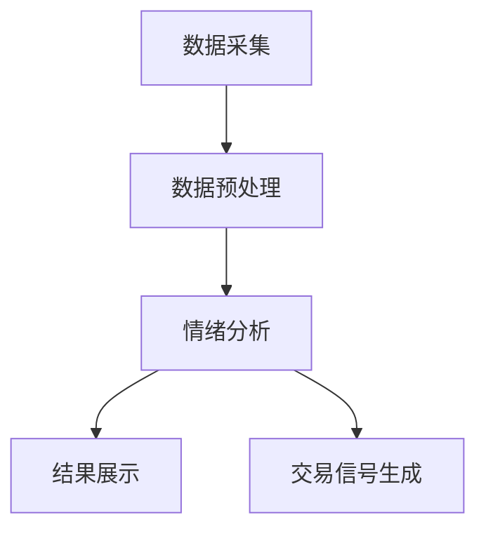
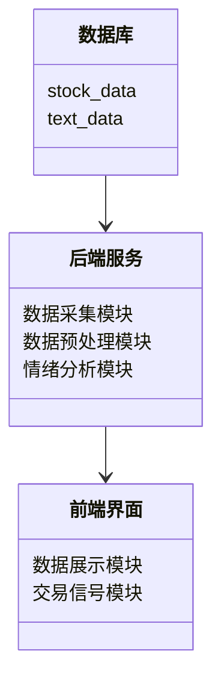
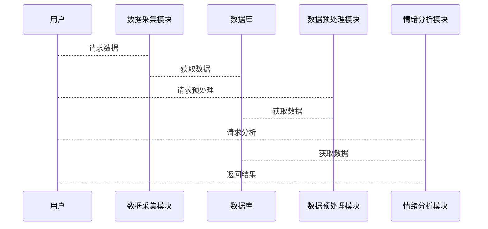

                 

# 《AI驱动的股票市场情绪分析》

## 关键词：人工智能、股票市场、情绪分析、自然语言处理、机器学习、深度学习、金融数据

## 摘要：  
本文将探讨如何利用人工智能技术，特别是自然语言处理和机器学习，来分析股票市场中的投资者情绪。通过构建情绪分析模型，我们能够从新闻、社交媒体和交易数据中提取情绪信息，从而辅助投资者做出更明智的决策。文章将从情绪分析的基本概念入手，逐步分析AI技术在股票市场中的应用，并结合实际案例，详细讲解算法原理、系统架构和项目实现。

---

# 第1章: 股票市场情绪分析的背景与概念

## 1.1 情绪分析的基本概念

### 1.1.1 情绪分析的定义与核心要素
情绪分析是指通过自然语言处理技术，从文本中提取出说话者或作者的情绪倾向（如积极、消极、中性）的过程。在股票市场中，情绪分析的核心要素包括：
- **文本数据**：新闻、社交媒体帖子、投资者评论等。
- **情绪类别**：通常分为积极、消极、中性三类，也可进一步细分为愤怒、恐惧、贪婪等。
- **情绪强度**：情绪的强度表示情绪的强烈程度，例如“非常积极”或“轻微消极”。

### 1.1.2 股票市场的投资者行为分析
投资者在股票市场中的行为往往受到情绪的影响，例如：
- **羊群效应**：投资者跟随市场情绪进行交易，导致价格的短期波动。
- **市场情绪周期**：市场情绪会经历从乐观到悲观再到乐观的周期性变化。
- **情绪与价格的关系**：积极情绪通常会导致股价上涨，而消极情绪则可能导致股价下跌。

### 1.1.3 情绪分析在股票市场中的重要性
情绪分析可以帮助投资者和机构更好地理解市场动向，优化投资决策，例如：
- **预测市场趋势**：通过分析新闻和社交媒体的情绪，预测股价的短期波动。
- **风险管理**：识别市场情绪的极端情况，提前规避风险。
- **交易信号生成**：基于情绪数据，生成买卖信号。

---

## 1.2 AI技术在金融领域的应用背景

### 1.2.1 人工智能在金融领域的应用现状
人工智能技术在金融领域的应用日益广泛，包括：
- **量化交易**：利用算法进行高频交易。
- **风险控制**：通过机器学习模型评估投资风险。
- **客户行为分析**：分析客户行为，提供个性化服务。

### 1.2.2 情绪分析在股票市场中的应用前景
随着自然语言处理技术的进步，情绪分析在股票市场中的应用前景广阔，例如：
- **新闻媒体分析**：从财经新闻中提取情绪信息，预测股价走势。
- **社交媒体监控**：分析社交媒体上的投资者情绪，捕捉市场动向。
- **内部报告分析**：分析公司财报和管理层讲话的情绪，评估公司前景。

### 1.2.3 投资者情绪对股价波动的影响
投资者情绪是影响股价波动的重要因素之一，例如：
- **市场情绪指标**：如恐慌指数（VIX）可以反映市场的波动性。
- **情绪与市场周期**：市场情绪的波动与经济周期密切相关。

---

## 1.3 本章小结

### 1.3.1 情绪分析的核心概念
情绪分析是通过文本数据提取情绪倾向的过程，是理解投资者行为的重要工具。

### 1.3.2 AI技术在股票市场中的潜力
人工智能技术为股票市场的情绪分析提供了强大的工具，能够帮助投资者更好地理解市场动向。

### 1.3.3 本章内容总结
本章介绍了情绪分析的基本概念、投资者行为分析以及AI技术在股票市场中的应用前景，为后续章节奠定了基础。

---

# 第2章: 投资者情绪分析的核心概念

## 2.1 投资者情绪的定义与分类

### 2.1.1 投资者情绪的定义
投资者情绪是指投资者在投资决策过程中表现出的心理状态和情感倾向。

### 2.1.2 投资者情绪的分类
投资者情绪可以分为以下几类：
- **积极情绪**：投资者对市场持乐观态度，倾向于买入。
- **消极情绪**：投资者对市场持悲观态度，倾向于卖出。
- **中性情绪**：投资者对市场持观望态度，无明显倾向。

### 2.1.3 不同情绪类别对市场的影响
- **积极情绪**：可能导致股价上涨。
- **消极情绪**：可能导致股价下跌。
- **中性情绪**：市场趋于稳定。

---

## 2.2 情绪分析的关键技术

### 2.2.1 自然语言处理（NLP）技术
自然语言处理技术用于从文本中提取情绪信息，包括：
- **文本分割**：将文本分割成句子或单词。
- **特征提取**：提取文本中的关键词和情感词汇。

### 2.2.2 文本挖掘与情感计算
文本挖掘是从文本数据中提取有用信息的过程，情感计算是通过计算机技术分析和理解人类情感的过程。

### 2.2.3 统计学习与机器学习方法
统计学习和机器学习方法用于训练情绪分类模型，包括：
- **基于规则的方法**：通过预定义规则进行情绪分类。
- **机器学习方法**：如支持向量机（SVM）、随机森林等。

---

## 2.3 投资者情绪分析模型的构建

### 2.3.1 数据来源与特征提取
数据来源包括：
- **新闻媒体**：财经新闻、市场评论。
- **社交媒体**：投资者在社交媒体上的评论和帖子。
- **交易数据**：投资者的交易行为数据。

特征提取包括：
- **关键词提取**：提取与情绪相关的关键词。
- **情感特征提取**：提取情感特征向量。

### 2.3.2 情绪分类器的设计
情绪分类器的设计包括：
- **特征选择**：选择与情绪相关的特征。
- **模型训练**：训练情绪分类模型。
- **模型评估**：评估模型的性能。

### 2.3.3 模型的评估与优化
模型评估包括：
- **准确率**：分类正确的比例。
- **召回率**：分类器识别出的正例占所有实际正例的比例。
- **F1分数**：综合准确率和召回率的指标。

---

## 2.4 本章小结

### 2.4.1 情绪分析的核心概念
情绪分析是通过文本数据提取情绪倾向的过程，是理解投资者行为的重要工具。

### 2.4.2 关键技术的总结
自然语言处理、文本挖掘和机器学习是情绪分析的核心技术。

### 2.4.3 模型构建的关键步骤
数据来源、特征提取和模型训练是情绪分析模型构建的关键步骤。

---

# 第3章: AI技术在股票市场情绪分析中的应用

## 3.1 自然语言处理（NLP）技术的应用

### 3.1.1 NLP技术在新闻分析中的应用
通过NLP技术分析财经新闻的情绪，预测股价走势。

### 3.1.2 NLP技术在社交媒体分析中的应用
通过NLP技术分析社交媒体上的投资者情绪，捕捉市场动向。

### 3.1.3 NLP技术在交易数据中的应用
通过NLP技术分析交易数据，识别投资者情绪的变化。

---

## 3.2 机器学习在情绪分析中的应用

### 3.2.1 机器学习模型的训练
使用机器学习模型（如SVM、随机森林）训练情绪分类器。

### 3.2.2 模型的优化与调参
通过优化模型参数和调整模型结构，提高情绪分类的准确率。

### 3.2.3 模型的部署与应用
将训练好的情绪分类器部署到实际应用中，实时分析投资者情绪。

---

## 3.3 深度学习在情绪分析中的应用

### 3.3.1 深度学习模型的训练
使用深度学习模型（如LSTM、Transformer）训练情绪分类器。

### 3.3.2 模型的优势与局限
深度学习模型在情绪分析中具有较高的准确率，但也存在训练数据需求大、计算资源消耗高等问题。

---

## 3.4 本章小结

### 3.4.1 AI技术在情绪分析中的应用
自然语言处理、机器学习和深度学习技术在股票市场情绪分析中具有广泛的应用。

### 3.4.2 不同技术的优缺点
不同技术在情绪分析中的优缺点需要根据具体场景进行选择。

### 3.4.3 本章内容总结
本章介绍了AI技术在股票市场情绪分析中的应用，包括NLP、机器学习和深度学习技术。

---

# 第4章: 情绪分析算法原理

## 4.1 基于规则的分类算法

### 4.1.1 基于规则的分类方法
通过预定义规则进行情绪分类，例如：
- 如果文本中包含“乐观”、“上涨”等关键词，则分类为积极情绪。

### 4.1.2 基于规则的分类的优点
基于规则的分类方法简单易懂，适用于特定场景。

### 4.1.3 基于规则的分类的缺点
基于规则的分类方法依赖于规则的设计，难以应对复杂的文本数据。

---

## 4.2 机器学习分类算法

### 4.2.1 支持向量机（SVM）
支持向量机是一种常用的分类算法，适用于高维数据的分类。

### 4.2.2 随机森林
随机森林是一种基于决策树的集成分类算法，具有较高的准确率。

### 4.2.3 机器学习分类算法的优缺点
机器学习分类算法具有较高的准确率，但也需要大量的训练数据和计算资源。

---

## 4.3 深度学习分类算法

### 4.3.1 长短期记忆网络（LSTM）
LSTM是一种适用于序列数据的深度学习模型，能够捕捉文本中的时序信息。

### 4.3.2 Transformer模型
Transformer模型是一种基于注意力机制的深度学习模型，能够捕捉文本中的全局信息。

### 4.3.3 深度学习分类算法的优缺点
深度学习分类算法具有较高的准确率，但也需要大量的训练数据和计算资源。

---

## 4.4 本章小结

### 4.4.1 不同算法的原理
基于规则的分类、机器学习分类和深度学习分类是情绪分析中的三种主要算法。

### 4.4.2 算法的选择与应用
选择合适的算法需要考虑数据规模、计算资源和应用场景。

### 4.4.3 本章内容总结
本章介绍了情绪分析中的三种主要算法，包括基于规则的分类、机器学习分类和深度学习分类。

---

# 第5章: 股票市场情绪分析系统架构与设计

## 5.1 系统功能设计

### 5.1.1 系统功能模块
股票市场情绪分析系统主要包括数据采集、情绪分析、结果展示和交易信号生成四个模块。

### 5.1.2 系统功能设计的流程图
使用Mermaid绘制系统功能设计的流程图。

---

## 5.2 系统架构设计

### 5.2.1 系统架构的分层设计
股票市场情绪分析系统的架构通常包括前端、后端和数据库三个部分。

### 5.2.2 系统架构设计的类图
使用Mermaid绘制系统架构设计的类图。

---

## 5.3 系统接口设计

### 5.3.1 系统接口的定义
系统接口包括数据接口、分析接口和展示接口。

### 5.3.2 系统接口的交互流程
使用Mermaid绘制系统接口的交互流程图。

---

## 5.4 本章小结

### 5.4.1 系统功能设计
股票市场情绪分析系统主要包括数据采集、数据预处理、情绪分析和结果展示四个功能模块。

### 5.4.2 系统架构设计
系统架构通常包括前端、后端和数据库三个部分，各部分之间通过接口进行交互。

### 5.4.3 本章内容总结
本章介绍了股票市场情绪分析系统的功能设计、架构设计和接口设计。

---

# 第6章: 项目实战

## 6.1 环境配置

### 6.1.1 Python环境的安装
安装Python和相关库（如NLTK、scikit-learn、TensorFlow）。

### 6.1.2 数据集的获取
从财经新闻网站、社交媒体平台获取文本数据。

---

## 6.2 数据预处理

### 6.2.1 文本清洗
去除无关字符、停用词和标点符号。

### 6.2.2 特征提取
提取关键词、情感词汇和主题词。

---

## 6.3 模型训练

### 6.3.1 机器学习模型的训练
使用scikit-learn库训练SVM、随机森林等机器学习模型。

### 6.3.2 深度学习模型的训练
使用TensorFlow库训练LSTM、Transformer等深度学习模型。

---

## 6.4 结果分析

### 6.4.1 模型评估
通过准确率、召回率和F1分数评估模型的性能。

### 6.4.2 情绪可视化
使用可视化工具（如Matplotlib）展示情绪分布和趋势。

---

## 6.5 项目小结

### 6.5.1 项目实现的关键步骤
环境配置、数据预处理、模型训练和结果分析是项目实现的关键步骤。

### 6.5.2 项目实现的注意事项
数据质量、模型选择和计算资源是项目实现中需要注意的问题。

### 6.5.3 本章内容总结
本章通过实际案例详细讲解了股票市场情绪分析项目的实现过程。

---

# 第7章: 总结与展望

## 7.1 本章总结

### 7.1.1 情绪分析的核心概念
情绪分析是通过文本数据提取情绪倾向的过程，是理解投资者行为的重要工具。

### 7.1.2 AI技术在股票市场中的应用
人工智能技术为股票市场的情绪分析提供了强大的工具，能够帮助投资者更好地理解市场动向。

### 7.1.3 本章内容总结
本章总结了股票市场情绪分析的核心概念、AI技术在股票市场中的应用以及项目实现的关键步骤。

---

## 7.2 未来展望

### 7.2.1 情绪分析技术的优化
未来可以通过优化算法、引入新的数据源和提高模型的泛化能力来进一步提升情绪分析的准确率。

### 7.2.2 情绪分析在金融领域的拓展
未来可以将情绪分析技术应用于更多的金融场景，如风险管理、客户行为分析和量化交易。

### 7.2.3 技术融合与创新
未来可以通过将情绪分析技术与其他技术（如时间序列分析、图神经网络）相结合，进一步提升情绪分析的性能。

---

## 7.3 本章小结

### 7.3.1 未来的技术发展方向
未来可以通过优化算法、引入新的数据源和提高模型的泛化能力来进一步提升情绪分析的性能。

### 7.3.2 本章内容总结
本章总结了股票市场情绪分析的核心概念、AI技术在股票市场中的应用以及项目实现的关键步骤，并展望了未来的发展方向。

---

# 结语

通过本文的介绍，读者可以全面了解AI驱动的股票市场情绪分析的核心概念、技术实现和实际应用。随着人工智能技术的不断发展，情绪分析在股票市场中的应用前景将更加广阔，为投资者和机构提供更强大的决策支持工具。

