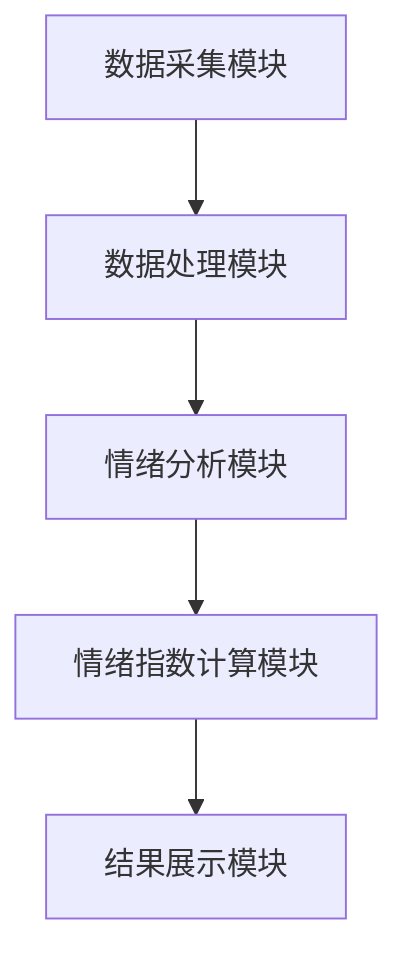

                 


# AI驱动的股票市场情绪指数开发

> 关键词：股票市场情绪指数，AI驱动，自然语言处理，情感分析，机器学习，深度学习，股票市场预测

> 摘要：本文详细介绍了AI驱动的股票市场情绪指数开发的过程，从情绪指数的定义、数据收集与预处理、算法原理到系统架构设计，再到项目实战和最佳实践。通过本文，读者可以系统地了解如何利用AI技术开发情绪指数，并将其应用于股票市场预测。

---

## 第一部分: 股票市场情绪指数开发背景与概念

### 第1章: 股票市场情绪指数概述

#### 1.1 情绪指数的定义与重要性
情绪指数是衡量市场参与者情绪状态的量化指标，能够反映市场乐观或悲观的程度。在股票市场中，情绪指数可以帮助投资者预测市场趋势，优化投资决策。

情绪指数的重要性体现在以下几个方面：
- **预测市场波动**：情绪指数可以预测市场的剧烈波动，帮助投资者提前规避风险。
- **辅助投资决策**：通过分析情绪指数的变化，投资者可以更好地把握市场的买卖时机。
- **量化市场情绪**：情绪指数将无形的情绪转化为可量化的指标，便于分析和研究。

#### 1.2 AI驱动情绪分析的背景
传统的市场情绪分析方法主要依赖人工分析，存在效率低、主观性强等问题。随着AI技术的发展，尤其是自然语言处理（NLP）和深度学习的进步，情绪分析的效率和准确性得到了显著提升。

AI在情绪分析中的优势：
- **自动化处理**：AI可以自动处理大量非结构化数据，如新闻、社交媒体评论等。
- **高精度**：基于机器学习的模型可以实现高精度的情绪分类。
- **实时性**：AI技术可以实现实时情绪分析，满足股票市场的实时性要求。

#### 1.3 情绪指数开发的核心要素
情绪指数开发的核心要素包括：
- **数据来源**：包括新闻、社交媒体、公司财报等。
- **情绪分析模型**：包括基于传统机器学习和深度学习的情绪分类模型。
- **指数计算与验证**：通过数据验证和模型调优，确保情绪指数的准确性和稳定性。

### 第2章: 情绪指数开发的核心概念

#### 2.1 自然语言处理与情感分析
自然语言处理（NLP）是AI驱动情绪分析的基础技术。情感分析是NLP中的一个重要任务，旨在判断文本中的情感倾向。

情感分析的分类：
- **二分类**：将文本分为正面、负面或中性。
- **多分类**：将文本分为多个情感类别，如极度乐观、乐观、中性、悲观、极度悲观。

情感分析在股票市场中的应用：
- **新闻分析**：分析新闻标题和内容，判断市场情绪。
- **社交媒体分析**：分析社交媒体上的评论，了解散户情绪。

#### 2.2 股票市场数据与情绪指数的关系
股票市场数据包括股票价格、交易量、市场指数等。情绪指数通过分析市场参与者的言论和行为，反映市场情绪的变化。

情绪指数与股票价格的关系：
- 情绪指数可以预测股票价格的短期波动。
- 情绪指数与股票价格之间存在一定的相关性，但不是决定性因素。

#### 2.3 情绪指数开发的边界与外延
情绪指数开发的边界包括：
- 数据范围：仅分析公开可用的市场数据。
- 时间范围：通常分析过去一段时间内的数据。
- 情绪范围：主要分析市场参与者的乐观和悲观情绪。

情绪指数开发的外延包括：
- 结合其他市场指标，如技术指标、宏观经济指标，构建综合市场预测模型。
- 应用到其他金融市场，如外汇市场、 commodities markets。

---

## 第二部分: 情绪指数开发的数据与算法

### 第3章: 数据收集与预处理

#### 3.1 数据来源
情绪指数开发需要多源数据支持，主要包括以下几类：
- **新闻数据**：包括财经新闻、公司公告等。
- **社交媒体数据**：包括Twitter、Reddit等平台上的用户评论。
- **公司财报与公告**：包括公司财务数据、管理层讲话等。

#### 3.2 数据清洗与预处理
数据清洗是情绪指数开发的重要步骤，主要包括以下内容：
- **文本清洗**：去除无关字符、停用词、标点符号等。
- **数据去噪**：去除噪声数据，如垃圾信息、重复数据。
- **数据增强**：通过数据增强技术，提高数据的多样性和鲁棒性。

#### 3.3 数据特征提取
特征提取是将文本数据转化为可计算的特征向量。常用特征包括：
- **词袋模型**：基于词频（TF）或逆文本频率（TF-IDF）的特征。
- **词嵌入**：如Word2Vec、GloVe等预训练词嵌入。
- **情感特征**：基于情感分析的特征，如情感极性、情感强度。

### 第4章: 情绪分析算法原理

#### 4.1 基于传统机器学习的情绪分析
传统机器学习方法是情绪分析的常用方法，主要包括以下几种：
- **支持向量机（SVM）**：通过构建特征空间，将数据点分为不同类别。
- **随机森林**：通过构建多个决策树，提高模型的准确性和鲁棒性。
- **逻辑回归**：通过构建逻辑回归模型，预测文本的情感倾向。

#### 4.2 基于深度学习的情绪分析
深度学习方法在情绪分析中表现出色，常用模型包括：
- **循环神经网络（RNN）**：通过处理序列数据，捕捉文本的情感倾向。
- **长短期记忆网络（LSTM）**：通过记忆单元，捕捉长距离依赖关系。
- **变换器（Transformer）**：如BERT、GPT等预训练模型，具有强大的上下文理解能力。

#### 4.3 情绪分析模型的评估与优化
模型评估是情绪分析的重要步骤，常用评估指标包括准确率、召回率、F1分数等。

模型优化方法包括：
- **超参数调优**：通过网格搜索、随机搜索等方法，优化模型参数。
- **数据增强**：通过生成更多样化的数据，提高模型的泛化能力。
- **集成学习**：通过集成多个模型的结果，提高模型的准确性和稳定性。

---

## 第三部分: 系统架构设计与项目实战

### 第5章: 系统架构设计

#### 5.1 系统功能设计
情绪指数开发系统的功能模块包括：
- 数据采集模块：负责采集新闻、社交媒体等数据。
- 数据处理模块：负责数据清洗、特征提取。
- 情绪分析模块：负责对数据进行情感分类。
- 情绪指数计算模块：负责计算情绪指数，并生成可视化结果。

#### 5.2 系统架构设计
系统架构采用分层设计，主要包括：
- 数据层：负责数据的存储和管理。
- 业务逻辑层：负责数据处理和情绪分析。
- 表示层：负责结果的展示和用户交互。

系统架构图如下：



### 第6章: 项目实战

#### 6.1 环境安装
情绪指数开发需要以下环境：
- Python 3.8+
- Python库：pandas、numpy、scikit-learn、tensorflow、keras、nltk。
- 数据来源：新浪财经API、Twitter API。

#### 6.2 核心代码实现
以下是情绪指数开发的核心代码示例：

```python
import pandas as pd
from sklearn.model_selection import train_test_split
from sklearn.svm import SVC
from sklearn.metrics import accuracy_score

# 数据加载与预处理
df = pd.read_csv('market_news.csv')
df['text'] = df['text'].apply(lambda x: x.lower())
df['text'] = df['text'].apply(lambda x: x.replace(',', ''))

# 特征提取
from sklearn.feature_extraction.text import TfidfVectorizer
vectorizer = TfidfVectorizer(max_features=5000)
X = vectorizer.fit_transform(df['text'])
y = df['label']

# 模型训练与评估
X_train, X_test, y_train, y_test = train_test_split(X, y, test_size=0.2)
model = SVC(C=1, kernel='linear', gamma='auto')
model.fit(X_train, y_train)
y_pred = model.predict(X_test)
print('准确率:', accuracy_score(y_test, y_pred))
```

#### 6.3 项目小结
通过项目实战，读者可以了解情绪指数开发的完整流程，包括数据采集、预处理、特征提取、模型训练和结果评估。在实际应用中，需要根据具体需求进行模型调优和系统优化。

---

## 第四部分: 最佳实践与小结

### 第7章: 最佳实践

#### 7.1 数据处理的注意事项
- 数据清洗要彻底，避免噪声数据影响模型效果。
- 特征提取要选择合适的特征，避免信息冗余。

#### 7.2 模型调优的技巧
- 使用交叉验证进行模型评估。
- 通过网格搜索优化模型参数。
- 结合集成学习提高模型的准确性和稳定性。

#### 7.3 系统设计的注意事项
- 系统设计要模块化，便于功能扩展和维护。
- 数据存储要高效，支持大规模数据处理。

### 7.4 小结
通过本文的介绍，读者可以系统地了解AI驱动的股票市场情绪指数开发的过程和方法。情绪指数开发是一个复杂的系统工程，需要结合数据处理、算法优化和系统设计的多方面知识。未来，随着AI技术的不断发展，情绪指数在股票市场中的应用将更加广泛和深入。

