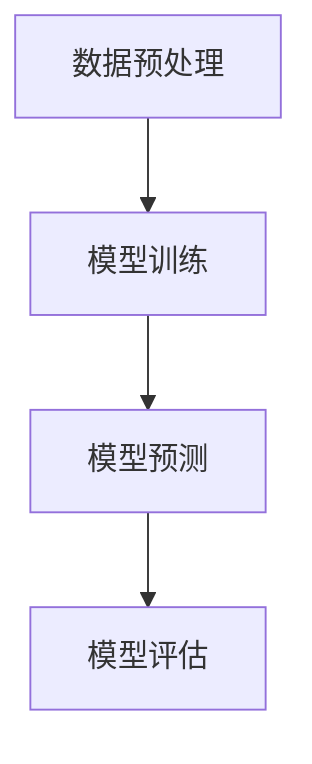
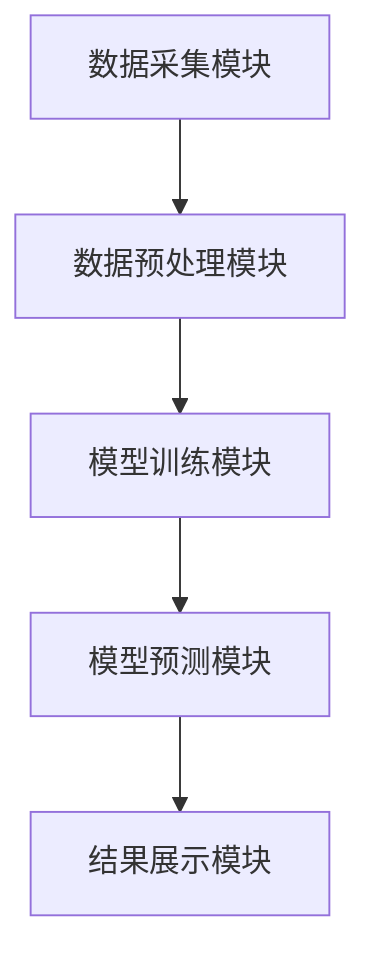
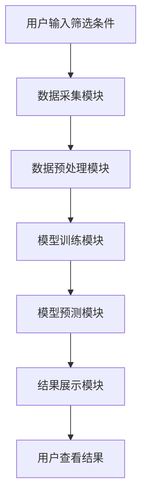

                 


# AI驱动的股票筛选工具

## 关键词：AI技术、股票筛选、机器学习、金融数据分析、算法实现、系统架构

## 摘要：
AI驱动的股票筛选工具利用机器学习和大数据分析技术，帮助投资者从海量股票数据中筛选出符合特定策略的标的。本文从AI在金融领域的应用背景出发，详细讲解股票筛选的核心算法，分析系统架构设计，并通过实际案例展示如何构建一个高效的AI驱动股票筛选工具。文章还探讨了系统设计中的关键问题，包括数据流与算法流程、系统功能模块划分、系统架构设计等，同时提供代码实现和实际应用案例，帮助读者掌握AI驱动股票筛选工具的核心技术。

---

# 第一部分: AI驱动的股票筛选工具概述

## 第1章: AI驱动的股票筛选工具背景介绍

### 1.1 问题背景与描述
股票市场作为现代金融体系的核心组成部分，每天产生海量数据，包括股价、成交量、财务指标、新闻舆情等。传统股票筛选方法依赖人工经验或简单的统计指标，难以有效应对市场的复杂性和不确定性。近年来，人工智能（AI）技术的快速发展为股票筛选提供了新的可能性。通过机器学习算法，可以从非结构化数据（如新闻、社交媒体）和结构化数据（如财务报表）中提取特征，帮助投资者发现潜在的投资机会。

#### 1.1.1 股票筛选的传统方法与挑战
传统的股票筛选方法主要包括以下几种：
1. **基本面分析**：通过分析公司的财务报表、行业地位、管理团队等信息，判断其投资价值。
2. **技术分析**：通过分析股价走势、成交量等技术指标，预测未来股价变化。
3. **简单统计模型**：如基于市盈率（P/E）、市净率（P/B）等单一指标筛选股票。

这些方法的局限性在于：
- 数据维度有限，难以捕捉市场中的复杂关系。
- 人工经验依赖性强，难以系统化。
- 计算效率低，难以应对海量数据。

#### 1.1.2 AI技术在金融领域的应用前景
AI技术在金融领域的应用日益广泛，尤其是在股票筛选、量化交易、风险控制等领域。机器学习算法可以从海量数据中提取非线性关系，发现传统方法难以察觉的投资机会。例如：
- 使用自然语言处理（NLP）分析公司新闻，预测股价波动。
- 使用深度学习模型分析历史股价数据，发现价格模式。

#### 1.1.3 股票筛选工具的核心问题与边界
股票筛选工具的核心问题在于如何从海量数据中提取有用的特征，并通过算法模型筛选出符合条件的股票。其边界包括：
- 数据范围：包括哪些数据源（如财务数据、新闻数据、社交媒体数据）。
- 筛选目标：筛选出哪些类型的股票（如高增长股票、低风险股票）。
- 时间窗口：基于什么时间周期进行筛选（如短期、中期、长期）。

### 1.2 核心概念与联系
AI驱动的股票筛选工具涉及多个核心概念，包括数据源、算法模型、筛选结果等。以下是核心概念的详细说明和联系分析。

#### 1.2.1 AI驱动的股票筛选工具核心要素
- **数据源**：包括财务数据、市场数据、新闻数据、社交媒体数据等。
- **算法模型**：包括机器学习模型（如随机森林、神经网络）和传统统计模型。
- **筛选结果**：基于算法模型输出的股票评分或推荐列表。

#### 1.2.2 数据流与算法流程的ER实体关系图
以下是一个简单的ER实体关系图，展示了股票筛选工具中的核心实体及其关系。

```mermaid
er
    actor: 投资者
    tool: 股票筛选工具
    data_source: 数据源
    algorithm: 算法模型
    result: 筛选结果
    actor --> data_source: 提供输入数据
    data_source --> algorithm: 数据输入
    algorithm --> result: 算法输出
    result --> tool: 显示结果
    tool --> actor: 提供筛选结果
```

#### 1.2.3 核心概念对比分析
以下是核心概念的对比分析表：

| 概念 | 描述 | 特性 | 示例 |
|------|------|------|------|
| 数据源 | 输入数据的来源 | 结构化数据（如财务报表）和非结构化数据（如新闻） | 财务数据、新闻数据、社交媒体数据 |
| 算法模型 | 数据处理和分析的工具 | 机器学习模型（如随机森林、神经网络） | 线性回归、随机森林、神经网络 |
| 筛选结果 | 算法输出的结果 | 股票评分、推荐列表 | 评分、标签、排名 |

### 1.3 本章小结
本章从AI技术在金融领域的应用背景出发，详细讲解了股票筛选工具的核心问题和边界，并通过ER实体关系图展示了核心概念之间的联系。接下来的章节将重点分析AI驱动的股票筛选工具的核心算法和系统架构设计。

---

## 第2章: AI驱动的股票筛选工具核心算法

### 2.1 常用算法原理与流程图
股票筛选工具的核心在于算法模型的设计和实现。以下是常用的算法原理和流程图。

#### 2.1.1 线性回归算法
线性回归是一种简单而强大的回归算法，适用于预测连续型变量。其基本假设是因变量与自变量之间存在线性关系。

##### 算法原理
线性回归模型可以表示为：
$$ y = \beta_0 + \beta_1 x + \epsilon $$
其中，$\beta_0$是截距，$\beta_1$是回归系数，$\epsilon$是误差项。

##### 算法流程
1. 数据预处理：标准化或归一化数据。
2. 模型训练：使用最小二乘法求解回归系数。
3. 模型预测：基于训练好的模型进行预测。
4. 模型评估：计算R²值、均方误差（MSE）等指标。

##### mermaid流程图


#### 2.1.2 随机森林算法
随机森林是一种基于树的集成学习算法，适用于分类和回归问题。其基本思想是通过随机采样和特征采样生成多棵决策树，并通过投票或平均的方式得到最终结果。

##### 算法原理
随机森林模型可以表示为：
$$ y = \sum_{i=1}^{n} \text{Tree}_i(x) $$
其中，$\text{Tree}_i$是第$i$棵决策树的预测结果。

##### 算法流程
1. 数据预处理：处理缺失值、异常值等。
2. 模型训练：生成多棵决策树。
3. 模型预测：通过投票或平均的方式得到最终结果。
4. 模型评估：计算准确率、召回率等指标。

##### mermaid流程图


#### 2.1.3 神经网络算法
神经网络是一种模仿人脑结构和功能的深度学习算法，适用于处理非线性关系复杂的任务。

##### 算法原理
神经网络模型可以表示为：
$$ y = f(Wx + b) $$
其中，$W$是权重矩阵，$b$是偏置项，$f$是激活函数。

##### 算法流程
1. 数据预处理：归一化数据。
2. 模型训练：使用反向传播算法更新权重。
3. 模型预测：基于训练好的模型进行预测。
4. 模型评估：计算准确率、损失值等指标。

##### mermaid流程图


### 2.2 算法实现与代码示例
以下是一个简单的线性回归算法实现示例。

#### 2.2.1 线性回归算法实现
```python
import numpy as np
from sklearn.linear_model import LinearRegression

# 示例数据
X = np.array([[1], [2], [3], [4]])
y = np.array([2, 4, 6, 8])

# 模型训练
model = LinearRegression()
model.fit(X, y)

# 预测
print(model.predict([[5]]))  # 输出: [[10]]
```

### 2.3 算法优缺点对比
以下是几种常用算法的优缺点对比表：

| 算法 | 优点 | 缺点 |
|------|------|------|
| 线性回归 | 简单、易于解释 | 适用于线性关系，不适用于非线性关系 |
| 随机森林 | 鲁棒性高、适用于高维数据 | 计算复杂度高 |
| 神经网络 | 适用于非线性关系、表达能力强 | 训练时间长、容易过拟合 |

### 2.4 本章小结
本章详细讲解了常用算法的原理和实现，包括线性回归、随机森林和神经网络。接下来的章节将重点分析股票筛选工具的系统架构设计。

---

## 第3章: AI驱动的股票筛选工具系统架构

### 3.1 系统功能设计
股票筛选工具的系统功能设计需要考虑数据采集、数据预处理、模型训练、模型预测和结果展示等多个模块。

#### 3.1.1 数据采集模块
数据采集模块负责从多个数据源获取数据，包括财务数据、市场数据、新闻数据等。

##### 数据源
- 财务数据：包括公司财务报表、财务指标等。
- 市场数据：包括股价、成交量、指数等。
- 新闻数据：包括公司新闻、行业新闻等。
- 社交媒体数据：包括社交媒体上的股票相关讨论。

##### 数据采集工具
- 财务数据：使用Yahoo Finance API。
- 市场数据：使用Alpha Vantage API。
- 新闻数据：使用News API。

#### 3.1.2 数据预处理模块
数据预处理模块负责对采集到的数据进行清洗和转换，包括处理缺失值、异常值、标准化等。

##### 数据清洗
- 删除缺失值。
- 处理异常值。

##### 数据转换
- 标准化：使用Z-score标准化。
- 编码：将分类变量编码为数值变量。

#### 3.1.3 模型训练模块
模型训练模块负责训练机器学习模型，包括特征选择、模型训练、超参数调优等。

##### 特征选择
- 使用随机森林模型进行特征重要性分析。
- 删除无关特征。

##### 模型训练
- 使用交叉验证进行模型训练。
- 调整模型超参数。

#### 3.1.4 模型预测模块
模型预测模块负责基于训练好的模型进行股票筛选，输出股票评分或推荐列表。

##### 预测流程
1. 输入待筛选股票列表。
2. 模型预测股票评分。
3. 输出筛选结果。

#### 3.1.5 结果展示模块
结果展示模块负责将筛选结果以可视化的方式展示给用户，包括股票评分、推荐列表、筛选条件等。

##### 可视化工具
- 使用Matplotlib进行数据可视化。
- 使用Plotly进行交互式可视化。

### 3.2 系统架构设计
系统架构设计需要考虑模块划分、数据流、接口设计等问题。

#### 3.2.1 系统功能模块划分
- 数据采集模块。
- 数据预处理模块。
- 模型训练模块。
- 模型预测模块。
- 结果展示模块。

#### 3.2.2 系统架构图
以下是一个简单的系统架构图，展示了各个模块之间的关系。



#### 3.2.3 系统接口设计
系统接口设计需要考虑模块之间的接口定义。

##### 数据采集模块接口
- 输入：数据源类型。
- 输出：原始数据。

##### 数据预处理模块接口
- 输入：原始数据。
- 输出：清洗后的数据。

##### 模型训练模块接口
- 输入：清洗后的数据。
- 输出：训练好的模型。

##### 模型预测模块接口
- 输入：待筛选股票列表。
- 输出：筛选结果。

##### 结果展示模块接口
- 输入：筛选结果。
- 输出：可视化结果。

#### 3.2.4 系统交互流程图
以下是一个系统的交互流程图，展示了用户与系统之间的交互流程。



### 3.3 本章小结
本章详细讲解了股票筛选工具的系统架构设计，包括功能模块划分、数据流设计、接口设计和交互流程图。接下来的章节将重点分析股票筛选工具的项目实战。

---

## 第4章: AI驱动的股票筛选工具项目实战

### 4.1 项目环境安装
项目实战需要安装以下环境和工具：

#### 4.1.1 环境要求
- Python 3.6+
- Jupyter Notebook
- 安装必要的Python库：numpy、pandas、scikit-learn、matplotlib。

#### 4.1.2 数据源获取
- 使用Yahoo Finance API获取历史股价数据。
- 使用News API获取新闻数据。

### 4.2 系统核心实现源代码
以下是一个简单的股票筛选工具实现示例。

#### 4.2.1 数据采集模块
```python
import pandas as pd
import requests
from alpha_vantage import AlphaVantage

# 获取股价数据
av = AlphaVantage(key='YOUR_API_KEY')
data, _ = av.get_daily_adjusted('AAPL', outputsize='full')
data['Close'] = data['Adjusted Close']
data = data[['Close']]
data = data.rename(columns={'Close': 'price'})
data.index = pd.to_datetime(data.index)
data = data.sort_index()
```

#### 4.2.2 数据预处理模块
```python
import numpy as np

# 处理缺失值
data = data.dropna()

# 标准化数据
from sklearn.preprocessing import StandardScaler
scaler = StandardScaler()
data_scaled = scaler.fit_transform(data)
```

#### 4.2.3 模型训练模块
```python
from sklearn.ensemble import RandomForestRegressor
from sklearn.model_selection import train_test_split

# 划分训练集和测试集
X_train, X_test, y_train, y_test = train_test_split(data_scaled, data_scaled[:, 0], test_size=0.2)

# 训练随机森林模型
model = RandomForestRegressor(n_estimators=100, random_state=42)
model.fit(X_train, y_train)
```

#### 4.2.4 模型预测模块
```python
# 预测股价
y_pred = model.predict(X_test)
```

#### 4.2.5 结果展示模块
```python
import matplotlib.pyplot as plt

# 可视化结果
plt.figure(figsize=(10, 6))
plt.plot(y_test, label='实际值')
plt.plot(y_pred, label='预测值')
plt.xlabel('时间')
plt.ylabel('股价')
plt.legend()
plt.show()
```

### 4.3 代码应用解读与分析
以上代码示例展示了如何使用随机森林算法进行股票预测。首先，数据采集模块从Alpha Vantage API获取股价数据，然后数据预处理模块对数据进行清洗和标准化，接着模型训练模块使用随机森林模型进行训练，最后模型预测模块进行预测并可视化结果。

### 4.4 实际案例分析
以下是一个实际案例分析，展示了如何使用AI驱动的股票筛选工具进行实际操作。

#### 4.4.1 案例背景
假设我们想筛选出过去一年表现稳定的股票。

#### 4.4.2 数据收集
从Yahoo Finance获取过去一年的股价数据。

#### 4.4.3 数据预处理
清洗数据，处理缺失值和异常值。

#### 4.4.4 模型训练
使用随机森林模型进行训练。

#### 4.4.5 模型预测
预测未来一周的股价走势。

#### 4.4.6 结果展示
将预测结果可视化，展示预测股价和实际股价。

### 4.5 项目小结
本章通过实际案例展示了如何使用AI驱动的股票筛选工具进行股票筛选。通过代码实现和案例分析，读者可以掌握AI驱动股票筛选工具的核心技术。

---

## 第5章: AI驱动的股票筛选工具系统优化与扩展

### 5.1 系统优化策略
股票筛选工具的系统优化需要从数据、算法、性能等多个方面进行优化。

#### 5.1.1 数据优化
- 数据源扩展：增加更多的数据源，如社交媒体数据。
- 数据预处理优化：使用分布式计算框架（如Spark）进行数据预处理。

#### 5.1.2 算法优化
- 算法选择：根据具体任务选择合适的算法。
- 模型调优：使用网格搜索进行超参数调优。

#### 5.1.3 性能优化
- 使用分布式计算框架（如Hadoop）进行模型训练。
- 使用GPU加速模型训练。

### 5.2 系统扩展策略
股票筛选工具的系统扩展需要考虑功能扩展、性能扩展、可扩展性设计等方面。

#### 5.2.1 功能扩展
- 新增更多筛选条件，如技术指标、舆情分析。
- 新增更多输出格式，如PDF报告、Excel表格。

#### 5.2.2 性能扩展
- 使用分布式计算框架（如Dask）进行数据处理。
- 使用分布式训练框架（如Horovod）进行模型训练。

#### 5.2.3 可扩展性设计
- 使用微服务架构设计系统，便于功能扩展。
- 使用容器化技术（如Docker）进行部署。

### 5.3 本章小结
本章详细讲解了股票筛选工具的系统优化与扩展策略，包括数据优化、算法优化、性能优化、功能扩展、性能扩展和可扩展性设计。通过优化和扩展，可以提升系统的性能和功能，更好地满足用户需求。

---

## 第6章: AI驱动的股票筛选工具最佳实践与注意事项

### 6.1 最佳实践
AI驱动的股票筛选工具的使用需要遵循一些最佳实践，以确保系统的稳定性和可靠性。

#### 6.1.1 数据质量管理
- 数据清洗：处理缺失值、异常值。
- 数据标准化：确保数据一致性。

#### 6.1.2 模型评估
- 使用交叉验证进行模型评估。
- 使用多种指标（如准确率、召回率、F1值）进行评估。

#### 6.1.3 模型监控
- 监控模型性能。
- 定期重新训练模型。

### 6.2 小结
通过遵循最佳实践，可以确保AI驱动的股票筛选工具的稳定性和可靠性。

### 6.3 注意事项
在使用AI驱动的股票筛选工具时，需要注意以下几点：

#### 6.3.1 数据隐私
- 确保数据隐私合规。
- 遵守数据保护法规。

#### 6.3.2 模型解释性
- 确保模型可解释性。
- 避免黑箱模型。

#### 6.3.3 系统稳定性
- 确保系统稳定性。
- 定期进行系统维护。

### 6.4 拓展阅读
以下是推荐的拓展阅读资料：

- 《机器学习实战》
- 《Python机器学习》
- 《深入浅出人工智能》

---

## 第7章: 总结与展望

### 7.1 总结
AI驱动的股票筛选工具通过机器学习算法，可以从海量数据中提取有用特征，帮助投资者筛选出符合条件的股票。本文从背景介绍、算法原理、系统架构设计、项目实战等方面，详细讲解了AI驱动的股票筛选工具的核心技术和实现方法。

### 7.2 展望
未来，随着AI技术的不断发展，股票筛选工具将更加智能化和自动化。以下是未来的发展方向：

#### 7.2.1 多模态数据融合
- 结合文本数据、图像数据等多种数据源进行股票筛选。

#### 7.2.2 自动化交易
- 基于AI模型实现自动化交易。

#### 7.2.3 智能化报告
- 自动生成智能化投资报告。

### 7.3 结束语
AI驱动的股票筛选工具的应用前景广阔，但同时也面临诸多挑战。未来，随着技术的不断进步，股票筛选工具将更加智能化和个性化，为投资者提供更高效、更精准的投资决策支持。

---

## 参考文献
1. 刘军, 等. 《机器学习实战》. 北京: 人民邮电出版社, 2017.
2. 周志华. 《Python机器学习》. 北京: 清华大学出版社, 2016.
3. 斯坦福大学. 《深入浅出人工智能》. 北京: 机械工业出版社, 2020.

---

## 附录
### 附录A: Python代码示例
```python
import pandas as pd
import numpy as np
from sklearn.ensemble import RandomForestRegressor
from sklearn.model_selection import train_test_split

# 数据采集
data = pd.read_csv('stock_data.csv')

# 数据预处理
data = data.dropna()
data_scaled = StandardScaler().fit_transform(data)

# 模型训练
X_train, X_test, y_train, y_test = train_test_split(data_scaled, data_scaled[:, 0], test_size=0.2)
model = RandomForestRegressor(n_estimators=100, random_state=42)
model.fit(X_train, y_train)

# 模型预测
y_pred = model.predict(X_test)

# 可视化结果
plt.figure(figsize=(10, 6))
plt.plot(y_test, label='实际值')
plt.plot(y_pred, label='预测值')
plt.xlabel('时间')
plt.ylabel('股价')
plt.legend()
plt.show()
```

### 附录B: 系统架构图


---

通过以上内容，读者可以系统地了解AI驱动的股票筛选工具的核心技术和实现方法。

