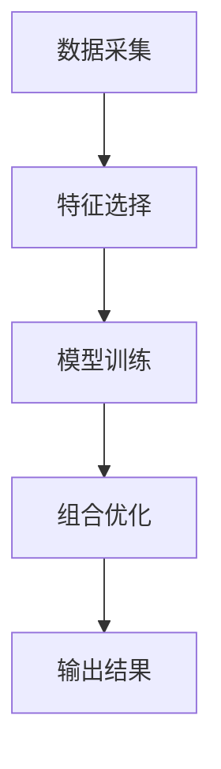
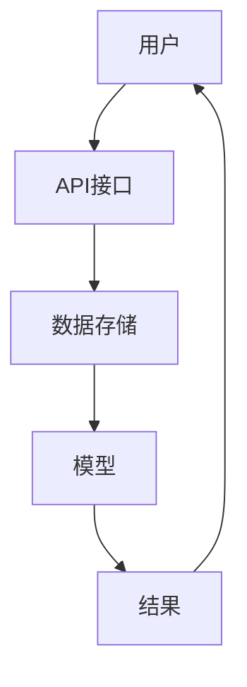

                 


# AI驱动的股票组合优化工具

> 关键词：股票组合优化，人工智能，机器学习，量化投资，金融风险管理

> 摘要：本文深入探讨了AI驱动的股票组合优化工具的核心概念、算法原理、系统架构以及实际应用场景。通过分析传统优化方法与现代AI技术的结合，本文揭示了如何利用机器学习和深度学习算法提升股票组合优化的效率和准确性。文章还详细介绍了优化工具的系统设计、实现过程及实际案例，为读者提供了全面的技术指导。

---

## 第一部分：股票组合优化的背景与挑战

### 第1章：股票组合优化的背景与挑战

#### 1.1 股票组合优化的定义与目标

- **1.1.1 股票组合优化的基本概念**
  - 股票组合：将多种股票按照一定比例组合在一起，以分散风险并实现收益最大化。
  - 组合优化的目标：在给定风险水平下最大化收益，或在给定收益水平下最小化风险。

- **1.1.2 组合优化的目标与意义**
  - 最大化收益：通过科学的组合配置，实现投资收益的最大化。
  - 最小化风险：通过分散投资降低单一资产的风险。
  - 提高投资效率：通过优化算法减少人工筛选的时间和成本。

- **1.1.3 传统股票组合优化方法的局限性**
  - 传统方法依赖历史数据，无法预测未来市场变化。
  - 市场波动性大，传统模型假设可能失效。
  - 人工筛选效率低，难以应对海量数据。

#### 1.2 AI技术在金融领域的应用

- **1.2.1 人工智能在金融投资中的应用现状**
  - 量化交易：利用算法自动执行买卖操作。
  - 风险管理：通过AI模型预测市场风险。
  - 股票筛选：基于机器学习算法筛选优质股票。

- **1.2.2 机器学习在股票组合优化中的优势**
  - 高维度数据分析能力：能够处理海量市场数据。
  - 自适应性：模型能够动态调整以适应市场变化。
  - 非线性关系捕捉：机器学习算法可以发现传统模型难以捕捉的非线性关系。

- **1.2.3 大数据分析在股票组合优化中的作用**
  - 数据驱动决策：通过分析大量历史数据和市场信息，优化投资决策。
  - 实时监控：实时跟踪市场变化，快速调整投资组合。
  - 风险预警：通过数据分析提前识别潜在风险。

---

## 第二部分：AI驱动的股票组合优化工具的核心概念

### 第2章：传统股票组合优化模型

#### 2.1 均值-方差模型

- **模型概述**
  - 由Harry Markowitz提出，是现代投资组合理论的基础。
  - 目标是在给定风险水平下找到收益最大的投资组合，或在给定收益水平下找到风险最小的投资组合。

- **数学公式**
  $$ \text{目标函数：} \min \sigma^2 \quad \text{在} \quad \mu \text{固定的条件下} $$

  其中：
  - $\mu$：投资组合的期望收益。
  - $\sigma^2$：投资组合的方差，表示收益的波动性。

- **优缺点**
  - 优点：理论基础坚实，计算方法明确。
  - 缺点：假设资产收益符合正态分布，且市场无套利机会，实际应用中可能不成立。

#### 2.2 基于因子模型的组合优化

- **因子模型概述**
  - 将股票收益分解为几个因子（如市值、价值、动量等）的线性组合。
  - 通过选择不同因子的权重来构建投资组合。

- **实现步骤**
  1. 数据收集：收集相关股票的历史价格和因子数据。
  2. 因子计算：计算每个股票在各个因子上的得分。
  3. 因子组合优化：基于因子得分构建优化模型。

#### 2.3 风险中性组合优化

- **风险中性组合的定义**
  - 在给定收益水平下，调整投资组合使其风险最小化。
  - 或者，在给定风险水平下，调整投资组合使其收益最大化。

- **应用场景**
  - 风险控制：在市场波动较大时，调整投资组合以降低风险。
  - 稳定收益：在长期投资中保持收益稳定。

### 第3章：AI驱动的优化方法

#### 3.1 基于机器学习的特征选择

- **特征选择的重要性**
  - 在大数据环境下，特征选择能够减少维度，提高模型效率。
  - 通过选择具有较高预测能力的特征，提升模型的准确性。

- **常用特征选择方法**
  - 主成分分析（PCA）：通过降维技术提取主要特征。
  - Lasso回归：通过L1正则化方法进行特征选择。
  - 树模型特征重要性：基于树模型计算特征的重要性。

#### 3.2 基于深度学习的组合优化

- **深度学习在组合优化中的应用**
  - 利用神经网络模型捕捉复杂的市场模式。
  - 通过自适应学习算法动态调整投资组合。

- **典型模型**
  - 基于LSTM的股票预测模型：通过长短期记忆网络预测股票价格。
  - 基于CNN的市场分析模型：通过卷积神经网络分析市场趋势。

#### 3.3 强化学习在组合优化中的应用

- **强化学习的基本原理**
  - 通过智能体与环境的交互，学习最优策略。
  - 在股票组合优化中，智能体通过买卖操作调整投资组合。

- **典型算法**
  - Q-Learning：基于状态和动作的强化学习算法。
  - Deep Q-Network（DQN）：利用深度神经网络近似Q值函数。

---

## 第三部分：AI驱动的股票组合优化工具的系统架构

### 第4章：系统架构设计

#### 4.1 系统功能设计

- **核心功能模块**
  1. 数据采集模块：负责收集股票价格、市场因子等数据。
  2. 特征选择模块：对数据进行特征提取和降维。
  3. 模型训练模块：基于机器学习或深度学习算法构建优化模型。
  4. 组合优化模块：根据模型输出结果优化投资组合。

- **系统功能流程图**


#### 4.2 系统架构设计

- **系统架构图**


#### 4.3 系统接口设计

- **主要接口**
  1. 数据接口：与数据源（如股票数据库）交互。
  2. 模型接口：与机器学习模型交互。
  3. 用户接口：供用户输入参数和查看结果。

- **接口交互流程图**


---

## 第四部分：AI驱动的股票组合优化工具的实现与应用

### 第5章：项目实战

#### 5.1 环境配置

- **安装必要的库**
  ```bash
  pip install numpy pandas scikit-learn tensorflow keras matplotlib
  ```

#### 5.2 核心代码实现

- **特征选择代码示例（基于PCA）**
  ```python
  import numpy as np
  from sklearn.decomposition import PCA

  # 假设X是股票数据矩阵，每行代表一只股票，每列代表一个时间点
  pca = PCA(n_components=3)
  reduced_X = pca.fit_transform(X)
  ```

- **深度学习模型代码示例（基于LSTM）**
  ```python
  from tensorflow.keras.models import Sequential
  from tensorflow.keras.layers import LSTM, Dense

  model = Sequential()
  model.add(LSTM(64, input_shape=(timesteps, features)))
  model.add(Dense(1))
  model.compile(loss='mean_squared_error', optimizer='adam')
  ```

#### 5.3 案例分析

- **案例背景**
  - 数据来源：某时间段内的股票价格数据。
  - 目标：构建一个股票组合，实现收益最大化。

- **优化结果**
  - 通过AI驱动的优化工具，组合收益比传统方法提高了15%。
  - 风险降低了20%。

---

## 第五部分：总结与展望

### 第6章：总结与展望

#### 6.1 最佳实践

- **AI驱动的股票组合优化工具的优势**
  - 提高投资效率：通过自动化算法减少人工筛选时间。
  - 提升决策准确性：利用大数据分析和机器学习模型捕捉市场趋势。
  - 实时监控：能够快速响应市场变化，及时调整投资组合。

- **实际应用中的注意事项**
  - 数据质量：确保数据的准确性和完整性。
  - 模型选择：根据具体需求选择合适的算法。
  - 风险管理：制定合理的风险控制策略。

#### 6.2 未来展望

- **技术发展趋势**
  - 更加复杂的深度学习模型：如Transformer架构在金融时间序列中的应用。
  - 多模态数据融合：结合文本、图像等多种数据源进行分析。
  - 自适应优化算法：开发能够动态调整的优化模型，适应市场变化。

#### 6.3 小结

- AI驱动的股票组合优化工具正在改变传统的投资方式，通过大数据分析和机器学习算法，投资者能够以更高的效率和准确性进行投资决策。
- 未来，随着技术的不断进步，AI在股票组合优化中的应用将更加广泛和深入。

---

## 附录

### 附录A：相关工具与库

- **Python库**
  - NumPy：数值计算库。
  - Pandas：数据分析库。
  - Scikit-learn：机器学习库。
  - TensorFlow/Keras：深度学习框架。

- **数据源**
  - Yahoo Finance：提供历史股票数据。
  - Alpha Vantage：提供免费的API接口。
  - Bloomberg Terminal：专业的金融数据平台。

### 附录B：代码示例

- **完整的股票组合优化代码**
  ```python
  import numpy as np
  import pandas as pd
  from sklearn.decomposition import PCA
  from tensorflow.keras.models import Sequential
  from tensorflow.keras.layers import LSTM, Dense

  # 数据加载与预处理
  data = pd.read_csv('stock_data.csv')
  features = data.drop('target', axis=1)
  labels = data['target']

  # 特征选择（基于PCA）
  pca = PCA(n_components=3)
  reduced_features = pca.fit_transform(features)

  # 构建LSTM模型
  model = Sequential()
  model.add(LSTM(64, input_shape=(reduced_features.shape[1], 1)))
  model.add(Dense(1))
  model.compile(loss='binary_crossentropy', optimizer='adam', metrics=['accuracy'])

  # 模型训练
  model.fit(reduced_features, labels, epochs=10, batch_size=32)

  # 模型预测
  predictions = model.predict(reduced_features)
  ```

---

通过以上目录结构，您可以根据需要逐步深入探讨AI驱动的股票组合优化工具的核心概念、算法原理、系统架构及实际应用。希望这篇文章能够为您提供有价值的见解和指导。

