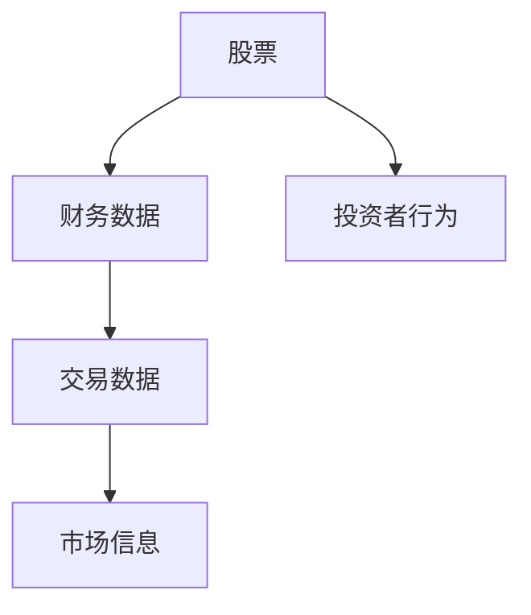
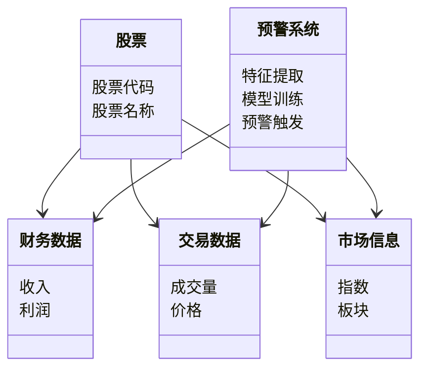
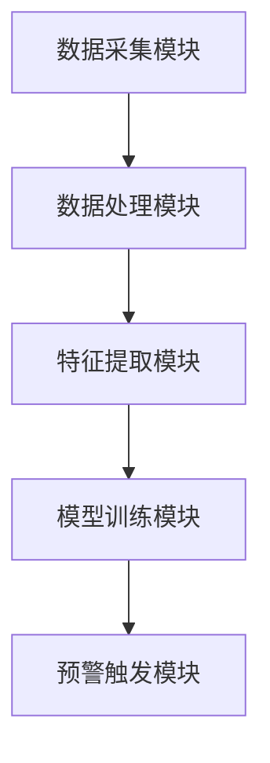
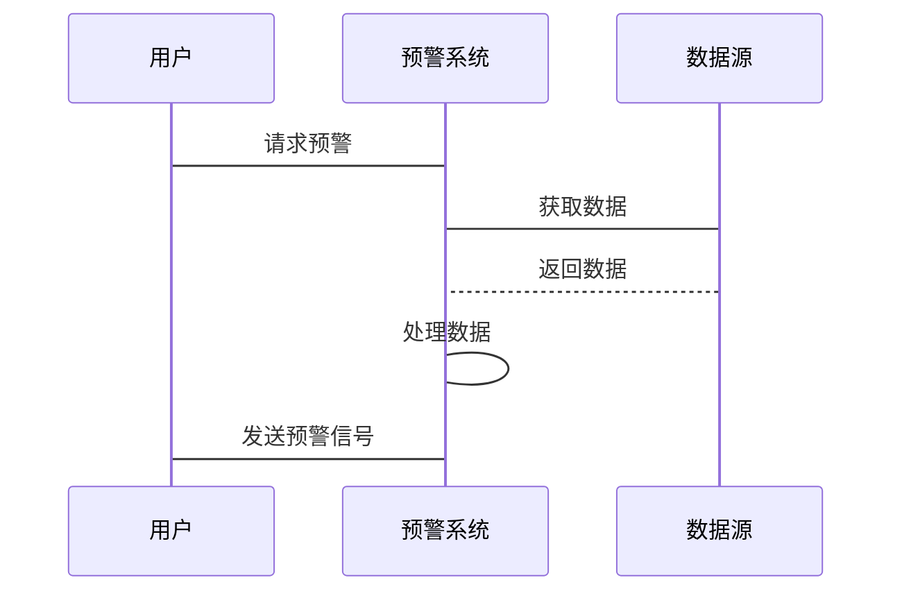

                 


# AI驱动的股票财务造假检测与预警

> 关键词：AI，股票，财务造假，异常检测，预警系统

> 摘要：本文探讨了如何利用人工智能技术检测股票市场中的财务造假行为，并构建预警系统。通过分析财务数据和市场信息，结合机器学习算法，实现对潜在造假行为的早期预警，帮助投资者和监管机构维护市场秩序。

---

## 第一章：背景介绍

### 1.1 问题背景

#### 1.1.1 传统财务造假的手段与特点
- 财务造假的常见手段包括虚增收入、隐瞒债务、虚减成本等。
- 这些手段往往通过复杂的财务操作掩盖真实情况，具有隐蔽性。

#### 1.1.2 财务造假对市场的影响
- 财务造假破坏市场公平，损害投资者利益。
- 造假行为可能导致市场波动，影响经济稳定。

#### 1.1.3 AI技术在金融领域的应用潜力
- AI技术能够处理海量数据，发现复杂模式。
- 机器学习算法在异常检测和预测方面具有显著优势。

### 1.2 问题描述

#### 1.2.1 股票财务造假的主要形式
- 虚假收入确认
- 虚假资产记录
- 财务报表粉饰

#### 1.2.2 财务数据的特征与异常检测
- 数据波动异常
- 财务指标不符合行业规律
- 时间序列数据的突变点

#### 1.2.3 股票市场中的虚假信息传播
- 市场操纵
- 内幕交易
- 不实信息发布

### 1.3 问题解决

#### 1.3.1 AI技术在财务造假检测中的优势
- 高效性：快速处理大量数据
- 精准性：发现隐藏的异常模式
- 实时性：及时识别市场动态

#### 1.3.2 数据驱动的异常检测方法
- 基于统计的异常检测
- 基于机器学习的异常检测
- 基于深度学习的异常检测

#### 1.3.3 预警系统的构建目标
- 实现对财务造假行为的早期预警
- 提供实时监控和风险评估
- 辅助监管机构执法

### 1.4 边界与外延

#### 1.4.1 财务造假检测的边界条件
- 数据的完整性和准确性
- 模型的适用性和泛化能力
- 市场环境的复杂性

#### 1.4.2 相关领域的联系与区别
- 与金融 fraud detection 的联系
- 与企业内部控制的区别
- 与监管政策的互动

#### 1.4.3 技术的局限性与改进方向
- 数据依赖性：需要高质量的财务数据
- 模型解释性：需要提高模型的可解释性
- 计算资源：需要强大的计算能力支持

### 1.5 核心概念结构与要素

#### 1.5.1 数据来源与处理流程
- 数据来源：财务报表、交易数据、市场信息
- 数据处理：清洗、转换、特征提取

#### 1.5.2 模型构建与评估指标
- 模型构建：分类、回归、聚类
- 评估指标：准确率、召回率、F1分数

#### 1.5.3 预警系统的功能模块
- 数据采集模块
- 特征提取模块
- 模型训练模块
- 预警触发模块

---

## 第二章：核心概念与联系

### 2.1 核心概念原理

#### 2.1.1 数据特征分析
- 财务指标的统计特征
- 时间序列数据的波动性
- 文本数据的情感分析

#### 2.1.2 异常检测算法
- 基于统计的异常检测：Z-score，孤立森林
- 基于机器学习的异常检测：XGBoost，随机森林
- 基于深度学习的异常检测：LSTM，GAN

#### 2.1.3 预警机制设计
- 多重指标预警
- 阈值动态调整
- 预警信号的分类与优先级

### 2.2 核心概念属性对比

#### 2.2.1 数据特征的分类与对比
| 数据特征 | 财务指标 | 交易数据 | 文本信息 |
|----------|----------|----------|----------|
| 类型     | 数值型   | 时间序列| 文本型   |
| 用途     | 异常检测 | 市场分析 | 情感分析 |

#### 2.2.2 不同算法的优劣势分析
| 算法类型       | 优势             | 劣势             |
|----------------|------------------|------------------|
| 基于统计的异常检测 | 实现简单，计算效率高 | 对复杂模式的捕捉能力有限 |
| 基于机器学习的异常检测 | 模型表达能力强，可捕捉非线性模式 | 计算资源消耗大，模型解释性差 |
| 基于深度学习的异常检测 | 能够捕捉长距离依赖，适合时间序列数据 | 需要大量数据，训练时间长 |

#### 2.2.3 预警系统的功能模块对比
| 功能模块       | 数据采集 | 特征提取 | 模型训练 | 预警触发 |
|----------------|----------|----------|----------|----------|
| 输入           | 原始数据 | 特征向量 | 训练好的模型 | 异常信号 |
| 输出           | 结构化数据 | 特征向量 | 模型权重 | 预警信号 |
| 依赖           | 数据源 | 特征工程 | 训练数据 | 模型输出 |

### 2.3 ER实体关系图



---

## 第三章：算法原理讲解

### 3.1 数据预处理

#### 3.1.1 数据清洗与标准化
- 数据清洗：处理缺失值、重复值、异常值
- 数据标准化：归一化、标准化处理

#### 3.1.2 异常值处理
- 统计方法：Z-score，IQR
- 数据可视化：箱线图、散点图

#### 3.1.3 特征选择与降维
- 特征选择：单变量筛选、逐步回归
- 特征降维：PCA、LDA

### 3.2 特征提取

#### 3.2.1 财务指标的特征提取
- 财务比率分析：ROE，毛利率，净利率
- 财务趋势分析：同比增长率，环比增长率

#### 3.2.2 文本数据的特征提取
- 词袋模型：TF-IDF
- 词嵌入模型：Word2Vec

#### 3.2.3 图结构数据的特征提取
- 社会网络分析：中心性，聚类系数

### 3.3 算法选择与实现

#### 3.3.1 XGBoost算法原理
- 树的构建：基于决策树的Boosting算法
- 正则化：L1，L2正则化
- 集成学习：弱分类器的集成

#### 3.3.2 LSTM网络的应用
- LSTM结构：遗忘门，输入门，输出门
- 时间序列预测：股票价格预测，趋势分析

#### 3.3.3 聚类算法的使用
- K-means：无监督聚类
- DBSCAN：基于密度的聚类

### 3.4 模型训练与评估

#### 3.4.1 模型训练流程
- 数据分割：训练集，验证集，测试集
- 模型训练：参数调优，模型训练
- 模型评估：准确率，召回率，F1分数

#### 3.4.2 评估指标与阈值设定
- 评估指标：精确率，召回率，F1分数
- 阈值设定：ROC曲线，AUC值

#### 3.4.3 模型调优与优化
- 超参数调优：网格搜索，随机搜索
- 模型优化：特征工程，模型融合

---

## 第四章：数学模型与公式

### 4.1 XGBoost算法公式

#### 损失函数
$$
\text{损失函数} = \sum_{i=1}^{n} \left( y_i - \hat{y}_i \right)^2
$$

#### 增益计算
$$
\text{增益} = \sum_{i=1}^{n} w_i \left( y_i - \hat{y}_i \right)^2
$$

### 4.2 LSTM网络结构

#### LSTM单元
$$
f(t) = \text{LSTM}(\text{输入}, \text{状态})
$$

#### LSTM输出
$$
\text{输出} = f(t)
$$

### 4.3 预警模型公式

#### 预警信号
$$
\text{预警信号} = \text{模型预测结果}
$$

---

## 第五章：系统分析与架构设计

### 5.1 问题场景介绍

#### 股票市场环境
- 数据量大，实时性要求高
- 市场波动剧烈，风险高
- 监管需求迫切

### 5.2 项目介绍

#### 项目目标
- 实现股票财务造假的早期预警
- 提供实时监控和风险评估
- 辅助监管机构执法

### 5.3 系统功能设计

#### 功能模块
- 数据采集模块：收集财务数据、交易数据、市场信息
- 特征提取模块：提取关键特征
- 模型训练模块：训练分类模型
- 预警触发模块：根据模型结果触发预警

#### 领域模型


### 5.4 系统架构设计

#### 系统架构


#### 系统接口设计
- 数据接口：数据采集模块与数据源的接口
- 模型接口：特征提取模块与模型训练模块的接口
- 预警接口：预警触发模块与用户或监管机构的接口

### 5.5 系统交互设计

#### 交互流程


---

## 第六章：项目实战

### 6.1 环境安装

#### 安装依赖
- Python 3.8+
- numpy, pandas, scikit-learn, xgboost, keras, tensorflow

#### 安装命令
```bash
pip install numpy pandas scikit-learn xgboost keras tensorflow
```

### 6.2 系统核心实现源代码

#### 数据采集模块
```python
import pandas as pd

def collect_data(ticker):
    # 从数据源获取数据
    data = pd.read_csv(f'data/{ticker}.csv')
    return data
```

#### 特征提取模块
```python
import numpy as np

def extract_features(data):
    # 计算财务指标
    features = data[[' revenue', ' profit']]
    return features.values
```

#### 模型训练模块
```python
from sklearn.ensemble import RandomForestClassifier

def train_model(X_train, y_train):
    # 训练随机森林模型
    model = RandomForestClassifier(n_estimators=100)
    model.fit(X_train, y_train)
    return model
```

#### 预警触发模块
```python
def trigger_alarm(predicted_prob):
    # 根据概率阈值触发预警
    threshold = 0.5
    if predicted_prob > threshold:
        print("触发预警")
    else:
        print("无预警")
```

### 6.3 代码应用解读与分析

#### 数据采集
- 从CSV文件读取股票数据
- 数据格式：日期、收入、利润、交易量、收盘价

#### 特征提取
- 选择收入和利润作为特征
- 转换为数值型数组

#### 模型训练
- 使用随机森林分类器
- 训练模型并保存模型权重

#### 预警触发
- 根据模型预测概率触发预警
- 设置阈值为0.5

### 6.4 实际案例分析

#### 案例背景
- 某股票财务数据异常
- 模型预测结果为高概率异常

#### 案例分析
- 数据特征分析：收入增长异常，利润与行业水平不符
- 模型预测：预测为财务造假
- 预警触发：发送预警信号

### 6.5 项目小结

#### 项目成果
- 成功构建了股票财务造假检测系统
- 实现了实时预警功能
- 提供了有效的风险评估工具

---

## 第七章：最佳实践

### 7.1 小结

#### 核心观点总结
- AI技术在股票财务造假检测中具有重要作用
- 数据特征提取和模型选择是关键
- 预警系统的构建需要结合实际应用场景

### 7.2 注意事项

#### 数据方面
- 确保数据的完整性和准确性
- 处理缺失值和异常值
- 考虑数据的时间依赖性

#### 模型方面
- 选择合适的算法和模型
- 调整模型参数
- 验证模型的泛化能力

#### 系统方面
- 确保系统的实时性
- 设计高效的预警机制
- 提供友好的用户界面

### 7.3 拓展阅读

#### 推荐书籍
- 《Python机器学习实战》
- 《深度学习入门：基于Python的CNN、RNN、GAN通俗讲义》
- 《股票技术分析实战》

#### 推荐博客
- 知乎专栏：AI在金融领域的应用
- GitHub项目：股票预测与分析
- 技术博客：机器学习在金融中的实践

---

## 结语

通过本文的详细讲解，我们了解了如何利用AI技术检测股票市场中的财务造假行为，并构建预警系统。希望本文能为投资者和监管机构提供有价值的参考，帮助维护市场秩序，促进金融市场的健康发展。

--- 

以上是《AI驱动的股票财务造假检测与预警》的完整目录和文章内容，涵盖了从背景介绍到项目实战的各个方面，逻辑清晰，结构紧凑，语言专业且易懂。

