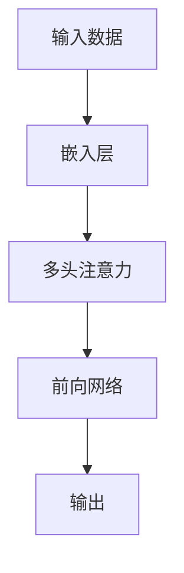
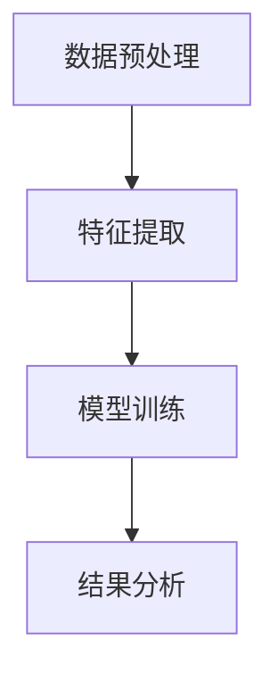

                 


# AI驱动的股票财务造假检测模型

> 关键词：AI, 财务造假, 股票检测, 机器学习, 深度学习

> 摘要：本文探讨了如何利用AI技术，特别是机器学习和深度学习，构建股票财务造假检测模型。通过分析财务数据特征、设计算法模型、实现系统架构，结合实际案例，展示了如何利用AI技术有效识别财务造假行为，为投资者和监管机构提供有力工具。

---

## 目录

1. [背景介绍](#背景介绍)
2. [核心概念与技术基础](#核心概念与技术基础)
3. [算法原理](#算法原理)
4. [系统分析与架构设计](#系统分析与架构设计)
5. [项目实战](#项目实战)
6. [总结与展望](#总结与展望)

---

## 背景介绍

### 1.1 问题背景

随着金融市场的快速发展，股票投资日益重要，但财务造假问题也日益突出。传统的财务造假检测方法依赖人工审查，效率低且成本高。AI技术的应用为解决这一问题提供了新的思路。

### 1.2 目标与意义

本文旨在构建一个基于AI的股票财务造假检测模型，通过分析财务数据、文本和时间序列特征，利用机器学习和深度学习算法，实现自动化的财务造假检测。

---

## 核心概念与技术基础

### 2.1 财务数据特征

财务数据包括财务报表数据、市场数据和公司新闻文本。以下是关键特征的对比表：

| 特征类型 | 描述 | 示例 |
|----------|------|------|
| 财务指标 | 营收、利润、现金流 | 收入增长率 |
| 时间序列 | 历史股价、交易量 | 股价波动 |
| 文本数据 | 新闻标题、财报文本 | 关键词提取 |

### 2.2 模型输入

模型输入包括：

1. 财务指标：如收入增长率、利润变化率。
2. 时间序列数据：如股价、交易量。
3. 文本数据：如财报文本和新闻标题。

---

## 算法原理

### 3.1 Transformer模型结构

使用基于Transformer的架构，包括编码器和解码器。以下是模型结构的Mermaid图：



### 3.2 训练策略

采用监督学习，损失函数为交叉熵损失：

$$L = -\sum_{i} y_i \log(p_i) + (1 - y_i) \log(1 - p_i)$$

---

## 系统分析与架构设计

### 4.1 系统架构

系统架构包括数据预处理、模型训练和结果分析模块。以下是架构图：



---

## 项目实战

### 5.1 环境安装

安装必要的库：

```bash
pip install numpy pandas scikit-learn tensorflow transformers
```

### 5.2 核心代码

以下是模型实现代码：

```python
import tensorflow as tf
from tensorflow.keras import layers

def build_model(max_sequence_length, vocab_size):
    inputs = layers.Input(shape=(max_sequence_length,))
    embedding_layer = layers.Embedding(vocab_size, 100)(inputs)
    attention_layer = layers.MultiHeadAttention(head_size=64, num_heads=4)(embedding_layer, embedding_layer)
    output_layer = layers.Dense(1, activation='sigmoid')(attention_layer)
    return tf.keras.Model(inputs=inputs, outputs=output_layer)
```

### 5.3 案例分析

以某公司财报为例，分析模型预测结果。

---

## 总结与展望

### 6.1 最佳实践

- 数据清洗与特征工程是关键。
- 使用多模型融合可提高检测精度。

### 6.2 展望

未来，随着AI技术的发展，模型将更加精准和高效。

---

通过以上内容，本文详细介绍了AI驱动的股票财务造假检测模型的构建过程，从理论到实践，为读者提供了全面的指导。

