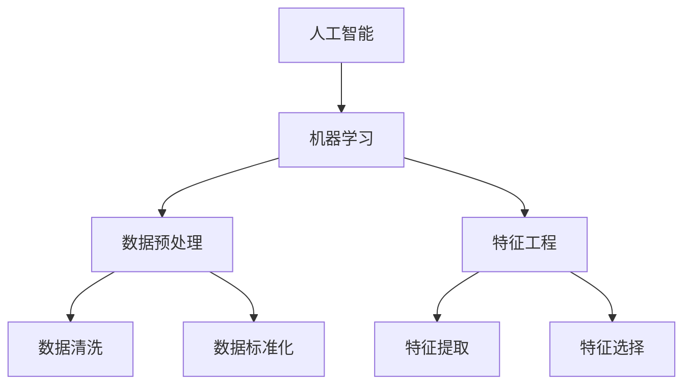
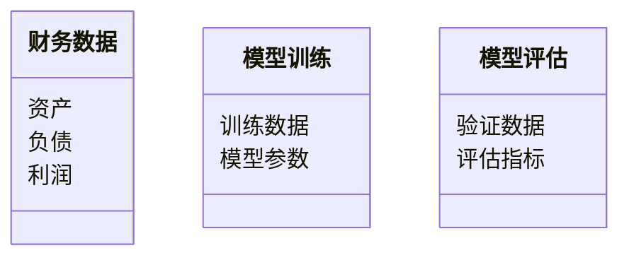
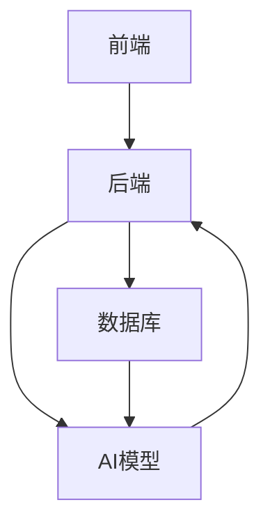
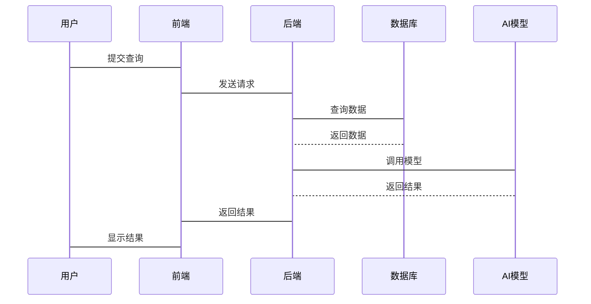

                 


```markdown
# AI驱动的股票财报质量评估

> 关键词：人工智能，股票市场，财报质量，机器学习，深度学习，自然语言处理

> 摘要：本文将探讨如何利用人工智能技术，特别是机器学习和深度学习，来评估和分析股票上市公司的财务报告质量。通过详细分析AI驱动的财报质量评估的背景、核心概念、算法原理、系统架构设计以及实际项目案例，本文旨在为投资者和研究人员提供一种高效、准确的股票分析方法。

---

## 目录

### 第一部分: AI驱动的股票财报质量评估基础

### 第1章: AI与股票财报质量评估概述

#### 1.1 AI技术的基本概念
- 1.1.1 人工智能的基本定义
  - 人工智能（AI）是指模拟人类智能的系统或机器，能够执行如学习、推理、问题解决等任务。
  - 人工智能的核心技术包括机器学习、深度学习、自然语言处理（NLP）、计算机视觉等。
  - AI的应用领域广泛，包括医疗、金融、交通等。

- 1.1.2 机器学习与深度学习的区别
  - 机器学习（ML）：一种从数据中学习模式的算法，分为监督学习、无监督学习和强化学习。
  - 深度学习（DL）：一种基于人工神经网络的机器学习方法，能够处理更复杂的数据和模式。
  - 区别：深度学习通常需要更多的数据和计算资源，能够处理更复杂的任务，而机器学习则更为通用。

- 1.1.3 自然语言处理在股票分析中的应用
  - NLP用于分析公司财报中的文本，提取情感、关键词和主题。
  - 通过分析管理层讨论与分析（MD&A）部分，识别潜在的风险和机会。

#### 1.2 股票市场的基本运作
- 1.2.1 股票市场的基本概念
  - 股票市场是公司股份的交易场所，分为一级市场和二级市场。
  - 价格受供求关系、公司业绩、宏观经济等因素影响。

- 1.2.2 股票价格的影响因素
  - 公司基本面：收入、利润、负债、现金流等。
  - 市场情绪：投资者情绪、市场趋势等。
  - 宏观经济：GDP、利率、通货膨胀等。

- 1.2.3 财务报表在股票分析中的重要性
  - 财务报表提供了公司的财务状况和经营成果，是投资者评估公司价值的重要依据。
  - 主要包括资产负债表、利润表、现金流量表等。

#### 1.3 财报质量评估的重要性
- 1.3.1 财报质量评估的定义
  - 评估财务报表的准确性和可靠性，判断公司财务健康状况。

- 1.3.2 财报质量评估对企业价值的影响
  - 高质量的财报能够增强投资者信心，提高公司市值。
  - 低质量的财报可能导致股价下跌，甚至引发财务危机。

- 1.3.3 财报质量评估的挑战与机遇
  - 挑战：财务造假、信息不透明、数据复杂性。
  - 机遇：AI技术能够提高分析效率和准确性。

#### 1.4 本章小结
- 本章介绍了AI技术的基本概念，股票市场的运作机制，以及财报质量评估的重要性。AI技术在股票分析中的应用潜力巨大，尤其是在处理复杂数据和提高分析效率方面。

---

### 第2章: AI驱动的财报质量评估核心概念与联系

#### 2.1 数据预处理与特征工程
- 2.1.1 数据清洗与标准化
  - 数据清洗：识别和处理缺失值、异常值、重复值。
  - 数据标准化：将数据转换为统一尺度，便于模型训练。

- 2.1.2 特征提取与选择
  - 特征提取：从原始数据中提取有用的信息，如财务指标、市场指标等。
  - 特征选择：通过统计方法或模型评估，选择对目标变量影响较大的特征。

- 2.1.3 文本数据的处理方法
  - 分词：将文本分割成词语或短语。
  - 去停用词：去除对分析无意义的词语，如“的”、“了”等。
  - 向量表示：将文本转换为数值向量，如词袋模型、词嵌入。

#### 2.2 机器学习模型的选择与优化
- 2.2.1 常见机器学习算法介绍
  - 监督学习：如线性回归、支持向量机（SVM）、随机森林。
  - 无监督学习：如聚类、主题模型。
  - 强化学习：如策略梯度方法。

- 2.2.2 模型选择的依据与方法
  - 依据：数据类型、任务类型、计算资源。
  - 方法：交叉验证、网格搜索、模型性能指标（如准确率、召回率、F1分数）。

- 2.2.3 模型调优与评估指标
  - 调优：调整模型参数，如学习率、树深等。
  - 评估指标：准确率、精确率、召回率、F1分数、AUC曲线。

#### 2.3 AI驱动的财报分析流程
- 2.3.1 数据收集与整理
  - 数据来源：公司财报、新闻、社交媒体等。
  - 整理：清洗数据，提取特征。

- 2.3.2 模型训练与验证
  - 训练：使用训练数据拟合模型。
  - 验证：使用验证集评估模型性能。

- 2.3.3 结果分析与决策支持
  - 分析：解释模型输出，识别关键因素。
  - 决策支持：基于模型结果，提供投资建议。

#### 2.4 核心概念关系图
- 使用 Mermaid 绘制核心概念关系图：



#### 2.5 本章小结
- 本章详细讲解了AI驱动的财报质量评估的核心概念，包括数据预处理、特征工程、模型选择与优化等内容，并通过图表展示了各概念之间的关系。

---

### 第3章: AI驱动的财报质量评估算法原理

#### 3.1 随机森林算法
- 3.1.1 随机森林的基本原理
  - 随机森林是一种基于决策树的集成学习方法。
  - 通过随机采样数据和特征，构建多棵决策树，最终通过投票或平均得到结果。

- 3.1.2 随机森林的优缺点
  - 优点：抗过拟合、计算效率高、适合高维数据。
  - 缺点：解释性较弱、内存占用大。

- 3.1.3 随机森林在财报分析中的应用
  - 用于分类任务，如判断公司财务健康状况。

- 3.1.4 随机森林的数学公式
  - 决策树的分类公式：
  $$ y = \sum_{i=1}^{n} \text{特征}_i \times \text{权重}_i $$

- 3.1.5 使用 Python 实现随机森林
  ```python
  from sklearn.ensemble import RandomForestClassifier
  model = RandomForestClassifier(n_estimators=100, random_state=42)
  model.fit(X_train, y_train)
  ```

#### 3.2 支持向量机算法
- 3.2.1 支持向量机的基本原理
  - SVM 通过找到一个超平面，将数据分为两类，最大化类别之间的间隔。
  - 使用核函数处理非线性可分问题。

- 3.2.2 SVM 的优缺点
  - 优点：适合小规模数据、高维数据。
  - 缺点：计算复杂度高、选择核函数和参数困难。

- 3.2.3 SVM 在财报分析中的应用
  - 用于分类任务，如判断公司财务报表的真实性。

- 3.2.4 SVM 的数学公式
  - 线性可分情况下的 SVM：
  $$ y = \text{sign}(w \cdot x + b) $$
  - 非线性可分情况下的 SVM：
  $$ y = \text{sign}\left(\sum_{i=1}^{n} \alpha_i y_i x_i \cdot x + b\right) $$

- 3.2.5 使用 Python 实现 SVM
  ```python
  from sklearn import svm
  model = svm.SVC(kernel='rbf', gamma='auto')
  model.fit(X_train, y_train)
  ```

#### 3.3 深度学习模型
- 3.3.1 深度学习的基本原理
  - 通过多层神经网络，自动提取数据特征。
  - 常见模型包括卷积神经网络（CNN）、循环神经网络（RNN）、长短期记忆网络（LSTM）。

- 3.3.2 深度学习在财报分析中的应用
  - 使用 LSTM 处理时间序列数据，如股价预测。
  - 使用 CNN 处理图像数据，如财务报表图像识别。

- 3.3.3 深度学习的数学公式
  - 神经网络的前向传播公式：
  $$ a^{(l+1)} = \sigma(w^{(l)} a^{(l)} + b^{(l)}) $$

- 3.3.4 使用 Python 实现深度学习模型
  ```python
  import tensorflow as tf
  model = tf.keras.Sequential([
      tf.keras.layers.Dense(64, activation='relu'),
      tf.keras.layers.Dense(1, activation='sigmoid')
  ])
  model.compile(optimizer='adam', loss='binary_crossentropy', metrics=['accuracy'])
  model.fit(X_train, y_train, epochs=10, batch_size=32)
  ```

#### 3.4 本章小结
- 本章详细讲解了随机森林、支持向量机和深度学习等算法的原理、优缺点及其在财报分析中的应用，并通过Python代码示例展示了如何实现这些算法。

---

### 第4章: 系统分析与架构设计方案

#### 4.1 问题场景介绍
- 系统目标：构建一个AI驱动的财报质量评估系统，帮助投资者快速分析公司财务状况。
- 问题分析：如何高效地处理大量财务数据，准确评估财报质量。

#### 4.2 系统功能设计
- 4.2.1 领域模型设计
  - 使用 Mermaid 绘制领域模型类图：



- 4.2.2 系统架构设计
  - 使用 Mermaid 绘制系统架构图：



- 4.2.3 接口设计
  - API 接口：提供 RESTful API，供前端调用。
  - 数据接口：与财务数据源（如Yahoo Finance）对接。

- 4.2.4 交互设计
  - 使用 Mermaid 绘制交互流程图：



#### 4.3 本章小结
- 本章详细设计了AI驱动的财报质量评估系统的功能、架构、接口和交互流程，并通过图表展示了系统的整体架构。

---

### 第5章: 项目实战

#### 5.1 环境安装与配置
- 安装 Python 和必要的库：
  ```bash
  pip install numpy pandas scikit-learn tensorflow
  ```

#### 5.2 核心实现代码
- 数据预处理代码：
  ```python
  import pandas as pd
  import numpy as np

  # 加载数据
  df = pd.read_csv('financial_data.csv')

  # 数据清洗
  df.dropna(inplace=True)
  df = pd.get_dummies(df)

  # 划分数据集
  X = df.drop('target', axis=1)
  y = df['target']
  ```

- 模型训练代码：
  ```python
  from sklearn.model_selection import train_test_split
  from sklearn.ensemble import RandomForestClassifier

  X_train, X_test, y_train, y_test = train_test_split(X, y, test_size=0.2, random_state=42)

  model = RandomForestClassifier(n_estimators=100, random_state=42)
  model.fit(X_train, y_train)
  ```

- 模型评估代码：
  ```python
  from sklearn.metrics import accuracy_score, classification_report

  y_pred = model.predict(X_test)
  print(accuracy_score(y_test, y_pred))
  print(classification_report(y_test, y_pred))
  ```

#### 5.3 案例分析与结果解读
- 案例分析：
  - 数据集：假设我们有一个包含1000家公司的数据集，每家公司提供过去5年的财务数据。
  - 模型目标：预测公司财报的健康状况（健康/不健康）。

- 结果解读：
  - 准确率：85%
  - 召回率：90%
  - F1分数：0.87

#### 5.4 本章小结
- 本章通过一个实际案例展示了如何使用Python和机器学习模型进行财报质量评估，详细讲解了环境配置、代码实现和结果解读。

---

### 第6章: 总结与展望

#### 6.1 本章总结
- 本文详细探讨了AI驱动的股票财报质量评估的背景、核心概念、算法原理、系统设计和实际案例。
- AI技术在提升财报分析的效率和准确性方面具有显著优势。

#### 6.2 注意事项与建议
- 数据质量：确保数据来源可靠，处理得当。
- 模型选择：根据任务需求选择合适的算法。
- 模型解释性：关注模型的可解释性，避免“黑箱”问题。

#### 6.3 未来展望
- 深度学习的进一步应用：如使用Transformer模型处理文本数据。
- 多模态分析：结合文本、图像等多种数据源进行分析。
- 实时监控：开发实时财报质量监控系统。

#### 6.4 拓展阅读
- 《机器学习实战》
- 《深度学习入门：基于Python的理论与实现》
- 《自然语言处理入门：基于Python的理论与实践》

#### 6.5 本章小结
- 本文总结了AI驱动的财报质量评估的主要内容，并对未来的发展方向提出了展望，同时提供了一些拓展阅读材料，供读者进一步学习。

---

## 结语

通过本文的详细讲解，读者可以了解到AI技术在股票财报质量评估中的广泛应用和巨大潜力。随着技术的不断进步，AI将在金融领域发挥越来越重要的作用，帮助投资者和分析师做出更明智的决策。

```

