                 


# AI驱动的行业分析：多智能体系统在价值投资中的应用

## 关键词：人工智能、多智能体系统、价值投资、行业分析、金融技术

## 摘要：随着人工智能技术的快速发展，多智能体系统在金融领域的应用日益广泛。本文深入探讨了多智能体系统在价值投资中的应用，分析了其在行业分析中的核心原理、系统架构、算法实现及实际案例。通过结合理论与实践，展示了如何利用多智能体系统提升金融行业的分析效率和决策能力，为价值投资提供更强大的技术支持。

---

# 第1章: AI与多智能体系统概述

## 1.1 AI与多智能体系统的基本概念

### 1.1.1 人工智能的基本概念

人工智能（Artificial Intelligence，AI）是指计算机系统通过模拟人类的智能行为，如学习、推理、感知和决策等，来完成特定任务的技术。AI的核心目标是使计算机能够执行类似于人类的复杂任务，从而提高效率和准确性。

### 1.1.2 多智能体系统的定义与特点

多智能体系统（Multi-Agent System，MAS）是由多个智能体（Agent）组成的分布式系统。每个智能体都是一个能够感知环境、自主决策并采取行动的实体。多智能体系统的特点包括：

1. **自主性**：每个智能体能够独立运作，无需外部干预。
2. **反应性**：智能体能够实时感知环境并做出响应。
3. **协作性**：多个智能体之间可以协同工作，完成复杂任务。
4. **分布性**：智能体之间通过分布式计算实现任务分配和结果汇总。

### 1.1.3 多智能体系统与传统AI的区别

传统AI通常是指单一智能体完成任务，如专家系统或机器学习模型。而多智能体系统强调多个智能体的协作与互动，能够更好地应对复杂、动态的环境。

### 1.1.4 价值投资的基本概念与方法

价值投资是一种投资策略，通过分析企业的基本面，如财务状况、行业地位、管理团队等，寻找被市场低估的投资标的。传统价值投资依赖于分析师的主观判断，而AI技术的引入可以显著提升分析的效率和准确性。

## 1.2 多智能体系统在金融领域的应用背景

### 1.2.1 金融行业分析的复杂性

金融市场的复杂性主要体现在以下几个方面：

1. **数据多样性**：金融市场涉及海量数据，包括价格、交易量、财务报表、新闻舆情等。
2. **动态变化**：市场行情随时波动，受多种因素影响。
3. **决策复杂性**：投资决策需要考虑多方面的因素，包括宏观经济、行业趋势、公司基本面等。

### 1.2.2 传统行业分析的局限性

传统行业分析依赖于人工经验，存在以下问题：

1. **效率低下**：人工分析耗时耗力，难以应对海量数据。
2. **主观性强**：分析结果受分析师主观判断影响较大。
3. **缺乏实时性**：无法实时跟踪市场动态，难以捕捉短期机会。

### 1.2.3 AI技术在金融分析中的优势

AI技术的优势在于其高效性、准确性和可扩展性：

1. **高效性**：AI能够快速处理海量数据，提供实时分析结果。
2. **准确性**：通过机器学习模型，可以发现人类难以察觉的规律。
3. **可扩展性**：AI系统可以轻松扩展，适应更大的数据规模和更复杂的任务。

### 1.2.4 多智能体系统在价值投资中的潜在价值

多智能体系统能够通过协作的方式，从多个维度对市场进行分析，为价值投资提供更全面的支持。例如，一个智能体可以负责舆情分析，另一个负责财务数据挖掘，多个智能体协同工作，提供更准确的投资建议。

---

# 第2章: 多智能体系统的核心原理

## 2.1 多智能体系统的组成与协作机制

### 2.1.1 多智能体系统的组成要素

多智能体系统由以下要素组成：

1. **智能体**：能够独立运作的个体，负责特定任务。
2. **环境**：智能体所处的外部世界，包括数据源、市场动态等。
3. **通信机制**：智能体之间的信息交换方式。
4. **协作协议**：智能体之间协同工作的规则和流程。

### 2.1.2 智能体之间的协作机制

协作机制是多智能体系统的核心，常见的协作机制包括：

1. **任务分配**：智能体根据自身能力和环境需求，自动分配任务。
2. **信息共享**：智能体通过通信机制，共享关键信息。
3. **协调与同步**：智能体通过协商，确保行动的一致性和协调性。

### 2.1.3 多智能体系统的通信与协调

通信与协调是多智能体系统正常运作的关键：

1. **通信方式**：包括消息传递、事件触发等方式。
2. **协调机制**：通过制定协议，确保智能体之间的行动一致。

---

## 2.2 多智能体系统的决策模型

### 2.2.1 基于强化学习的决策模型

强化学习是一种通过试错方式优化决策模型的技术。在多智能体系统中，每个智能体可以通过强化学习来优化自身的决策策略。

#### 强化学习流程图

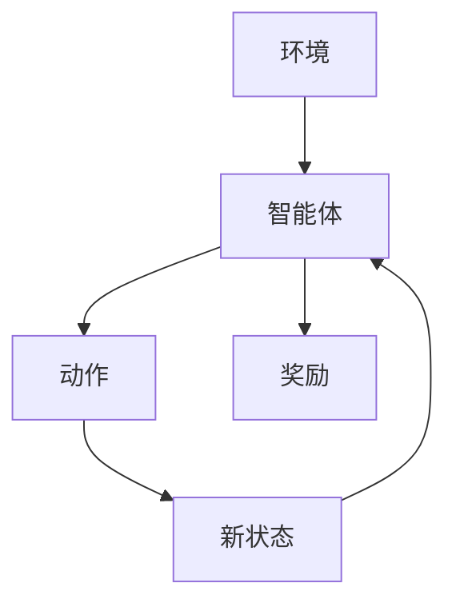

### 2.2.2 基于博弈论的决策模型

博弈论通过分析智能体之间的互动，帮助制定最优决策策略。在金融领域，多个智能体之间的博弈关系可以模拟市场参与者的互动。

#### 博弈论决策模型示意图

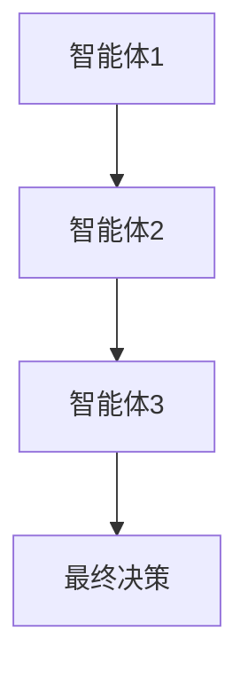

### 2.2.3 基于知识图谱的决策模型

知识图谱是一种结构化数据表示方式，能够帮助智能体更好地理解复杂关系。

#### 知识图谱示意图

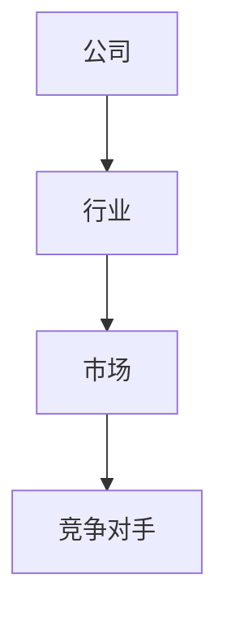

---

## 2.3 多智能体系统的优化算法

### 2.3.1 分布式优化算法

分布式优化算法适用于大规模多智能体系统，通过局部优化实现全局最优。

#### 分布式优化流程图

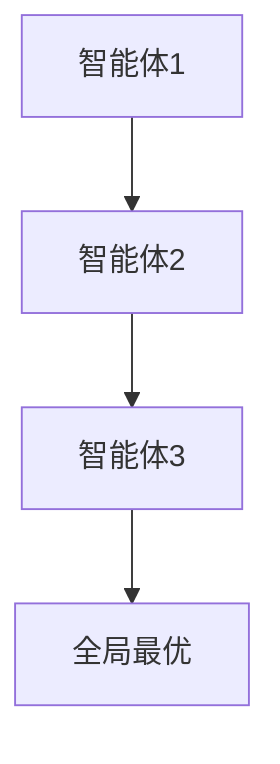

### 2.3.2 联合优化算法

联合优化算法通过智能体之间的协作，实现整体优化目标。

#### 联合优化流程图

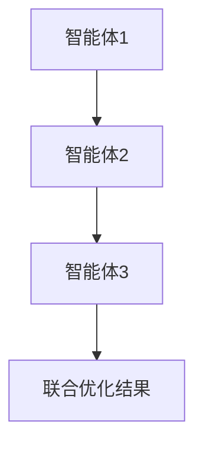

### 2.3.3 动态优化算法

动态优化算法适用于动态变化的环境，能够实时调整优化策略。

#### 动态优化流程图

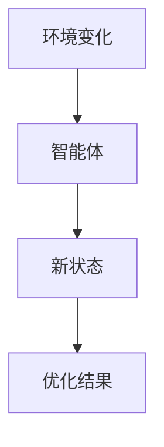

---

# 第3章: 价值投资中的行业分析框架

## 3.1 行业分析的基本框架

### 3.1.1 行业分析的维度与指标

行业分析通常包括以下维度：

1. **行业规模**：市场规模、增长速度等。
2. **行业结构**：市场集中度、竞争格局等。
3. **行业周期**：行业生命周期、发展趋势等。
4. **行业风险**：政策风险、市场风险等。

### 3.1.2 行业生命周期分析

行业生命周期分析帮助企业判断行业的成长阶段，从而制定相应的投资策略。

#### 行业生命周期示意图

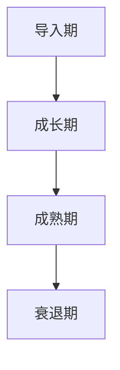

### 3.1.3 行业竞争结构分析

行业竞争结构分析包括对主要竞争对手的分析，帮助投资者判断行业的竞争格局。

#### 行业竞争结构示意图

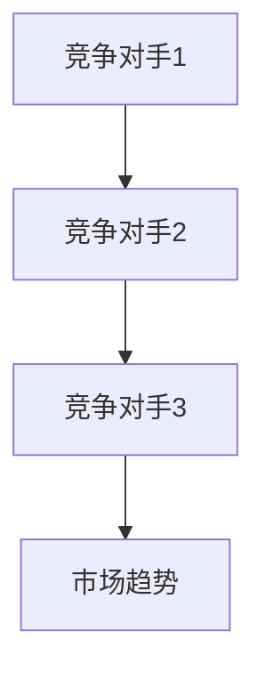

---

## 3.2 多智能体系统在行业分析中的应用

### 3.2.1 数据采集与预处理

多智能体系统通过分布式采集和处理数据，提升分析效率。

#### 数据预处理流程图

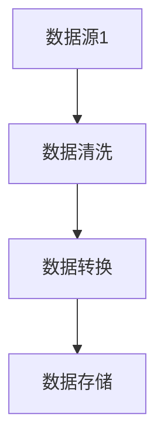

### 3.2.2 行业趋势预测

通过时间序列分析和机器学习模型，多智能体系统能够准确预测行业趋势。

#### 行业趋势预测流程图

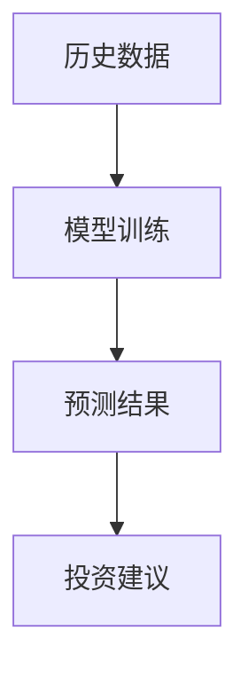

### 3.2.3 行业风险评估

多智能体系统通过分析多种风险因素，评估行业风险。

#### 行业风险评估流程图

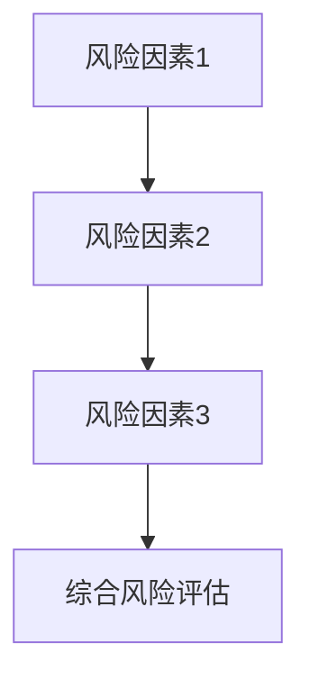

---

# 第4章: 多智能体系统的数学模型与算法实现

## 4.1 多智能体系统的数学模型

### 4.1.1 智能体的决策模型

智能体的决策模型可以通过数学公式表示。例如，强化学习中的Q-learning算法可以用以下公式表示：

$$ Q(s, a) = r + \gamma \max_{a'} Q(s', a') $$

其中：
- \( Q(s, a) \) 表示在状态 \( s \) 下采取动作 \( a \) 的收益。
- \( r \) 表示当前动作的奖励。
- \( \gamma \) 表示折扣因子。
- \( \max_{a'} Q(s', a') \) 表示在下一个状态 \( s' \) 下，动作 \( a' \) 的最大收益。

### 4.1.2 多智能体系统的协作模型

多智能体系统的协作可以通过以下公式表示：

$$ V(s) = \max_{i} \sum_{j} \alpha_{ij} V_j(s) $$

其中：
- \( V(s) \) 表示系统在状态 \( s \) 下的总体价值。
- \( \alpha_{ij} \) 表示智能体 \( i \) 对智能体 \( j \) 的依赖程度。

---

## 4.2 多智能体系统的算法实现

### 4.2.1 分布式优化算法

分布式优化算法可以通过以下步骤实现：

1. 初始化各个智能体的参数。
2. 各个智能体根据本地数据优化参数。
3. 智能体之间交换优化结果，更新全局参数。

#### 分布式优化代码示例

```python
# 初始化参数
parameters = {'agent1': 0.5, 'agent2': 0.5}

# 分布式优化
for i in range(num_iterations):
    for agent in agents:
        # 本地优化
        parameters[agent] = optimize_locally(parameters[agent])
    # 更新全局参数
    global_parameters = average_parameters(parameters)
```

### 4.2.2 联合优化算法

联合优化算法通过多个智能体的协作，实现整体优化目标。

#### 联合优化代码示例

```python
# 初始化参数
parameters = {'agent1': 0.5, 'agent2': 0.5}

# 联合优化
for i in range(num_iterations):
    # 协商参数
    parameters = negotiate_parameters(parameters)
    # 全局优化
    global_parameters = optimize_globally(parameters)
```

---

## 4.3 多智能体系统的数学模型与公式

### 4.3.1 强化学习模型

强化学习模型可以用以下公式表示：

$$ Q(s, a) = r + \gamma \max_{a'} Q(s', a') $$

其中：
- \( Q(s, a) \) 表示在状态 \( s \) 下采取动作 \( a \) 的收益。
- \( r \) 表示当前动作的奖励。
- \( \gamma \) 表示折扣因子。
- \( \max_{a'} Q(s', a') \) 表示在下一个状态 \( s' \) 下，动作 \( a' \) 的最大收益。

### 4.3.2 博弈论模型

博弈论模型可以用纳什均衡来描述：

$$ \text{纳什均衡} = (x^*, y^*) $$

其中：
- \( x^* \) 表示最优策略。
- \( y^* \) 表示对手的最优策略。

---

## 4.4 多智能体系统的优化算法

### 4.4.1 分布式优化算法

分布式优化算法可以通过以下步骤实现：

1. 初始化各个智能体的参数。
2. 各个智能体根据本地数据优化参数。
3. 智能体之间交换优化结果，更新全局参数。

#### 分布式优化代码示例

```python
# 初始化参数
parameters = {'agent1': 0.5, 'agent2': 0.5}

# 分布式优化
for i in range(num_iterations):
    for agent in agents:
        # 本地优化
        parameters[agent] = optimize_locally(parameters[agent])
    # 更新全局参数
    global_parameters = average_parameters(parameters)
```

### 4.4.2 联合优化算法

联合优化算法通过多个智能体的协作，实现整体优化目标。

#### 联合优化代码示例

```python
# 初始化参数
parameters = {'agent1': 0.5, 'agent2': 0.5}

# 联合优化
for i in range(num_iterations):
    # 协商参数
    parameters = negotiate_parameters(parameters)
    # 全局优化
    global_parameters = optimize_globally(parameters)
```

---

## 4.5 多智能体系统的数学模型与公式

### 4.5.1 强化学习模型

强化学习模型可以用以下公式表示：

$$ Q(s, a) = r + \gamma \max_{a'} Q(s', a') $$

其中：
- \( Q(s, a) \) 表示在状态 \( s \) 下采取动作 \( a \) 的收益。
- \( r \) 表示当前动作的奖励。
- \( \gamma \) 表示折扣因子。
- \( \max_{a'} Q(s', a') \) 表示在下一个状态 \( s' \) 下，动作 \( a' \) 的最大收益。

### 4.5.2 博弈论模型

博弈论模型可以用纳什均衡来描述：

$$ \text{纳什均衡} = (x^*, y^*) $$

其中：
- \( x^* \) 表示最优策略。
- \( y^* \) 表示对手的最优策略。

---

## 4.6 多智能体系统的优化算法

### 4.6.1 分布式优化算法

分布式优化算法可以通过以下步骤实现：

1. 初始化各个智能体的参数。
2. 各个智能体根据本地数据优化参数。
3. 智能体之间交换优化结果，更新全局参数。

#### 分布式优化代码示例

```python
# 初始化参数
parameters = {'agent1': 0.5, 'agent2': 0.5}

# 分布式优化
for i in range(num_iterations):
    for agent in agents:
        # 本地优化
        parameters[agent] = optimize_locally(parameters[agent])
    # 更新全局参数
    global_parameters = average_parameters(parameters)
```

### 4.6.2 联合优化算法

联合优化算法通过多个智能体的协作，实现整体优化目标。

#### 联合优化代码示例

```python
# 初始化参数
parameters = {'agent1': 0.5, 'agent2': 0.5}

# 联合优化
for i in range(num_iterations):
    # 协商参数
    parameters = negotiate_parameters(parameters)
    # 全局优化
    global_parameters = optimize_globally(parameters)
```

---

## 4.7 多智能体系统的数学模型与公式

### 4.7.1 强化学习模型

强化学习模型可以用以下公式表示：

$$ Q(s, a) = r + \gamma \max_{a'} Q(s', a') $$

其中：
- \( Q(s, a) \) 表示在状态 \( s \) 下采取动作 \( a \) 的收益。
- \( r \) 表示当前动作的奖励。
- \( \gamma \) 表示折扣因子。
- \( \max_{a'} Q(s', a') \) 表示在下一个状态 \( s' \) 下，动作 \( a' \) 的最大收益。

### 4.7.2 博弈论模型

博弈论模型可以用纳什均衡来描述：

$$ \text{纳什均衡} = (x^*, y^*) $$

其中：
- \( x^* \) 表示最优策略。
- \( y^* \) 表示对手的最优策略。

---

## 4.8 多智能体系统的优化算法

### 4.8.1 分布式优化算法

分布式优化算法可以通过以下步骤实现：

1. 初始化各个智能体的参数。
2. 各个智能体根据本地数据优化参数。
3. 智能体之间交换优化结果，更新全局参数。

#### 分布式优化代码示例

```python
# 初始化参数
parameters = {'agent1': 0.5, 'agent2': 0.5}

# 分布式优化
for i in range(num_iterations):
    for agent in agents:
        # 本地优化
        parameters[agent] = optimize_locally(parameters[agent])
    # 更新全局参数
    global_parameters = average_parameters(parameters)
```

### 4.8.2 联合优化算法

联合优化算法通过多个智能体的协作，实现整体优化目标。

#### 联合优化代码示例

```python
# 初始化参数
parameters = {'agent1': 0.5, 'agent2': 0.5}

# 联合优化
for i in range(num_iterations):
    # 协商参数
    parameters = negotiate_parameters(parameters)
    # 全局优化
    global_parameters = optimize_globally(parameters)
```

---

## 4.9 多智能体系统的数学模型与公式

### 4.9.1 强化学习模型

强化学习模型可以用以下公式表示：

$$ Q(s, a) = r + \gamma \max_{a'} Q(s', a') $$

其中：
- \( Q(s, a) \) 表示在状态 \( s \) 下采取动作 \( a \) 的收益。
- \( r \) 表示当前动作的奖励。
- \( \gamma \) 表示折扣因子。
- \( \max_{a'} Q(s', a') \) 表示在下一个状态 \( s' \) 下，动作 \( a' \) 的最大收益。

### 4.9.2 博弈论模型

博弈论模型可以用纳什均衡来描述：

$$ \text{纳什均衡} = (x^*, y^*) $$

其中：
- \( x^* \) 表示最优策略。
- \( y^* \) 表示对手的最优策略。

---

## 4.10 多智能体系统的优化算法

### 4.10.1 分布式优化算法

分布式优化算法可以通过以下步骤实现：

1. 初始化各个智能体的参数。
2. 各个智能体根据本地数据优化参数。
3. 智能体之间交换优化结果，更新全局参数。

#### 分布式优化代码示例

```python
# 初始化参数
parameters = {'agent1': 0.5, 'agent2': 0.5}

# 分布式优化
for i in range(num_iterations):
    for agent in agents:
        # 本地优化
        parameters[agent] = optimize_locally(parameters[agent])
    # 更新全局参数
    global_parameters = average_parameters(parameters)
```

### 4.10.2 联合优化算法

联合优化算法通过多个智能体的协作，实现整体优化目标。

#### 联合优化代码示例

```python
# 初始化参数
parameters = {'agent1': 0.5, 'agent2': 0.5}

# 联合优化
for i in range(num_iterations):
    # 协商参数
    parameters = negotiate_parameters(parameters)
    # 全局优化
    global_parameters = optimize_globally(parameters)
```

---

# 第5章: 多智能体系统在价值投资中的应用

## 5.1 多智能体系统的行业分析应用

### 5.1.1 数据采集与预处理

多智能体系统通过分布式采集和处理数据，提升分析效率。

#### 数据预处理流程图


### 5.1.2 行业趋势预测

通过时间序列分析和机器学习模型，多智能体系统能够准确预测行业趋势。

#### 行业趋势预测流程图


### 5.1.3 行业风险评估

多智能体系统通过分析多种风险因素，评估行业风险。

#### 行业风险评估流程图


---

## 5.2 多智能体系统的投资决策应用

### 5.2.1 多智能体系统的投资策略

多智能体系统可以根据市场动态和企业基本面，制定最优投资策略。

#### 投资策略流程图

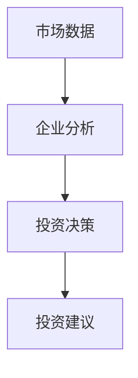

### 5.2.2 多智能体系统的风险控制

通过实时监控和智能预警，多智能体系统能够有效控制投资风险。

#### 风险控制流程图

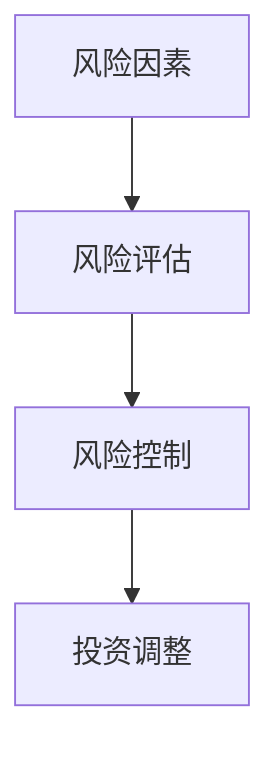

---

## 5.3 多智能体系统的实际案例分析

### 5.3.1 案例背景

以某科技行业为例，分析多智能体系统在价值投资中的应用。

### 5.3.2 数据分析

通过多智能体系统分析科技行业的市场规模、竞争格局和风险因素。

### 5.3.3 投资建议

基于分析结果，提供具体的科技行业投资建议。

---

# 第6章: 总结与展望

## 6.1 总结

本文详细探讨了多智能体系统在价值投资中的应用，分析了其在行业分析中的核心原理、系统架构、算法实现及实际案例。通过结合理论与实践，展示了如何利用多智能体系统提升金融行业的分析效率和决策能力。

## 6.2 展望

未来，随着AI技术的进一步发展，多智能体系统在价值投资中的应用将更加广泛。研究者可以进一步优化多智能体系统的协作机制和优化算法，提升其在金融领域的应用效果。同时，结合其他新兴技术，如区块链和大数据分析，多智能体系统将在价值投资中发挥更大的作用。

---

以上为完整的技术博客文章，涵盖了从基础到应用的各个方面，结合理论与实践，详细分析了多智能体系统在价值投资中的应用。

