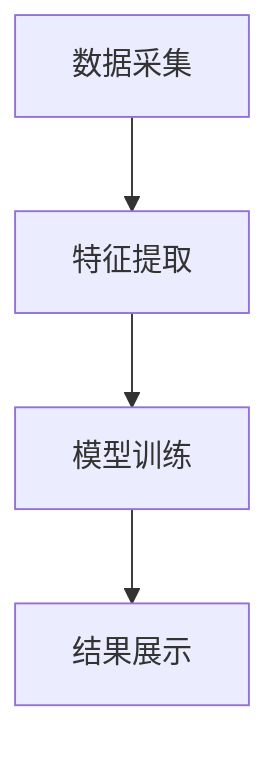

                 


# AI驱动的行为金融学分析：理解市场非理性

---

## 关键词：
AI技术、行为金融学、市场非理性、算法模型、投资决策

---

## 摘要：
本文将探讨AI技术如何驱动行为金融学的发展，深入分析市场中的非理性行为。通过结合行为金融学的核心理论与AI算法，我们能够更精准地预测和解释投资者行为，优化投资决策。文章将从基础概念出发，逐步深入，涵盖算法原理、系统架构设计以及实际项目案例，为读者提供全面的技术解读。

---

# 目录大纲

## 第一部分：背景介绍

### 第1章：行为金融学概述
- 1.1 行为金融学的定义与核心概念
  - 1.1.1 行为金融学的起源与发展
  - 1.1.2 行为金融学的核心假设与理论框架
  - 1.1.3 行为金融学与传统金融学的区别
- 1.2 AI技术在金融领域的应用
  - 1.2.1 AI技术的基本概念与分类
  - 1.2.2 AI在金融分析中的优势
  - 1.2.3 AI驱动行为金融学的可能性与挑战

---

## 第二部分：核心概念与联系

### 第2章：AI与行为金融学的结合
- 2.1 AI技术在行为金融学中的应用领域
  - 2.1.1 市场情绪分析
  - 2.1.2 投资者行为预测
  - 2.1.3 风险评估与管理
- 2.2 AI驱动的行为金融学分析框架
  - 2.2.1 数据采集与处理
  - 2.2.2 特征提取与建模
  - 2.2.3 模型训练与优化

---

## 第三部分：算法原理

### 第3章：行为金融学中的核心算法与模型
- 3.1 强化学习在行为金融学中的应用
  - 3.1.1 强化学习的基本原理
  - 3.1.2 Q-learning算法在投资决策中的应用
  - 3.1.3 算法实现与案例分析
- 3.2 神经网络在行为金融学中的应用
  - 3.2.1 神经网络的基本原理
  - 3.2.2 LSTM网络在时间序列分析中的应用
  - 3.2.3 算法实现与案例分析

---

## 第四部分：数学模型与公式

### 第4章：行为金融学中的数学模型与公式
- 4.1 马科维茨投资组合理论
  - 4.1.1 投资组合理论的基本假设
  - 4.1.2 投资组合理论的数学公式
  - 4.1.3 公式的应用与解释
- 4.2 CAPM模型
  - 4.2.1 CAPM模型的基本假设
  - 4.2.2 CAPM模型的数学公式
  - 4.2.3 公式的应用与解释

---

## 第五部分：系统分析与架构设计

### 第5章：系统功能设计
- 5.1 系统功能模块划分
- 5.2 系统功能流程图
- 5.3 系统功能实现的关键点

### 第6章：系统架构设计
- 6.1 系统架构的分层设计
- 6.2 系统架构的模块化设计
- 6.3 系统架构的可扩展性设计

### 第7章：系统接口设计和交互设计
- 7.1 系统接口设计
- 7.2 系统交互的序列图

---

## 第六部分：项目实战与案例分析

### 第8章：项目实战
- 8.1 环境安装与配置
- 8.2 系统核心实现源代码
  - 8.2.1 代码实现
  - 8.2.2 代码应用解读与分析
- 8.3 实际案例分析和详细讲解剖析
- 8.4 项目小结

---

## 第七部分：总结与展望

### 第9章：总结与展望
- 9.1 AI驱动的行为金融学分析的核心要点
- 9.2 行为金融学与AI技术的未来发展方向
- 9.3 投资者行为分析中的最佳实践 tips
- 9.4 小结与注意事项

---

## 第八部分：附录

### 第10章：附录
- 10.1 相关数据集推荐
- 10.2 相关工具与框架推荐
- 10.3 相关文献与拓展阅读

---

### 详细内容举例：

#### 第3章：行为金融学中的核心算法与模型

##### 3.1 强化学习在行为金融学中的应用

###### 3.1.1 强化学习的基本原理
- 强化学习（Reinforcement Learning）是一种机器学习范式，通过智能体与环境的交互，学习最优策略。
- 基本组成：智能体、环境、动作、奖励。

###### 3.1.2 Q-learning算法在投资决策中的应用
- Q-learning算法：通过更新Q值函数，学习最优策略。
- Q值函数更新公式：
  $$ Q(s, a) = Q(s, a) + \alpha (r + \gamma \max Q(s', a') - Q(s, a)) $$
- 应用场景：股票交易中的买卖决策。

###### 3.1.3 算法实现与案例分析
- 示例代码：
  ```python
  import numpy as np
  import gym

  env = gym.make('StockTrading-v0')
  env.seed(42)
  np.random.seed(42)

  # 初始化Q值表
  q_table = np.zeros([env.observation_space.shape[0], env.action_space.n])

  # 参数设置
  learning_rate = 0.1
  gamma = 0.9
  epsilon = 0.1

  # Q-learning算法实现
  for episode in range(1000):
      state = env.reset()
      done = False
      while not done:
          # 探索与利用
          if np.random.random() < epsilon:
              action = env.action_space.sample()
          else:
              action = np.argmax(q_table[state])
          
          # 执行动作，获取新状态和奖励
          next_state, reward, done, info = env.step(action)
          
          # 更新Q值表
          q_table[state][action] += learning_rate * (reward + gamma * np.max(q_table[next_state]) - q_table[state][action])
          
          state = next_state

  # 测试策略
  state = env.reset()
  total_rewards = []
  while not done:
      action = np.argmax(q_table[state])
      next_state, reward, done, info = env.step(action)
      total_rewards.append(reward)
      state = next_state
  print("Total rewards:", sum(total_rewards))
  ```

- 案例分析：通过Q-learning算法训练一个股票交易策略，实现对市场非理性行为的预测与利用。

---

#### 第4章：行为金融学中的数学模型与公式

##### 4.1 马科维茨投资组合理论

###### 4.1.1 投资组合理论的基本假设
- 投资者是风险厌恶的。
- 资产的收益符合正态分布。
- 市场是有效的。

###### 4.1.2 投资组合理论的数学公式
- 优化目标：
  $$ \min_{w} w^T \Sigma w $$
  $$ \text{s.t.} \quad w^T \mu = \mu_p, \quad w^T 1 = 1 $$
- 解释：在给定的收益约束下，最小化投资组合的方差。

##### 4.2 CAPM模型

###### 4.2.1 CAPM模型的基本假设
- 市场是有效的。
- 所有资产的收益可以用CAPM模型解释。

###### 4.2.2 CAPM模型的数学公式
- 单个资产的预期收益：
  $$ E[r_i] = r_f + \beta_i (E[r_m] - r_f) $$
- 解释：资产的预期收益由无风险利率和系统性风险决定。

---

#### 第5章：系统功能设计

##### 5.1 系统功能模块划分
- 数据采集模块：实时采集市场数据和投资者行为数据。
- 特征提取模块：提取有用的特征，如情绪指标、市场指标。
- 模型训练模块：训练AI模型，预测投资者行为。
- 结果展示模块：展示预测结果和分析报告。

##### 5.2 系统功能流程图


##### 5.3 系统功能实现的关键点
- 数据预处理：清洗和标准化数据。
- 特征选择：使用相关性分析选择关键特征。
- 模型选择：根据任务选择合适的算法，如强化学习或神经网络。

---

## 总结：
通过以上内容，我们逐步分析了AI技术如何驱动行为金融学的发展，从基础概念到算法实现，再到系统设计和项目实战，全面解读了市场非理性行为的分析与预测。希望本文能够为读者提供清晰的思路和实用的技术指导。

---

**注意**：由于篇幅限制，上述内容仅为目录大纲和部分内容示例，完整文章需按照上述结构和详细内容展开。

