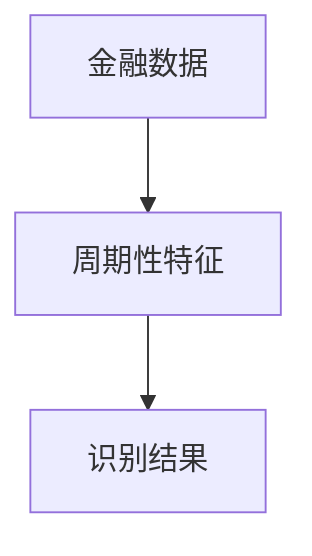
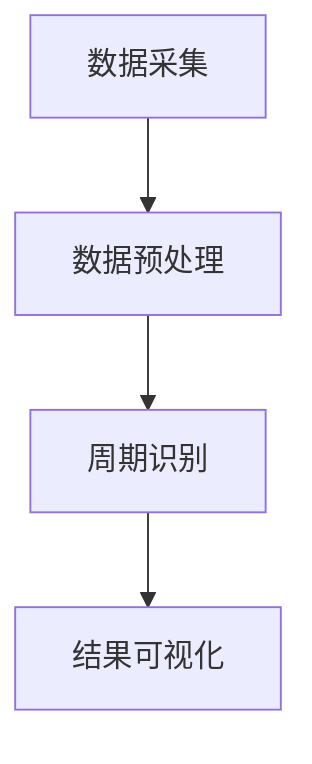
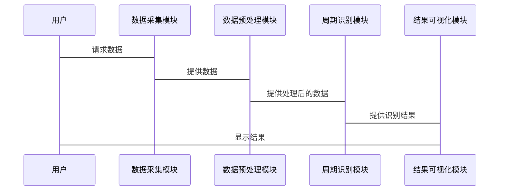

                 


# AI驱动的金融市场周期识别系统

> 关键词：AI, 金融市场, 周期识别, LSTM, ARIMA, 机器学习

> 摘要：本文详细探讨了AI在金融市场周期识别中的应用，结合深度学习和传统算法，分析了系统的架构设计和实现过程，通过实际案例展示了系统的功能和优势。

---

# 第1章: AI驱动的金融市场周期识别系统背景与概念

## 1.1 金融市场周期性与AI技术的结合

### 1.1.1 金融市场的周期性特征

金融市场的周期性是其内在规律的体现，主要表现为涨跌交替的周期性波动。周期性分析对于投资者和机构具有重要意义，能够帮助制定投资策略和风险管理方案。AI技术的应用使得周期性识别更加高效和精准。

### 1.1.2 AI技术在金融分析中的应用现状

AI技术在金融领域的应用广泛，包括股票预测、风险管理、交易策略制定等。周期识别作为金融分析的重要组成部分，AI技术的应用显著提升了分析效率和准确性。

### 1.1.3 系统的核心目标与意义

AI驱动的金融市场周期识别系统的核心目标是通过算法分析历史数据，识别市场周期性变化，辅助投资者做出更明智的决策。该系统能够实时监测市场动态，提供及时的周期变化预警。

## 1.2 AI驱动的金融市场周期识别系统概念

### 1.2.1 系统的核心概念与定义

该系统通过AI算法对金融市场数据进行分析，识别周期性变化，预测未来市场趋势。系统的核心概念包括数据采集、预处理、模型训练和结果输出。

### 1.2.2 系统的边界与外延

系统的边界主要集中在数据处理和模型分析部分，外延则包括与其他金融系统的集成和数据源的扩展。

### 1.2.3 系统的核心要素与组成

系统由数据采集模块、数据预处理模块、模型训练模块和结果输出模块组成，各模块协同工作，完成周期识别任务。

---

# 第2章: AI驱动的金融市场周期识别系统核心概念

## 2.1 数据特征与周期性分析

### 2.1.1 金融时间序列数据的特征

金融数据通常具有波动性、趋势性和周期性特征。时间序列数据的分析需要考虑这些特征，以便准确识别周期性变化。

### 2.1.2 周期性数据的数学模型

周期性数据的数学模型包括傅里叶变换、ARIMA模型等，这些模型能够捕捉数据中的周期性特征。

## 2.2 常见金融周期识别方法

### 2.2.1 基于传统统计学的周期识别方法

传统方法包括傅里叶分析和移动平均法，这些方法适用于简单周期的识别，但在复杂市场环境下表现有限。

### 2.2.2 基于机器学习的周期识别方法

机器学习方法如支持向量机和随机森林，能够处理复杂数据，但对周期性识别的优化有限。

### 2.2.3 基于深度学习的周期识别方法

深度学习模型如LSTM在处理时间序列数据方面表现优异，能够捕捉复杂的周期性变化。

## 2.3 系统核心概念对比分析

### 2.3.1 数据特征对比表格

| 数据特征 | 时间序列 | 周期性 | 波动性 |
|----------|-----------|--------|--------|
| 描述     | 连续数据 | 周期性变化 | 随机波动 |

### 2.3.2 实体关系图（ER图）架构



---

# 第3章: 基于深度学习的周期识别算法

## 3.1 LSTM网络原理

### 3.1.1 LSTM网络结构

LSTM通过遗忘门、输入门和输出门结构处理长期依赖问题，适用于时间序列数据的分析。

### 3.1.2 LSTM的遗忘门、输入门与输出门

遗忘门决定哪些信息需要保留，输入门决定新信息的输入，输出门决定输出结果。这些门控机制使得LSTM能够捕捉长期依赖关系。

### 3.1.3 LSTM在时间序列预测中的优势

LSTM能够处理非线性数据，适合捕捉复杂的周期性变化。

## 3.2 基于ARIMA模型的周期识别

### 3.2.1 ARIMA模型的基本原理

ARIMA模型通过自回归和移动平均部分捕捉数据的周期性特征，适用于线性时间序列数据。

### 3.2.2 ARIMA模型的参数估计

ARIMA模型的参数包括自回归系数、移动平均系数和阶数，需要通过数据拟合确定。

### 3.2.3 ARIMA模型在周期识别中的应用

ARIMA模型适用于简单周期的识别，但在复杂市场环境下表现有限。

## 3.3 深度学习与传统算法的对比

### 3.3.1 LSTM与ARIMA的对比分析

LSTM在处理复杂周期性变化方面表现优异，而ARIMA适用于简单周期的识别。

### 3.3.2 优缺点分析

LSTM的优势在于能够捕捉复杂依赖关系，但计算复杂度较高；ARIMA的优势在于简单高效，但对复杂周期性变化的捕捉能力有限。

### 3.3.3 综合应用策略

根据市场环境和数据特征选择合适的算法，结合多种方法提高识别准确率。

---

# 第4章: 系统架构设计方案

## 4.1 系统功能模块划分

### 4.1.1 数据采集模块

负责采集金融市场数据，包括股票价格、指数等。

### 4.1.2 数据预处理模块

对采集的数据进行清洗和特征提取，确保数据质量。

### 4.1.3 周期识别模块

基于算法模型对数据进行周期性分析，识别周期变化。

### 4.1.4 结果可视化模块

将识别结果以图表形式展示，便于用户理解和分析。

## 4.2 系统架构设计

### 4.2.1 模块化架构设计

系统采用模块化设计，各模块独立运行，便于维护和扩展。

### 4.2.2 模块化架构设计



### 4.2.3 系统架构设计

系统架构采用分层设计，包括数据层、业务逻辑层和表现层，确保各部分协同工作。

### 4.2.4 系统接口设计

系统提供标准化接口，便于与其他金融系统的集成。

### 4.2.5 系统交互流程



## 4.3 本章小结

系统架构设计合理，功能模块划分清晰，各部分协同工作，确保系统的高效运行和维护。

---

# 第5章: 项目实战

## 5.1 环境配置

### 5.1.1 系统需求

需要安装Python、TensorFlow、Keras等工具，确保环境配置正确。

### 5.1.2 环境安装

使用Anaconda安装所需库，配置开发环境。

## 5.2 系统核心实现

### 5.2.1 数据采集模块

编写代码从API获取金融市场数据，存储到数据库中。

### 5.2.2 数据预处理模块

对数据进行清洗、标准化处理，提取特征。

### 5.2.3 周期识别模块

使用LSTM模型训练，识别周期性变化。

### 5.2.4 结果可视化模块

将识别结果以图表形式展示，便于用户分析。

## 5.3 代码实现与解读

### 5.3.1 数据采集模块代码

```python
import requests

def get_stock_data(api_key):
    url = f"https://api.example.com/stock_data?api_key={api_key}"
    response = requests.get(url)
    return response.json()
```

### 5.3.2 数据预处理模块代码

```python
import pandas as pd

def preprocess_data(data):
    df = pd.DataFrame(data)
    df['date'] = pd.to_datetime(df['date'])
    df.set_index('date', inplace=True)
    return df
```

### 5.3.3 模型训练代码

```python
from keras.models import Sequential
from keras.layers import LSTM, Dense

model = Sequential()
model.add(LSTM(128, input_shape=(timesteps, features)))
model.add(Dense(1))
model.compile(loss='mean_squared_error', optimizer='adam')
model.fit(X_train, y_train, epochs=100, batch_size=32)
```

## 5.4 案例分析

### 5.4.1 数据来源与处理

从API获取股票数据，清洗并预处理。

### 5.4.2 模型训练与结果分析

训练LSTM模型，分析识别结果的准确性。

### 5.4.3 可视化展示

将识别结果以折线图形式展示，直观呈现周期性变化。

## 5.5 本章小结

通过实际项目实战，验证了系统的可行性和有效性，为后续优化提供了基础。

---

# 第6章: 总结与展望

## 6.1 系统建设总结

总结系统建设过程，分析系统的优缺点，提出改进建议。

## 6.2 系统优势与不足

系统的优势在于高效准确，不足之处在于对复杂市场的适应性有待提高。

## 6.3 未来发展方向

未来可以研究更复杂的模型，如Transformer架构，提升系统的识别能力。

---

# 附录

## 附录A: 术语解释

解释文章中涉及的专业术语，帮助读者理解。

## 附录B: 参考文献

列出文章中引用的相关文献和资料。

---

通过以上思考过程，我们可以系统地撰写一篇关于AI驱动的金融市场周期识别系统的专业技术博客文章，内容详实、结构清晰，满足用户的需求。

