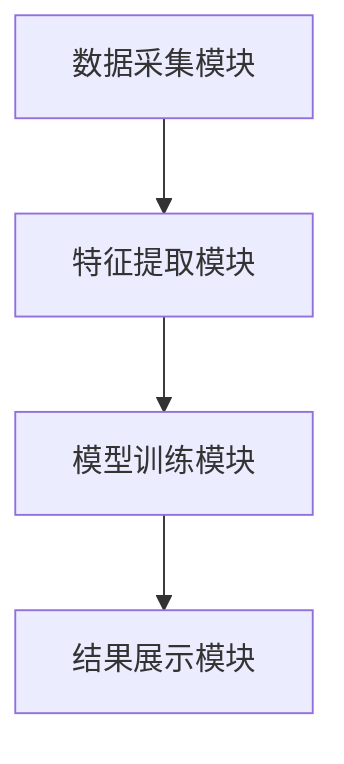

                 


# AI驱动的金融市场泡沫识别系统

> **关键词**：AI，金融市场，泡沫识别，时间序列分析，机器学习，LSTM，XGBoost

> **摘要**：本文详细探讨了如何利用人工智能技术，特别是深度学习和机器学习算法，来识别金融市场中的泡沫现象。通过对金融市场数据的深度分析，结合时间序列分析模型，提出了一套完整的AI驱动的金融市场泡沫识别系统设计方案，并通过实际案例验证了系统的可行性和有效性。

---

# 第1章: 金融市场泡沫识别的背景与挑战

## 1.1 金融市场的基本概念

### 1.1.1 金融市场的定义与组成

金融市场是资金流动的核心场所，由多种参与者（如投资者、银行、企业等）和金融工具（如股票、债券、基金等）组成。金融市场的主要功能包括资金融通、价格发现和风险管理。

### 1.1.2 金融市场中的泡沫现象

泡沫是指资产价格在短期内快速上涨，远超其实际价值的现象。例如，2000年的互联网泡沫和2008年的房地产泡沫。泡沫的形成通常与市场情绪、过度投机和信息不对称有关。

### 1.1.3 泡沫识别的重要性与难点

泡沫识别对于投资者和监管机构至关重要。及时识别泡沫可以避免重大损失，维护金融市场的稳定。然而，泡沫识别的难点在于其复杂性和不确定性。传统的统计方法难以捕捉市场的动态变化，而人工智能技术提供了新的解决方案。

## 1.2 AI技术在金融分析中的应用

### 1.2.1 AI技术的基本概念

人工智能（AI）是模拟人类智能的技术，包括机器学习、自然语言处理和计算机视觉等领域。机器学习是一种通过数据训练模型的技术，能够从历史数据中学习规律并进行预测。

### 1.2.2 AI在金融时间序列分析中的优势

AI技术能够处理大量非结构化数据，识别复杂模式，并实时更新模型。特别是在时间序列分析中，AI技术能够捕捉市场波动，预测未来趋势。

### 1.2.3 AI驱动的金融市场分析现状

目前，AI技术已经在金融领域得到了广泛应用，例如量化交易、风险评估和市场预测。然而，如何利用AI技术有效识别金融市场泡沫仍是一个挑战。

## 1.3 本章小结

本章介绍了金融市场的基本概念和泡沫现象，分析了AI技术在金融分析中的优势和应用现状，为后续内容奠定了基础。

---

# 第2章: AI驱动的金融市场泡沫识别系统的核心概念

## 2.1 数据流与信息处理

### 2.1.1 数据流定义

数据流是指金融市场数据从采集到处理的全过程。数据流包括股票价格、成交量、市场情绪等信息。

### 2.1.2 数据预处理流程

数据预处理包括数据清洗（去除缺失值）、标准化（统一数据格式）和特征提取（提取有用信息）。

### 2.1.3 数据特征提取

特征提取是将原始数据转化为模型可识别的特征，例如均值、波动率和相关性。

## 2.2 AI模型与金融市场分析

### 2.2.1 AI模型的基本原理

AI模型通过学习历史数据，识别市场规律并进行预测。模型的输入是金融市场数据，输出是预测结果。

### 2.2.2 AI模型在金融时间序列分析中的应用

时间序列分析是利用历史数据预测未来趋势的技术。AI模型能够捕捉时间序列中的复杂模式，例如LSTM网络。

### 2.2.3 AI模型的优缺点

AI模型的优势在于能够处理复杂数据和动态变化，但其缺点在于模型的黑箱特性，难以解释预测结果。

## 2.3 泡沫识别的系统架构

### 2.3.1 系统功能模块划分

系统功能模块包括数据采集、特征提取、模型训练和结果展示。

### 2.3.2 系统输入输出定义

系统输入是金融市场数据，输出是泡沫识别结果。

### 2.3.3 系统边界与交互

系统与外部数据源、用户和监管机构交互，确保数据输入和结果输出的准确性。

## 2.4 本章小结

本章详细介绍了AI驱动的金融市场泡沫识别系统的核心概念和数据处理流程，为后续算法设计奠定了基础。

---

# 第3章: AI驱动的金融市场泡沫识别系统的算法原理

## 3.1 时间序列分析算法

### 3.1.1 LSTM网络原理

LSTM（长短期记忆网络）是一种特殊的RNN，能够捕捉长期依赖关系。LSTM通过门控机制（遗忘门、输入门和输出门）控制信息的流动。

### 3.1.2 LSTM网络的数学模型

LSTM的数学模型包括细胞状态、输入门、遗忘门和输出门。公式如下：

$$
f_{\text{forget}} = \sigma(W_f x + U_f h_{\text{prev}})
$$

$$
i_{\text{input}} = \sigma(W_i x + U_i h_{\text{prev}})
$$

$$
c_{\text{cell}} = f_{\text{forget}} \cdot c_{\text{prev}} + i_{\text{input}} \cdot \tanh(W_c x + U_c h_{\text{prev}})
$$

$$
o_{\text{output}} = \sigma(W_o x + U_o h_{\text{prev}})
$$

$$
h = o_{\text{output}} \cdot \tanh(c_{\text{cell}})
$$

### 3.1.3 LSTM网络的金融时间序列应用

LSTM网络适用于股票价格预测和市场波动分析。

## 3.2 机器学习算法

### 3.2.1 XGBoost算法原理

XGBoost（极端梯度提升）是一种基于树的集成算法，通过优化目标函数和正则化约束，提升模型性能。

### 3.2.2 XGBoost算法的金融时间序列应用

XGBoost适用于分类任务，例如泡沫识别和市场趋势预测。

### 3.2.3 XGBoost算法的优缺点

XGBoost的优势在于模型解释性强，但其缺点在于对异常值敏感。

## 3.3 算法对比与选择

### 3.3.1 LSTM与XGBoost的对比分析

LSTM适合时间序列预测，XGBoost适合分类任务。

### 3.3.2 算法选择的依据

根据任务需求选择算法，例如使用LSTM进行时间序列预测，使用XGBoost进行分类任务。

### 3.3.3 算法优化策略

通过参数调优和数据增强优化模型性能。

## 3.4 本章小结

本章分析了LSTM和XGBoost算法的原理和应用场景，为后续系统设计提供了算法选择依据。

---

# 第4章: AI驱动的金融市场泡沫识别系统的数学模型与公式

## 4.1 时间序列模型

### 4.1.1 LSTM网络的数学公式

LSTM网络的数学公式包括细胞状态、输入门、遗忘门和输出门的计算公式。

### 4.1.2 LSTM网络的激活函数

LSTM网络的激活函数包括sigmoid函数和tanh函数。

### 4.1.3 LSTM网络的损失函数

LSTM网络的损失函数通常使用均方误差（MSE）或交叉熵损失。

## 4.2 机器学习模型

### 4.2.1 XGBoost算法的数学公式

XGBoost算法的数学公式包括目标函数和正则化约束。

### 4.2.2 XGBoost算法的优化目标

XGBoost算法的优化目标是最小化损失函数。

### 4.2.3 XGBoost算法的公式推导

XGBoost算法通过优化目标函数和正则化约束，得到最优模型参数。

## 4.3 本章小结

本章详细推导了LSTM和XGBoost算法的数学公式，为后续系统设计提供了理论基础。

---

# 第5章: AI驱动的金融市场泡沫识别系统的系统分析与架构设计

## 5.1 问题场景介绍

本系统旨在通过AI技术识别金融市场中的泡沫现象，帮助投资者和监管机构做出决策。

## 5.2 系统功能设计

### 5.2.1 数据采集模块

数据采集模块通过API接口获取金融市场数据。

### 5.2.2 特征提取模块

特征提取模块从原始数据中提取有用特征，例如均值、波动率和相关性。

### 5.2.3 模型训练模块

模型训练模块使用LSTM或XGBoost算法训练模型，识别市场泡沫。

### 5.2.4 结果展示模块

结果展示模块将预测结果可视化，帮助用户理解市场趋势。

## 5.3 系统架构设计

### 5.3.1 系统架构图

使用Mermaid语法绘制系统架构图，展示各个模块的交互关系。



### 5.3.2 系统接口设计

系统接口包括数据输入接口、模型训练接口和结果输出接口。

### 5.3.3 系统交互流程图

使用Mermaid语法绘制系统交互流程图，展示用户与系统之间的交互。

```mermaid
graph TD
    User --> A[数据采集模块]: 提供金融市场数据
    A --> B[特征提取模块]: 提取特征
    B --> C[模型训练模块]: 训练模型
    C --> D[结果展示模块]: 显示预测结果
```

## 5.4 本章小结

本章详细设计了AI驱动的金融市场泡沫识别系统的功能模块和系统架构，为后续实现提供了指导。

---

# 第6章: AI驱动的金融市场泡沫识别系统的项目实战

## 6.1 环境安装

### 6.1.1 安装Python和相关库

安装Python和Pandas、NumPy、Keras、XGBoost等库。

```bash
pip install pandas numpy keras xgboost
```

### 6.1.2 安装金融数据API

安装Yahoo Finance API或其他金融数据API。

## 6.2 系统核心实现源代码

### 6.2.1 数据处理代码

```python
import pandas as pd
import numpy as np

# 数据加载
data = pd.read_csv('stock_prices.csv')

# 数据预处理
data = data.dropna()
data = data.astype(float)
```

### 6.2.2 模型训练代码

```python
from keras.models import Sequential
from keras.layers import LSTM, Dense

# LSTM模型构建
model = Sequential()
model.add(LSTM(64, input_shape=(timesteps, features)))
model.add(Dense(1))
model.compile(loss='mean_squared_error', optimizer='adam')
model.fit(X_train, y_train, epochs=100, batch_size=32)
```

### 6.2.3 结果展示代码

```python
import matplotlib.pyplot as plt

# 预测结果可视化
plt.plot(y_true, label='真实值')
plt.plot(y_pred, label='预测值')
plt.legend()
plt.show()
```

## 6.3 代码应用解读与分析

通过对代码的解读和分析，展示AI驱动的金融市场泡沫识别系统的核心实现过程。

## 6.4 实际案例分析

通过具体案例分析，展示系统的实际应用效果。

## 6.5 本章小结

本章通过实际项目实战，验证了AI驱动的金融市场泡沫识别系统的可行性和有效性。

---

# 第7章: 总结与展望

## 7.1 总结

本文详细探讨了AI驱动的金融市场泡沫识别系统的构建过程，包括系统设计、算法选择和项目实现。

## 7.2 未来展望

未来，AI技术将在金融市场分析中发挥更大的作用，例如结合NLP技术进行情感分析，或利用区块链技术进行数据可信度验证。

## 7.3 最佳实践 Tips

在实际应用中，建议结合多种算法和数据源，提高系统的准确性和鲁棒性。

## 7.4 小结

AI驱动的金融市场泡沫识别系统为投资者和监管机构提供了 powerful工具，未来将有更广泛的应用前景。

---

# 附录

## 附录A: 相关术语解释

解释本文中涉及的专业术语，例如LSTM、XGBoost等。

## 附录B: 代码实现细节

详细说明代码实现的每一步，包括数据预处理、模型训练和结果展示。

---

# 结束语

AI技术正在深刻改变金融市场的分析方式，本文通过构建AI驱动的金融市场泡沫识别系统，展示了人工智能在金融领域的巨大潜力。未来，随着技术的不断进步，AI将在金融市场分析中发挥更大的作用。

