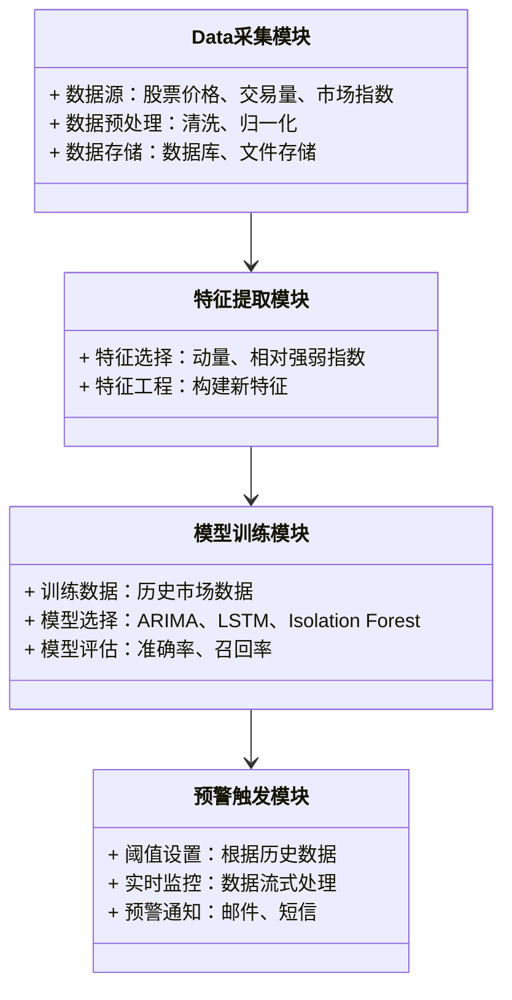
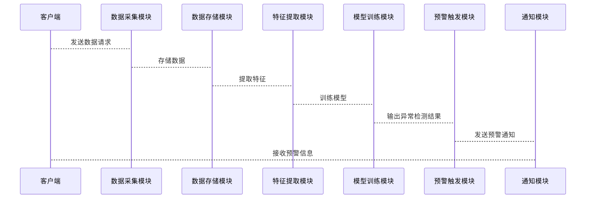

                 


# AI驱动的金融市场黑天鹅事件预警系统

## 关键词：AI技术、金融市场、黑天鹅事件、预警系统、异常检测、时间序列分析、机器学习

## 摘要：  
本文探讨了如何利用人工智能技术构建金融市场黑天鹅事件的预警系统。通过分析金融市场数据的特征，结合时间序列分析、异常检测和集成学习等算法，提出了一种基于AI的预警模型。该系统能够提前识别潜在的极端风险事件，帮助投资者和金融机构做出及时决策，降低损失。文章详细介绍了系统的架构设计、算法原理、实现方法以及实际案例分析，为金融市场的风险管理提供了新的思路。

---

## 第一部分: AI驱动的金融市场黑天鹅事件预警系统背景与概述

### 第1章: 金融市场中的黑天鹅事件

#### 1.1 黑天鹅事件的定义与特征

**1.1.1 什么是黑天鹅事件**  
黑天鹅事件是指金融市场中发生的小概率、高影响的极端事件。这类事件通常难以预测，但一旦发生，会对市场造成巨大冲击。例如，2008年的全球金融危机和2020年新冠疫情引发的市场崩盘。

**1.1.2 黑天鹅事件的特征**  
- **低概率性**：在正常市场条件下，这类事件发生的概率极低。  
- **高影响性**：一旦发生，通常会导致市场剧烈波动，甚至引发系统性风险。  
- **可预测性差**：传统统计模型往往无法捕捉到这类事件的前兆。  

**1.1.3 黑天鹅事件对金融市场的冲击**  
黑天鹅事件通常会导致市场流动性枯竭、资产价格大幅波动，甚至引发金融危机。因此，建立有效的预警系统对金融市场稳定具有重要意义。

#### 1.2 AI技术在金融预警中的应用

**1.2.1 人工智能在金融领域的应用现状**  
人工智能技术在金融领域的应用越来越广泛，包括股票价格预测、风险评估、欺诈检测等。然而，现有的预警系统在应对黑天鹅事件时仍存在诸多不足。

**1.2.2 人工智能在金融分析中的优势**  
- **数据处理能力**：AI能够处理海量的非结构化数据，提取隐藏的模式和特征。  
- **实时性**：AI算法可以实现实时数据分析和预警。  
- **自适应性**：AI模型能够根据市场变化动态调整预测策略。  

**1.2.3 当前金融预警系统的局限性**  
传统的预警系统依赖于统计模型，难以捕捉非线性关系和复杂市场行为。此外，现有系统在处理极端事件时往往表现不佳。

#### 1.3 黑天鹅事件预警系统的重要性

**1.3.1 为什么需要黑天鹅事件预警系统**  
- **提前预警**：通过AI技术识别潜在的极端风险事件，提前采取应对措施。  
- **降低损失**：预警系统可以帮助投资者和金融机构减少因极端事件带来的损失。  
- **维护市场稳定**：通过预警和干预，可以降低系统性风险，维护金融市场稳定。  

**1.3.2 传统金融预警系统的不足**  
- **模型假设限制**：传统统计模型假设市场数据符合正态分布，忽视了极端事件的可能性。  
- **数据处理能力有限**：传统方法难以处理海量非结构化数据。  
- **反应速度慢**：传统预警系统通常在事件发生后才做出反应。  

**1.3.3 黑天鹅事件预警系统的社会价值**  
预警系统的建立可以为投资者、金融机构和社会提供重要的风险管理工具，减少极端事件对经济的冲击。

---

### 第2章: AI技术在金融预警中的应用

#### 2.1 人工智能在金融领域的应用现状

**2.1.1 人工智能技术的快速发展**  
近年来，人工智能技术在金融领域的应用取得了显著进展。从股票价格预测到风险管理，AI技术已经成为金融行业的重要工具。

**2.1.2 人工智能在金融分析中的优势**  
- **数据处理能力**：AI能够处理海量的非结构化数据，提取隐藏的模式和特征。  
- **实时性**：AI算法可以实现实时数据分析和预警。  
- **自适应性**：AI模型能够根据市场变化动态调整预测策略。  

**2.1.3 当前金融预警系统的局限性**  
传统的预警系统依赖于统计模型，难以捕捉非线性关系和复杂市场行为。此外，现有系统在处理极端事件时表现不佳。

#### 2.2 AI驱动的预警系统的必要性

**2.2.1 为什么需要AI驱动的预警系统**  
- **提前预警**：通过AI技术识别潜在的极端风险事件，提前采取应对措施。  
- **降低损失**：预警系统可以帮助投资者和金融机构减少因极端事件带来的损失。  
- **维护市场稳定**：通过预警和干预，可以降低系统性风险，维护金融市场稳定。  

**2.2.2 AI技术在金融预警中的优势**  
- **数据处理能力**：AI能够处理海量的非结构化数据，提取隐藏的模式和特征。  
- **实时性**：AI算法可以实现实时数据分析和预警。  
- **自适应性**：AI模型能够根据市场变化动态调整预测策略。  

---

### 第3章: 黑天鹅事件预警系统的重要性

#### 3.1 为什么需要黑天鹅事件预警系统

**3.1.1 传统金融预警系统的不足**  
- **模型假设限制**：传统统计模型假设市场数据符合正态分布，忽视了极端事件的可能性。  
- **数据处理能力有限**：传统方法难以处理海量非结构化数据。  
- **反应速度慢**：传统预警系统通常在事件发生后才做出反应。  

**3.1.2 AI驱动的预警系统的必要性**  
- **提前预警**：通过AI技术识别潜在的极端风险事件，提前采取应对措施。  
- **降低损失**：预警系统可以帮助投资者和金融机构减少因极端事件带来的损失。  
- **维护市场稳定**：通过预警和干预，可以降低系统性风险，维护金融市场稳定。  

---

## 第二部分: AI驱动的黑天鹅事件预警系统核心概念与原理

### 第4章: 数据特征与异常检测

#### 4.1 金融市场数据的特征分析

**4.1.1 时间序列数据的特性**  
金融市场数据通常表现为时间序列，具有以下特征：  
- **趋势性**：数据可能呈现上升或下降的趋势。  
- **周期性**：数据可能受到季节性或周期性因素的影响。  
- **波动性**：数据的波动性可能在不同时间段内发生变化。  

**4.1.2 市场波动性与相关性分析**  
- **波动性**：市场的波动性通常与风险相关，波动性高的市场可能更容易出现极端事件。  
- **相关性**：不同资产之间的相关性在极端事件中可能会显著增加，形成“市场恐慌”。  

**4.1.3 异常数据点的识别**  
- **异常点**：在时间序列中，某些点可能显著偏离正常值，这些点可能是极端事件的前兆。  
- **识别方法**：可以通过统计方法（如Z-score）或机器学习方法（如Isolation Forest）来识别异常点。  

#### 4.2 异常检测算法

**4.2.1 基于统计的方法**  
- **Z-score**：通过计算数据点与均值的距离标准化值来识别异常点。  
- **经验法则**：根据数据的均值和标准差来判断数据点是否为异常。  

**4.2.2 基于机器学习的方法**  
- **Isolation Forest**：一种基于树结构的异常检测算法，适用于无监督学习场景。  
- **One-Class SVM**：通过在特征空间中构建一个超球，识别数据点是否在超球内。  

**4.2.3 深度学习方法**  
- **自动编码器（Autoencoder）**：通过训练一个神经网络来重构输入数据，异常点通常会导致重构误差较大。  
- **变分自编码器（VAE）**：通过生成对抗网络来识别异常点。  

#### 4.3 异常检测的挑战与解决方案

**4.3.1 异常检测的挑战**  
- **样本不平衡**：正常数据点远多于异常数据点，导致模型难以学习异常模式。  
- **概念漂移**：市场环境的变化可能导致模型性能下降。  
- **计算效率**：实时检测需要高效的算法和计算能力。  

**4.3.2 解决方案**  
- **数据增强**：通过生成合成数据来平衡样本分布。  
- **在线学习**：采用增量学习方法，适应市场环境的变化。  
- **分布式计算**：利用分布式计算框架（如Spark）来提高计算效率。  

---

### 第5章: AI算法与模型选择

#### 5.1 常见的AI算法及其适用场景

**5.1.1 时间序列分析算法**

- **ARIMA模型**：自回归积分滑动平均模型，适用于线性时间序列数据。  
- **LSTM网络**：长短期记忆网络，适用于捕捉时间序列中的长期依赖关系。  

**5.1.2 异常检测算法**

- **K-Means**：基于聚类的方法，适用于无监督异常检测。  
- **DBSCAN**：基于密度的聚类算法，适用于处理噪声数据。  

**5.1.3 集成学习算法**

- **随机森林**：通过集成多个决策树来提高模型的泛化能力。  
- **梯度提升树**：通过迭代提升模型性能，适用于分类和回归任务。  

#### 5.2 算法选择的考虑因素

**5.2.1 数据特性**  
- **数据量**：数据量越大，深度学习模型越适用。  
- **数据分布**：样本不平衡问题需要采用特定的算法（如SMOTE）。  
- **数据维度**：高维数据可能需要降维处理（如PCA）。  

**5.2.2 任务目标**  
- **分类任务**：适用于监督学习算法（如SVM、随机森林）。  
- **回归任务**：适用于线性回归、LSTM等算法。  

**5.2.3 计算资源**  
- **计算效率**：在线实时检测需要高效的算法和计算能力。  
- **硬件支持**：深度学习模型需要高性能计算卡（如GPU）。  

---

### 第6章: 系统架构与模块设计

#### 6.1 系统整体架构设计

**6.1.1 数据采集模块**  
- **数据源**：包括股票价格、交易量、市场指数等。  
- **数据格式**：支持多种数据格式，如CSV、JSON等。  
- **数据预处理**：包括数据清洗、归一化等。  

**6.1.2 特征提取模块**  
- **特征选择**：根据领域知识和数据特征选择相关特征。  
- **特征工程**：通过构建新特征（如动量、相对强弱指数）来提高模型性能。  

**6.1.3 模型训练与评估模块**  
- **训练数据**：使用历史数据进行模型训练。  
- **评估指标**：包括准确率、召回率、F1分数等。  
- **模型优化**：通过交叉验证和超参数调优提高模型性能。  

**6.1.4 预警触发模块**  
- **阈值设置**：根据历史数据设定预警阈值。  
- **实时监控**：对当前数据进行实时分析，触发预警。  
- **预警通知**：通过邮件、短信等方式通知相关人员。  

---

## 第三部分: 算法原理与数学模型

### 第7章: 时间序列分析算法

#### 7.1 时间序列分析的基本概念

**7.1.1 时间序列的平稳性与分解**

- **平稳性**：时间序列的均值和方差在时间上保持不变。  
- **分解方法**：将时间序列分解为趋势、周期性和随机成分。  

#### 7.2 ARIMA模型的原理与应用

**7.2.1 ARIMA模型的数学公式**

$$ ARIMA(p, d, q) $$  

其中，  
- $p$：自回归阶数  
- $d$：差分阶数  
- $q$：移动平均阶数  

**7.2.2 ARIMA模型的实现步骤**

1. **数据预处理**：对时间序列进行平稳化处理。  
2. **模型参数选择**：通过AIC准则选择最优的$p$和$q$。  
3. **模型训练**：使用历史数据训练ARIMA模型。  
4. **模型预测**：对未来数据进行预测并计算预测误差。  

#### 7.3 LSTM网络的原理与应用

**7.3.1 LSTM网络的结构**

- **输入门**：控制输入信息的流动。  
- **遗忘门**：决定哪些信息需要遗忘。  
- **输出门**：生成最终的输出值。  

**7.3.2 LSTM网络的数学公式**

$$
\begin{aligned}
i_t &= \sigma(w_i x_t + u_i h_{t-1}) \\
f_t &= \sigma(w_f x_t + u_f h_{t-1}) \\
o_t &= \sigma(w_o x_t + u_o h_{t-1}) \\
g_t &= \tanh(w_g x_t + u_g h_{t-1}) \\
h_t &= f_t \cdot h_{t-1} + i_t \cdot g_t \\
\end{aligned}
$$  

---

### 第8章: 异常检测算法

#### 8.1 Isolation Forest算法的原理与应用

**8.1.1 Isolation Forest算法的数学公式**

$$
\text{异常得分} = \frac{\text{隔离时间}}{\text{平均隔离时间}}
$$  

**8.1.2 Isolation Forest算法的实现步骤**

1. **随机选择特征和数据点**：构建随机树。  
2. **计算异常得分**：根据数据点在树中的位置计算异常得分。  
3. **调整参数**：通过超参数调优提高模型性能。  

#### 8.2 One-Class SVM算法的原理与应用

**8.2.1 One-Class SVM算法的数学公式**

$$
\text{损失函数} = \sum_{i=1}^{n} \max(0, \epsilon - \langle w, x_i \rangle)
$$  

**8.2.2 One-Class SVM算法的实现步骤**

1. **数据预处理**：对数据进行标准化处理。  
2. **模型训练**：使用One-Class SVM算法训练模型。  
3. **异常检测**：对新数据点进行异常检测并输出结果。  

---

## 第四部分: 系统分析与架构设计方案

### 第9章: 系统架构设计

#### 9.1 问题场景介绍

**9.1.1 金融市场中的极端事件**  
黑天鹅事件通常具有低概率、高影响的特点，难以通过传统统计模型预测。

#### 9.2 项目介绍

**9.2.1 项目目标**  
构建一个基于AI的金融市场黑天鹅事件预警系统，帮助投资者和金融机构提前识别潜在风险。

**9.2.2 项目范围**  
涵盖股票、基金、外汇等多种金融资产，支持实时数据采集和分析。

#### 9.3 系统功能设计

**9.3.1 领域模型（类图）**



---

### 第10章: 系统架构设计

#### 10.1 系统架构（架构图）


---

### 第11章: 系统接口设计

#### 11.1 系统接口设计

**11.1.1 数据接口**  
- **输入接口**：接收金融市场数据流。  
- **输出接口**：输出预警信号和相关分析结果。  

**11.1.2 模型接口**  
- **输入接口**：接收特征工程后的数据。  
- **输出接口**：输出异常检测结果和概率分数。  

---

### 第12章: 系统交互设计

#### 12.1 系统交互流程



---

## 第五部分: 项目实战

### 第13章: 项目实战

#### 13.1 环境安装

**13.1.1 安装Python环境**  
- 安装Python 3.8及以上版本。  
- 安装必要的库：NumPy、Pandas、Scikit-learn、Keras、TensorFlow、PyTorch、LSTM。  

**13.1.2 数据采集工具**  
- 使用Yahoo Finance API获取股票数据。  
- 使用Pandas进行数据处理。  

#### 13.2 核心实现

**13.2.1 数据采集与预处理**

```python
import pandas as pd
import numpy as np

# 数据采集
def get_stock_data(ticker, start_date, end_date):
    data = pd.read_csv(f"data/{ticker}.csv")
    return data

# 数据预处理
def preprocess_data(data):
    data = data.dropna()
    data = (data - data.mean()) / data.std()
    return data
```

**13.2.2 特征提取与工程**

```python
import pandas as pd
import numpy as np

# 特征选择
def select_features(data, target_column):
    features = data.columns.drop(target_column)
    return features

# 特征工程
def create_new_features(data):
    data['动量'] = data['收盘价'].rolling(window=5).mean()
    data['相对强弱指数'] = (data['收盘价'] - data['开盘价']) / (data['收盘价'] - data['最低价'])
    return data
```

**13.2.3 模型训练与评估**

```python
from sklearn.ensemble import IsolationForest
from sklearn.metrics import classification_report

# 模型训练
def train_model(X_train, y_train):
    model = IsolationForest(n_estimators=100, contamination=0.05)
    model.fit(X_train, y_train)
    return model

# 模型评估
def evaluate_model(model, X_test, y_test):
    y_pred = model.predict(X_test)
    print(classification_report(y_test, y_pred))
```

**13.2.4 预警系统实现**

```python
import pandas as pd
import numpy as np

# 预警触发
def trigger_alarm(probability_score, threshold=0.05):
    if probability_score < threshold:
        print("触发预警！")
    else:
        print("未触发预警！")

# 实时监控
def monitor_market(data_stream, model, threshold=0.05):
    for data_point in data_stream:
        # 数据预处理
        processed_data = preprocess_data(data_point)
        # 预测概率
        probability = model.predict(processed_data)
        # 触发预警
        trigger_alarm(probability, threshold)
```

---

### 第14章: 案例分析与详细解读

#### 14.1 案例分析

**14.1.1 数据来源**  
使用2010年至2023年的股票数据，包括开盘价、收盘价、最高价、最低价和交易量。  

**14.1.2 数据处理**  
对数据进行清洗和归一化处理，确保数据适合模型训练。  

**14.1.3 模型训练**  
采用Isolation Forest算法进行异常检测，训练模型并评估性能。  

**14.1.4 预警触发**  
在实时数据流上应用模型，触发预警并记录结果。  

---

### 第15章: 项目小结

#### 15.1 项目总结

**15.1.1 项目成果**  
成功构建了一个基于AI的金融市场黑天鹅事件预警系统，能够实时检测异常事件并触发预警。  

**15.1.2 项目经验**  
- **数据处理**：数据预处理和特征工程是系统性能的关键。  
- **算法选择**：不同算法适用于不同的场景，需要根据数据特性进行选择。  
- **系统架构**：模块化设计能够提高系统的可扩展性和维护性。  

---

## 第六部分: 最佳实践

### 第16章: 最佳实践

#### 16.1 小结

**16.1.1 系统优势**  
- **实时性**：能够实现实时数据处理和预警触发。  
- **准确性**：通过多种算法的集成，提高了预警的准确性。  
- **可扩展性**：模块化设计使得系统易于扩展和维护。  

#### 16.2 注意事项

**16.2.1 数据质量**  
- 数据清洗和特征工程是系统性能的关键，需要高度重视。  
**16.2.2 模型调优**  
- 需要根据数据特性进行超参数调优，提高模型性能。  
**16.2.3 系统维护**  
- 定期更新模型和数据，保持系统的有效性和稳定性。  

#### 16.3 拓展阅读

**16.3.1 推荐书籍**  
- 《Python机器学习实战》  
- 《时间序列分析：方法与应用》  

**16.3.2 推荐博客**  
-Towards Data Science  
- Analytics Vidhya  

---

### 第17章: 项目总结与展望

#### 17.1 项目总结

**17.1.1 项目成果**  
通过本项目，我们成功构建了一个基于AI的金融市场黑天鹅事件预警系统，能够实时检测异常事件并触发预警。  

**17.1.2 项目经验**  
- **数据处理**：数据预处理和特征工程是系统性能的关键。  
- **算法选择**：不同算法适用于不同的场景，需要根据数据特性进行选择。  
- **系统架构**：模块化设计能够提高系统的可扩展性和维护性。  

#### 17.2 未来展望

**17.2.1 研究方向**  
- **多模态数据融合**：结合文本、图像等多模态数据，提高预警系统的准确性。  
- **强化学习应用**：探索强化学习在金融市场预测中的应用。  

**17.2.2 技术改进**  
- **模型优化**：研究更高效的算法和模型，提高系统的计算效率和准确性。  
- **系统集成**：将预警系统与其他金融工具（如自动化交易系统）集成，提供更全面的解决方案。  

---

## 结语

通过本文的详细讲解，我们探讨了如何利用人工智能技术构建金融市场黑天鹅事件的预警系统。从数据特征分析到算法选择，从系统架构设计到项目实战，我们提供了一个完整的解决方案。未来，随着AI技术的不断发展，预警系统将更加智能化和高效，为金融市场的稳定与发展提供更有力的支持。

