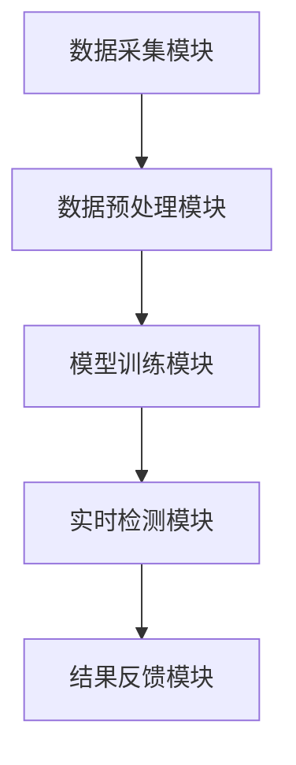
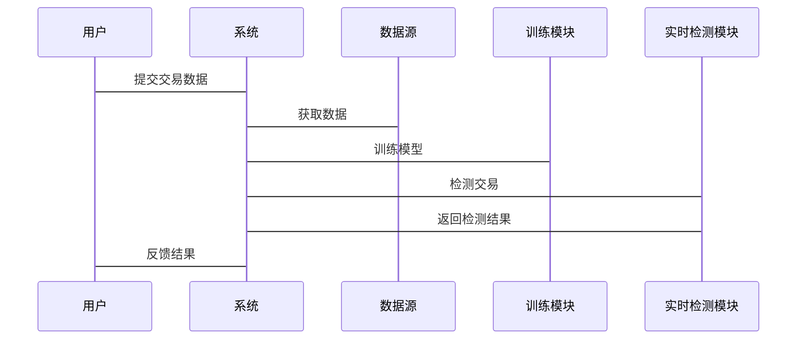

                 


# AI驱动的金融欺诈检测系统

> 关键词：金融欺诈检测，人工智能，机器学习，深度学习，时间序列分析

> 摘要：本文详细探讨了AI在金融欺诈检测中的应用，从背景、核心概念、算法原理到系统架构和项目实战，全面解析了如何利用AI技术构建高效的金融欺诈检测系统。文章通过实际案例分析和代码实现，展示了AI在金融安全领域的强大能力，并提供了最佳实践和未来发展建议。

---

# 第一部分: 背景与概述

## 第1章: 金融欺诈检测的背景与概述

### 1.1 金融欺诈的现状与挑战

#### 1.1.1 金融欺诈的定义与类型

金融欺诈是指通过欺骗、误导或其他非法手段，窃取或骗取金融机构或客户的资金、信息或其他财产的行为。常见的金融欺诈类型包括：

- **信用卡欺诈**：未经授权使用信用卡进行消费或提取现金。
- **交易欺诈**：通过虚假交易或操控交易数据进行非法获利。
- **身份盗窃**：盗用他人身份信息进行金融活动。
- **洗钱**：通过复杂交易掩盖非法资金来源。

#### 1.1.2 传统欺诈检测方法的局限性

传统欺诈检测方法主要依赖规则-based系统（如基于交易金额、频率、地点的限制）和人工审查。然而，这种方法存在以下局限性：

1. **规则复杂性**：需要手动定义大量规则，难以覆盖所有可能的欺诈场景。
2. **响应速度慢**：面对新型欺诈手段，规则系统难以快速调整。
3. **误报与漏报**：规则-based系统容易产生误报或漏报，影响用户体验和金融机构声誉。

#### 1.1.3 AI在金融欺诈检测中的优势

人工智能（AI）和机器学习（ML）技术的引入，为金融欺诈检测带来了显著优势：

1. **自动化学习**：AI能够自动从海量数据中学习，发现隐藏的模式和异常。
2. **实时检测**：基于流数据处理技术，AI系统能够实时分析交易数据，快速识别潜在欺诈行为。
3. **高准确性**：通过训练深度学习模型，AI能够显著提高欺诈检测的准确率，减少误报和漏报。

### 1.2 AI驱动的金融欺诈检测系统的核心概念

#### 1.2.1 问题背景与问题描述

金融欺诈检测的核心问题是：如何通过分析交易数据，识别出潜在的欺诈行为。这涉及到以下关键问题：

- **数据多样性**：金融交易数据类型多样，包括数值型、类别型、时间戳等。
- **数据不平衡性**：欺诈交易占比较小，导致数据分布不均衡。
- **实时性要求**：需要在交易发生时快速做出判断，避免事后损失。

#### 1.2.2 问题解决的思路与方法

AI驱动的金融欺诈检测系统通常采用以下思路：

1. **数据采集与预处理**：收集交易数据，并进行清洗、特征提取等预处理。
2. **模型训练**：使用监督学习、无监督学习或深度学习算法训练模型。
3. **实时检测**：将实时交易数据输入模型，判断是否为欺诈交易。
4. **结果反馈与优化**：根据模型输出结果，调整模型参数或优化检测策略。

#### 1.2.3 系统的边界与外延

金融欺诈检测系统通常包括以下几个部分：

1. **数据采集模块**：负责收集交易数据。
2. **数据预处理模块**：对数据进行清洗和特征工程。
3. **模型训练模块**：训练AI模型。
4. **实时检测模块**：对实时交易进行欺诈检测。
5. **结果反馈模块**：将检测结果反馈给用户或金融机构。

#### 1.2.4 核心要素与概念结构

以下是金融欺诈检测系统的核心要素及其关系：

- **数据源**：交易数据、用户行为数据等。
- **特征工程**：将原始数据转换为模型可识别的特征。
- **模型算法**：如随机森林、XGBoost、LSTM等。
- **实时检测引擎**：负责在线交易的欺诈判断。
- **反馈机制**：根据检测结果优化模型或调整策略。

### 1.3 本章小结

本章介绍了金融欺诈检测的背景、挑战以及AI技术的应用优势。通过分析传统方法的局限性和AI驱动系统的核心概念，为后续章节奠定了基础。

---

# 第二部分: 核心概念与技术基础

## 第2章: AI驱动的金融欺诈检测系统的核心概念与技术基础

### 2.1 AI与机器学习的基本概念

#### 2.1.1 人工智能的定义与特点

人工智能（AI）是指计算机系统通过模拟人类智能完成特定任务的技术。其特点包括：

- **学习能力**：通过数据和经验不断优化性能。
- **推理能力**：能够进行逻辑推理和问题解决。
- **自适应能力**：能够根据环境变化调整自身行为。

#### 2.1.2 机器学习的基本概念与分类

机器学习（ML）是AI的一个子领域，通过数据训练模型，使其能够做出预测或决策。常见的机器学习方法包括：

1. **监督学习**：基于标记数据进行训练，如分类和回归。
2. **无监督学习**：基于未标记数据进行训练，如聚类和降维。
3. **强化学习**：通过与环境交互，学习最优策略。

#### 2.1.3 监督学习、无监督学习与强化学习的对比

| 对比维度         | 监督学习              | 无监督学习            | 强化学习              |
|------------------|-----------------------|-----------------------|-----------------------|
| 数据类型         | 标记数据              | 未标记数据            | 环境反馈              |
| 任务目标         | 分类、回归            | 聚类、降维            | 最大化累积奖励         |
| 应用场景         | 风险评估、欺诈检测    | 客户分群、市场分析    | 自动驾驶、游戏AI       |

### 2.2 金融欺诈检测中的关键算法与技术

#### 2.2.1 常见的机器学习算法及其特点

1. **随机森林（Random Forest）**

随机森林是一种基于决策树的集成学习算法，通过构建多棵决策树并取其投票结果，显著提高了模型的准确性和稳定性。

- **优点**：抗过拟合、特征重要性分析。
- **缺点**：计算资源消耗较大。

2. **XGBoost（梯度提升树）**

XGBoost是一种基于树的梯度提升算法，通过优化目标函数和正则化，显著提高了模型的泛化能力。

- **优点**：训练速度快、模型解释性强。
- **缺点**：参数调整较为复杂。

3. **神经网络（Neural Networks）**

神经网络是一种受生物神经元启发的深度学习模型，能够处理复杂的非线性关系。

- **优点**：能够捕捉数据中的深层特征。
- **缺点**：训练时间长、需要大量计算资源。

4. **LSTM（长短期记忆网络）**

LSTM是一种特殊的RNN（循环神经网络），能够有效处理时间序列数据，特别适合处理金融时间序列数据。

- **优点**：能够捕捉时间序列中的长距离依赖关系。
- **缺点**：训练过程中可能会出现梯度消失或爆炸问题。

#### 2.2.2 深度学习在金融欺诈检测中的应用

深度学习模型（如CNN、RNN、LSTM）在金融欺诈检测中的应用越来越广泛。这些模型能够自动提取高维特征，显著提高了欺诈检测的准确率。

### 2.3 特征工程与数据预处理

#### 2.3.1 特征选择的重要性

特征选择是将原始数据转换为模型可识别的特征的过程。合理的特征选择能够显著提高模型的性能。

#### 2.3.2 数据清洗与预处理的步骤

1. **数据清洗**：去除重复数据、处理缺失值、纠正错误数据。
2. **数据标准化**：将数据标准化或归一化，确保不同特征具有可比性。
3. **特征提取**：从原始数据中提取有意义的特征，如时间特征、行为特征等。

#### 2.3.3 特征提取与特征工程的实现

特征工程是金融欺诈检测中非常重要的一步。通过构建有效的特征，可以显著提高模型的性能。例如：

- **时间特征**：交易时间、交易频率、时间间隔等。
- **行为特征**：交易地点、设备信息、用户行为模式等。
- **金额特征**：交易金额、金额波动、金额分布等。

### 2.4 本章小结

本章详细介绍了AI和机器学习的基本概念，分析了常见的机器学习算法及其特点，并重点讨论了特征工程与数据预处理的重要性。这些内容为后续章节的算法实现奠定了基础。

---

# 第三部分: 算法原理

## 第3章: AI驱动的金融欺诈检测系统的算法原理

### 3.1 常见的欺诈检测算法

#### 3.1.1 随机森林算法

随机森林是一种基于决策树的集成学习算法，通过构建多棵决策树并取其投票结果，显著提高了模型的准确性和稳定性。

#### 3.1.2 XGBoost算法

XGBoost是一种基于树的梯度提升算法，通过优化目标函数和正则化，显著提高了模型的泛化能力。

#### 3.1.3 神经网络模型

神经网络是一种受生物神经元启发的深度学习模型，能够处理复杂的非线性关系。

#### 3.1.4 时间序列模型（如LSTM）

LSTM是一种特殊的RNN（循环神经网络），能够有效处理时间序列数据，特别适合处理金融时间序列数据。

### 3.2 算法原理的数学模型与公式

#### 3.2.1 随机森林的投票机制

随机森林通过投票机制进行分类预测，具体公式如下：

$$
\text{预测结果} = \text{多数决策树的预测结果}
$$

#### 3.2.2 XGBoost的损失函数与优化目标

XGBoost的损失函数通常采用以下形式：

$$
\text{损失函数} = \sum_{i=1}^{n} \left( y_i - \hat{y}_i \right)^2
$$

优化目标是通过梯度提升算法，最小化上述损失函数。

#### 3.2.3 LSTM的循环结构与记忆机制

LSTM通过细胞状态和门控机制实现对时间序列数据的建模。其核心公式包括：

1. **遗忘门**：
$$
f_t = \sigma(W_f \cdot [h_{t-1}, x_t] + b_f)
$$

2. **输入门**：
$$
i_t = \sigma(W_i \cdot [h_{t-1}, x_t] + b_i)
$$

3. **细胞状态更新**：
$$
c_t = f_t \cdot c_{t-1} + i_t \cdot \tilde{c}_t
$$

4. **输出门**：
$$
o_t = \sigma(W_o \cdot [h_{t-1}, x_t] + b_o)
$$

5. **隐藏状态更新**：
$$
h_t = o_t \cdot \tanh(c_t)
$$

### 3.3 算法实现的代码示例

#### 3.3.1 随机森林算法的Python实现

```python
from sklearn.ensemble import RandomForestClassifier

# 数据准备
X_train, y_train = prepare_data()

# 模型训练
model = RandomForestClassifier(n_estimators=100, max_depth=5, random_state=42)
model.fit(X_train, y_train)

# 预测
X_test = ...  # 测试数据
y_pred = model.predict(X_test)
```

#### 3.3.2 XGBoost算法的Python实现

```python
import xgboost as xgb

# 数据准备
X_train, y_train = prepare_data()

# 模型训练
dtrain = xgb.DMatrix(X_train, label=y_train)
params = {
    'objective': 'binary:logistic',
    'max_depth': 5,
    'n_estimators': 100
}
model = xgb.XGBClassifier(**params)
model.fit(X_train, y_train)

# 预测
X_test = ...  # 测试数据
y_pred = model.predict(X_test)
```

#### 3.3.3 LSTM模型的Python实现

```python
import keras
from keras.layers import LSTM, Dense, Dropout

# 数据准备
X_train, y_train = prepare_data()

# 模型构建
model = keras.Sequential()
model.add(LSTM(units=64, return_sequences=True, input_shape=(timesteps, features)))
model.add(Dropout(0.2))
model.add(LSTM(units=32, return_sequences=False))
model.add(Dense(1, activation='sigmoid'))

# 模型训练
model.compile(loss='binary_crossentropy', optimizer='adam', metrics=['accuracy'])
model.fit(X_train, y_train, epochs=10, batch_size=32)
```

### 3.4 本章小结

本章详细介绍了常见欺诈检测算法的原理和实现方法，包括随机森林、XGBoost和LSTM等算法。通过数学公式和代码示例，读者可以更好地理解这些算法的工作原理和实现细节。

---

# 第四部分: 系统分析与架构设计

## 第4章: AI驱动的金融欺诈检测系统的系统分析与架构设计

### 4.1 问题场景介绍

金融欺诈检测系统需要处理海量的交易数据，并实时检测潜在的欺诈行为。系统需要具备以下特点：

1. **高可用性**：确保系统能够7×24小时稳定运行。
2. **低延迟**：实时交易的检测需要在毫秒级别完成。
3. **高扩展性**：能够处理海量数据和高并发请求。

### 4.2 系统功能设计

#### 4.2.1 数据采集模块

- **功能描述**：从多种数据源（如数据库、日志文件）采集交易数据。
- **关键功能**：数据清洗、数据转换、数据存储。

#### 4.2.2 数据预处理模块

- **功能描述**：对采集到的原始数据进行预处理，提取特征。
- **关键功能**：特征选择、数据标准化、特征工程。

#### 4.2.3 模型训练模块

- **功能描述**：训练AI模型，优化模型参数。
- **关键功能**：选择算法、调整超参数、保存模型。

#### 4.2.4 实时检测模块

- **功能描述**：对实时交易数据进行欺诈检测。
- **关键功能**：数据流处理、模型预测、结果反馈。

### 4.3 系统架构设计

#### 4.3.1 系统架构图



#### 4.3.2 关键组件设计

1. **数据采集模块**：负责从多种数据源采集交易数据。
2. **数据预处理模块**：对采集到的原始数据进行清洗和特征提取。
3. **模型训练模块**：训练AI模型，优化模型参数。
4. **实时检测模块**：对实时交易数据进行欺诈检测。
5. **结果反馈模块**：将检测结果反馈给用户或金融机构。

### 4.4 系统接口设计

系统接口设计需要考虑以下几个方面：

1. **数据接口**：与数据库、日志系统等数据源的接口。
2. **模型接口**：与训练模块和实时检测模块的接口。
3. **结果接口**：将检测结果传递给用户或上层系统。

### 4.5 系统交互设计

#### 4.5.1 系统交互流程图



### 4.6 本章小结

本章详细分析了AI驱动的金融欺诈检测系统的功能需求和系统架构，通过mermaid图展示了系统的整体架构和交互流程。

---

# 第五部分: 项目实战

## 第5章: AI驱动的金融欺诈检测系统的项目实战

### 5.1 环境安装与配置

#### 5.1.1 安装Python与相关库

```bash
pip install numpy pandas scikit-learn xgboost keras tensorflow
```

#### 5.1.2 安装Jupyter Notebook

```bash
pip install jupyter
```

### 5.2 系统核心实现源代码

#### 5.2.1 数据预处理代码

```python
import pandas as pd
import numpy as np

# 数据加载
data = pd.read_csv('transactions.csv')

# 数据清洗
data.dropna(inplace=True)

# 特征提取
data['time_feature'] = data['time'].apply(lambda x: x % 24)
data['amount_feature'] = data['amount'].apply(lambda x: np.log(x + 1))
```

#### 5.2.2 模型训练代码

```python
from sklearn.model_selection import train_test_split
from sklearn.ensemble import RandomForestClassifier

# 数据分割
X_train, X_test, y_train, y_test = train_test_split(X, y, test_size=0.2)

# 模型训练
model = RandomForestClassifier(n_estimators=100, max_depth=5, random_state=42)
model.fit(X_train, y_train)

# 模型评估
print('Accuracy:', model.score(X_test, y_test))
```

#### 5.2.3 实时检测代码

```python
import pandas as pd
import numpy as np
import joblib

# 加载模型
model = joblib.load('fraud_detection_model.pkl')

# 实时检测
def detect_fraud(transaction):
    # 特征提取
    features = extract_features(transaction)
    # 预测
    prediction = model.predict(features.reshape(1, -1))
    return 'fraud' if prediction[0] == 1 else 'not fraud'
```

### 5.3 代码应用解读与分析

#### 5.3.1 数据预处理代码解读

上述数据预处理代码包括以下步骤：

1. **数据加载**：从CSV文件中加载交易数据。
2. **数据清洗**：删除缺失值。
3. **特征提取**：提取时间特征和金额特征。

#### 5.3.2 模型训练代码解读

上述模型训练代码包括以下步骤：

1. **数据分割**：将数据分为训练集和测试集。
2. **模型训练**：使用随机森林算法训练模型。
3. **模型评估**：计算模型的准确率。

#### 5.3.3 实时检测代码解读

上述实时检测代码包括以下步骤：

1. **模型加载**：从文件中加载训练好的模型。
2. **特征提取**：从单笔交易中提取特征。
3. **欺诈检测**：使用模型预测交易是否为欺诈。

### 5.4 实际案例分析与详细讲解剖析

#### 5.4.1 数据集描述

假设我们有一个包含以下字段的交易数据集：

| 字段名      | 类型       | 描述                     |
|-------------|------------|--------------------------|
| transaction_id | int       | 交易ID                 |
| amount      | float      | 交易金额                 |
| time        | datetime   | 交易时间                 |
| user_id     | int       | 用户ID                 |
| device_type  | str       | 设备类型                 |
| is_fraud    | bool       | 是否为欺诈交易           |

#### 5.4.2 数据预处理步骤

1. **数据清洗**：删除缺失值。
2. **特征提取**：提取时间特征（如交易时间的小时部分）、金额特征（如对数变换后的金额）。
3. **数据转换**：将数据转换为模型可接受的格式。

#### 5.4.3 模型训练与评估

1. **数据分割**：将数据分为训练集和测试集。
2. **模型训练**：使用随机森林算法训练模型。
3. **模型评估**：计算模型的准确率、召回率和F1分数。

#### 5.4.4 实时检测流程

1. **接收交易数据**：从实时交易中获取数据。
2. **特征提取**：提取交易的特征。
3. **模型预测**：使用训练好的模型预测交易是否为欺诈。
4. **结果反馈**：将预测结果反馈给用户或金融机构。

### 5.5 项目小结

本章通过实际案例分析，详细讲解了AI驱动的金融欺诈检测系统的实现过程，包括数据预处理、模型训练和实时检测等步骤。通过代码示例和实际案例分析，读者可以更好地理解如何将理论应用于实践。

---

# 第六部分: 最佳实践与总结

## 第6章: 最佳实践与总结

### 6.1 最佳实践

#### 6.1.1 数据质量的重要性

数据质量是模型性能的基础。建议在实际应用中：

1. **确保数据完整性**：检查数据是否存在缺失值。
2. **处理异常值**：对异常值进行清洗或标记。
3. **特征工程**：合理提取和选择特征，避免冗余特征。

#### 6.1.2 模型调优与优化

模型调优是提高模型性能的关键。建议在实际应用中：

1. **选择合适的算法**：根据数据特点选择合适的算法。
2. **调整超参数**：使用网格搜索或随机搜索优化模型参数。
3. **模型融合**：通过集成学习（如堆叠、投票）进一步提高模型性能。

#### 6.1.3 实时检测的优化

实时检测是金融欺诈检测的核心。建议在实际应用中：

1. **优化数据处理流程**：减少数据预处理时间。
2. **选择高效的算法**：使用轻量级模型或优化现有模型。
3. **部署高效的计算资源**：使用GPU加速计算。

### 6.2 小结

通过本文的介绍，读者可以全面了解AI驱动的金融欺诈检测系统的构建过程，从背景分析、算法选择、系统设计到项目实战，每一步都进行了详细讲解。

### 6.3 注意事项

1. **数据隐私与安全**：在处理金融数据时，必须遵守相关法律法规，确保数据安全和隐私保护。
2. **模型的可解释性**：在实际应用中，模型的可解释性非常重要，特别是在金融领域。
3. **模型的持续优化**：金融欺诈手段不断演变，需要持续优化模型和检测策略。

### 6.4 拓展阅读

1. **《机器学习实战》**：深入讲解机器学习算法的实现与应用。
2. **《深度学习》（花书）**：系统介绍深度学习的基本原理和应用。
3. **《金融数据分析与建模》**：详细讲解金融数据分析的方法和建模技巧。

### 6.5 本章小结

本章总结了AI驱动的金融欺诈检测系统的最佳实践，并提出了未来的发展方向。通过本文的介绍，读者可以更好地理解和应用AI技术，构建高效的金融欺诈检测系统。

---

# 第七部分: 附录

## 附录A: 项目代码与数据集

### A.1 项目代码

```python
# 数据预处理代码
import pandas as pd
import numpy as np

# 数据加载
data = pd.read_csv('transactions.csv')

# 数据清洗
data.dropna(inplace=True)

# 特征提取
data['time_feature'] = data['time'].apply(lambda x: x % 24)
data['amount_feature'] = data['amount'].apply(lambda x: np.log(x + 1))

# 模型训练代码
from sklearn.model_selection import train_test_split
from sklearn.ensemble import RandomForestClassifier

# 数据分割
X_train, X_test, y_train, y_test = train_test_split(X, y, test_size=0.2)

# 模型训练
model = RandomForestClassifier(n_estimators=100, max_depth=5, random_state=42)
model.fit(X_train, y_train)

# 模型评估
print('Accuracy:', model.score(X_test, y_test))

# 实时检测代码
import joblib

# 加载模型
model = joblib.load('fraud_detection_model.pkl')

# 实时检测
def detect_fraud(transaction):
    # 特征提取
    features = extract_features(transaction)
    # 预测
    prediction = model.predict(features.reshape(1, -1))
    return 'fraud' if prediction[0] == 1 else 'not fraud'
```

### A.2 数据集推荐

1. **Kaggle数据集**：提供丰富的金融欺诈检测数据集。
2. **UCI机器学习仓库**：提供多种金融相关数据集。

## 附录B: 工具与库推荐

### B.1 Python库推荐

- **Pandas**：数据处理与分析。
- **NumPy**：数值计算。
- **Scikit-learn**：机器学习算法实现。
- **XGBoost**：梯度提升算法。
- **Keras**：深度学习框架。

### B.2 开发工具推荐

- **Jupyter Notebook**：交互式编程环境。
- **VS Code**：代码编辑器。
- **Git**：版本控制工具。
- **Docker**：容器化部署工具。

---

# 结语

通过本文的详细讲解，读者可以全面了解AI驱动的金融欺诈检测系统的构建过程。从背景分析、算法选择、系统设计到项目实战，每一步都进行了深入探讨。希望本文能够为读者提供有价值的参考，帮助他们在实际应用中更好地利用AI技术，构建高效的金融欺诈检测系统。

