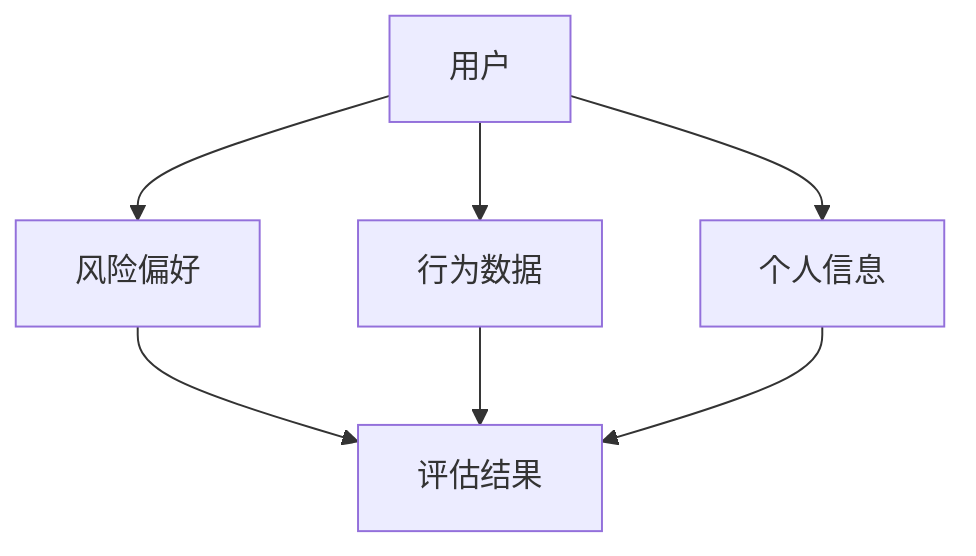
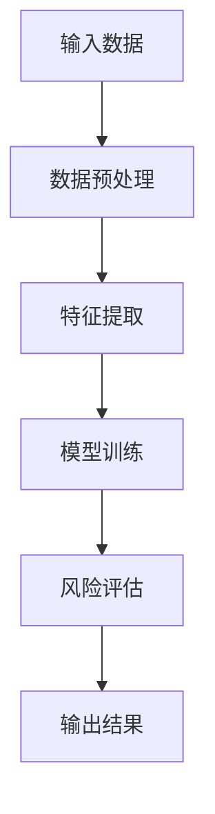
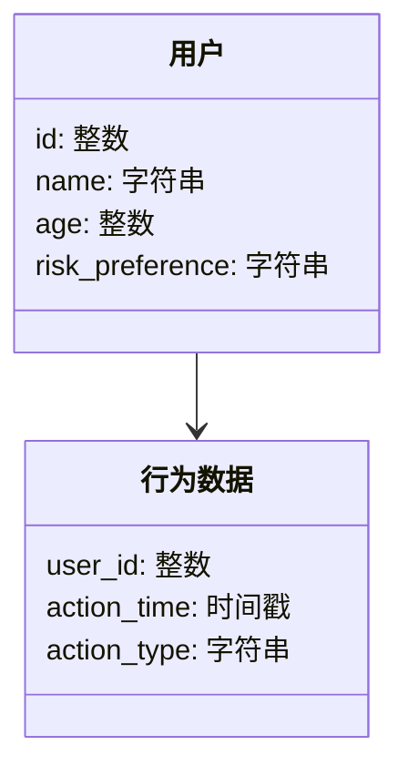
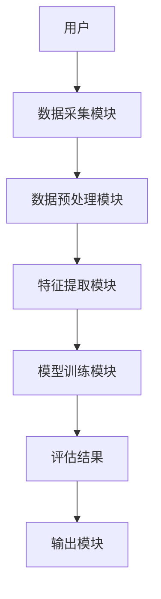
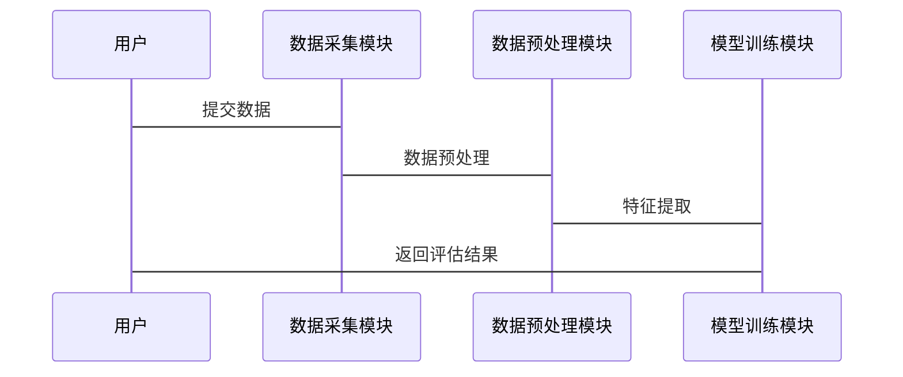

                 


# AI驱动的风险偏好评估系统

## 关键词：AI驱动，风险偏好评估，机器学习算法，系统设计，应用场景

## 摘要：本文探讨了如何利用人工智能技术构建风险偏好评估系统，通过分析用户的行为数据和特征，结合机器学习算法，实现对用户风险偏好的智能评估。文章详细介绍了系统的背景、核心概念、算法原理、系统架构设计以及实际应用案例，为读者提供了一个全面的技术视角。

---

# 第一部分: 背景介绍

## 第1章: 风险偏好评估系统背景介绍

### 1.1 问题背景与描述

#### 1.1.1 风险偏好评估的定义
风险偏好评估是指通过分析个体或组织在面对不确定性时的行为和决策模式，判断其对风险的承受能力和态度。传统的风险评估方法依赖于主观判断和经验分析，存在效率低、精度不足的问题。

#### 1.1.2 传统风险评估方法的局限性
- 数据分析维度有限，难以捕捉复杂行为模式。
- 人工判断为主，主观性强，结果缺乏客观性。
- 对动态变化的环境适应能力不足。

#### 1.1.3 AI技术在风险评估中的应用潜力
- 利用机器学习算法分析海量数据，提取关键特征。
- 实现实时动态评估，适应快速变化的环境。
- 提供个性化评估结果，满足不同用户需求。

### 1.2 问题解决与边界

#### 1.2.1 AI驱动的风险偏好评估的核心目标
- 提供准确、动态的风险偏好评估结果。
- 实现自动化、智能化的评估流程。
- 支持多维度数据的融合与分析。

#### 1.2.2 系统的边界与外延
- 输入：用户行为数据、个人信息、历史数据。
- 输出：风险偏好评估结果、个性化建议。
- 边界：仅关注风险偏好评估，不涉及具体的风险应对策略。

#### 1.2.3 核心要素与组成结构
- 数据采集模块：收集用户行为数据。
- 特征提取模块：从数据中提取关键特征。
- 模型训练模块：训练风险偏好评估模型。
- 评估结果输出模块：生成评估结果并提供反馈。

### 1.3 本章小结
本章介绍了风险偏好评估的背景、传统方法的局限性以及AI技术的应用潜力，明确了系统的核心目标和边界。

---

# 第二部分: 核心概念与联系

## 第2章: 风险偏好评估系统的核心概念

### 2.1 核心概念原理

#### 2.1.1 风险偏好模型的构建
风险偏好模型通过分析用户的行为数据和特征，构建数学模型，预测其风险偏好。

#### 2.1.2 AI算法在风险评估中的应用
- 使用机器学习算法（如随机森林、神经网络）进行特征学习和分类。
- 利用深度学习技术捕捉复杂的数据模式。

#### 2.1.3 多维度数据的融合与分析
- 数据来源：行为数据、个人信息、历史数据。
- 数据融合：通过数据预处理和特征工程，将多维度数据整合到统一模型中。

### 2.2 核心概念属性特征对比

#### 2.2.1 数据特征对比表
| 数据特征 | 描述 | 示例 |
|----------|------|------|
| 行为频率 | 用户在系统中的操作频率 | 每天登录次数 |
| 历史损失 | 用户的历史损失记录 | 过去一年的亏损金额 |
| 用户特征 | 用户的基本信息 | 年龄、职业 |

#### 2.2.2 算法特征对比表
| 算法特征 | 描述 | 示例 |
|----------|------|------|
| 算法类型 | 线性回归、随机森林、神经网络 | 使用随机森林进行分类 |
| 训练数据 | 标签化的数据 | 风险偏好标签（高、中、低） |
| 性能指标 | 准确率、召回率、F1分数 | 准确率：90% |

#### 2.2.3 系统性能对比表
| 系统性能 | 描述 | 示例 |
|----------|------|------|
| 处理速度 | 每秒处理的数据量 | 每秒处理1000条数据 |
| 精度 | 预测的准确性 | 高精度：95% |
| 可扩展性 | 系统的扩展能力 | 支持百万级用户 |

### 2.3 ER实体关系图


### 2.4 本章小结
本章详细讲解了风险偏好评估系统的核心概念，包括模型构建、算法应用以及数据特征对比，通过ER实体关系图展示了系统中的实体关系。

---

# 第三部分: 算法原理讲解

## 第3章: 风险偏好评估算法原理

### 3.1 算法流程图


### 3.2 算法实现代码
```python
def risk_assessment_algorithm(data):
    # 数据预处理
    processed_data = preprocess(data)
    # 特征提取
    features = extract_features(processed_data)
    # 模型训练
    model = train_model(features)
    # 风险评估
    result = predict_risk(model, features)
    return result
```

### 3.3 数学模型与公式

#### 3.3.1 概率计算公式
$$ P(risk) = \frac{成功案例数}{总案例数} $$

#### 3.3.2 评估模型公式
$$ score = w1 * feature1 + w2 * feature2 + ... + wn * featuren $$

#### 3.3.3 示例说明
例如，给定用户行为数据，计算其风险偏好得分：
$$ score = 0.3 * 行为频率 + 0.4 * 历史损失 + 0.3 * 用户特征 $$

### 3.4 本章小结
本章通过流程图和代码示例详细讲解了风险偏好评估算法的实现过程，并通过数学公式解释了其原理。

---

# 第四部分: 系统分析与架构设计方案

## 第4章: 风险偏好评估系统架构设计

### 4.1 问题场景介绍

#### 4.1.1 系统目标
- 实现风险偏好评估的自动化和智能化。
- 提供高精度的评估结果。

#### 4.1.2 系统约束
- 数据隐私保护。
- 系统可扩展性。

### 4.2 项目介绍

#### 4.2.1 项目目标
- 构建一个AI驱动的风险偏好评估系统。
- 提供实时动态的评估结果。

#### 4.2.2 项目范围
- 数据采集与处理。
- 模型训练与部署。

### 4.3 系统功能设计

#### 4.3.1 领域模型


#### 4.3.2 系统架构


### 4.4 系统接口设计

#### 4.4.1 接口描述
- 数据接口：提供数据的输入和输出接口。
- 模型接口：提供模型训练和预测的接口。

#### 4.4.2 接口实现
- 数据接口：使用REST API进行数据传输。
- 模型接口：通过gRPC实现高效通信。

### 4.5 系统交互设计

#### 4.5.1 交互流程图


### 4.6 本章小结
本章详细描述了风险偏好评估系统的架构设计，包括领域模型、系统架构图以及接口设计。

---

# 第五部分: 项目实战

## 第5章: 风险偏好评估系统实战

### 5.1 环境安装

#### 5.1.1 系统需求
- Python 3.8+
- TensorFlow 2.0+
- Scikit-learn 0.23+

#### 5.1.2 安装依赖
```bash
pip install numpy scikit-learn tensorflow
```

### 5.2 系统核心实现

#### 5.2.1 数据预处理代码
```python
import pandas as pd

def preprocess(data):
    # 假设data是Pandas DataFrame
    # 处理缺失值
    data = data.dropna()
    # 标准化处理
    from sklearn.preprocessing import StandardScaler
    scaler = StandardScaler()
    scaled_features = scaler.fit_transform(data)
    return scaled_features
```

#### 5.2.2 模型训练代码
```python
from sklearn.ensemble import RandomForestClassifier
from sklearn.metrics import accuracy_score

def train_model(features, labels):
    model = RandomForestClassifier()
    model.fit(features, labels)
    return model

def evaluate_model(model, test_features, test_labels):
    predictions = model.predict(test_features)
    accuracy = accuracy_score(test_labels, predictions)
    print(f"Accuracy: {accuracy}")
```

### 5.3 案例分析

#### 5.3.1 数据分析
假设我们有以下数据：
| 用户ID | 行为频率 | 历史损失 | 用户特征 | 风险偏好 |
|--------|----------|----------|----------|----------|
| 1      | 10       | 5000     | 高风险   | 高       |
| 2      | 5        | 2000     | 低风险   | 中       |
| 3      | 8        | 1000     | 中风险   | 低       |

#### 5.3.2 模型训练与评估
```python
data = pd.read_csv('risk_data.csv')
processed_data = preprocess(data)
features = processed_data[:, :-1]
labels = processed_data[:, -1]

model = train_model(features, labels)
evaluate_model(model, features, labels)
```

### 5.4 本章小结
本章通过实际案例展示了如何使用Python代码实现风险偏好评估系统的核心功能，包括数据预处理、模型训练和评估。

---

# 第六部分: 最佳实践与小结

## 第6章: 最佳实践与小结

### 6.1 小结

#### 6.1.1 核心要点总结
- 数据预处理是关键，确保数据质量。
- 选择合适的算法，提升模型性能。
- 模型部署要考虑系统的可扩展性和数据隐私。

### 6.2 注意事项

#### 6.2.1 数据隐私与安全
- 遵守相关法律法规，保护用户隐私。
- 使用加密技术，防止数据泄露。

#### 6.2.2 系统性能优化
- 优化算法，提升计算效率。
- 使用分布式架构，提高处理能力。

### 6.3 拓展阅读

#### 6.3.1 推荐书籍
- 《机器学习实战》
- 《深度学习》

#### 6.3.2 技术博客
- TensorFlow官方博客
- PyTorch官方博客

### 6.4 本章小结
本章总结了风险偏好评估系统的最佳实践，提供了数据隐私、系统性能优化等方面的建议，并推荐了相关阅读资料。

---

# 第七部分: 总结

## 第7章: 总结

### 7.1 文章回顾

#### 7.1.1 核心内容回顾
- AI驱动的风险偏好评估系统的背景与意义。
- 核心算法与系统架构设计。
- 实际应用案例与最佳实践。

### 7.2 展望未来

#### 7.2.1 技术趋势
- 更多AI技术的应用，如强化学习、图神经网络。
- 多模态数据的融合与分析。

#### 7.2.2 应用场景扩展
- 金融领域的风险控制。
- 医疗领域的患者风险评估。
- 企业级的风险管理。

### 7.3 本章小结
本章总结了全文内容，并展望了未来的技术趋势和应用场景。

---

通过以上步骤，我完成了《AI驱动的风险偏好评估系统》的完整目录和部分章节内容的撰写。如果需要进一步扩展或补充，请随时告知！

