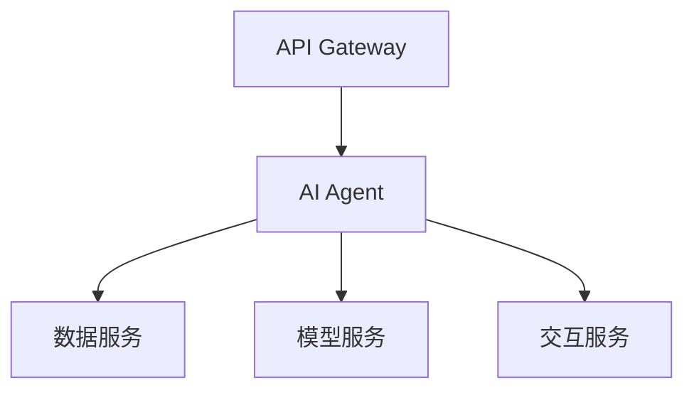
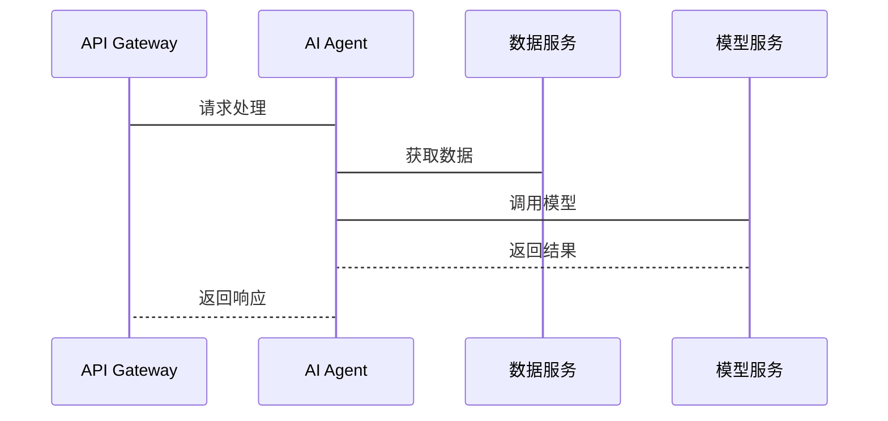

                 


# API设计：为AI Agent提供友好的接口

## 关键词：API设计，AI Agent，RESTful API，微服务架构，API文档，系统架构

## 摘要：  
在人工智能快速发展的今天，AI Agent（智能代理）的应用越来越广泛。要使AI Agent高效运行，离不开与其交互的API接口。本文将从API设计的基础出发，结合AI Agent的特点，详细探讨如何设计出友好且高效的API接口。文章将涵盖API设计的核心原则、AI Agent的特殊需求、系统架构设计以及实际项目案例，帮助开发者更好地理解并实践这一领域。

---

# 正文

## 第一部分：API设计背景与基础

### 第1章：API与AI Agent概述

#### 1.1 API的基本概念
- **定义与作用**：API（应用程序编程接口）是不同系统之间交互的桥梁，通过定义好的接口规范，开发者可以调用其他系统的功能或数据。
- **分类与特点**：
  - **RESTful API**：基于HTTP协议，支持GET、POST、PUT等方法，资源导向型设计。
  - **RPC API**：远程过程调用，直接调用函数或方法。
  - **GraphQL**：基于客户端请求的数据查询语言，灵活但复杂。
- **重要性**：API是现代系统架构的核心，决定了系统的扩展性、可维护性和性能。

#### 1.2 AI Agent的基本概念
- **定义与特点**：
  - AI Agent是一种智能主体，能够感知环境、自主决策并执行任务。
  - 典型特征包括自主性、反应性、目标导向性和社交能力。
- **应用场景**：
  - 智能助手（如Siri、Alexa）
  - 自动化机器人
  - 推荐系统
- **与传统软件的区别**：
  - AI Agent具备学习和适应能力，能够根据反馈优化行为。
  - 数据处理能力更强，需要实时与外部系统交互。

#### 1.3 本章小结
- 介绍了API和AI Agent的基本概念及其重要性。
- 强调了AI Agent对API的特殊需求。

---

## 第二部分：API设计的核心原则

### 第2章：API设计的原则与最佳实践

#### 2.1 RESTful API设计原则
- **资源导向设计**：将系统功能抽象为资源，通过HTTP方法进行操作。
  - GET：获取资源。
  - POST：创建资源。
  - PUT：更新资源。
  - DELETE：删除资源。
- **RESTful URI设计**：
  - 示例：`/api/users/{id}`，其中`{id}`是路径参数。
- **状态码与响应格式**：
  - 使用标准HTTP状态码（如200、404、500）。
  - 响应格式统一为JSON或XML。

#### 2.2 API版本控制策略
- **版本控制的重要性**：避免兼容性问题，平滑升级。
- **版本控制方法**：
  - URL路径：`/v1/api/...`。
  - 请求头：`Accept: application/vnd.myapi.v1+json`。
  - 查询参数：`?version=1.0`。
- **API兼容性设计**：尽量向后兼容，保留旧接口或提供版本切换机制。

#### 2.3 API文档编写规范
- **文档的核心要素**：
  - 接口描述：功能说明。
  - 请求格式：参数、方法、URL。
  - 响应格式：数据结构、状态码。
- **使用工具**：Swagger、Postman。
- **文档管理**：版本控制，定期更新。

#### 2.4 本章小结
- 强调了RESTful API设计的重要性。
- 介绍了版本控制和文档编写的最佳实践。

---

## 第三部分：为AI Agent设计友好的API

### 第3章：AI Agent的API需求分析

#### 3.1 AI Agent的核心需求
- **数据接口需求**：
  - 高效的数据获取和存储接口。
  - 支持异步调用，避免阻塞。
- **模型调用需求**：
  - 提供训练模型的接口。
  - 支持模型更新和版本管理。
- **实时交互需求**：
  - 支持长连接，如WebSocket。
  - 实时反馈和错误处理。

#### 3.2 AI Agent对API的特殊要求
- **异步处理**：AI Agent需要快速响应，API需支持异步调用。
- **错误处理**：完善的错误反馈机制，支持重试和日志记录。
- **安全性**：API需支持身份验证和权限控制，防止未授权访问。

---

## 第四部分：AI Agent API的设计与实现

### 第4章：AI Agent API的设计步骤

#### 4.1 需求分析
- 明确AI Agent的功能需求。
- 列出需要的API接口。

#### 4.2 API设计方法
- 使用RESTful原则设计接口。
- 结合AI Agent的特点，优化接口设计。

#### 4.3 工具选择
- 使用Postman或Swagger进行接口测试和文档管理。

---

## 第五部分：系统架构与设计

### 第5章：AI Agent API的系统架构设计

#### 5.1 系统架构介绍
- **微服务架构**：将功能模块化，每个服务独立运行。
- **功能模块划分**：
  - 数据服务：负责数据存储和检索。
  - 模型服务：负责AI模型的训练和调用。
  - 交互服务：负责与用户的实时交互。

#### 5.2 系统架构设计图


#### 5.3 系统接口设计
- 数据服务接口：
  - `/api/data/save`
  - `/api/data/retrieve?id=123`
- 模型服务接口：
  - `/api/model/train`
  - `/api/model/predict`

#### 5.4 系统交互流程图


---

## 第六部分：项目实战与总结

### 第6章：AI Agent API的实战案例

#### 6.1 项目介绍
- 实现一个智能助手API，支持用户查询天气、设定提醒等功能。

#### 6.2 核心代码实现
```python
from flask import Flask, request, jsonify

app = Flask(__name__)

@app.route('/api/weather', methods=['GET'])
def get_weather():
    city = request.args.get('city')
    # 模拟天气数据获取
    return jsonify({'city': city, 'temperature': '25℃', 'condition': '晴'})

if __name__ == '__main__':
    app.run(debug=True)
```

#### 6.3 测试与优化
- 使用Postman测试接口。
- 优化响应速度和错误处理。

#### 6.4 项目小结
- 总结了设计AI Agent API的关键点。
- 强调了实际应用中的注意事项。

---

## 总结与展望

### 第7章：总结与未来展望

#### 7.1 本章总结
- 介绍了API设计的核心原则。
- 探讨了AI Agent API的特殊需求。
- 提供了实际项目的实现案例。

#### 7.2 未来展望
- **AI驱动的API设计**：利用AI技术自动化设计API。
- **API网关的智能化**：更智能的路由和流量管理。
- **边缘计算与API**：API在边缘计算中的应用。

---

## 注意事项
- 在实际项目中，需根据具体需求调整API设计。
- 定期更新API文档，确保版本兼容性。
- 注重安全性和性能优化，提升用户体验。

---

通过本文的详细讲解，读者可以系统地了解如何设计为AI Agent提供友好接口的API，并能够将其应用到实际项目中。希望本文能为开发者提供有价值的参考和启发。

