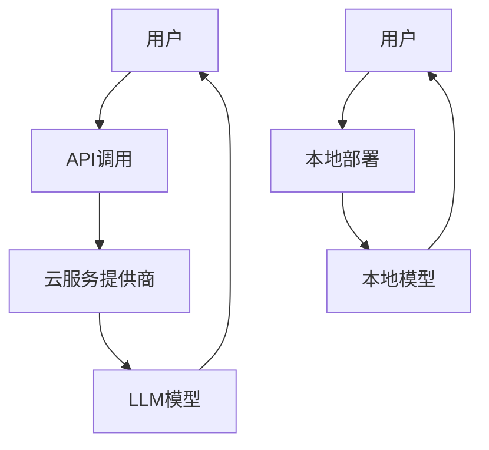
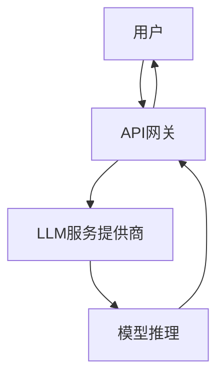
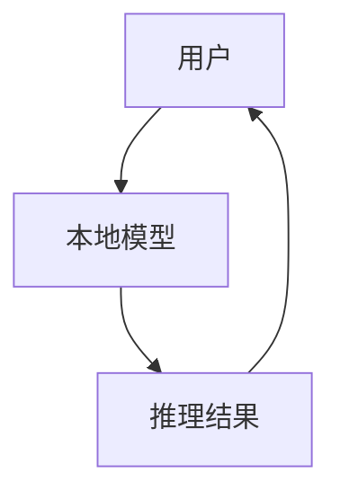
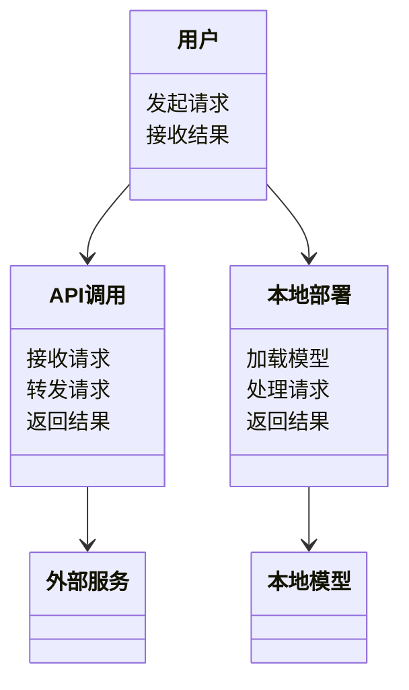
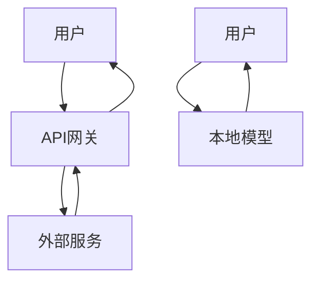
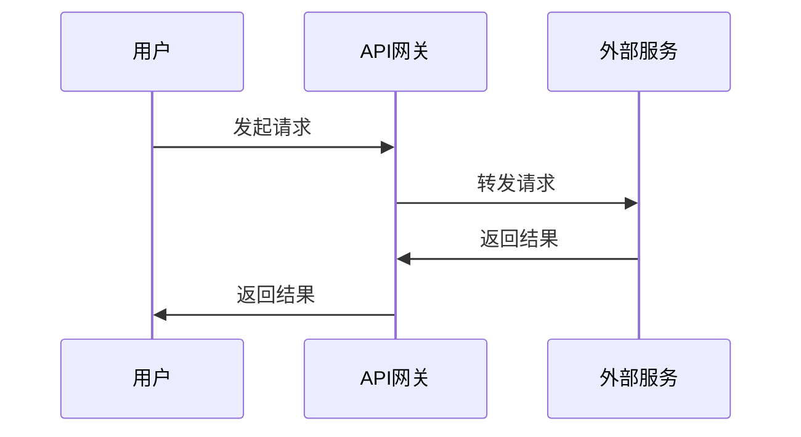

                 


# API调用还是本地部署？LLM使用策略对比

## 关键词：API调用，本地部署，LLM，人工智能，机器学习，模型部署

## 摘要：  
在人工智能快速发展的今天，大语言模型（LLM）的使用策略成为企业技术决策中的重要议题。本文通过对比分析API调用和本地部署这两种主流的LLM使用方式，从成本、性能、安全性、可扩展性等多个维度展开详细讨论，旨在为企业技术决策者提供清晰的对比框架和实用建议。通过案例分析和实际项目部署经验分享，本文为读者提供了选择适合自身业务需求的LLM使用策略的深度指南。

---

## 第一部分: LLM使用策略背景与核心概念

### 第1章: 问题背景与描述

#### 1.1 问题背景  
近年来，随着深度学习技术的飞速发展，大语言模型（Large Language Models, LLM）逐渐成为企业智能化转型的重要工具。LLM的应用场景涵盖了自然语言处理、机器翻译、问答系统、内容生成等多个领域。然而，企业在选择LLM的使用方式时面临两种主要选择：API调用和本地部署。这两种方式各有优劣，如何根据自身需求和资源情况做出最优选择，成为企业技术决策的关键问题。

#### 1.2 问题描述  
API调用和本地部署是两种典型的LLM使用策略，但它们在资源消耗、响应速度、安全性、可扩展性等方面存在显著差异。企业在选择时需要综合考虑技术可行性、成本效益、业务需求的匹配度以及长期维护能力等多方面因素。

#### 1.3 问题解决  
本文旨在通过对比分析API调用和本地部署这两种LLM使用策略，构建一个清晰的对比框架，帮助企业技术决策者明确两种方式的核心差异，从而做出更明智的选择。

#### 1.4 概念结构与核心要素  
- **API调用**：通过调用第三方提供的LLM服务接口，将模型部署在云端，用户通过API发起请求并获取结果。
- **本地部署**：将LLM模型下载到本地服务器或私有云环境中，用户直接调用本地模型进行推理。
- **核心对比维度**：成本、性能、安全性、可扩展性、管理复杂度。

---

### 第2章: 核心概念与联系

#### 2.1 核心概念原理  
- **API调用**：通过网络接口将请求发送到云端模型服务，由服务提供商负责模型的训练和维护，用户仅需支付调用费用。
- **本地部署**：将模型下载到本地环境，用户自行负责模型的训练、优化和维护，资源消耗较高，但对业务的控制力更强。

#### 2.2 对比分析  
以下是API调用与本地部署的对比分析表：

| 对比维度       | API调用                           | 本地部署                           |
|----------------|------------------------------------|--------------------------------------|
| **成本**       | 按需付费，无需前期投入             | 一次性投入（模型训练/采购）+维护成本 |
| **资源需求**   | 对网络依赖较高，本地资源消耗低      | 本地资源需求高（CPU、GPU等）         |
| **响应速度**   | 可能受网络延迟影响                 | 更快且稳定                          |
| **安全性**     | 数据可能在传输过程中被截获风险较高  | 数据完全掌控，安全性更高            |
| **管理复杂度** | 无需本地维护，简单                | 需要专业团队进行模型维护和优化      |

#### 2.3 实体关系图  


---

## 第二部分: 算法原理与数学模型

### 第3章: API调用的算法原理  

#### 3.1 API调用流程  
1. 用户发起请求，通过HTTP协议将输入数据发送到API接口。
2. API网关接收请求并进行身份验证。
3. 请求被转发到LLM服务提供商的模型推理服务。
4. 模型处理请求并返回结果。
5. 结果通过API网关返回给用户。

**流程图**：  


#### 3.2 本地部署的算法原理  

1. 用户将LLM模型下载到本地服务器。
2. 配置本地环境，安装必要的依赖库（如TensorFlow、PyTorch）。
3. 加载模型并初始化推理环境。
4. 用户发起请求，本地模型直接处理并返回结果。

**流程图**：  


#### 3.3 数学模型与公式  

**API调用的延迟公式**：  
$$延迟 = 网络延迟 + 服务提供商的处理时间 + 返回时间$$  

**本地部署的资源消耗公式**：  
$$资源消耗 = 模型大小 \times 推理参数 + 本地服务器负载$$  

---

## 第三部分: 系统分析与架构设计方案  

### 第4章: 系统架构设计  

#### 4.1 问题场景介绍  
企业在选择LLM使用策略时，需要考虑以下场景：  
- **数据隐私**：是否需要将数据托管在外部服务？  
- **响应速度**：对实时性要求有多高？  
- **成本控制**：是否有预算进行本地部署？  
- **技术能力**：是否有足够的技术团队进行本地模型的维护和优化？  

#### 4.2 系统功能设计  

**领域模型**：  


#### 4.3 系统架构设计  

**整体架构图**：  


#### 4.4 接口设计  

- **API接口**：  
  ```http
  POST /api/predict
  {
      "input": "..."
  }
  ```

- **本地部署接口**：  
  ```python
  def predict(input):
      # 模型推理逻辑
      return result
  ```

#### 4.5 系统交互  

**交互序列图**：  


---

## 第四部分: 项目实战  

### 第5章: 本地部署实战  

#### 5.1 环境安装  

```bash
pip install transformers torch
```

#### 5.2 核心代码实现  

```python
from transformers import pipeline

# 初始化本地模型
model = pipeline("text-classification", model="bert-base-cased")

# 推理函数
def predict(text):
    return model(text)
```

#### 5.3 代码解读与分析  
- **模型初始化**：使用`transformers`库加载预训练模型。
- **推理函数**：将输入文本传递给模型，返回预测结果。

#### 5.4 实际案例分析  
以文本分类任务为例，本地部署的代码如下：  
```python
result = predict("这是一个测试句子。")
print(result)
```

---

## 第五部分: 最佳实践与总结  

### 第6章: 最佳实践  

#### 6.1 小结  
- **选择API调用**：适合预算有限、对实时性要求不高、希望快速上线的企业。
- **选择本地部署**：适合对数据隐私要求高、有技术团队支持、需要高性能推理的企业。

#### 6.2 注意事项  
- **API调用**：注意数据隐私和网络稳定性。
- **本地部署**：确保本地服务器资源充足，定期进行模型优化。

#### 6.3 拓展阅读  
- 《大语言模型的训练与部署》
- 《云原生技术与机器学习》

---

## 结语  
通过本文的详细对比分析，企业可以根据自身需求和资源情况，选择最适合的LLM使用策略。无论是API调用还是本地部署，关键在于找到平衡点，最大化技术优势，最小化成本和风险。希望本文能为企业技术决策者提供有价值的参考和启发。

