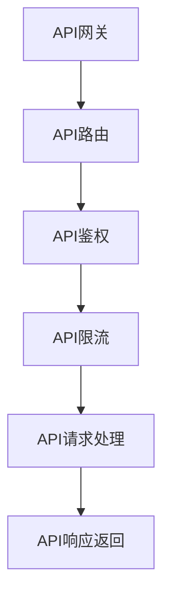
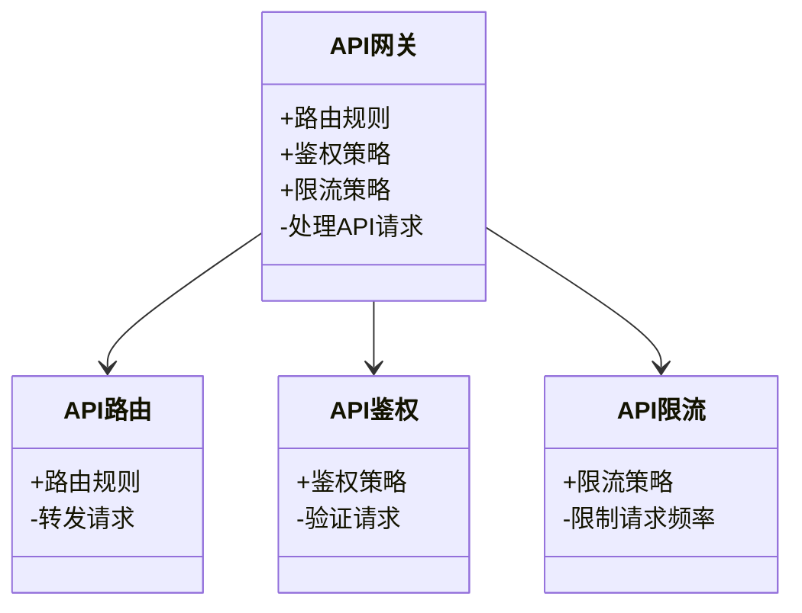
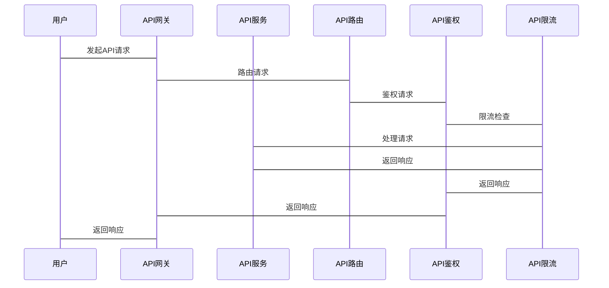

                 


# API集成：扩展AI Agent的功能与数据源

---

## 关键词：
- API集成，AI Agent，数据源扩展，系统架构设计，API调用，功能扩展

---

## 摘要：
在现代AI开发中，API集成是扩展AI Agent功能与数据源的核心技术。本文将从API集成的基本概念出发，逐步深入探讨其在AI Agent中的应用，包括API的设计原则、AI Agent的功能扩展、数据源的多样性与集成、系统架构设计与实现、项目实战与案例分析，以及未来趋势与最佳实践。通过本文，读者将能够全面理解API集成的重要性，并掌握如何通过API扩展AI Agent的功能与数据源。

---

# 第1章: API集成与AI Agent概述

## 1.1 API与AI Agent的基本概念

### 1.1.1 API的定义与作用
API（Application Programming Interface）是应用程序之间的接口，允许不同的系统或服务之间进行通信与交互。API的作用是通过定义一组接口，使得开发者可以调用其他系统或服务的功能，而无需关心其实现细节。

### 1.1.2 AI Agent的定义与特点
AI Agent（人工智能代理）是一种能够感知环境、执行任务并提供智能服务的计算机程序。AI Agent的特点包括自主性、反应性、目标导向性和社会性。

### 1.1.3 API在AI Agent中的核心作用
API是AI Agent与外部系统或服务进行交互的重要桥梁。通过API，AI Agent可以调用外部功能、获取数据源、执行任务等。

## 1.2 API集成的重要性

### 1.2.1 API在现代系统中的地位
API是现代分布式系统的核心，通过API集成，可以实现不同系统之间的协同工作。

### 1.2.2 AI Agent通过API扩展功能的必要性
AI Agent的功能扩展离不开API的支持。通过调用外部API，AI Agent可以增强自身的能力，例如自然语言处理、数据分析、任务执行等。

### 1.2.3 API集成对数据源扩展的意义
API集成使得AI Agent能够访问多样化的数据源，例如数据库、第三方服务、实时数据等，从而提高AI Agent的数据处理能力。

## 1.3 本书的核心目标与结构

### 1.3.1 本书的核心目标
通过本书，读者将掌握API集成的核心概念、设计原则、实现方法以及在AI Agent中的应用。

### 1.3.2 目录结构概览
- 第1章：API集成与AI Agent概述
- 第2章：API的基础知识
- 第3章：AI Agent的功能扩展
- 第4章：数据源的多样性与API集成
- 第5章：API集成的系统架构与设计
- 第6章：项目实战与案例分析
- 第7章：未来趋势与最佳实践

### 1.3.3 学习方法与注意事项
建议读者在学习过程中结合实际项目进行实践，并注意API设计的规范性和安全性。

## 1.4 本章小结
本章主要介绍了API和AI Agent的基本概念，以及API集成在AI Agent中的重要性。通过本章，读者可以理解API集成的核心作用，并为后续章节的学习打下基础。

---

# 第2章: API的基础知识

## 2.1 API的分类与特点

### 2.1.1 RESTful API
REST（Representational State Transfer）是一种基于HTTP协议的API设计风格。其特点包括基于HTTP方法（GET、POST、PUT、DELETE等）、使用URI作为资源标识、支持JSON格式数据等。

### 2.1.2 GraphQL API
GraphQL是一种基于图灵完备的查询语言，允许客户端直接向服务器请求所需的数据，减少多次请求的开销。

### 2.1.3 其他类型的API
包括SOAP（基于XML的API）、WebSocket（实时通信API）等。

## 2.2 API的设计原则

### 2.2.1 明确的API设计目标
在设计API时，需要明确API的功能目标、使用场景和用户群体。

### 2.2.2 API的可扩展性与可维护性
API设计应遵循模块化原则，确保其可扩展性和可维护性。

### 2.2.3 API的版本控制
通过版本控制，确保API的兼容性和稳定性。

## 2.3 API的请求与响应机制

### 2.3.1 HTTP协议基础
HTTP协议是RESTful API的核心，了解HTTP状态码、请求头和响应头是API开发的基础。

### 2.3.2 JSON格式与数据结构
JSON（JavaScript Object Notation）是一种轻量级的数据交换格式，广泛应用于API通信中。

### 2.3.3 API的认证与授权
API的认证与授权是保障API安全的重要环节，常用的认证方式包括OAuth、JWT等。

## 2.4 本章小结
本章主要介绍了API的分类与特点、设计原则以及请求与响应机制。通过本章，读者可以掌握API开发的基础知识。

---

# 第3章: AI Agent的功能扩展

## 3.1 AI Agent的功能模块

### 3.1.1 自然语言处理模块
通过调用NLP API，AI Agent可以实现文本分析、语义理解等功能。

### 3.1.2 数据分析与处理模块
通过调用数据分析API，AI Agent可以处理和分析各种数据源，例如调用Pandas库进行数据处理。

### 3.1.3 任务执行与反馈模块
通过调用任务执行API，AI Agent可以执行外部任务，并通过反馈机制进行优化。

## 3.2 通过API扩展AI Agent的功能

### 3.2.1 第三方API的调用
AI Agent可以通过调用第三方API（如天气API、地图API）来增强自身功能。

### 3.2.2 自定义API的开发
根据需求，AI Agent可以开发自定义API，提供特定功能。

### 3.2.3 API的组合与协同工作
通过组合多个API，AI Agent可以实现复杂的功能，例如通过调用天气API和日历API实现智能日程安排。

## 3.3 API在AI Agent中的应用场景

### 3.3.1 信息获取与数据处理
通过API获取外部数据，例如从数据库中获取用户信息。

### 3.3.2 任务自动化与流程优化
通过API调用自动化工具，优化AI Agent的任务执行流程。

### 3.3.3 多系统协同与集成
通过API集成多个系统，实现系统的协同工作，例如集成CRM系统和ERP系统。

## 3.4 本章小结
本章主要介绍了AI Agent的功能模块以及通过API扩展AI Agent功能的方法。通过本章，读者可以理解如何通过API增强AI Agent的能力。

---

# 第4章: 数据源的多样性与API集成

## 4.1 数据源的分类

### 4.1.1 结构化数据源
结构化数据源包括数据库（如MySQL、MongoDB）和表格数据。

### 4.1.2 非结构化数据源
非结构化数据源包括文本、图像、视频等。

### 4.1.3 实时数据源
实时数据源包括物联网设备、实时日志等。

## 4.2 数据源的访问方式

### 4.2.1 数据库API
通过数据库API（如MySQL的REST API）访问数据库中的数据。

### 4.2.2 Web API
通过Web API（如Twitter API）获取网络上的数据。

### 4.2.3 文件系统API
通过文件系统API（如FTP、SFTP）访问文件系统中的数据。

## 4.3 数据源的集成与管理

### 4.3.1 数据源的发现与选择
根据需求选择合适的API和数据源。

### 4.3.2 数据源的安全访问
通过认证和授权机制，确保数据源的安全访问。

### 4.3.3 数据源的监控与维护
通过监控工具，实时监控数据源的状态，并进行必要的维护。

## 4.4 本章小结
本章主要介绍了数据源的多样性以及如何通过API集成不同的数据源。通过本章，读者可以理解如何通过API扩展AI Agent的数据源。

---

# 第5章: API集成的系统架构与设计

## 5.1 系统功能设计

### 5.1.1 API网关的设计
API网关是API集成的核心，负责路由、鉴权、限流等功能。

### 5.1.2 API路由与转发
通过API路由设计，实现API请求的转发和处理。

### 5.1.3 API的鉴权与限流
通过鉴权和限流机制，确保API的安全性和稳定性。

## 5.2 系统架构图



## 5.3 系统功能设计（领域模型）



## 5.4 系统交互设计（序列图）



## 5.5 本章小结
本章主要介绍了API集成的系统架构与设计，包括API网关、路由、鉴权和限流等关键组件。通过本章，读者可以理解如何设计和实现高效的API集成系统。

---

# 第6章: 项目实战与案例分析

## 6.1 项目背景与目标

### 6.1.1 项目背景
本项目旨在通过API集成，扩展AI Agent的功能与数据源。

### 6.1.2 项目目标
- 实现AI Agent与第三方API的集成
- 实现数据源的多样性和可扩展性
- 优化API集成的性能和安全性

## 6.2 环境配置

### 6.2.1 安装必要的工具
- 安装Python和pip
- 安装requests库（用于发送HTTP请求）
- 安装flask库（用于搭建API网关）

## 6.3 核心实现

### 6.3.1 API网关的实现

```python
from flask import Flask
from flask_restful import Resource, Api

app = Flask(__name__)
api = Api(app)

class APIService(Resource):
    def get(self):
        # 示例API处理逻辑
        return {"message": "API集成示例"}, 200

api.add_resource(APIService, '/api/test')

if __name__ == '__main__':
    app.run(debug=True)
```

### 6.3.2 API路由与鉴权的实现

```python
from flask_restful import reqparse
import jwt

class AuthResource(Resource):
    def post(self):
        parser = reqparse.RequestParser()
        parser.add_argument('username', type=str, required=True)
        parser.add_argument('password', type=str, required=True)
        args = parser.parse_args()

        # 示例鉴权逻辑
        payload = {'user': args.username}
        token = jwt.encode(payload, 'secret', algorithm='HS256')
        return {'token': token.decode()}, 200

api.add_resource(AuthResource, '/api/auth')
```

### 6.3.3 数据源的集成

```python
import requests

class DataSource:
    def get_data(self):
        response = requests.get('https://api.example.com/data')
        return response.json()

# 使用DataSource类获取数据
data_source = DataSource()
data = data_source.get_data()
print(data)
```

## 6.4 项目小结
本章通过一个实际项目，展示了API集成的核心实现，包括API网关、鉴权和数据源的集成。通过本章，读者可以掌握API集成的实际操作方法。

---

# 第7章: 未来趋势与最佳实践

## 7.1 未来趋势

### 7.1.1 API的智能化
未来的API将更加智能化，支持自适应路由、自动鉴权等功能。

### 7.1.2 API的安全性
随着API的广泛使用，API的安全性将更加重要，包括抗DDoS攻击、防止未授权访问等。

### 7.1.3 API的性能优化
API的性能优化将更加注重延迟优化和资源利用率。

## 7.2 最佳实践

### 7.2.1 API设计规范
遵循RESTful设计规范，确保API的可扩展性和可维护性。

### 7.2.2 API文档的重要性
提供详细的API文档，包括请求参数、响应格式、错误码等。

### 7.2.3 API的监控与日志
通过监控工具实时监控API的性能和状态，并记录日志以便排查问题。

## 7.3 注意事项

### 7.3.1 安全性
在API设计和实现中，必须重视安全性，防止未授权访问和数据泄露。

### 7.3.2 性能优化
通过缓存、分片等技术优化API的性能。

### 7.3.3 可维护性
遵循模块化设计，确保API的可维护性和可扩展性。

## 7.4 本章小结
本章主要介绍了API集成的未来趋势和最佳实践，包括API的智能化、安全性、性能优化等方面。通过本章，读者可以了解API集成的发展方向，并掌握实际应用中的注意事项。

---

# 结语

通过本文的详细讲解，读者可以全面理解API集成在AI Agent中的重要性，并掌握如何通过API扩展AI Agent的功能与数据源。API集成不仅是一项技术，更是一种思维方式，通过合理设计和实现API，可以构建高效、安全、可扩展的AI系统。希望本文能为读者提供有价值的参考和启发。

--- 

# END

