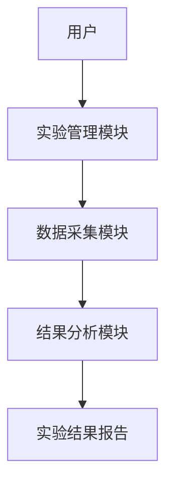

                 


# 《A/B测试框架：持续优化AI Agent性能》

---

## 关键词：

- A/B测试框架
- AI Agent
- 性能优化
- 统计显著性
- 贝叶斯方法
- 系统架构设计

---

## 摘要：

本文详细探讨了A/B测试框架在AI Agent性能优化中的应用。通过分析A/B测试的基本原理、算法实现、系统架构设计以及实际项目案例，本文为读者提供了一套系统化的优化方案。从理论到实践，从算法到架构，本文全面解析了如何利用A/B测试框架持续优化AI Agent的性能，帮助读者在实际应用中实现更高效的优化策略。

---

# 第1章: A/B测试框架与AI Agent优化背景

## 1.1 A/B测试的基本概念

### 1.1.1 什么是A/B测试

A/B测试是一种实验方法，通过将用户随机分配到不同的实验组（A组和B组），分别采用不同的策略或算法，观察并比较两组在特定指标上的表现差异。其核心在于通过统计方法确定不同策略之间的优劣。

### 1.1.2 A/B测试在AI Agent优化中的作用

AI Agent的性能优化需要通过实验验证不同策略的效果。A/B测试提供了科学的实验方法，帮助我们在真实环境下评估AI Agent的表现，从而选择最优策略。

### 1.1.3 A/B测试与其他优化方法的对比

| 对比维度       | A/B测试                     | 其他优化方法（如贪心算法）       |
|----------------|------------------------------|------------------------------------|
| 实验成本       | 较高，需要真实环境数据       | 较低，依赖模型预测               |
| 实验风险       | 较低，通过统计方法控制风险   | 较高，可能引入次优策略           |
| 适用场景       | 离线与在线优化               | 主要适用于离线优化               |

---

## 1.2 AI Agent性能优化的背景与挑战

### 1.2.1 AI Agent的定义与应用场景

AI Agent是一种智能实体，能够感知环境、自主决策并执行任务。应用场景包括推荐系统、智能客服、自动驾驶等。

### 1.2.2 优化AI Agent性能的重要性

AI Agent的性能直接影响用户体验和业务效果。通过优化性能，可以提升决策的准确性和效率，降低成本，提高用户满意度。

### 1.2.3 A/B测试在AI Agent优化中的独特优势

A/B测试通过真实环境中的实验，能够直接验证策略的有效性，避免了离线评估的局限性。同时，通过统计方法确保实验结果的可靠性。

---

## 1.3 本章小结

本章介绍了A/B测试的基本概念及其在AI Agent优化中的作用，并与其他优化方法进行了对比。通过分析AI Agent的定义、应用场景及其优化的重要性，我们明确了A/B测试的独特优势。

---

# 第2章: A/B测试框架的核心概念

## 2.1 A/B测试的基本原理

### 2.1.1 实验设计的基本要素

A/B测试的实验设计需要考虑以下要素：

- 实验目标：明确实验的目的，如提升点击率。
- 实验组与对照组：分别采用不同的策略。
- 样本量：确保实验结果的统计显著性。
- 评估指标：选择能够反映实验目标的指标，如转化率、响应时间等。

### 2.1.2 对比分析的核心逻辑

通过统计方法（如t检验）比较实验组和对照组在评估指标上的差异，判断策略是否有效。

### 2.1.3 统计显著性与置信区间

统计显著性用于判断实验结果是否具有实际意义。置信区间则提供了结果的可信范围，帮助我们评估实验结果的稳定性。

---

## 2.2 A/B测试的优缺点分析

### 2.2.1 优点：快速迭代与风险控制

A/B测试可以在真实环境下快速验证策略的效果，同时通过小样本实验降低风险。

### 2.2.2 缺点：样本偏差与实验干扰

样本偏差可能导致实验结果不准确，实验干扰则可能影响用户体验。

### 2.2.3 如何平衡优缺点

通过科学的实验设计和统计方法，可以有效减少样本偏差和实验干扰的影响。

---

## 2.3 A/B测试框架的核心要素对比

| 对比维度       | 实验组（A组）              | 对照组（B组）                |
|----------------|---------------------------|-----------------------------|
| 策略           | 新策略或改进版本          | 现有策略或对照版本          |
| 目标           | 验证新策略的有效性        | 作为基准进行比较            |
| 风险           | 可能引入新的问题          | 保持现有性能                |

---

## 2.4 本章小结

本章详细讲解了A/B测试的基本原理、优缺点及其核心要素的对比。通过理解这些概念，我们可以更好地设计和实施A/B测试实验。

---

# 第3章: A/B测试的统计方法

## 3.1 假设检验的基本原理

### 3.1.1 基于t检验的假设检验

t检验用于小样本数据的假设检验，公式如下：

$$ t = \frac{\bar{x}_1 - \bar{x}_2}{\sqrt{\frac{s_1^2}{n_1} + \frac{s_2^2}{n_2}}} $$

其中，$\bar{x}_1$ 和 $\bar{x}_2$ 分别为两组的样本均值，$s_1$ 和 $s_2$ 为样本标准差，$n_1$ 和 $n_2$ 为样本容量。

### 3.1.2 基于z检验的假设检验

z检验用于大样本数据，公式如下：

$$ z = \frac{\bar{x}_1 - \bar{x}_2}{\sqrt{\frac{\sigma_1^2}{n_1} + \frac{\sigma_2^2}{n_2}}} $$

其中，$\sigma_1$ 和 $\sigma_2$ 为总体标准差。

### 3.1.3 显著性水平与p值的计算

显著性水平通常设为0.05，p值小于显著性水平时，拒绝原假设。

---

## 3.2 A/B测试的样本量计算

### 3.2.1 样本量与统计效力的关系

统计效力是指正确拒绝无效假设的概率。样本量越大，统计效力越高。

### 3.2.2 样本量计算公式

样本量计算公式如下：

$$ n = \frac{(z_{\alpha/2} \cdot \sigma)^2}{\beta^2} $$

其中，$z_{\alpha/2}$ 为显著性水平对应的z值，$\sigma$ 为总体标准差，$\beta$ 为第二类错误概率。

### 3.2.3 示例计算与分析

假设显著性水平为0.05，统计效力为0.8，总体标准差为0.1，计算得到样本量为100。

---

## 3.3 贝叶斯方法在A/B测试中的应用

### 3.3.1 贝叶斯与频率学派的对比

| 对比维度       | 贝叶斯方法                | 频率学派                   |
|----------------|--------------------------|---------------------------|
| 推断基础       | 后验概率                  | p值                        |
| 实验终止条件   | 可以动态调整              | 固定样本量                |

### 3.3.2 贝叶斯A/B测试的基本原理

贝叶斯方法通过不断更新先验概率，得到后验概率，判断策略的优劣。

### 3.3.3 贝叶斯方法的优势与挑战

优势：动态调整实验，减少样本浪费；挑战：计算复杂，需要较高的编程能力。

---

## 3.4 本章小结

本章介绍了A/B测试的统计方法，包括假设检验、样本量计算以及贝叶斯方法的应用。通过这些方法，我们可以科学地设计和实施A/B测试实验。

---

# 第4章: A/B测试框架的系统架构设计

## 4.1 系统功能设计

### 4.1.1 实验管理模块

- 实验配置：设置实验参数，如样本量、评估指标等。
- 实验监控：实时监控实验进展，及时发现异常。

### 4.1.2 数据采集模块

- 数据收集：采集实验数据，如用户行为数据、系统日志等。
- 数据存储：将数据存储到数据库中，便于后续分析。

### 4.1.3 结果分析模块

- 数据分析：通过统计方法分析实验结果，判断策略的有效性。
- 结果报告：生成实验报告，供决策者参考。

---

## 4.2 系统架构设计

### 4.2.1 系统架构图（Mermaid）



### 4.2.2 系统功能模块的交互流程

1. 用户发起实验请求。
2. 实验管理模块分配实验组和对照组。
3. 数据采集模块收集实验数据。
4. 结果分析模块分析数据，生成报告。
5. 实验结果报告反馈给用户。

---

## 4.3 本章小结

本章详细设计了A/B测试框架的系统架构，包括功能模块和交互流程。通过科学的系统设计，我们可以高效地实施A/B测试实验。

---

# 第5章: A/B测试框架的项目实战

## 5.1 环境安装与配置

### 5.1.1 安装Python和必要的库

```bash
pip install numpy pandas scikit-learn
```

### 5.1.2 安装数据库和相关工具

```bash
pip install sqlalchemy mysql-connector-python
```

---

## 5.2 A/B测试框架的核心实现

### 5.2.1 实验设计与数据采集

```python
import pandas as pd
from sklearn.metrics import mean_absolute_error

# 数据采集
data = pd.DataFrame({
    'group': ['A', 'B', 'A', 'B', ...],
    'metric': [0.8, 0.7, 0.9, 0.6, ...]
})

# 数据分析
mae = mean_absolute_error(data[data['group'] == 'A']['metric'], data[data['group'] == 'B']['metric'])
print(mae)
```

### 5.2.2 实验结果分析与优化

通过分析实验结果，选择最优策略，并进行迭代优化。

---

## 5.3 实际案例分析

### 5.3.1 案例背景

假设我们正在优化一个推荐系统的AI Agent，希望通过A/B测试验证两种推荐策略的效果。

### 5.3.2 实验设计与实施

- 实验组采用新推荐策略，对照组采用旧策略。
- 实验周期为两周，样本量为10000。

### 5.3.3 数据分析与结果解读

通过t检验，我们发现新策略的转化率显著高于旧策略，因此选择新策略作为优化方案。

---

## 5.4 本章小结

本章通过实际案例，详细讲解了A/B测试框架的环境安装、核心实现和结果分析。通过实战，读者可以更好地掌握A/B测试的实施方法。

---

# 第6章: A/B测试框架的最佳实践与小结

## 6.1 最佳实践 tips

1. **样本量计算**：确保样本量足够，提高实验结果的统计效力。
2. **实验设计**：合理设计实验，避免样本偏差和实验干扰。
3. **结果分析**：结合统计方法和业务需求，综合评估实验结果。

---

## 6.2 小结

通过本章的学习，我们掌握了A/B测试框架的核心概念、算法原理和系统架构设计。同时，通过实际案例的分析，我们了解了如何在实际应用中优化AI Agent的性能。

---

## 6.3 注意事项

- **避免过度优化**：优化策略需要在用户体验和性能之间找到平衡。
- **及时终止实验**：当实验结果显著时，及时终止实验，避免浪费资源。
- **记录实验数据**：保存实验数据，便于后续分析和优化。

---

## 6.4 拓展阅读

- 《Experimentation in Software Engineering》
- 《Bayesian A/B Testing Made Simple》
- 《A/B Testing: The Method Everyone Uses But Few Understand》

---

# 附录: A/B测试框架的Python代码实现

```python
import numpy as np
from scipy.stats import ttest_ind

# 示例数据
group_a = [0.8, 0.7, 0.9, 0.6]
group_b = [0.75, 0.7, 0.85, 0.5]

# t检验
t_stat, p_value = ttest_ind(group_a, group_b)
print(f"t统计量: {t_stat}, p值: {p_value}")
```

---

通过以上目录大纲，我们可以系统地学习和实施A/B测试框架，持续优化AI Agent的性能。从理论到实践，从算法到架构，本文为读者提供了一套完整的解决方案，帮助他们在实际应用中实现更高效的优化策略。

