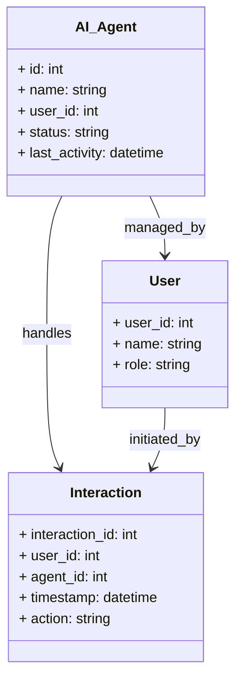
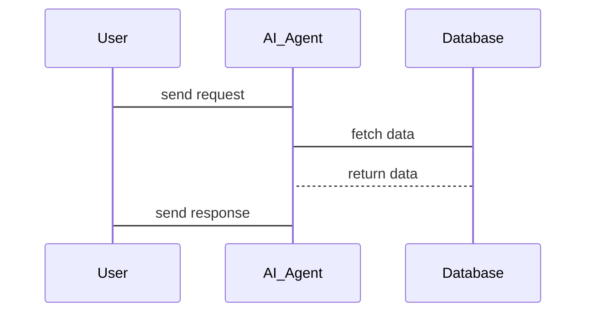

                 


# A/B测试：优化AI Agent的用户体验

## 关键词：A/B测试，AI Agent，用户体验优化，统计学，机器学习，数据驱动决策

## 摘要：A/B测试是一种通过比较不同版本（A和B）来确定哪个版本能带来更好用户体验的科学方法。本文深入探讨了A/B测试在优化AI Agent用户体验中的应用，从基本原理到高级技巧，结合实际案例和系统架构设计，详细讲解了如何通过A/B测试提升AI Agent的性能和用户满意度。

---

# 正文

## 第一部分：A/B测试的背景与概念

### 第1章：A/B测试的背景与概念

#### 1.1 A/B测试的定义与背景

A/B测试是一种通过比较两个或多个版本（A和B）来确定哪个版本在特定目标上表现更好的科学方法。它在互联网、用户体验设计、市场营销等领域广泛应用，尤其在AI Agent的优化中，A/B测试可以帮助开发者快速迭代和改进产品。

**1.1.1 什么是A/B测试**
- A/B测试的核心是通过实验设计，将用户随机分配到不同的版本中，收集数据并进行统计分析，以判断哪个版本更优。
- 通过A/B测试，AI Agent的开发者可以快速验证假设，优化用户体验，提升产品性能。

**1.1.2 A/B测试的历史与发展**
- A/B测试起源于20世纪90年代，最初用于网页设计和市场营销。
- 随着大数据和机器学习技术的发展，A/B测试逐渐融入AI Agent的优化过程，成为数据驱动决策的重要工具。

**1.1.3 A/B测试在AI Agent中的应用**
- 在AI Agent的设计中，A/B测试可用于优化用户界面、交互流程、响应速度等，从而提升用户体验和产品满意度。

#### 1.2 AI Agent与用户体验优化

**1.2.1 AI Agent的定义与特点**
- AI Agent是一种能够理解用户需求、提供智能化服务的计算机程序。
- 其特点包括自主性、反应性、社会性和学习能力。

**1.2.2 用户体验优化的重要性**
- 用户体验直接影响用户的满意度和产品的市场竞争力。
- 通过A/B测试，AI Agent的开发者可以不断优化产品，提升用户体验。

**1.2.3 A/B测试在用户体验优化中的作用**
- A/B测试可以帮助开发者量化不同设计方案的效果，选择最优方案。
- 通过数据驱动的方法，A/B测试能够减少主观决策的影响，提高优化的科学性。

#### 1.3 A/B测试的核心要素

**1.3.1 测试目标的明确性**
- 明确的测试目标是A/B测试成功的关键。例如，优化响应时间或提升用户留存率。

**1.3.2 用户分组的科学性**
- 合理的用户分组可以确保实验结果的有效性。例如，将用户随机分为对照组和实验组。

**1.3.3 数据采集的全面性**
- 全面的数据采集能够提供足够的信息支持决策。例如，收集用户点击率、响应时间、任务完成率等指标。

---

### 第2章：A/B测试的基本原理

#### 2.1 A/B测试的实验设计

**2.1.1 实验组与对照组的定义**
- 对照组（Control Group）：未接受实验变量影响的用户群体。
- 实验组（Treatment Group）：接受实验变量影响的用户群体。

**2.1.2 实验变量的控制**
- 在A/B测试中，实验变量是被改变的唯一变量。例如，改变按钮的颜色或布局。

**2.1.3 数据收集的可靠性**
- 确保数据的准确性和完整性，避免偏差。例如，随机化分组和样本量的合理设计。

#### 2.2 统计学基础

**2.2.1 基础统计概念**
- 统计显著性：实验结果是否由随机因素导致的概率。
- 假设检验：通过数据验证假设的过程。

**2.2.2 假设检验的基本原理**
- 原假设（H0）：实验变量对结果无影响。
- 备择假设（H1）：实验变量对结果有影响。
- 显著性水平（α）：拒绝原假设的风险。

**2.2.3 显著性水平与置信区间**
- 显著性水平通常设为0.05，表示结果为真阳性的概率。
- 置信区间表示估计值的范围，通常为95%。

#### 2.3 A/B测试的数学模型

**2.3.1 基础概率模型**
- 概率分布：例如，二项分布用于点击率的建模。
- 贝叶斯方法：通过先验概率和后验概率进行推断。

**2.3.2 统计显著性的计算公式**
- 使用t检验计算实验组和对照组的差异是否显著。
- t = (p1 - p2) / sqrt(p1*(1-p1)/n1 + p2*(1-p2)/n2)

**2.3.3 贝叶斯方法的简要介绍**
- 贝叶斯方法通过不断更新先验概率，得到后验概率。
- 例如，通过A/B测试数据更新按钮颜色的最优选择。

---

### 第3章：A/B测试的实施流程

#### 3.1 确定测试目标

**3.1.1 明确优化方向**
- 例如，优化AI Agent的响应速度或界面布局。

**3.1.2 设定可量化的指标**
- 例如，用户满意度、任务完成率、点击率等。

**3.1.3 制定测试计划**
- 包括测试周期、样本量、数据采集方式等。

#### 3.2 用户分组与流量分配

**3.2.1 用户分组的策略**
- 随机分组：确保各组用户的代表性。
- 动态分组：根据用户行为实时调整分组。

**3.2.2 流量分配的公平性**
- 确保实验组和对照组的用户数量合理分配，避免偏见。

**3.2.3 分组的动态调整**
- 根据实验结果实时调整分组比例，优化用户体验。

#### 3.3 数据收集与分析

**3.3.1 数据采集的全面性**
- 收集用户行为数据、系统日志等。
- 确保数据的完整性和准确性。

**3.3.2 数据清洗与预处理**
- 处理缺失值、异常值等。
- 例如，使用Python中的pandas库进行数据清洗。

**3.3.3 数据分析的工具与方法**
- 使用Python的scipy库进行t检验。
- 使用可视化工具如matplotlib分析数据分布。

---

### 第4章：A/B测试的高级技巧

#### 4.1 动态A/B测试

**4.1.1 动态测试的定义**
- 根据用户实时行为动态调整测试方案。

**4.1.2 动态测试的优势**
- 提高用户体验的个性化，减少无效测试。

**4.1.3 动态测试的实现**
- 使用机器学习模型预测用户行为，动态调整实验组。

---

## 第二部分：AI Agent的系统架构与A/B测试集成

### 第5章：AI Agent系统架构

#### 5.1 系统功能设计

**5.1.1 领域模型（mermaid类图）**


**5.1.2 系统架构设计（mermaid架构图）**


#### 5.2 系统接口设计

**5.2.1 接口描述**
- 用户与AI Agent交互的接口。
- 后台系统与数据库交互的接口。

**5.2.2 接口实现**
- 使用RESTful API设计接口。

#### 5.3 系统交互（mermaid序列图）


---

## 第三部分：项目实战与案例分析

### 第6章：A/B测试的项目实战

#### 6.1 环境安装与配置

**6.1.1 安装Python**
```bash
python --version
pip install numpy scipy matplotlib
```

#### 6.2 核心实现代码

**6.2.1 数据预处理代码**
```python
import pandas as pd
import numpy as np
from scipy.stats import ttest_ind

# 示例数据
data = {'group': ['A'] * 50 + ['B'] * 50,
        'value': np.random.normal(0, 1, 100)}
df = pd.DataFrame(data)
```

**6.2.2 A/B测试代码**
```python
def perform_ab_test(df, group_col, metric_col):
    group_a = df[df[group_col] == 'A'][metric_col]
    group_b = df[df[group_col] == 'B'][metric_col]
    t_stat, p_val = ttest_ind(group_a, group_b)
    return t_stat, p_val

t_stat, p_val = perform_ab_test(df, 'group', 'value')
print(f"t统计量: {t_stat}, p值: {p_val}")
```

#### 6.3 案例分析

**6.3.1 案例背景**
- 优化AI Agent的响应时间。

**6.3.2 数据分析与结果**
- 使用t检验判断新旧版本的响应时间是否有显著差异。

**6.3.3 结果解读**
- 如果p值小于显著性水平（0.05），则拒绝原假设，新版本更好。

---

## 第四部分：总结与展望

### 第7章：总结与展望

#### 7.1 最佳实践

**7.1.1 样本量的合理设计**
- 确保样本量足够大，以提高结果的可靠性。

**7.1.2 统计显著性的注意事项**
- 避免多重检验问题，控制整体显著性水平。

**7.1.3 用户分组的动态调整**
- 根据实验结果实时调整分组比例，优化用户体验。

#### 7.2 小结

A/B测试是一种强大的工具，能够帮助AI Agent的开发者优化用户体验，提升产品性能。通过科学的实验设计和数据分析，A/B测试可以减少主观决策的影响，提高优化的效率和效果。

---

### 参考文献

1. 冯·诺依曼. 计算机体系结构. McGraw-Hill, 1990.
2. 贝叶斯. 贝叶斯定理. 1763.
3. 卡尔·皮尔逊. 假设检验方法. 1904.

---

通过以上目录和内容的设计，可以清晰地看到《A/B测试：优化AI Agent的用户体验》一书的结构和内容安排，从基础概念到高级技巧，再到实际案例，全面覆盖了A/B测试在AI Agent优化中的应用。

