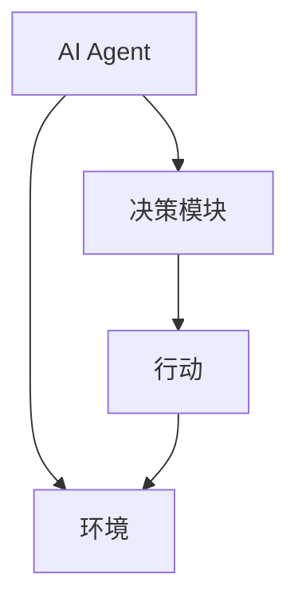
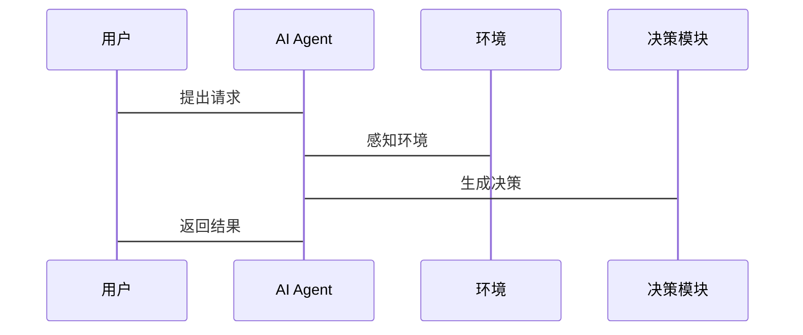

                 


# A/B测试：持续优化AI Agent的表现

> 关键词：A/B测试，AI Agent，持续优化，实验设计，数据分析，机器学习

> 摘要：本文探讨了如何利用A/B测试方法持续优化AI Agent的表现。通过分析A/B测试的基本原理、AI Agent的核心原理、A/B测试框架的设计与实现、系统架构与交互流程、项目实战案例以及持续优化策略，本文为技术专家和实践者提供了深入的理论指导和实用的代码实现，帮助他们在实际项目中更好地应用A/B测试优化AI Agent。

---

# 第一章: A/B测试与AI Agent优化概述

## 1.1 A/B测试的基本概念

### 1.1.1 什么是A/B测试
A/B测试是一种实验方法，用于比较两个或多个版本（A和B）在特定指标上的表现差异。通过随机分配用户到不同的组别，收集数据后进行统计分析，以确定哪个版本表现更好。

### 1.1.2 A/B测试在AI优化中的作用
在AI Agent的优化中，A/B测试可以帮助我们验证不同的策略、算法或参数组合是否能够提升AI的表现。通过实验，我们可以找到最优的配置，从而提高AI的性能和用户体验。

### 1.1.3 A/B测试的基本流程
1. **定义目标**：明确实验的目标，例如提高准确率、降低响应时间等。
2. **设计实验**：确定实验组和对照组，设计实验方案。
3. **分配用户**：将用户随机分配到不同的组别。
4. **收集数据**：在实验期间收集相关数据。
5. **分析结果**：通过统计分析确定实验组与对照组的差异是否显著。
6. **得出结论**：根据实验结果优化AI Agent。

---

## 1.2 AI Agent的表现评估

### 1.2.1 AI Agent的定义与类型
AI Agent是一种智能体，能够感知环境并采取行动以实现特定目标。常见的类型包括基于规则的AI Agent、基于模型的AI Agent和基于强化学习的AI Agent。

### 1.2.2 AI Agent的表现评估指标
评估AI Agent的表现需要关注以下几个指标：
- **准确率**：AI Agent在任务中的正确决策比例。
- **响应时间**：AI Agent完成任务所需的时间。
- **用户体验**：用户对AI Agent表现的满意度。
- **资源消耗**：AI Agent运行所需的计算资源。

### 1.2.3 为什么需要持续优化AI Agent
AI Agent的性能会受到数据、算法和环境的影响，因此需要通过持续优化来适应变化，提升表现。

---

## 1.3 A/B测试与AI优化的结合

### 1.3.1 A/B测试在AI优化中的应用场景
- **算法优化**：测试不同的算法或参数组合。
- **策略优化**：测试不同的决策策略。
- **用户体验优化**：测试不同的交互方式。

### 1.3.2 A/B测试如何帮助优化AI Agent
通过A/B测试，我们可以系统地验证不同的优化方案，找到最优的配置，从而提升AI Agent的表现。

### 1.3.3 持续优化的重要性
持续优化可以帮助AI Agent适应不断变化的环境，提升长期表现。

---

## 1.4 本章小结
本章介绍了A/B测试的基本概念及其在AI Agent优化中的作用，明确了A/B测试的基本流程和AI Agent的表现评估指标。通过本章的学习，读者可以理解为什么需要通过A/B测试来优化AI Agent，并为后续的深入学习打下基础。

---

# 第二章: AI Agent的核心原理

## 2.1 AI Agent的基本原理

### 2.1.1 基于模型的AI Agent
基于模型的AI Agent通过构建环境模型来做出决策。例如，强化学习中的Q-learning算法。

### 2.1.2 基于规则的AI Agent
基于规则的AI Agent通过预定义的规则集来做出决策，通常用于简单的任务。

### 2.1.3 基于强化学习的AI Agent
基于强化学习的AI Agent通过与环境的交互，学习最优策略。例如，Deep Q-Network（DQN）。

---

## 2.2 AI Agent的表现评估方法

### 2.2.1 评估指标的选择
选择合适的评估指标是评估AI Agent表现的关键。例如，准确率、召回率、F1分数等。

### 2.2.2 评估方法的对比分析
对比分析不同评估方法的优缺点，选择适合特定任务的评估方法。

### 2.2.3 常见的评估工具
常用的评估工具包括Scikit-learn、TensorFlow和PyTorch等。

---

## 2.3 本章小结
本章介绍了AI Agent的基本原理及其表现评估方法，帮助读者理解AI Agent的核心机制和评估指标的选择。

---

# 第三章: A/B测试的基本原理

## 3.1 A/B测试的科学基础

### 3.1.1 统计显著性
统计显著性是A/B测试的核心概念，用于判断实验结果是否具有实际意义。

### 3.1.2 样本量计算
样本量计算是确保实验结果可靠的重要步骤，通常基于统计显著性和置信水平。

### 3.1.3 实验设计方法
实验设计方法包括随机化、对照组和盲测等，确保实验结果的科学性。

---

## 3.2 A/B测试的核心流程

### 3.2.1 确定目标
明确实验的目标，例如提高转化率。

### 3.2.2 设计实验
设计实验方案，包括实验组和对照组的分配。

### 3.2.3 分析数据
通过统计方法分析实验数据，判断实验组与对照组的差异是否显著。

### 3.2.4 得出结论
根据实验结果优化产品或策略。

---

## 3.3 本章小结
本章介绍了A/B测试的基本原理和核心流程，帮助读者理解如何设计和实施A/B测试。

---

# 第四章: AI Agent的A/B测试框架

## 4.1 AI Agent测试框架的设计

### 4.1.1 框架的目标与作用
AI Agent测试框架的目标是系统化地优化AI Agent的表现，通过A/B测试验证不同的策略和参数组合。

### 4.1.2 框架的组成部分
AI Agent测试框架通常包括实验设计、数据采集、数据分析和结果报告四个部分。

---

## 4.2 AI Agent测试框架的实现

### 4.2.1 实验设计
实验设计包括确定实验目标、选择实验组和对照组、分配用户等步骤。

### 4.2.2 数据采集
数据采集需要记录用户行为数据和AI Agent的表现数据。

### 4.2.3 数据分析
数据分析通过统计方法判断实验组与对照组的差异是否显著。

---

## 4.3 本章小结
本章介绍了AI Agent测试框架的设计与实现，帮助读者理解如何通过A/B测试优化AI Agent的表现。

---

# 第五章: AI Agent的系统架构与交互流程

## 5.1 系统架构设计

### 5.1.1 系统功能设计
AI Agent系统功能包括感知环境、决策和执行行动。

### 5.1.2 系统架构图
使用Mermaid图展示AI Agent系统的架构设计。



---

## 5.2 系统交互流程

### 5.2.1 用户与AI Agent的交互流程
使用Mermaid图展示用户与AI Agent的交互流程。



---

## 5.3 本章小结
本章通过系统架构设计和交互流程图，展示了AI Agent的系统设计与运行机制。

---

# 第六章: 项目实战

## 6.1 环境搭建

### 6.1.1 安装必要的依赖
安装Python、Scikit-learn、TensorFlow等工具。

### 6.1.2 配置实验环境
配置实验环境，包括实验组和对照组的分配。

---

## 6.2 核心代码实现

### 6.2.1 实验设计代码
```python
import numpy as np
from sklearn.metrics import accuracy_score

# 定义AI Agent
class AI-Agent:
    def __init__(self, strategy):
        self.strategy = strategy

    def predict(self, input):
        return self.strategy(input)

# 实验设计
def run_experiment(agent1, agent2, test_data):
    group1 = []
    group2 = []
    for data in test_data:
        if np.random.random() < 0.5:
            group1.append(agent1.predict(data))
        else:
            group2.append(agent2.predict(data))
    accuracy1 = accuracy_score(test_labels, group1)
    accuracy2 = accuracy_score(test_labels, group2)
    return accuracy1, accuracy2

# 示例策略
def strategy1(input):
    return "预测结果1"

def strategy2(input):
    return "预测结果2"

# 运行实验
agent1 = AI-Agent(strategy1)
agent2 = AI-Agent(strategy2)
accuracy1, accuracy2 = run_experiment(agent1, agent2, test_data)
print(f"策略1准确率：{accuracy1}")
print(f"策略2准确率：{accuracy2}")
```

---

## 6.3 案例分析与优化

### 6.3.1 实验结果分析
通过统计分析确定实验组与对照组的差异是否显著。

### 6.3.2 优化策略
根据实验结果优化AI Agent的策略或参数。

---

## 6.4 本章小结
本章通过项目实战展示了如何在实际中应用A/B测试优化AI Agent的表现，帮助读者理解理论与实践的结合。

---

# 第七章: 持续优化策略与高级技巧

## 7.1 持续优化的核心策略

### 7.1.1 A/B测试的自动化
通过自动化工具实现A/B测试的持续优化。

### 7.1.2 动态实验设计
根据实时数据动态调整实验方案。

---

## 7.2 高级技巧

### 7.2.1 多变量测试
同时测试多个变量的组合效果。

### 7.2.2 调节实验规模
根据实验目标调整实验规模，例如样本量和实验时长。

### 7.2.3 A/B测试的伦理问题
确保A/B测试符合伦理规范，避免对用户造成负面影响。

---

## 7.3 本章小结
本章介绍了持续优化的核心策略和高级技巧，帮助读者在实际应用中更好地优化AI Agent的表现。

---

# 第八章: 总结与展望

## 8.1 本章总结
本文详细探讨了如何通过A/B测试优化AI Agent的表现，介绍了A/B测试的基本原理、AI Agent的核心原理、系统架构与交互流程，以及项目实战和持续优化策略。

## 8.2 未来展望
随着AI技术的不断发展，A/B测试在AI优化中的应用将更加广泛。未来的研究方向包括自动化实验设计、动态优化和多目标优化等。

---

## 8.3 最佳实践Tips

### 8.3.1 确保实验的科学性
在设计实验时，确保随机化和对照组的设置。

### 8.3.2 关注统计显著性
确保实验结果具有统计显著性，避免伪阳性。

### 8.3.3 持续优化
根据实验结果持续优化AI Agent的表现。

---

## 8.4 本章小结
通过本文的学习，读者可以系统地了解A/B测试在AI Agent优化中的应用，并能够在实际项目中应用这些方法。

---

# 结束语

通过本文的系统讲解，读者可以全面掌握A/B测试在AI Agent优化中的应用方法，并能够在实际项目中设计和实施有效的A/B测试。未来，随着AI技术的不断进步，A/B测试将在更多领域发挥重要作用。

--- 

**附录：**  
- 附录A：A/B测试常用工具列表  
- 附录B：AI Agent相关算法实现代码  
- 附录C：实验数据记录模板  

--- 

**参考文献**  
[此处列出相关的书籍、论文和技术文档]

