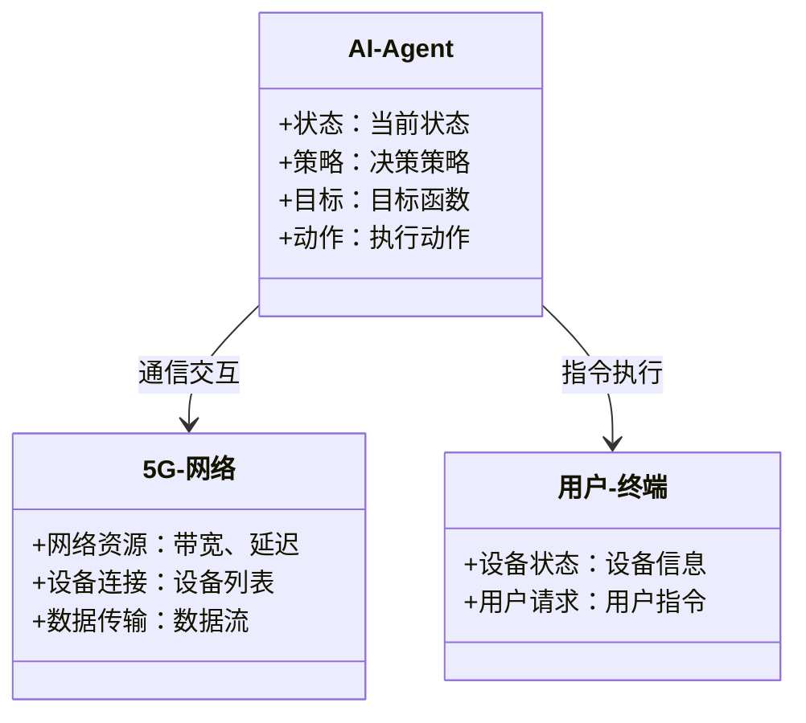
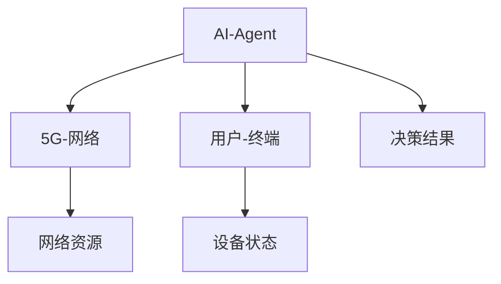
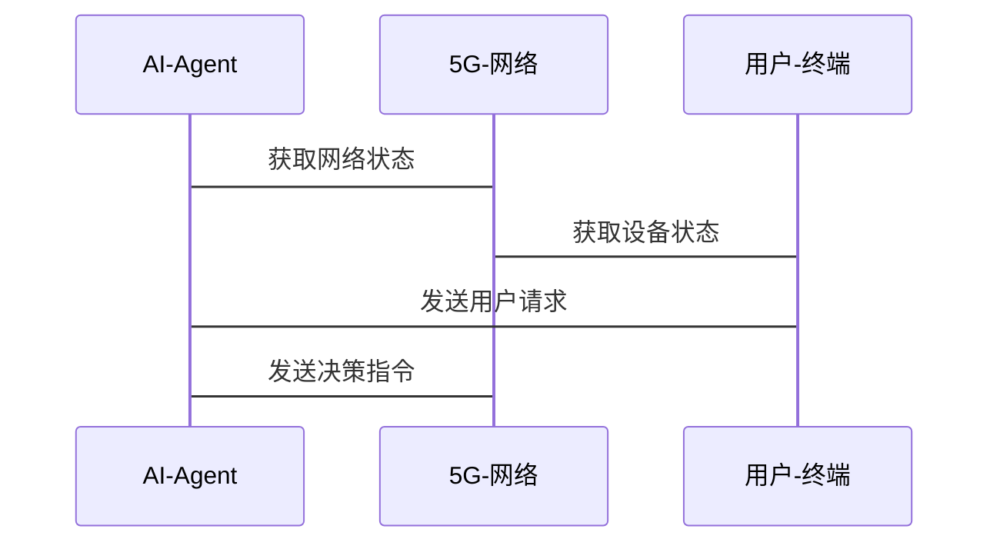

                 


# 《5G+AI：探索高速网络下的AI Agent新应用》

---

## 关键词：
- 5G网络
- AI Agent
- 高速网络
- 强化学习
- 图神经网络
- 边缘计算

---

## 摘要：
本文将探讨5G网络与AI Agent结合的新应用，分析其核心概念、算法原理、系统架构及实际案例。通过结合强化学习、图神经网络和边缘计算等技术，AI Agent在5G网络下的性能与应用场景将得到深入分析。文章最后将总结5G+AI Agent的未来发展趋势及最佳实践。

---

## 第1章：5G网络与AI Agent概述

### 1.1 5G网络的基础知识

#### 1.1.1 5G网络的定义与特点
5G网络是第五代移动通信技术，相较于4G，其特点包括：
- **高速度**：理论峰值速率可达10Gbps以上。
- **低延迟**：端到端时延低至1ms，支持实时交互。
- **大规模连接**：支持海量设备接入，满足物联网需求。
- **网络切片**：可根据不同场景定制化网络资源。

#### 1.1.2 5G网络的架构与组成部分
5G网络架构主要包括：
- **接入层**：负责用户设备与网络的连接，如5G基站（gNodeB）。
- **传输层**：实现数据的高效传输，采用SDN（软件定义网络）和NFV（网络功能虚拟化）技术。
- **核心层**：负责数据的处理与转发，支持网络切片。

#### 1.1.3 5G网络的性能指标与优势
- 高速率：满足高清视频、虚拟现实等场景的需求。
- 低延迟：支持实时交互，如工业自动化、智能驾驶等领域。
- 大连接：支持海量设备接入，适用于智慧城市、物联网等场景。

---

### 1.2 AI Agent的基本概念

#### 1.2.1 AI Agent的定义与分类
AI Agent（智能体）是指在环境中能够感知并自主行动以实现目标的实体。AI Agent可以分为：
- **简单反射型AI Agent**：基于规则的简单响应。
- **基于模型的反射型AI Agent**：具有环境模型，能够进行复杂决策。
- **目标驱动型AI Agent**：根据目标进行规划与行动。
- **实用驱动型AI Agent**：基于效用函数进行优化决策。

#### 1.2.2 AI Agent的核心功能与应用场景
AI Agent的核心功能包括：
- **感知环境**：通过传感器或数据接口获取环境信息。
- **决策与行动**：基于感知信息进行推理、决策并执行行动。
- **自适应学习**：通过经验优化自身行为。

应用场景包括：
- **智能家居**：控制家电设备，提供个性化服务。
- **智能助手**：如Siri、Alexa，帮助用户完成日常任务。
- **智能客服**：通过自然语言处理技术解决用户问题。

#### 1.2.3 AI Agent与传统AI的区别
AI Agent与传统AI的区别在于：
- AI Agent具有自主性、反应性、目标导向性和持续学习能力。
- 传统AI通常是静态的，不具备自主决策能力。

---

### 1.3 5G网络与AI Agent的结合背景

#### 1.3.1 5G网络为AI Agent提供的技术支撑
5G网络的高速度、低延迟和大连接能力为AI Agent提供了：
- 更快的数据传输速度，支持实时决策。
- 更低的延迟，确保快速响应。
- 更强的连接能力，支持大规模设备协同。

#### 1.3.2 AI Agent在5G网络中的潜在应用
AI Agent在5G网络中的潜在应用包括：
- **智能交通系统**：实时优化交通流量，减少拥堵。
- **智能制造**：实现设备间的高效协同，优化生产流程。
- **智能医疗**：支持远程手术、实时监测患者数据。

#### 1.3.3 5G+AI Agent结合的意义与价值
5G+AI Agent结合的意义在于：
- 提高网络资源利用率，优化网络性能。
- 提升设备智能化水平，推动智能化应用的发展。
- 为垂直行业数字化转型提供技术支持。

---

## 第2章：AI Agent的核心概念与原理

### 2.1 AI Agent的核心原理

#### 2.1.1 AI Agent的感知与决策机制
AI Agent的感知机制包括：
- **环境建模**：通过传感器或数据接口获取环境信息。
- **数据处理**：对获取的信息进行分析、融合与理解。

AI Agent的决策机制包括：
- **状态空间建模**：将环境信息转化为状态表示。
- **动作选择**：基于当前状态选择最优动作。
- **策略优化**：通过强化学习等方法优化决策策略。

#### 2.1.2 AI Agent的行动与反馈循环
AI Agent的行动与反馈循环包括：
- **执行动作**：根据决策结果执行实际操作。
- **接收反馈**：通过传感器或数据接口获取环境反馈。
- **更新模型**：根据反馈调整模型参数或策略。

#### 2.1.3 AI Agent的自适应与学习能力
AI Agent的自适应与学习能力体现在：
- **在线学习**：在运行过程中持续优化模型。
- **经验记忆**：存储历史数据以供后续决策参考。
- **多目标优化**：在多个目标之间找到平衡点。

---

### 2.2 AI Agent与5G网络的交互机制

#### 2.2.1 AI Agent在5G网络中的数据流分析
AI Agent与5G网络的交互数据流包括：
- **上行数据流**：AI Agent向5G网络发送请求或指令。
- **下行数据流**：5G网络向AI Agent返回响应或数据。

#### 2.2.2 AI Agent与5G网络的通信协议
AI Agent与5G网络的通信协议包括：
- **HTTP/HTTPS**：用于简单的请求响应交互。
- **MQTT**：用于轻量级设备间的通信。
- **WebSocket**：用于实时双向通信。

#### 2.2.3 AI Agent在5G网络中的任务分配与协同
AI Agent在5G网络中的任务分配与协同包括：
- **任务调度**：根据网络资源和设备状态分配任务。
- **协同工作**：通过边缘计算实现设备间的协同。

---

### 2.3 AI Agent的核心算法与技术

#### 2.3.1 基于强化学习的AI Agent算法
强化学习是一种通过试错机制优化决策策略的算法。AI Agent通过与环境的交互，不断优化自身的策略。

**算法步骤：**
1. **状态感知**：AI Agent感知当前状态。
2. **动作选择**：根据当前状态选择动作。
3. **执行动作**：执行选择的动作并观察环境反馈。
4. **奖励机制**：根据反馈调整策略，优化动作选择。

**数学模型：**
- 状态空间：S
- 动作空间：A
- 奖励函数：R(s, a)
- 策略函数：π(a|s)

**代码示例（强化学习）：**
```python
class Agent:
    def __init__(self, state_space, action_space):
        self.state_space = state_space
        self.action_space = action_space
        # 初始化策略参数
        self.theta = np.random.randn(...)
    
    def perceive(self, state):
        # 根据当前状态选择动作
        action = self.policy(state, self.theta)
        return action
    
    def update(self, reward):
        # 更新策略参数
        self.theta = update_theta(self.theta, reward)
```

#### 2.3.2 基于图神经网络的AI Agent建模
图神经网络（Graph Neural Network，GNN）是一种处理图结构数据的深度学习模型。AI Agent可以通过GNN建模复杂的交互关系。

**数学模型：**
- 图结构：G = (V, E)
- 节点特征：x_v ∈ R^d
- 边特征：e_uv ∈ R^d
- 输出：y_v ∈ R^m

**代码示例（图神经网络）：**
```python
import tensorflow as tf
from tensorflow.keras import layers

class GNNModel(tf.keras.Model):
    def __init__(self, input_dim, output_dim):
        super(GNNModel, self).__init__()
        self.gcn = layers.GCN(input_dim, 64)
        self.dense = layers.Dense(output_dim)
    
    def call(self, inputs):
        x, A = inputs
        x = self.gcn([x, A])
        output = self.dense(x)
        return output
```

---

### 2.4 本章小结
本章详细介绍了AI Agent的核心概念与原理，包括其感知与决策机制、与5G网络的交互机制，以及基于强化学习和图神经网络的核心算法。这些内容为后续章节的系统设计与实际应用奠定了基础。

---

## 第3章：5G网络下的AI Agent算法原理

### 3.1 基于强化学习的AI Agent算法

#### 3.1.1 强化学习的数学模型
强化学习的数学模型包括：
- **状态空间**：S
- **动作空间**：A
- **奖励函数**：R(s, a)
- **策略函数**：π(a|s)

**数学公式：**
- 价值函数：$$ V(s) = \max_a Q(s,a) $$
- Q-learning更新公式：$$ Q(s,a) = Q(s,a) + α[r + \max_{a'} Q(s',a')] - Q(s,a) $$

#### 3.1.2 强化学习在5G网络中的应用
强化学习在5G网络中的应用包括：
- **资源分配**：通过强化学习优化网络资源分配。
- **路径规划**：通过强化学习优化数据传输路径。

**代码示例（Q-learning）：**
```python
class QLearning:
    def __init__(self, state_num, action_num, alpha=0.1, gamma=0.9):
        self.q_table = np.zeros((state_num, action_num))
        self.alpha = alpha
        self.gamma = gamma
    
    def choose_action(self, state):
        return np.argmax(self.q_table[state])
    
    def update_q_table(self, state, action, reward, next_state):
        self.q_table[state][action] += self.alpha * (reward + self.gamma * np.max(self.q_table[next_state]) - self.q_table[state][action])
```

---

### 3.2 基于图神经网络的AI Agent算法

#### 3.2.1 图神经网络的数学模型
图神经网络的数学模型包括：
- **节点表示**：x_v ∈ R^d
- **边表示**：e_uv ∈ R^d
- **图表示**：G = (V, E)

**数学公式：**
- 聚合操作：$$ h_v = \text{aggregate}(\{h_u | u \in N(v)\}) $$
- 转换操作：$$ f_v = \text{transform}(h_v) $$

#### 3.2.2 图神经网络在5G网络中的应用
图神经网络在5G网络中的应用包括：
- **网络切片**：通过图神经网络优化网络切片策略。
- **设备协同**：通过图神经网络实现设备间的协同工作。

---

### 3.3 基于边缘计算的AI Agent优化

#### 3.3.1 边缘计算的基本概念
边缘计算是一种将计算能力推向数据源的技术，具有低延迟、高带宽的特点。

#### 3.3.2 边缘计算在AI Agent中的应用
边缘计算在AI Agent中的应用包括：
- **本地推理**：AI Agent在本地设备上进行推理，减少云依赖。
- **数据隐私**：通过边缘计算实现数据的本地处理，保护用户隐私。

---

### 3.4 本章小结
本章详细介绍了5G网络下的AI Agent算法原理，包括强化学习、图神经网络和边缘计算的应用。这些算法为AI Agent在5G网络中的高效运行提供了技术支撑。

---

## 第4章：5G网络下的AI Agent系统设计与架构

### 4.1 问题场景介绍
本章以智能交通系统为例，探讨AI Agent在5G网络下的系统设计与架构。

---

### 4.2 系统功能设计

#### 4.2.1 领域模型（类图）


---

### 4.3 系统架构设计

#### 4.3.1 系统架构图


---

### 4.4 系统接口设计

#### 4.4.1 系统交互流程图


---

### 4.5 本章小结
本章通过智能交通系统的案例，详细描述了AI Agent在5G网络下的系统设计与架构，包括领域模型、系统架构图和交互流程图。

---

## 第5章：5G+AI Agent的项目实战

### 5.1 智能交通系统案例分析

#### 5.1.1 环境安装
- **Python版本**：Python 3.8+
- **依赖库安装**：numpy、tensorflow、networkx
  ```bash
  pip install numpy tensorflow networkx
  ```

#### 5.1.2 核心代码实现
```python
import numpy as np
import tensorflow as tf
import networkx as nx

class AI-Agent:
    def __init__(self):
        self.model = self.build_model()
    
    def build_model(self):
        model = tf.keras.Sequential([
            tf.keras.layers.Dense(64, activation='relu'),
            tf.keras.layers.Dense(1, activation='sigmoid')
        ])
        return model
    
    def perceive(self, state):
        return self.model.predict(np.array([state]))
    
    def decide(self, state):
        prediction = self.perceive(state)
        return 1 if prediction[0][0] > 0.5 else 0
```

#### 5.1.3 代码应用解读与分析
AI-Agent类实现了基于深度学习的决策模型，通过感知环境状态进行决策。模型通过训练不断优化预测能力。

#### 5.1.4 实际案例分析
以智能交通系统为例，AI Agent通过感知交通流量和车辆状态，优化信号灯控制，减少拥堵。

---

### 5.2 本章小结
本章通过智能交通系统的案例，详细描述了AI Agent在5G网络下的实际应用，包括环境安装、核心代码实现和案例分析。

---

## 第6章：5G+AI Agent的未来展望

### 6.1 未来发展趋势

#### 6.1.1 技术趋势
- **多模态AI Agent**：结合视觉、听觉等多种感知方式。
- **自适应网络**：AI Agent与网络的深度协同优化。
- **边缘智能**：AI Agent在边缘设备上的广泛应用。

#### 6.1.2 应用场景扩展
- **智能城市**：AI Agent在交通、安防等领域的广泛应用。
- **智能医疗**：AI Agent在远程手术、患者监测中的应用。
- **智能制造**：AI Agent在工业自动化、质量检测中的应用。

---

### 6.2 最佳实践 Tips

#### 6.2.1 开发建议
- **数据隐私保护**：在设计AI Agent时，需注意数据隐私保护。
- **网络资源优化**：合理分配网络资源，提高系统效率。
- **多技术融合**：结合5G、AI、边缘计算等多种技术，提升系统性能。

#### 6.2.2 注意事项
- **算法优化**：在实际应用中，需不断优化AI Agent的算法。
- **系统可靠性**：确保AI Agent在复杂环境下的可靠性。
- **用户体验**：关注用户体验，提供个性化的服务。

---

### 6.3 本章小结
本章总结了5G+AI Agent的未来发展趋势，并提出了实际应用中的注意事项和建议。

---

## 结语
本文从5G网络与AI Agent的基本概念出发，深入探讨了AI Agent的核心算法、系统架构及实际应用。通过智能交通系统的案例分析，展示了AI Agent在5G网络下的实际应用价值。最后，本文展望了5G+AI Agent的未来发展趋势，并提出了实际应用中的注意事项和建议。希望本文能为读者提供有价值的技术参考。

--- 

**感谢您的阅读！**

