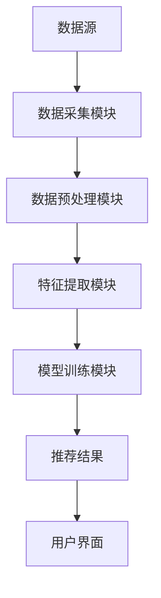
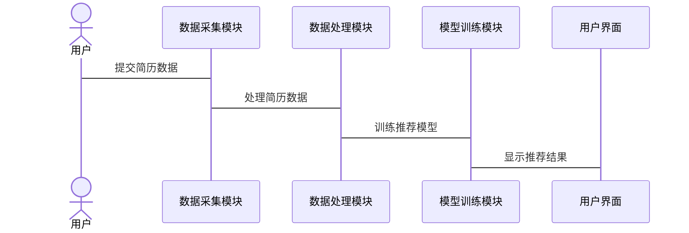

                 


# HR AI Agent：简历筛选与人才匹配

> 关键词：HR AI Agent, 简历筛选, 人才匹配, 自然语言处理, 机器学习, 系统架构

> 摘要：随着企业数字化转型的推进，人力资源管理领域也在不断探索如何利用人工智能技术提高招聘效率和精准度。本文深入探讨HR AI Agent在简历筛选和人才匹配中的应用，分析其核心原理、系统架构，并通过实际案例展示其在提升招聘效率和人才匹配精准度方面的能力。文章从背景、原理到实现，层层剖析，为读者提供全面的HR AI Agent技术解读。

---

## 第一部分: HR AI Agent背景与概念

### 第1章: 人力资源管理的数字化转型

#### 1.1 传统招聘流程的挑战

在传统招聘流程中，企业面临诸多挑战。首先，招聘效率低下，尤其是在处理大量简历时，HR需要花费大量时间进行筛选。其次，人才匹配的精准度不足，由于人为因素的影响，可能会遗漏合适的人选或引入不适合的员工。最后，招聘成本与时间的双重压力使得企业寻求更高效的解决方案。

#### 1.2 AI技术在HR领域的应用前景

人工智能技术的快速发展为HR领域带来了新的机遇。AI能够自动化处理简历筛选、优化人才匹配过程，从而提高招聘效率和精准度。通过自然语言处理（NLP）和机器学习技术，AI能够理解简历内容并推荐最适合的候选人。

#### 1.3 HR AI Agent的核心概念

**HR AI Agent**是一种基于AI技术的智能辅助工具，主要用于简历筛选和人才匹配。其核心功能包括简历解析、关键词提取、相似度计算以及个性化推荐。通过自动化处理和数据分析，HR AI Agent能够帮助企业快速找到合适的人才，提升招聘效率和质量。

---

## 第二部分: HR AI Agent的核心原理与技术

### 第2章: 自然语言处理在简历筛选中的应用

#### 2.1 自然语言处理的基础概念

自然语言处理（NLP）是人工智能的重要分支，旨在让计算机理解和处理人类语言。NLP技术在简历筛选中的应用包括分词、关键词提取和文本相似度计算。

#### 2.2 简历文本分析的关键技术

- **分词与词性标注**：将简历文本分解成词语并标注词性，便于后续处理。
- **关键词提取**：识别简历中的关键技能和经验，用于筛选合适候选人。
- **文本相似度计算**：通过余弦相似度等方法，衡量简历与职位需求的匹配程度。

#### 2.3 基于NLP的简历筛选流程

1. 数据预处理：去除停用词，进行分词和词性标注。
2. 关键词匹配：提取简历中的关键词并与职位要求进行匹配。
3. 文本相似度计算：使用BM25算法计算简历与职位描述的相似度。

### 第3章: 机器学习在人才匹配中的应用

#### 3.1 机器学习的基础概念

机器学习是一种通过数据训练模型，使其能够自动进行预测和决策的技术。在人才匹配中，监督学习和无监督学习尤为重要。

#### 3.2 基于机器学习的人才推荐算法

- **协同过滤推荐**：基于用户相似性推荐候选人。
- **深度学习模型**：使用神经网络进行更复杂的特征提取和推荐。

#### 3.3 人才匹配的评价指标与优化方法

- **匹配度评价指标**：如精确率、召回率和F1分数。
- **算法优化**：通过交叉验证和超参数调优提升模型性能。

---

## 第三部分: HR AI Agent的系统架构与实现

### 第4章: HR AI Agent的整体架构设计

#### 4.1 系统功能模块划分

- **数据采集模块**：获取简历和职位描述数据。
- **简历处理模块**：进行文本分析和特征提取。
- **模型训练模块**：训练机器学习模型并进行推荐。

#### 4.2 系统架构设计



#### 4.3 系统交互流程



---

## 第五部分: 项目实战与最佳实践

### 第5章: HR AI Agent的实现

#### 5.1 环境安装

- Python 3.8+
- 依赖库：scikit-learn, nltk, spacy

#### 5.2 核心代码实现

```python
import sklearn
from sklearn.feature_extraction.text import TfidfVectorizer
from sklearn.metrics.pairwise import cosine_similarity

# 示例数据
resumes = ["具有5年Python开发经验，擅长算法设计和团队协作"]
jobs = ["寻找有5年以上Python开发经验的高级工程师"]

# 向量转换
vectorizer = TfidfVectorizer()
tfidf_matrix = vectorizer.fit_transform(resumes + jobs)

# 计算相似度
similarity_matrix = cosine_similarity(tfidf_matrix[:len(resumes)], tfidf_matrix[len(resumes):])
```

#### 5.3 实际案例分析

通过具体案例，展示如何利用HR AI Agent筛选简历并推荐人才。

### 第5.4 最佳实践与注意事项

- 数据质量：确保简历和职位描述数据的准确性和完整性。
- 模型优化：定期更新模型，提升推荐精准度。
- 隐私保护：遵守数据隐私法规，保护候选人信息。

---

## 第六部分: 总结与展望

### 6.1 总结

本文详细探讨了HR AI Agent在简历筛选和人才匹配中的应用，从技术原理到系统实现，为读者提供了全面的解读。

### 6.2 未来展望

随着AI技术的不断进步，HR AI Agent将在人才匹配中发挥更大作用，为企业提供更精准和高效的招聘解决方案。

---

通过以上内容，我们系统地介绍了HR AI Agent的技术背景、核心原理和实现方案，为读者提供了深入的技术解读和实践指导。

