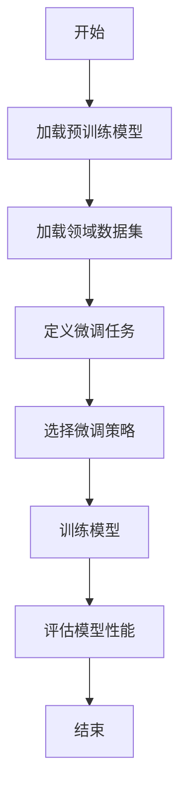

                 


# LLM Fine-Tuning 技巧：针对特定领域优化

**关键词**：LLM, Fine-Tuning, 大语言模型, 特定领域优化, 自然语言处理, 微调技术

**摘要**：本文详细探讨了如何对大语言模型（LLM）进行微调，以优化其在特定领域的表现。文章从基础概念入手，逐步深入分析微调的核心原理、算法流程、数学模型，并结合实际项目案例，提供系统化的解决方案和最佳实践。通过本文，读者能够全面理解并掌握如何针对不同领域的需求，有效优化LLM模型，提升其性能和适用性。

---

## 第一部分: 大语言模型（LLM）微调基础

### 第1章: 微调技术的背景与概念

#### 1.1 问题背景
- **1.1.1 传统NLP模型的局限性**
  - 传统模型在处理复杂任务时表现不足。
  - 无法有效处理长文本和上下文关系。
- **1.1.2 大语言模型的崛起**
  - LLM的优势：强大的上下文理解和生成能力。
  - LLM的应用场景：文本生成、对话系统、机器翻译等。
- **1.1.3 微调技术的必要性**
  - 通用模型的适应性不足。
  - 特定领域需求的多样化。

#### 1.2 问题描述
- **1.2.1 通用模型的适应性不足**
  - 无法直接满足特定领域的复杂需求。
- **1.2.2 特定领域需求的多样化**
  - 不同领域有不同的语言习惯和术语。
- **1.2.3 微调技术的核心目标**
  - 优化模型在特定领域的表现。

#### 1.3 问题解决
- **1.3.1 微调技术的定义**
  - 微调技术是对预训练模型进行针对性优化的过程。
- **1.3.2 微调技术的关键作用**
  - 提高模型在特定领域的准确性和实用性。
- **1.3.3 微调技术的实现路径**
  - 数据选择、任务适配、模型优化。

#### 1.4 边界与外延
- **1.4.1 微调与迁移学习的区别**
  - 微调是迁移学习的一种具体应用。
- **1.4.2 微调的适用场景**
  - 小样本数据、领域特定任务。
- **1.4.3 微调的局限性**
  - 需要领域内数据，计算资源需求高。

#### 1.5 核心概念结构
- **1.5.1 模型、任务、数据的关系**
  - 模型：基础预训练模型。
  - 任务：特定领域任务。
  - 数据：领域内数据。
- **1.5.2 微调的三要素分析**
  - 数据、模型、任务的协同作用。
- **1.5.3 核心要素的组成**
  - 数据预处理、模型调整、任务适配。

### 第2章: 微调技术的核心概念与联系

#### 2.1 微调技术的核心原理
- **2.1.1 参数微调与模型架构微调的对比**
  - 参数微调：调整模型参数，保持架构不变。
  - 模型架构微调：修改模型结构，适应特定任务。
- **2.1.2 适应性微调的概念**
  - 根据任务需求动态调整模型。
- **2.1.3 微调与迁移学习的关系**
  - 微调是迁移学习的一种高级应用。

#### 2.2 核心概念属性特征对比表格
| 概念       | 参数微调 | 模型架构微调 | 适应性微调 |
|------------|----------|-------------|------------|
| 对象       | 模型参数 | 模型架构     | 适应性调整 |
| 调整方式   | 微调参数 | 修改结构     | 动态调整   |

#### 2.3 实体关系图（ER图）架构
```mermaid
erDiagram
    actor 微调系统
    actor 预训练模型
    actor 领域数据
    actor 优化目标
    微调系统 --> 预训练模型: 输入
    微调系统 --> 领域数据: 输入
    微调系统 --> 优化目标: 输出
```

---

## 第二部分: 微调技术的算法原理

### 第3章: 微调算法的原理与实现

#### 3.1 微调算法的核心流程
- **3.1.1 任务特定的微调**
  - 为特定任务设计微调策略。
- **3.1.2 参数高效微调**
  - 使用更高效的参数更新方法。
- **3.1.3 逐步微调**
  - 分阶段优化模型参数。

#### 3.2 微调算法的流程图


#### 3.3 微调算法的数学模型
- **损失函数的计算**
  $$ \text{Loss} = \sum_{i=1}^{n} \text{CrossEntropy}(y_i, y_{\text{pred}}) $$
- **模型参数更新步骤**
  $$ \theta_{\text{new}} = \theta - \eta \cdot \nabla_{\theta} \text{Loss} $$

---

## 第三部分: 微调技术的数学模型

### 第4章: 微调的数学推导与应用

#### 4.1 微调的数学模型
- **损失函数的数学表达**
  $$ \text{Loss}(x, y) = -\sum_{i=1}^{n} y_i \log(p_i) $$
  其中，\( p_i \) 是模型预测的概率。

#### 4.2 参数更新的数学推导
- **梯度计算**
  $$ \frac{\partial \text{Loss}}{\partial \theta} = \nabla_{\theta} \text{Loss} $$
- **参数更新**
  $$ \theta_{\text{new}} = \theta - \eta \cdot \nabla_{\theta} \text{Loss} $$

---

## 第四部分: 微调系统的架构设计

### 第5章: 微调系统的架构与实现

#### 5.1 系统架构设计
- **整体架构**
  ```mermaid
  graph TD
      I[输入数据] --> P[数据预处理]
      P --> M[模型加载]
      M --> T[任务定义]
      T --> O[模型优化]
      O --> E[性能评估]
      E --> 输出结果
  ```

#### 5.2 系统功能设计
- **数据预处理模块**
  - 数据清洗、特征提取。
- **模型加载模块**
  - 加载预训练模型，初始化参数。
- **任务定义模块**
  - 定义微调任务和目标。
- **模型优化模块**
  - 执行微调算法，更新参数。
- **性能评估模块**
  - 评估模型在特定领域的表现。

---

## 第五部分: 微调技术的项目实战

### 第6章: 微调技术的实际应用

#### 6.1 项目环境搭建
- **工具安装**
  - 安装Python、TensorFlow、PyTorch等框架。
- **依赖管理**
  - 使用虚拟环境管理依赖。

#### 6.2 项目核心代码实现
```python
# 微调代码示例
import torch
from transformers import AutoTokenizer, AutoModelForMaskedLM

# 加载预训练模型
model = AutoModelForMaskedLM.from_pretrained('bert-base-uncased')
tokenizer = AutoTokenizer.from_pretrained('bert-base-uncased')

# 定义微调任务
def compute_loss(batch, model, tokenizer):
    inputs = tokenizer(batch['text'], return_tensors='pt', padding=True, truncation=True)
    outputs = model(**inputs)
    loss = outputs.loss
    return loss

# 训练循环
optimizer = torch.optim.Adam(model.parameters(), lr=1e-5)
model.train()
for epoch in range(num_epochs):
    for batch in train_loader:
        optimizer.zero_grad()
        loss = compute_loss(batch, model, tokenizer)
        loss.backward()
        optimizer.step()
```

---

## 第六部分: 微调技术的最佳实践

### 第7章: 微调技术的优化与总结

#### 7.1 最佳实践 tips
- **选择高质量的数据集**
  - 数据清洗、去除噪声。
- **模型选择与调优**
  - 选择适合任务的模型架构。
- **避免过拟合**
  - 使用交叉验证、正则化等技术。

#### 7.2 小结
- 微调技术的核心在于数据和任务的适配。
- 模型优化需要结合具体场景和需求。

#### 7.3 注意事项
- **数据隐私**
  - 确保数据的隐私和合规性。
- **计算资源**
  - 微调过程需要大量计算资源。

#### 7.4 拓展阅读
- 了解最新的微调技术，如Adapter Tuning、LoRA等。

---

## 附录

### 附录A: 术语解释
- **微调（Fine-tuning）**：对预训练模型进行针对性优化的过程。
- **参数微调（Parameter Tuning）**：调整模型参数以适应特定任务。
- **模型架构微调（Architecture Tuning）**：修改模型结构以适应特定任务。

### 附录B: 工具与资源
- **常用框架**
  - TensorFlow、PyTorch。
- **数据集资源**
  - Hugging Face datasets。

---

通过以上目录结构，您可以系统地学习和掌握大语言模型微调技术的核心概念、算法原理、数学模型、系统架构以及实际应用技巧。

