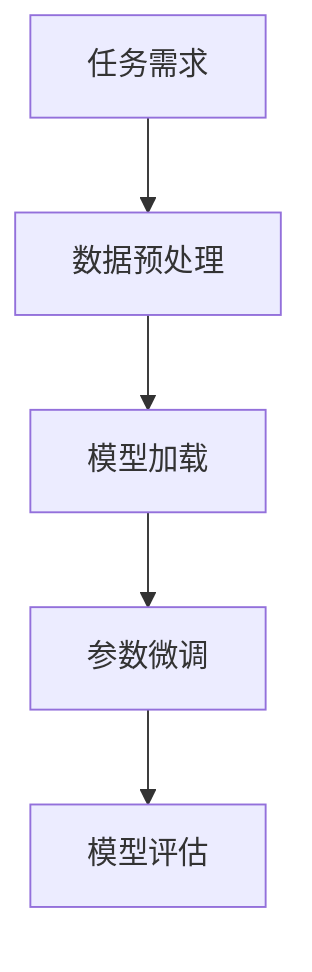
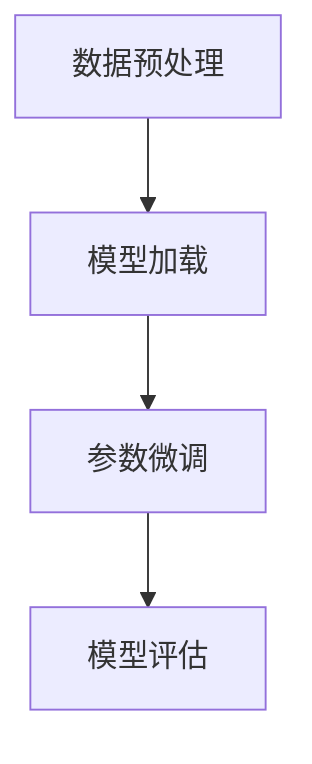
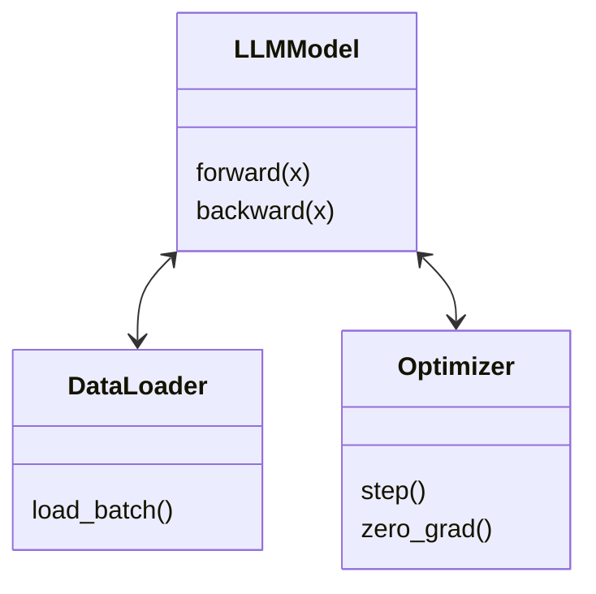
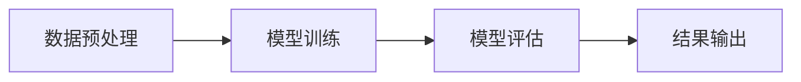

                 


# LLM Fine-Tuning技术：定制化AI Agent的关键

## 关键词：LLM微调，定制化AI，大语言模型，AI代理，模型优化

## 摘要：
本文深入探讨了LLM（大语言模型）微调技术在定制化AI代理中的关键作用。从背景到原理，从算法到实践，全面解析了如何通过微调技术提升AI代理的性能和适应性。文章详细介绍了微调的核心概念、算法流程、系统架构，并通过实际案例展示了如何将理论应用于实践，最后总结了最佳实践和未来发展方向。

---

# 第一部分: LLM Fine-Tuning技术概述

## 第1章: LLM Fine-Tuning技术背景与概述

### 1.1 LLM Fine-Tuning的背景与意义
#### 1.1.1 大语言模型的发展历程
从2018年的BERT到2020年的GPT-3，大语言模型（LLM）经历了从无到有的快速发展。这些模型在自然语言处理任务中表现出色，但它们通常是基于通用数据集训练的，难以满足特定场景的需求。

#### 1.1.2 Fine-Tuning技术的出现与作用
为了使大语言模型适应特定任务或领域，研究者提出了Fine-Tuning技术。通过调整模型参数，Fine-Tuning使LLM能够更好地处理定制化任务。

#### 1.1.3 定制化AI Agent的需求与挑战
定制化AI Agent需要根据具体场景优化模型，以提高准确性和效率。然而，直接使用通用模型往往效果不佳，因此Fine-Tuning成为实现定制化的关键。

### 1.2 LLM Fine-Tuning的核心概念
#### 1.2.1 什么是LLM Fine-Tuning
Fine-Tuning是指在预训练模型的基础上，进一步调整模型参数以适应特定任务的过程。

#### 1.2.2 Fine-Tuning与模型调优的区别
Fine-Tuning是在预训练后调整部分或全部参数，而模型调优通常指通过调整超参数来优化性能。

#### 1.2.3 定制化AI Agent的定义与目标
定制化AI Agent是为特定场景或任务设计的智能体，目标是通过Fine-Tuning提高模型的适用性和性能。

### 1.3 LLM Fine-Tuning的应用场景
#### 1.3.1 企业级应用中的定制需求
企业需要AI Agent处理特定任务，如客服问答、内部文档处理等。

#### 1.3.2 行业特定任务的优化
在医疗、法律等领域，模型需要处理专业数据，Fine-Tuning是必要的。

#### 1.3.3 用户个性化服务的实现
通过Fine-Tuning，AI Agent可以为用户提供个性化的服务体验。

### 1.4 本章小结
本章介绍了LLM微调技术的背景、核心概念和应用场景，为后续内容奠定了基础。

---

## 第2章: LLM Fine-Tuning的核心概念与联系

### 2.1 LLM Fine-Tuning的核心原理
#### 2.1.1 模型参数的调整机制
微调通过调整模型的权重参数，使模型适应特定任务。

#### 2.1.2 微调过程中的知识迁移
微调使模型将预训练的知识迁移到新的任务中，提升性能。

#### 2.1.3 任务适应性增强的实现方式
通过任务特定的数据训练，模型能够更好地处理该任务。

### 2.2 LLM Fine-Tuning的关键特征对比
#### 2.2.1 不同Fine-Tuning方法的特征对比

| 方法         | 参数调整范围 | 训练数据需求 | 计算资源需求 |
|--------------|--------------|--------------|--------------|
| 全参数微调   | 全部参数      | 较多          | 高            |
| 半参数微调   | 部分参数      | 较少          | 中            |
| 参数冻结     | 无            | 无            | 低            |

#### 2.2.2 基于任务的参数调整策略
根据任务需求选择参数调整策略，如全微调、半微调等。

#### 2.2.3 模型性能与计算资源的平衡
在性能和资源之间找到平衡点，选择合适的微调方法。

### 2.3 实体关系图与流程图


---

## 第3章: LLM Fine-Tuning的算法原理

### 3.1 微调算法的流程图


### 3.2 微调算法的数学模型
交叉熵损失函数：
$$ L = -\sum_{i=1}^{n} y_i \log(p_i) $$
其中，$y_i$ 是真实标签，$p_i$ 是预测概率。

### 3.3 微调训练的Python代码示例
```python
import torch
from torch import nn
from torch.optim import Adam

# 定义模型
class LLM(nn.Module):
    def __init__(self, ...):
        super().__init__()
        # 模型结构定义

    def forward(self, x):
        return self.decoder(x)

# 加载预训练模型
model = LLM().to(device)
optimizer = Adam(model.parameters(), lr=1e-5)

# 微调训练
for epoch in epochs:
    for batch in dataloader:
        optimizer.zero_grad()
        outputs = model(batch)
        loss = criterion(outputs, labels)
        loss.backward()
        optimizer.step()
```

### 3.4 微调过程中的学习率调整策略
使用学习率衰减：
$$ \text{new\_lr} = \text{initial\_lr} \times \frac{1}{1 + \text{annealing\_factor} \times \text{step}} $$

---

## 第4章: LLM Fine-Tuning的系统分析与架构设计

### 4.1 问题场景介绍
在医疗领域，定制化AI Agent需要处理专业术语和特定问题。

### 4.2 系统功能设计
使用Mermaid类图展示领域模型：


### 4.3 系统架构设计
使用Mermaid架构图展示系统架构：


### 4.4 系统接口设计
定义接口：
```python
class Agent:
    def __init__(self, model, tokenizer):
        self.model = model
        self.tokenizer = tokenizer

    def process_query(self, query):
        # 处理查询
        pass
```

---

## 第5章: LLM Fine-Tuning的项目实战

### 5.1 环境安装
安装必要的库：
```bash
pip install torch transformers
```

### 5.2 核心代码实现
```python
import torch
from transformers import AutoTokenizer, AutoModelForMaskedLM

# 加载预训练模型和分词器
tokenizer = AutoTokenizer.from_pretrained('bert-base-uncased')
model = AutoModelForMaskedLM.from_pretrained('bert-base-uncased')

# 定义微调函数
def fine_tune(model, tokenizer, train_dataset, val_dataset, num_epochs=3):
    optimizer = Adam(model.parameters(), lr=1e-5)
    criterion = nn.CrossEntropyLoss()
    # 微调训练过程...
```

### 5.3 实际案例分析
以客服系统为例，展示如何通过Fine-Tuning提高回答准确性。

### 5.4 项目经验总结
分享在项目中遇到的问题和解决方法，如数据质量、计算资源等。

---

## 第6章: LLM Fine-Tuning的最佳实践

### 6.1 小结
总结Fine-Tuning的核心要点和注意事项。

### 6.2 注意事项
- 数据预处理的重要性
- 学习率和批次大小的调整
- 模型评估和优化

### 6.3 拓展阅读
推荐相关论文和资源，供读者深入学习。

---

## 第7章: 总结与展望

### 7.1 总结
回顾本文的主要内容，强调Fine-Tuning在定制化AI中的重要性。

### 7.2 未来展望
探讨Fine-Tuning技术的未来发展方向，如更高效的方法和应用场景。

---

通过以上内容，本文系统地介绍了LLM Fine-Tuning技术的各个方面，从理论到实践，为读者提供了全面的指导和深入的分析。

