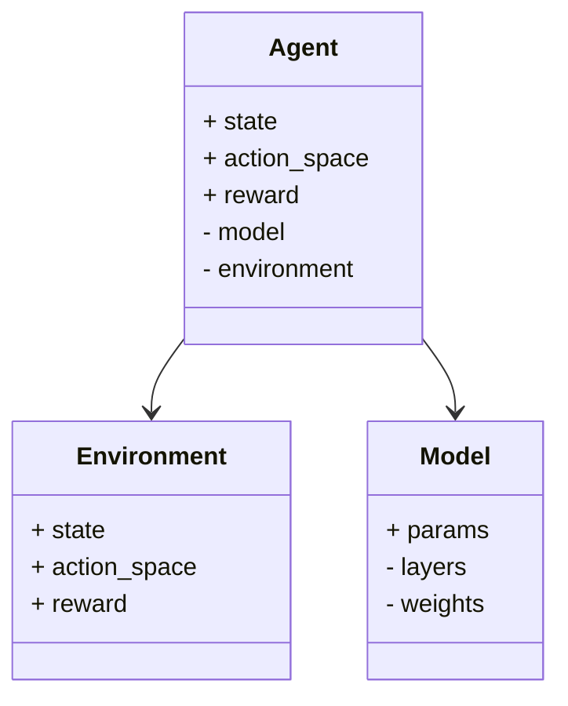
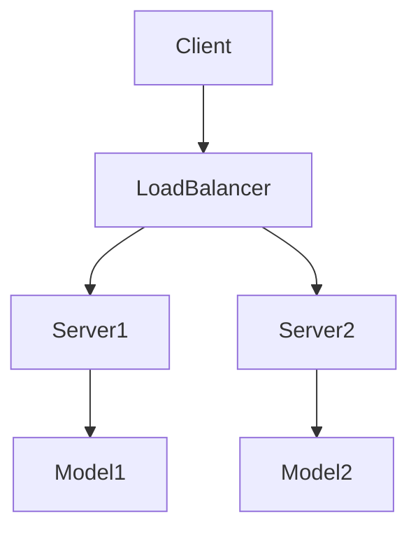

                 


# LLM 驱动的 AI Agent：核心原理与技术栈详解

> 关键词：大语言模型、AI Agent、自然语言处理、强化学习、系统架构

> 摘要：本文详细探讨了LLM（大语言模型）驱动的AI Agent的核心原理与技术实现。从AI Agent的发展历程、LLM的基本概念，到算法原理、系统架构设计，再到项目实战和最佳实践，全面解析了如何利用大语言模型构建智能代理系统。

---

# 第一部分: LLM 驻动的 AI Agent 背景与基础

## 第1章: LLM 驻动的 AI Agent 概述

### 1.1 AI Agent 的发展历程

#### 1.1.1 从传统 AI 到现代 AI Agent 的演变

人工智能（AI）技术经历了多个阶段的发展。早期的AI系统主要基于规则和逻辑推理，例如专家系统。这些系统通过预定义的规则来处理特定问题，但其灵活性和扩展性有限。随着机器学习（ML）和深度学习（DL）技术的进步，AI系统逐渐从基于规则的简单逻辑推理发展到基于数据驱动的深度学习模型。

现代AI Agent 的核心是能够感知环境、做出决策并执行动作。传统的AI Agent 依赖于预定义的规则和逻辑推理，而现代AI Agent 则更多地依赖于数据驱动的深度学习模型，尤其是大语言模型（LLM）。

#### 1.1.2 大语言模型的崛起

大语言模型（LLM）是近年来自然语言处理（NLP）领域的重大突破。LLM 通过深度学习技术训练大规模的神经网络模型，能够理解和生成人类语言。这类模型的成功主要归功于以下几点：

1. **大规模数据**：训练数据量的爆炸式增长，例如从 Books Corpus 到 Internet 垃圾数据的利用。
2. **模型架构**：Transformer 架构的引入，使得模型能够处理长序列数据，并具备并行计算能力。
3. **训练方法**：引入了多种优化技术，如注意力机制、位置编码、跨模态训练等。

大语言模型的崛起使得AI Agent 的实现更加高效和灵活，能够处理复杂的自然语言交互任务。

#### 1.1.3 LLM 与 AI Agent 的结合

AI Agent 的核心功能包括感知、决策和执行。传统的AI Agent 依赖于预定义的规则和逻辑推理，而 LLM 的引入为 AI Agent 带来了以下优势：

1. **自然语言处理能力**：LLM 能够理解和生成自然语言，使得 AI Agent 能够与人类进行更自然的交互。
2. **上下文理解**：LLM 具备上下文理解能力，能够根据对话历史和环境信息做出更智能的决策。
3. **自适应能力**：通过持续学习和优化，LLM 驱动的 AI Agent 能够适应不同的场景和用户需求。

结合 LLM 的 AI Agent 具备更强的通用性和灵活性，能够应用于多种领域，如智能助手、智能客服、机器人控制等。

---

### 1.2 LLM 驻动的 AI Agent 核心概念

#### 1.2.1 大语言模型的定义与特点

**大语言模型（LLM）** 是一种基于深度学习的自然语言处理模型，通常基于 Transformer 架构。LLM 的主要特点包括：

1. **大规模参数量**：LLM 通常包含数亿甚至数十亿的参数，能够捕捉复杂的语言模式。
2. **自注意力机制**：通过自注意力机制，模型能够理解上下文信息，处理长序列数据。
3. **多任务能力**：LLM 可以通过微调或提示工程技术，适应多种不同的任务，如文本生成、问答系统、机器翻译等。

#### 1.2.2 AI Agent 的定义与功能

**AI Agent（智能代理）** 是一种能够感知环境、做出决策并执行动作的智能系统。AI Agent 的核心功能包括：

1. **感知**：通过传感器或其他信息源获取环境信息。
2. **决策**：基于感知信息和内部状态，做出决策。
3. **执行**：根据决策结果执行动作，影响环境或与用户交互。

#### 1.2.3 LLM 驻动 AI Agent 的独特优势

LLM 驻动的 AI Agent 具备以下独特优势：

1. **自然语言交互**：通过 LLM 的自然语言处理能力，AI Agent 能够以人类语言与用户交互。
2. **上下文理解**：LLM 能够理解上下文，使得 AI Agent 的决策更加智能和连贯。
3. **自适应能力**：通过持续学习和优化，LLM 驻动的 AI Agent 能够适应不同的场景和用户需求。

---

### 1.3 本章小结

本章介绍了 LLM 驻动的 AI Agent 的背景与发展，重点探讨了 LLM 和 AI Agent 的核心概念及其结合的优势。通过本章的介绍，读者可以理解 LLM 驻动的 AI Agent 的基本概念和其在现代 AI 系统中的重要性。

---

## 第2章: 大语言模型的核心原理

### 2.1 大语言模型的训练与优化

#### 2.1.1 Transformer 架构的数学模型

Transformer 架构是大语言模型的核心。其主要组成部分包括编码器（Encoder）和解码器（Decoder）。编码器负责将输入序列转换为高维向量表示，解码器则基于编码器的输出生成目标序列。

**编码器结构**：
1. **嵌入层（Embedding Layer）**：将输入的词或字符转换为向量表示。
2. **位置编码（Positional Encoding）**：为每个位置添加位置信息，使得模型能够处理序列数据。
3. **自注意力机制（Self-Attention）**：计算每个位置与其他位置的相关性，生成注意力权重。
4. **前馈神经网络（FFN）**：对注意力加权后的向量进行非线性变换。

**自注意力机制的公式**：
$$
\text{Attention}(Q, K, V) = \text{softmax}\left(\frac{QK^T}{\sqrt{d_k}}\right)V
$$

其中，$Q$、$K$、$V$ 分别是查询（Query）、键（Key）、值（Value）矩阵，$d_k$ 是键的维度。

#### 2.1.2 注意力机制的原理与公式

注意力机制是 Transformer 架构的核心。通过计算查询与键之间的相似性，模型能够关注输入序列中重要的部分。

**多头注意力机制**：
$$
\text{Multi-Head Attention}(Q, K, V) = \text{Concat}(\text{Head}_1, \text{Head}_2, ..., \text{Head}_n)
$$

其中，每个 Head 是一个独立的注意力计算过程，$n$ 是并行的注意力头数。

#### 2.1.3 大模型的训练方法与挑战

大语言模型的训练过程通常包括以下几个步骤：

1. **数据准备**：收集和整理大规模的文本数据。
2. **模型构建**：基于 Transformer 架构构建模型。
3. **损失函数定义**：通常使用交叉熵损失函数。
4. **优化算法选择**：常用 Adam、AdamW 等优化器。
5. **训练与调优**：通过分布式训练和参数调整优化模型性能。

**交叉熵损失函数**：
$$
\mathcal{L} = -\sum_{i=1}^{n} y_i \log p(y_i)
$$

其中，$y_i$ 是真实标签的概率，$p(y_i)$ 是模型预测的概率。

### 2.2 大语言模型的推理过程

#### 2.2.1 解码过程

解码过程是大语言模型生成输出的关键步骤。通常采用贪心搜索或随机采样方法。

**贪心搜索**：
1. 初始化解码序列。
2. 逐步生成下一个词，选择概率最高的词。
3. 直到生成序列结束（如达到最大长度或生成特殊符号）。

**随机采样**：
1. 从模型输出的概率分布中随机采样生成下一个词。
2. 直到生成序列结束。

**解码过程示意图**：
```mermaid
graph TD
    Start --> Decode
    Decode --> GenerateToken
    GenerateToken --> EndOrContinue
    EndOrContinue --> (条件满足) ? --> End
    End --> Output
```

---

## 第3章: AI Agent 的核心算法与实现

### 3.1 AI Agent 的核心算法

#### 3.1.1 强化学习（Reinforcement Learning）

强化学习是一种通过试错方式来优化决策策略的方法。AI Agent 在与环境交互的过程中，通过不断尝试不同的动作，学习最优的策略。

**马尔可夫决策过程（MDP）**：
- 状态（State）
- 动作（Action）
- 转移概率（Transition Probability）
- 奖励（Reward）

**策略（Policy）**：
- 确定性策略：$\pi(a|s)$，给定状态$s$时选择动作$a$的概率。
- 随机性策略：$\pi(a|s)$，动作$a$的概率分布。

**价值函数（Value Function）**：
- 状态价值函数：$V(s)$，从状态$s$开始的期望累积奖励。
- 动作价值函数：$Q(s,a)$，从状态$s$选择动作$a$的期望累积奖励。

**贝尔曼方程**：
$$
V(s) = \max_a Q(s,a)
$$

#### 3.1.2 规划算法（Planning Algorithms）

规划算法用于生成从当前状态到目标状态的最优路径。常见的规划算法包括：

1. **宽度优先搜索（BFS）**：适用于无权图的最短路径问题。
2. **深度优先搜索（DFS）**：适用于解决树状结构中的路径问题。
3. **Dijkstra 算法**：适用于带权图的最短路径问题。
4. **A* 算法**：结合了启发式搜索和Dijkstra算法，用于最优路径规划。

---

### 3.2 AI Agent 的实现步骤

#### 3.2.1 环境感知

AI Agent 需要通过传感器或其他信息源获取环境信息。例如：

- **视觉感知**：通过摄像头获取图像信息。
- **听觉感知**：通过麦克风获取音频信息。
- **其他感知方式**：如 GPS 位置信息、温度传感器等。

#### 3.2.2 状态表示

将感知到的环境信息转换为模型能够理解的状态表示。例如：

- **图像表示**：将图像转换为特征向量。
- **文本表示**：将自然语言文本转换为词向量或句向量。

#### 3.2.3 决策过程

基于当前状态，AI Agent 选择最优动作。例如：

- **策略网络**：通过神经网络直接输出动作。
- **Q-learning**：通过价值函数选择最优动作。

#### 3.2.4 动作执行

根据决策结果，AI Agent 执行相应的动作。例如：

- **机器人控制**：通过电机控制机械臂移动。
- **智能助手**：通过调用 API 发送消息。

---

## 第4章: LLM 驻动的 AI Agent 系统架构与设计

### 4.1 系统功能模块

LLM 驻动的 AI Agent 系统通常包括以下功能模块：

1. **感知模块**：负责获取环境信息。
2. **决策模块**：负责基于感知信息做出决策。
3. **执行模块**：负责执行决策结果。
4. **交互模块**：负责与用户进行自然语言交互。

**功能模块类图**：


---

### 4.2 系统架构设计

#### 4.2.1 分布式架构

大语言模型的训练和推理通常采用分布式架构，以提高计算效率。

**分布式训练**：
- 数据并行：将数据分割成多个批次，分别在不同的GPU上训练。
- 模型并行：将模型分割成多个部分，分别在不同的GPU上训练。

**分布式推理**：
- 负载均衡：将请求分配到不同的服务器上，避免单点过载。

**分布式架构示意图**：


---

## 第5章: LLM 驻动的 AI Agent 项目实战

### 5.1 项目背景与目标

#### 5.1.1 项目背景

随着大语言模型的快速发展，越来越多的企业开始尝试将 LLM 应用于智能代理系统。本项目旨在通过 LLM 实现一个智能助手，能够与用户进行自然语言交互，并完成特定的任务。

#### 5.1.2 项目目标

- 实现一个基于 LLM 的智能助手。
- 提供自然语言交互界面。
- 支持多种任务，如信息查询、任务执行等。

---

### 5.2 环境搭建

#### 5.2.1 安装 Python 和相关库

首先，安装 Python 和必要的开发工具。

```bash
# 安装 Python
sudo apt-get install python3 python3-dev

# 安装 pip
sudo apt-get install python3-pip
```

然后，安装必要的库：

```bash
pip install numpy torch transformers
```

---

### 5.3 核心代码实现

#### 5.3.1 感知模块

感知模块负责获取用户输入。

```python
import transformers

def get_input():
    input_text = input("请输入命令：")
    return input_text
```

---

#### 5.3.2 决策模块

决策模块负责生成响应。

```python
def generate_response(input_text):
    model = transformers.AutoModelForCausalLM.from_pretrained("gpt2")
    tokenizer = transformers.AutoTokenizer.from_pretrained("gpt2")
    inputs = tokenizer.encode(input_text, return_tensors="pt")
    outputs = model.generate(inputs, max_length=50)
    response = tokenizer.decode(outputs[0], skip_special_tokens=True)
    return response
```

---

### 5.4 系统测试与优化

#### 5.4.1 测试案例

测试案例包括：

1. **基本交互测试**：输入简单的命令，检查输出是否正确。
2. **上下文理解测试**：输入多轮对话，检查模型是否能够保持上下文。
3. **异常处理测试**：输入无效命令，检查系统是否能够正常处理。

#### 5.4.2 性能优化

性能优化包括：

1. **模型压缩**：使用模型蒸馏等技术减少模型参数。
2. **推理优化**：优化代码，提高推理速度。

---

## 第6章: LLM 驻动的 AI Agent 最佳实践与注意事项

### 6.1 性能优化技巧

1. **模型选择**：选择适合任务的模型，避免使用过于复杂的模型。
2. **剪枝**：通过剪枝技术减少模型的计算量。
3. **量化**：将模型参数量化，降低存储和计算成本。

---

### 6.2 安全性考虑

1. **数据隐私**：确保用户数据的安全性和隐私性。
2. **内容审核**：过滤敏感内容，防止恶意输入。

---

### 6.3 未来发展方向

1. **多模态模型**：结合视觉、听觉等多模态信息，提升 AI Agent 的感知能力。
2. **边缘计算**：将 LLM 部署在边缘设备上，降低延迟和带宽消耗。
3. **人机协作**：优化人机协作流程，提升用户体验。

---

## 第7章: 总结与展望

通过本文的介绍，读者可以全面了解 LLM 驻动的 AI Agent 的核心原理与技术实现。从算法原理到系统架构，从项目实战到最佳实践，本文为读者提供了一个完整的实现框架。未来，随着大语言模型技术的不断进步，LLM 驻动的 AI Agent 将具备更强大的功能和更广泛的应用场景。

