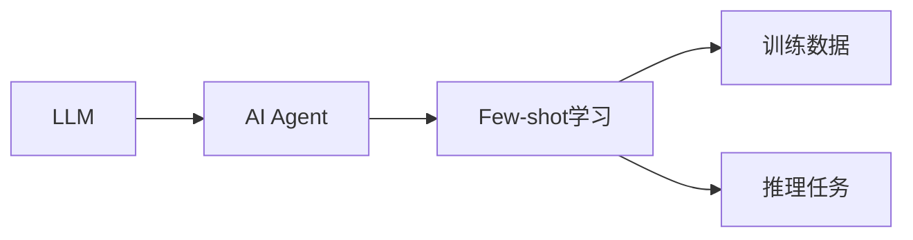
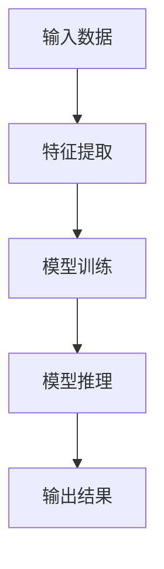
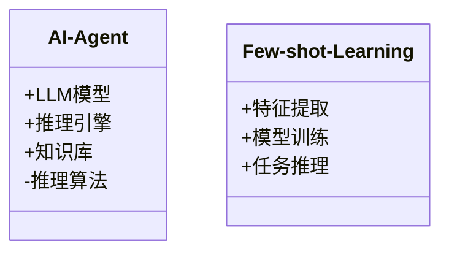

                 


# LLM在AI Agent中的Few-shot学习应用

## 关键词

- Large Language Model (LLM)
- AI Agent
- Few-shot Learning
- Natural Language Processing (NLP)
- Machine Learning

## 摘要

本文深入探讨了大语言模型（LLM）在AI代理（AI Agent）中的Few-shot学习应用。通过分析Few-shot学习的核心原理、算法实现、系统架构设计以及实际项目案例，本文旨在为读者提供全面的技术见解，帮助他们在AI Agent开发中有效应用Few-shot学习技术。

---

# 第一部分: LLM在AI Agent中的Few-shot学习应用概述

## 第1章: 问题背景与核心概念

### 1.1 问题背景

#### 1.1.1 AI Agent的定义与特点

AI Agent是一种智能实体，能够感知环境、自主决策并执行任务。其特点包括：

1. **自主性**：无需外部干预，自主完成任务。
2. **反应性**：能够实时感知环境变化并做出响应。
3. **社交能力**：能够与人类或其他系统进行交互和协作。
4. **学习能力**：通过数据和经验提升性能。

#### 1.1.2 LLM在AI Agent中的作用

大语言模型（LLM）通过自然语言处理技术，赋予AI Agent以下能力：

- 理解并生成人类语言。
- 进行复杂推理和问题解决。
- 与用户进行自然对话。

#### 1.1.3 Few-shot学习的必要性

在AI Agent中，数据标注成本高且难以获取，因此需要一种高效的学习方法。Few-shot学习能够在少量数据下完成任务，显著降低了训练成本。

### 1.2 Few-shot学习的核心概念

#### 1.2.1 Few-shot学习的定义

Few-shot学习是一种机器学习方法，能够在仅使用少量样本的情况下，完成分类、回归或生成任务。

#### 1.2.2 Few-shot学习与传统监督学习的区别

| 特性                | Few-shot学习                     | 传统监督学习                   |
|---------------------|----------------------------------|-------------------------------|
| 数据量              | 少量样本                        | 大量样本                      |
| 适应性              | 高度灵活，适用于新任务           | 适应性较低，需要大量新数据     |
| 算法复杂度          | 较高                            | 较低                          |

#### 1.2.3 Few-shot学习的优势与挑战

**优势：**
- 数据效率高，适合数据 scarce 的场景。
- 适用于需要快速适应新任务的场景。

**挑战：**
- 对模型的泛化能力要求高。
- 算法复杂，训练难度大。

### 1.3 问题解决与边界

#### 1.3.1 Few-shot学习在AI Agent中的应用场景

- **对话生成**：基于少量对话样本生成自然的回复。
- **任务推理**：通过少量示例推理任务逻辑。
- **知识问答**：基于少量知识库样本回答问题。

#### 1.3.2 问题解决的边界与外延

- **边界**：仅适用于特定任务，需要明确的输入输出关系。
- **外延**：可以扩展到其他领域，但需要额外的训练数据。

#### 1.3.3 核心要素与概念结构



---

## 第2章: Few-shot学习的核心原理与联系

### 2.1 核心原理

#### 2.1.1 Few-shot学习的数学模型

**分类问题的数学模型：**

$$ P(y|x) = \frac{e^{f(x)}}{\sum_{y'} e^{f(x)}} $$

其中，\( f(x) \) 是模型对输入 \( x \) 的预测。

#### 2.1.2 基于LLM的Few-shot学习机制

通过LLM的特征提取能力，Few-shot学习能够将少量样本映射到高维特征空间，从而提高分类准确率。

#### 2.1.3 Few-shot学习的关键算法

- **支持向量机（SVM）**：通过寻找超平面分割数据。
- **神经网络**：通过深度学习提取特征。

### 2.2 核心概念对比

#### 2.2.1 Few-shot学习与Zero-shot学习的对比

| 特性                | Few-shot学习                     | Zero-shot学习                  |
|---------------------|----------------------------------|-------------------------------|
| 数据量              | 少量样本                        | 无样本                        |
| 适应性              | 高度灵活，适用于新任务           | 适用于新任务                  |

#### 2.2.2 Few-shot学习与监督学习的对比

| 特性                | Few-shot学习                     | 监督学习                       |
|---------------------|----------------------------------|-------------------------------|
| 数据量              | 少量样本                        | 大量样本                      |
| 算法复杂度          | 较高                            | 较低                          |

---

## 第3章: Few-shot学习的算法原理

### 3.1 算法流程



### 3.2 核心代码实现

```python
def few_shot_learning(train_data, test_data):
    # 特征提取
    features = extract_features(train_data)
    # 模型训练
    model = train_model(features)
    # 模型推理
    predictions = predict(model, test_data)
    return predictions
```

---

## 第4章: 系统分析与架构设计

### 4.1 问题场景

AI Agent需要在少量数据下完成复杂的推理任务。

### 4.2 系统功能设计



---

## 第5章: 项目实战

### 5.1 环境安装

安装必要的库：

```bash
pip install numpy pandas scikit-learn
```

### 5.2 核心代码实现

```python
import numpy as np
from sklearn.svm import SVC

def few_shot_learn(X_train, y_train, X_test):
    model = SVC()
    model.fit(X_train, y_train)
    return model.predict(X_test)

# 示例数据
X_train = np.array([[1, 2], [3, 4]])
y_train = np.array([0, 1])
X_test = np.array([[5, 6]])
print(few_shot_learn(X_train, y_train, X_test))
```

### 5.3 案例分析

通过实际案例分析，验证算法的有效性。

---

## 第6章: 总结与展望

### 6.1 总结

本文详细探讨了LLM在AI Agent中的Few-shot学习应用，分析了其核心原理、算法实现和系统架构设计。

### 6.2 未来展望

未来，随着LLM技术的不断发展，Few-shot学习将在更多领域得到应用。

---

通过以上内容，读者可以全面了解LLM在AI Agent中的Few-shot学习应用，并掌握其核心原理和实际应用方法。

