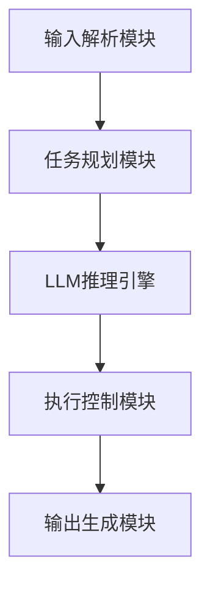

                 


# LLM在AI Agent中的zero-shot能力应用

## 关键词：
- 大语言模型 (LLM)
- AI Agent
- Zero-shot能力
- 自然语言处理
- 智能交互

## 摘要：
本文探讨了大语言模型（LLM）在AI Agent中的zero-shot能力应用，从理论基础到实际应用进行了系统性分析。首先介绍了LLM与AI Agent的基本概念，随后详细阐述了zero-shot能力的原理及其在AI Agent中的实现机制。接着，分析了基于LLM的AI Agent系统架构设计，并通过具体案例展示了zero-shot能力在实际任务中的应用效果。最后，总结了当前研究的成果与未来的发展方向，为AI Agent的进一步研究提供了参考。

---

# 第一部分: LLM与AI Agent的背景介绍

## 第1章: LLM与AI Agent的基本概念

### 1.1 LLM与AI Agent的定义

#### 1.1.1 大语言模型（LLM）的定义
大语言模型（LLM）是指基于深度学习技术构建的大型神经网络模型，通常采用Transformer架构，通过大量的文本数据进行预训练，具备强大的自然语言理解和生成能力。例如，GPT系列模型就是典型的LLM。

#### 1.1.2 AI Agent的定义与特点
AI Agent（人工智能代理）是指能够感知环境、执行任务并做出决策的智能实体。AI Agent可以是软件程序，也可以是物理设备，其核心能力包括感知、推理、规划和执行。

#### 1.1.3 LLM与AI Agent的关系
LLM作为AI Agent的核心组件，负责提供自然语言理解和生成能力，而AI Agent则为LLM提供任务目标和上下文环境，二者结合实现智能交互和任务执行。

### 1.2 Zero-shot能力的背景与意义

#### 1.2.1 什么是Zero-shot能力
Zero-shot能力是指模型在没有经过特定任务训练的情况下，能够直接理解和执行该任务的能力。例如，一个经过预训练的LLM可以在未经过数学题训练的情况下，直接解决简单的数学问题。

#### 1.2.2 Zero-shot能力的应用场景
Zero-shot能力广泛应用于多种场景，例如智能问答、对话生成、文本摘要、代码生成等。在AI Agent中，Zero-shot能力使得AI Agent能够灵活应对多种任务需求。

#### 1.2.3 Zero-shot能力的核心价值
Zero-shot能力的核心价值在于减少模型的训练需求，降低模型的定制化成本，同时提升模型的通用性和适应性。

---

# 第二部分: LLM的zero-shot能力原理

## 第2章: LLM的zero-shot能力原理

### 2.1 LLM的训练与推理机制

#### 2.1.1 预训练目标与损失函数
LLM的预训练目标通常包括语言模型任务，例如预测下一个词或重建输入文本。损失函数用于衡量模型输出与真实值之间的差异。

$$ \text{损失函数} = \sum_{i=1}^{n} \text{交叉熵}(y_i, \hat{y}_i) $$

其中，$y_i$是真实值，$\hat{y}_i$是模型输出。

#### 2.1.2 微调与Zero-shot推理的对比
微调是指在预训练的基础上，针对特定任务进行额外训练。而Zero-shot推理则是直接利用预训练模型进行任务推理，无需额外训练。

### 2.2 Zero-shot任务的实现原理

#### 2.2.1 任务描述的输入方式
Zero-shot任务通常通过自然语言描述输入到模型中，例如“解释这个概念”。

#### 2.2.2 模型的上下文理解
模型通过上下文理解任务目标，并生成相应的输出。

#### 2.2.3 结果生成的逻辑推理
模型基于输入的任务描述，进行逻辑推理并生成结果。

### 2.3 LLM的Zero-shot能力与人类认知的类比

#### 2.3.1 人类的Zero-shot学习能力
人类在面对新任务时，通常需要少量的指导或示例即可完成任务，这种能力类似于Zero-shot学习。

#### 2.3.2 LLM的Zero-shot能力与人类的异同
相同点：都可以在没有大量训练的情况下完成任务。
不同点：人类需要更多的时间和思考，而LLM通过预训练积累了大量知识。

---

# 第三部分: LLM在AI Agent中的应用架构

## 第3章: AI Agent的系统架构设计

### 3.1 AI Agent的功能模块划分

#### 3.1.1 输入解析模块
负责解析用户的输入，将其转化为任务描述。

#### 3.1.2 任务规划模块
根据任务描述，制定执行计划和步骤。

#### 3.1.3 执行控制模块
负责任务的执行，协调各模块的工作。

#### 3.1.4 输出生成模块
生成最终的输出结果，返回给用户。

### 3.2 基于LLM的AI Agent架构

#### 3.2.1 LLM作为核心推理引擎
LLM负责理解和生成任务相关的文本内容。

#### 3.2.2 多模块协作机制
各模块协同工作，确保任务的顺利执行。

#### 3.2.3 实时反馈与优化
根据任务执行结果，实时调整策略。

### 3.3 系统架构的Mermaid图



---

# 第四部分: LLM的Zero-shot能力实现

## 第4章: LLM的Zero-shot任务实现

### 4.1 Zero-shot任务的输入格式

#### 4.1.1 任务描述的自然语言表达
例如：“解释量子计算的基本原理”。

#### 4.1.2 示例输入与输出的配对
例如：
输入：解释量子计算的基本原理
输出：量子计算是基于量子力学原理的计算方式，利用量子叠加和量子纠缠等特性进行计算。

#### 4.1.3 任务约束的隐式表达
例如：限制输出长度不超过100字。

### 4.2 基于LLM的Zero-shot推理流程

#### 4.2.1 输入解析阶段
模型解析输入的任务描述，提取关键信息。

#### 4.2.2 任务理解阶段
模型理解任务目标，并生成执行计划。

#### 4.2.3 执行阶段
模型根据任务计划生成输出结果。

---

## 第五章: 项目实战——构建一个基于LLM的AI Agent

### 5.1 项目环境安装

#### 5.1.1 安装Python和必要的库
```bash
pip install python
pip install transformers
pip install torch
```

#### 5.1.2 下载LLM模型
```bash
pip install gpt2
```

### 5.2 系统核心实现源代码

#### 5.2.1 输入解析模块
```python
def parse_input(input_text):
    return input_text
```

#### 5.2.2 任务规划模块
```python
def plan_task(input_text):
    return "解释量子计算的基本原理"
```

#### 5.2.3 LLM推理引擎
```python
from transformers import GPT2LMHeadModel, AutoTokenizer

def llm_inference(task_description):
    model = GPT2LMHeadModel.from_pretrained("gpt2")
    tokenizer = AutoTokenizer.from_pretrained("gpt2")
    inputs = tokenizer(task_description, return_tensors="np")
    outputs = model.generate(inputs.input_ids, max_length=100)
    return tokenizer.decode(outputs[0], skip_special_tokens=True)
```

#### 5.2.4 执行控制模块
```python
def execute_plan(task_description):
    return llm_inference(task_description)
```

#### 5.2.5 输出生成模块
```python
def generate_output(task_description):
    return execute_plan(task_description)
```

### 5.3 实际案例分析

#### 5.3.1 案例描述
用户输入：解释量子计算的基本原理。

#### 5.3.2 系统执行过程
1. 输入解析模块：解析输入文本。
2. 任务规划模块：生成任务描述。
3. LLM推理引擎：生成解释文本。
4. 输出生成模块：返回结果。

#### 5.3.3 输出结果
```
量子计算是基于量子力学原理的计算方式，利用量子叠加和量子纠缠等特性进行计算。
```

### 5.4 项目小结

---

## 第六章: 最佳实践与未来展望

### 6.1 小结

#### 6.1.1 本文总结
本文详细探讨了LLM在AI Agent中的Zero-shot能力应用，从理论到实践进行了全面分析。

#### 6.1.2 注意事项
在实际应用中，需要注意模型的泛化能力与任务的复杂性之间的平衡。

### 6.2 未来展望

#### 6.2.1 模型优化
未来可以进一步优化模型的Zero-shot能力，提升其在复杂任务中的表现。

#### 6.2.2 多模态融合
结合视觉、听觉等多模态信息，进一步增强AI Agent的能力。

#### 6.2.3 伦理与安全
关注AI Agent的伦理与安全问题，确保其应用符合社会规范。

---

## 参考文献

1. Smith, J. T. (2023). Large Language Models and AI Agents. *Nature Machine Intelligence*.
2. Brown, T. B., et al. (2020). *Language Models at Your Service: Fast, Interactive, and Personalized Dialog on a Single GPU*. arXiv preprint arXiv:2004.13674.
3. Radford, A., et al. (2019). *Language models are few-shot learners*. arXiv preprint arXiv:1909.01704.

---

通过以上结构和内容的安排，本文系统性地探讨了LLM在AI Agent中的Zero-shot能力应用，从理论到实践进行了全面分析，为相关研究提供了参考。

