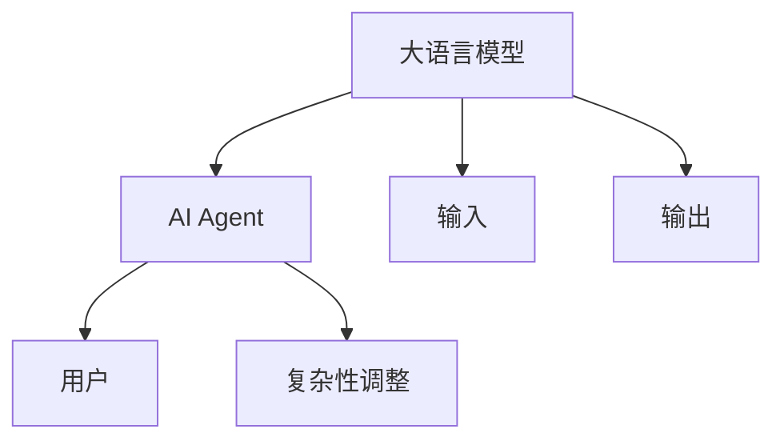
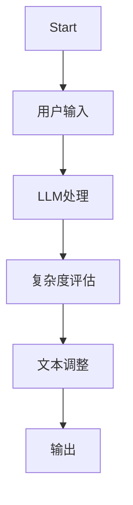
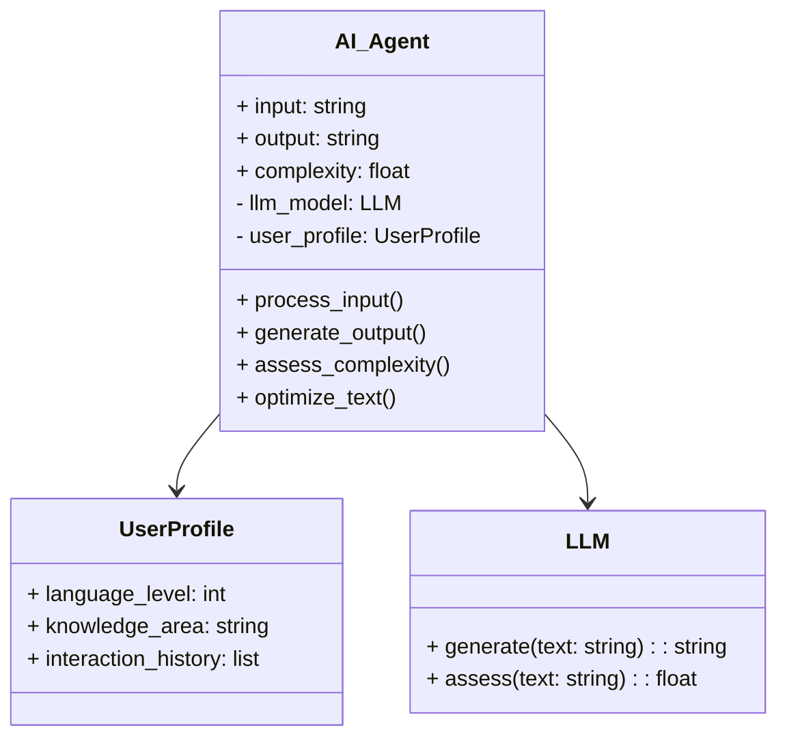
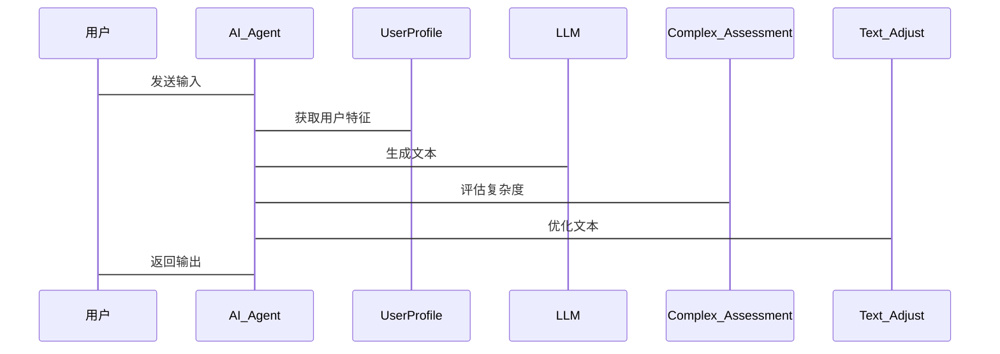

                 


# LLM在AI Agent中的文本复杂性调整能力

---

## 关键词：LLM, AI Agent, 文本复杂性, 自然语言处理, 智能交互

---

## 摘要

随着大语言模型（LLM）的快速发展，AI Agent在各个领域的应用越来越广泛。在AI Agent与用户的交互过程中，文本的复杂性调整能力至关重要。本文将从背景、原理、算法、系统架构、实战案例等多个维度，全面分析LLM在AI Agent中的文本复杂性调整能力。通过详细的技术解析和实际案例，本文旨在为读者提供一个清晰的思路，理解如何利用LLM实现文本复杂性调整，优化用户体验，提升系统性能。

---

## 目录

1. 背景介绍
   1.1 LLM与AI Agent的核心概念
   1.2 文本复杂性调整的背景与需求
   1.3 LLM在AI Agent中的应用场景

2. 核心概念与联系
   2.1 LLM的文本生成机制
   2.2 AI Agent的交互逻辑与功能模块
   2.3 LLM与AI Agent的实体关系图

3. 算法原理讲解
   3.1 文本复杂性调整的算法原理
   3.2 基于LLM的文本复杂性调整模型
   3.3 算法实现的数学模型与代码示例

4. 系统分析与架构设计
   4.1 问题场景与系统需求分析
   4.2 系统功能设计与模块划分
   4.3 系统架构设计与接口实现

5. 项目实战
   5.1 实战案例：AI客服中的文本复杂性调整
   5.2 系统实现与代码解读
   5.3 案例分析与优化建议

6. 最佳实践与总结
   6.1 LLM在文本复杂性调整中的应用经验
   6.2 系统优化与维护的注意事项
   6.3 未来发展方向与技术趋势

---

## 第一部分：背景介绍

### 1.1 LLM与AI Agent的核心概念

#### 1.1.1 大语言模型（LLM）的定义

大语言模型（LLM）是一种基于深度学习的自然语言处理模型，通过大量数据的训练，能够理解和生成人类语言。LLM的核心是其强大的文本生成和理解能力，这使得它在AI Agent中扮演重要角色。

#### 1.1.2 LLM的核心特点与优势

- **强大的语言理解能力**：LLM能够理解上下文，并生成连贯的文本。
- **动态适应性**：LLM可以根据输入调整输出，适应不同的场景和用户需求。
- **可扩展性**：LLM可以应用于多种场景，从客服到教育，从医疗到金融。

#### 1.1.3 LLM与传统NLP模型的区别

| 特性         | 传统NLP模型       | LLM                 |
|--------------|-------------------|---------------------|
| 模型复杂度    | 较低              | 极高                |
| 数据需求     | 较小              | 需要大量数据         |
| 生成能力     | 较弱              | 强大                |
| 上下文理解    | 有限              | 强大                |

### 1.2 AI Agent的基本概念与功能

#### 1.2.1 AI Agent的定义与分类

AI Agent是一种智能体，能够感知环境并采取行动以实现目标。根据功能和应用场景，AI Agent可以分为以下几类：

- **简单规则型AI Agent**：基于预设规则进行决策。
- **基于模型的AI Agent**：利用模型模拟环境并做出决策。
- **基于学习的AI Agent**：通过机器学习算法不断优化决策。

#### 1.2.2 AI Agent的核心功能与应用场景

- **信息处理**：解析用户输入并生成响应。
- **任务执行**：根据用户需求完成特定任务。
- **动态交互**：与用户进行多轮对话，保持交互流畅性。

#### 1.2.3 LLM与AI Agent的结合

LLM为AI Agent提供了强大的语言理解和生成能力，使其能够更好地理解用户需求并生成自然的响应。这种结合使得AI Agent在复杂场景下的交互更加智能化和人性化。

### 1.3 LLM在AI Agent中的应用场景

#### 1.3.1 客服系统中的文本复杂性调整

在客服系统中，AI Agent需要根据用户的问题复杂性调整回答的复杂度。例如，对于技术专家，可以提供详细的技术说明；对于普通用户，可以简化语言，确保信息清晰易懂。

#### 1.3.2 教育领域的文本复杂性调整

在教育领域，AI Agent可以根据学生的知识水平调整教学内容的复杂度。例如，对于初级学生，提供简单易懂的解释；对于高级学生，提供深度分析。

#### 1.3.3 金融领域的文本复杂性调整

在金融领域，AI Agent需要根据用户的风险承受能力和投资经验，调整金融产品说明的复杂度。例如，为普通投资者提供简化的投资建议，为专业投资者提供详细的市场分析。

---

## 第二部分：核心概念与联系

### 2.1 LLM的文本生成机制

#### 2.1.1 基于概率的生成模型

LLM的文本生成过程基于概率模型。模型通过计算每个词的条件概率，生成最可能的下一个词。这种生成方式使得文本既连贯又自然。

#### 2.1.2 解码器结构与文本生成过程

LLM的解码器结构通常采用自注意力机制，能够捕捉文本中的长距离依赖关系。生成过程包括以下步骤：

1. 输入序列编码。
2. 解码器生成初始隐藏状态。
3. 根据上下文生成每个词的概率分布。
4. 选择概率最高的词作为输出。

#### 2.1.3 LLM的上下文理解能力

LLM能够理解上下文信息，包括句法、语义和语境。这种理解能力使得生成的文本不仅语法正确，而且语义连贯。

### 2.2 AI Agent的交互逻辑与功能模块

#### 2.2.1 AI Agent的核心功能模块

- **输入解析模块**：解析用户的输入并提取关键信息。
- **文本生成模块**：根据输入生成响应文本。
- **复杂性调整模块**：根据用户特征调整文本复杂度。
- **反馈优化模块**：根据用户反馈优化生成内容。

#### 2.2.2 LLM在AI Agent中的功能模块

- **语言理解模块**：基于LLM的自然语言理解能力。
- **生成优化模块**：基于LLM的文本生成能力。
- **复杂性调整模块**：动态调整文本的复杂度。

#### 2.2.3 LLM与AI Agent的关系

LLM为AI Agent提供了强大的语言理解和生成能力，而AI Agent则为LLM提供了一个应用场景，使其能够更好地服务于用户需求。

### 2.3 LLM与AI Agent的实体关系图



---

## 第三部分：算法原理讲解

### 3.1 文本复杂性调整的算法原理

#### 3.1.1 文本复杂性调整的核心思想

文本复杂性调整的核心思想是根据用户特征和场景需求，动态调整生成文本的复杂度。这种调整可以通过以下步骤实现：

1. 用户特征分析：分析用户的语言习惯、知识水平和场景需求。
2. 文本生成：根据用户特征生成初步文本。
3. 复杂度评估：评估生成文本的复杂度。
4. 文本优化：根据评估结果优化文本复杂度。

#### 3.1.2 基于LLM的文本复杂性调整模型

以下是一个基于LLM的文本复杂性调整模型的Mermaid流程图：



#### 3.1.3 算法实现的数学模型与公式

文本复杂度评估的一个常用指标是困惑度（Perplexity），其公式如下：

$$
\text{Perplexity} = -\frac{1}{N}\sum_{i=1}^{N}\log P(x_i)
$$

其中，\(P(x_i)\)是第i个词的概率，\(N\)是词的总数。

---

## 第四部分：系统分析与架构设计

### 4.1 问题场景与系统需求分析

#### 4.1.1 问题场景介绍

在客服系统中，AI Agent需要根据用户的问题复杂性动态调整回答的复杂度。例如，对于技术专家，回答可以包含技术术语；对于普通用户，回答需要简单易懂。

#### 4.1.2 系统需求分析

- **动态调整**：根据用户特征动态调整文本复杂度。
- **实时交互**：支持多轮对话，保持交互流畅性。
- **可扩展性**：支持多种场景和用户特征。

### 4.2 系统功能设计与模块划分

#### 4.2.1 系统功能设计

- **用户特征分析**：分析用户的语言习惯、知识水平和场景需求。
- **文本生成**：根据用户特征生成初步文本。
- **复杂度评估**：评估生成文本的复杂度。
- **文本优化**：根据评估结果优化文本复杂度。

#### 4.2.2 系统模块划分

- **输入模块**：接收用户输入。
- **处理模块**：处理用户输入并生成响应。
- **评估模块**：评估生成文本的复杂度。
- **优化模块**：优化生成文本的复杂度。

#### 4.2.3 系统功能的Mermaid类图



### 4.3 系统架构设计与接口实现

#### 4.3.1 系统架构设计

系统架构采用分层架构，包括数据层、业务逻辑层和用户界面层。

- **数据层**：存储用户特征和历史记录。
- **业务逻辑层**：处理用户输入并生成响应。
- **用户界面层**：与用户交互并展示结果。

#### 4.3.2 系统接口设计

- **输入接口**：接收用户输入。
- **输出接口**：展示生成的文本。
- **评估接口**：评估生成文本的复杂度。

#### 4.3.3 系统交互的Mermaid序列图



---

## 第五部分：项目实战

### 5.1 实战案例：AI客服中的文本复杂性调整

#### 5.1.1 实战背景

在AI客服系统中，用户的问题复杂性差异很大。例如，普通用户可能只需要简单的操作指导，而技术专家可能需要详细的代码解释。

#### 5.1.2 系统实现与代码解读

以下是AI Agent的核心代码实现：

```python
class AI_Agent:
    def __init__(self, llm_model, user_profile):
        self.llm_model = llm_model
        self.user_profile = user_profile
        self.complexity_threshold = 0.6

    def process_input(self, input_text):
        user_features = self.user_profile.get_features()
        generated_text = self.llm_model.generate(input_text)
        complexity_score = self.assess_complexity(generated_text)
        if complexity_score > self.complexity_threshold:
            adjusted_text = self.optimize_text(generated_text)
        else:
            adjusted_text = generated_text
        return adjusted_text

    def assess_complexity(self, text):
        # 简单实现，可以根据词数和句子长度计算复杂度
        word_count = len(text.split())
        sentence_count = len(text.split('.'))
        complexity_score = (word_count + sentence_count) / 100
        return complexity_score

    def optimize_text(self, text):
        # 简单实现，可以对文本进行简化
        simplified_text = text.replace('复杂', '简单')
        return simplified_text
```

#### 5.1.3 案例分析与优化建议

在AI客服系统中，文本复杂性调整的关键在于准确评估生成文本的复杂度，并根据用户特征进行优化。优化建议包括：

- **动态调整阈值**：根据用户特征动态调整复杂度评估阈值。
- **多维度评估**：结合词汇难度和句法复杂度进行综合评估。
- **用户反馈优化**：根据用户反馈进一步优化生成文本。

---

## 第六部分：最佳实践与总结

### 6.1 LLM在文本复杂性调整中的应用经验

- **动态调整**：根据用户特征动态调整文本复杂度。
- **多维度评估**：结合词汇难度和句法复杂度进行综合评估。
- **用户反馈优化**：根据用户反馈进一步优化生成文本。

### 6.2 系统优化与维护的注意事项

- **数据质量**：确保用户特征数据的准确性和完整性。
- **模型更新**：定期更新LLM模型，保持生成能力。
- **系统监控**：实时监控系统性能，及时发现并解决问题。

### 6.3 未来发展方向与技术趋势

- **多模态优化**：结合视觉、听觉等多种模态信息，进一步提升文本复杂性调整的精准度。
- **自适应学习**：通过自适应学习算法，进一步优化文本复杂性调整的效果。
- **人机协作**：探索人机协作模式，提升用户体验和系统性能。

---

## 结语

LLM在AI Agent中的文本复杂性调整能力是一个复杂而重要的问题。通过本文的详细分析，我们了解了如何利用LLM实现文本复杂性调整，优化用户体验，提升系统性能。未来，随着技术的不断进步，LLM在AI Agent中的应用将更加广泛和深入，为人类带来更加智能化和个性化的服务。

---

