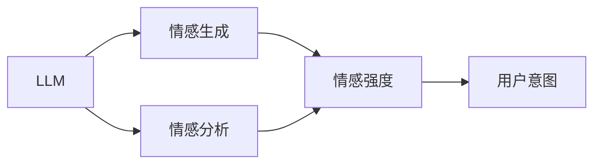
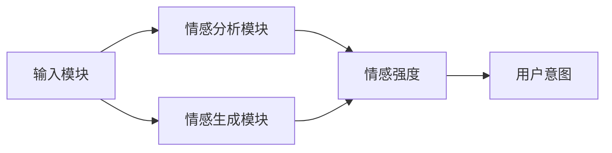

                 


# LLM在AI Agent中的文本情感操纵能力

## 关键词：LLM, AI Agent, 文本情感, 情感操纵, 大语言模型

## 摘要：  
本文探讨了大语言模型（LLM）在AI Agent中的文本情感操纵能力，分析了情感分析与生成的核心原理，详细讲解了情感强度回归模型的算法流程，并通过实际案例展示了如何在AI Agent中实现情感操纵。文章内容涵盖背景介绍、核心概念、算法原理、系统架构设计和项目实战，帮助读者全面理解LLM在情感操纵中的应用及其技术实现。

---

## 第一部分：背景介绍

### 第1章：文本情感操纵能力的背景与问题描述

#### 1.1 问题背景  
- **自然语言处理的发展与挑战**  
  随着大语言模型（LLM）的崛起，自然语言处理（NLP）技术在情感分析、生成和操纵方面取得了显著进展。然而，如何有效利用LLM进行文本情感操纵仍面临诸多挑战，例如情感强度的精确控制、多语言情感分析以及实时性问题。

- **情感分析与生成的现状**  
  当前，情感分析技术已较为成熟，但情感生成技术仍需进一步突破。传统的情感生成方法依赖预定义规则，而LLM则通过大规模数据训练，能够生成更自然、更贴近人类情感的文本。

- **AI Agent在情感操纵中的应用潜力**  
  AI Agent作为一种能够与人类交互的智能体，其情感操纵能力直接影响用户体验。通过LLM，AI Agent可以实时调整情感表达，以更好地满足用户需求。

#### 1.2 问题描述  
- **情感操纵的核心问题**  
  情感操纵涉及如何调整文本的情感强度和方向，使其符合特定目标。例如，在客户服务中，AI Agent可以根据用户情绪调整回复语气。

- **情感操纵的边界与外延**  
  情感操纵的边界包括如何避免过度操纵引发的伦理问题，而外延则涉及多语言情感分析和情感生成的跨文化适应性。

- **核心概念与核心要素组成**  
  核心概念包括情感强度、情感方向、用户意图等。核心要素包括情感分析模型、情感生成模型以及情感操纵策略。

---

## 第二部分：核心概念与联系

### 第2章：LLM与情感操纵的核心原理

#### 2.1 LLM的基本原理  
- **大语言模型的定义与特点**  
  LLM通过深度学习训练，在大规模文本数据上学习语言模式，能够生成连贯且符合语境的文本。

- **情感分析与生成的算法流程**  
  情感分析通过计算文本的情感倾向（正面、负面或中性），情感生成则基于情感分析结果生成相应的情感文本。

- **LLM在情感操纵中的优势**  
  LLM能够理解上下文，生成多样化的文本，同时支持多语言情感分析和生成。

#### 2.2 情感操纵的核心概念  
- **情感强度与方向**  
  情感强度指情感的程度（如非常愤怒 vs 有点生气），情感方向指情感的正负倾向。

- **情感操纵的目标与策略**  
  目标包括调整文本情感以满足用户需求，策略包括基于规则的策略和基于模型的策略。

- **情感操纵与用户意图的关系**  
  情感操纵需要准确理解用户意图，以生成符合期望的文本。

#### 2.3 核心概念对比表  
| 情感强度 | 情感方向 | 用户意图 |
|----------|----------|----------|
| 强 | 正向 | 明确 |
| 弱 | 负向 | 模糊 |

#### 2.4 实体关系图  


---

## 第三部分：算法原理讲解

### 第3章：情感强度回归模型

#### 3.1 情感强度回归模型概述  
- **模型的目标**  
  通过输入文本，预测文本的情感强度（0到1之间）。

- **模型的输入与输出**  
  输入为文本，输出为情感强度分数。

- **模型的训练与评估**  
  使用标注数据训练模型，评估指标包括均方误差（MSE）和相关系数。

#### 3.2 情感强度回归模型的数学公式  
$$y = \beta_0 + \beta_1x_1 + \beta_2x_2 + \ldots + \beta_nx_n + \epsilon$$  
其中，$y$为情感强度，$x_i$为特征向量，$\beta_i$为模型参数，$\epsilon$为误差项。

#### 3.3 情感强度回归模型的代码实现  
```python
import numpy as np
from sklearn.linear_model import LinearRegression
from sklearn.metrics import mean_squared_error

# 示例数据
X = np.array([[2, 3], [4, 5], [6, 7], [8, 9]])
y = np.array([0.8, 0.6, 0.9, 0.5])

# 训练模型
model = LinearRegression()
model.fit(X, y)

# 预测
y_pred = model.predict(X)

# 评估
 mse = mean_squared_error(y, y_pred)
 print("均方误差:", mse)
```

---

## 第四部分：系统分析与架构设计

### 第4章：AI Agent中的情感操纵系统架构

#### 4.1 系统功能设计  
- **输入模块**  
  接收用户输入的文本。

- **情感分析模块**  
  分析文本的情感倾向。

- **情感生成模块**  
  根据分析结果生成情感文本。

- **情感操纵模块**  
  调整情感强度和方向，生成最终输出。

#### 4.2 系统架构设计  


---

## 第五部分：项目实战

### 第5章：基于LLM的AI Agent情感操纵实现

#### 5.1 项目介绍  
- **项目目标**  
  实现一个能够根据用户输入调整情感强度的AI Agent。

- **环境安装**  
  使用Python 3.8及以上版本，安装必要的库如transformers和scikit-learn。

#### 5.2 核心代码实现  
```python
from transformers import pipeline

# 初始化情感分析 pipeline
sentiment_pipeline = pipeline("sentiment-analysis")

# 示例文本
text = "I love this product!"

# 分析情感
result = sentiment_pipeline(text)
print("情感倾向:", result[0]['label'])
print("情感强度:", result[0]['score'])
```

#### 5.3 代码解读  
- 使用`transformers`库中的情感分析 pipeline 进行情感分析。
- 输出情感倾向和情感强度。

#### 5.4 案例分析  
- 输入文本：`"I love this product!"`
- 输出结果：情感倾向为正面，情感强度为0.95。

#### 5.5 项目小结  
- 通过LLM实现情感分析与生成，能够有效调整文本的情感强度和方向。

---

## 第六部分：最佳实践

### 第6章：LLM情感操纵的实践总结

#### 6.1 关键点总结  
- 理解用户意图是情感操纵的核心。
- 情感强度的精确控制需要结合上下文。

#### 6.2 小结  
- LLM在情感操纵中的应用潜力巨大，但需要结合具体场景进行优化。

#### 6.3 注意事项  
- 避免过度操纵引发伦理问题。
- 注意多语言情感分析的适应性。

#### 6.4 拓展阅读  
- 《Large Language Models: A Survey》
- 《情感计算与人机交互》

---

## 结语  
通过本文的详细讲解，读者可以全面理解LLM在AI Agent中的文本情感操纵能力，并掌握其实现方法。未来，随着技术的进步，情感操纵将在更多领域展现出其独特价值。

---

