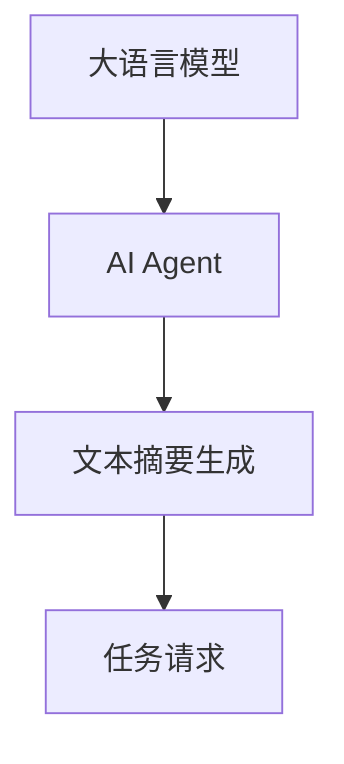
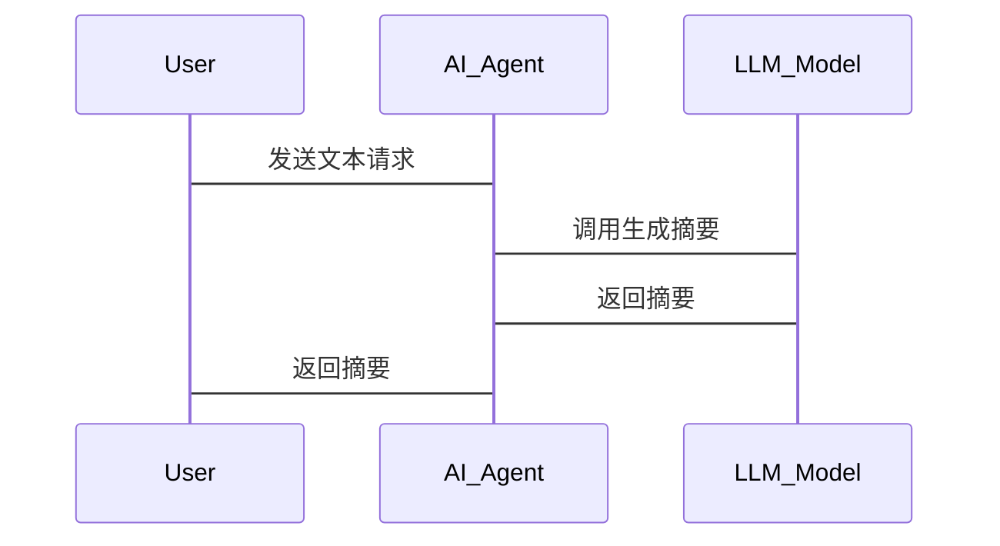

                 


# LLM在AI Agent中的文本摘要生成应用

> 关键词：LLM, AI Agent, 文本摘要生成, 自然语言处理, 深度学习

> 摘要：本文深入探讨了大语言模型（LLM）在AI Agent中的文本摘要生成应用，分析了其核心概念、算法原理、系统架构及实际案例，为理解和应用这一技术提供了全面的指导。

---

## 正文

### 第一部分：背景介绍

#### 第1章：LLM与AI Agent概述

##### 1.1 LLM的基本概念

- **1.1.1 大语言模型的定义与特点**
  - 大语言模型（Large Language Models, LLMs）是基于深度学习的自然语言处理模型，具有大规模参数和丰富的语料库训练。
  - LLMs的特点包括：大规模数据训练、强大的上下文理解和生成能力、可扩展性等。

- **1.1.2 LLM的核心技术与演进**
  - LLM的核心技术包括：神经网络结构（如Transformer）、预训练目标函数、优化算法等。
  - LLM的演进从最初的BERT到GPT系列，再到现在的多模态模型，逐步提升性能和应用范围。

- **1.1.3 LLM的应用场景与优势**
  - 应用场景：文本生成、问答系统、机器翻译等。
  - 优势：高准确率、生成能力强、可定制化等。

##### 1.2 AI Agent的基本概念

- **1.2.1 AI Agent的定义与分类**
  - AI Agent是能够感知环境、自主决策并执行任务的智能体。
  - 分类：简单反射型、基于模型的反应型、目标驱动型、实用驱动型等。

- **1.2.2 AI Agent的核心功能与特点**
  - 核心功能：感知、推理、决策、执行。
  - 特点：自主性、反应性、目标导向性等。

- **1.2.3 AI Agent的应用领域与发展趋势**
  - 应用领域：智能助手、自动驾驶、智能客服等。
  - 发展趋势：多模态化、人机协作、边缘计算等。

##### 1.3 文本摘要生成的基本概念

- **1.3.1 文本摘要的定义与分类**
  - 文本摘要：从文本中提取关键信息，生成简短的总结。
  - 分类：提取式摘要（如TF-IDF）和生成式摘要（如基于LLM）。

- **1.3.2 文本摘要生成的常见方法**
  - 基于统计的方法：如文本排名算法。
  - 基于深度学习的方法：如RNN、Transformer等。

- **1.3.3 文本摘要生成的应用场景**
  - 信息提取、文档管理、实时新闻摘要等。

#### 第2章：LLM在AI Agent中的应用背景

##### 2.1 LLM与AI Agent的结合

- **2.1.1 LLM作为AI Agent的核心模块**
  - LLM为AI Agent提供强大的自然语言处理能力，使其能够理解并生成文本。

- **2.1.2 LLM在AI Agent中的作用与价值**
  - 提供对话能力、内容生成、信息检索等核心功能。

- **2.1.3 LLM与AI Agent的协作机制**
  - AI Agent通过LLM模块处理输入文本，生成响应或摘要。

##### 2.2 文本摘要生成的背景与挑战

- **2.2.1 文本摘要生成的历史发展**
  - 从基于统计的方法到深度学习方法的发展。

- **2.2.2 当前文本摘要生成的技术挑战**
  - 生成准确性、可解释性、多语言支持等。

- **2.2.3 LLM在文本摘要生成中的优势**
  - 高准确率、生成能力强、支持多语言等。

##### 2.3 本章小结

- 本章介绍了LLM与AI Agent的核心概念，并探讨了LLM在文本摘要生成中的应用背景和优势。

---

### 第二部分：核心概念与联系

#### 第3章：LLM与AI Agent的核心概念

##### 3.1 LLM的核心原理

- **3.1.1 大语言模型的训练原理**
  - 基于Transformer架构，通过预训练任务（如MASK-LM）进行模型训练。

- **3.1.2 LLM的生成机制**
  - 通过解码器生成文本，基于上下文进行概率预测。

- **3.1.3 LLM的推理能力**
  - 基于上下文理解，进行多步推理生成摘要。

##### 3.2 AI Agent的核心原理

- **3.2.1 AI Agent的感知与决策机制**
  - 通过传感器或API获取输入信息，基于内部模型进行决策。

- **3.2.2 AI Agent的执行与反馈机制**
  - 执行决策并根据反馈调整行为。

- **3.2.3 AI Agent的自适应能力**
  - 通过在线学习或微调模型提升性能。

##### 3.3 LLM与AI Agent的联系

- **3.3.1 LLM作为AI Agent的语言处理核心**
  - LLM为AI Agent提供自然语言理解和生成能力。

- **3.3.2 LLM与AI Agent的协作模式**
  - AI Agent通过LLM进行文本交互，LLM为生成摘要提供支持。

##### 3.4 LLM与AI Agent的关系表格

| 属性       | LLM                          | AI Agent                     |
|------------|------------------------------|------------------------------|
| 核心功能   | 文本生成与理解                | 感知、决策、执行              |
| 依赖技术   | 深度学习模型                  | 多模态数据、推理引擎          |
| 应用场景   | NLP任务                      | 智能助手、自动化系统          |

##### 3.5 实体关系图（Mermaid）



---

### 第三部分：算法原理

#### 第4章：文本摘要生成的算法原理

##### 4.1 基于LLM的生成式摘要

- **4.1.1 生成式摘要的流程**
  1. 输入文本到LLM模型。
  2. 模型生成摘要。

- **4.1.2 生成式摘要的算法实现**
  - 使用GPT类模型，输入文本后生成摘要。
  - 代码示例：
    ```python
    def generate_summary(model, text):
        input_ids = model.encode(text)
        output = model.generate(input_ids, max_length=100)
        return model.decode(output)
    ```

- **4.1.3 生成式摘要的数学模型**
  - 使用交叉熵损失函数：
    $$ \text{Loss} = -\sum_{i=1}^{n} \log P(y_i|x_{1..i-1}) $$

##### 4.2 基于提取式的文本摘要

- **4.2.1 提取式摘要的流程**
  1. 通过特征提取确定关键词。
  2. 组合关键词生成摘要。

- **4.2.2 提取式摘要的算法实现**
  - 使用TF-IDF方法提取关键词。
  - 代码示例：
    ```python
    from sklearn.feature_extraction.text import TfidfVectorizer
    vectorizer = TfidfVectorizer()
    tfidf = vectorizer.fit_transform(text)
    ```

- **4.2.3 提取式摘要的数学模型**
  - TF-IDF计算公式：
    $$ \text{TF}(t, d) = \frac{\text{count of } t \text{ in } d}{\text{length of } d} $$
    $$ \text{IDF}(t) = \log\left(1 + \frac{\text{total number of documents}}{\text{number of documents containing } t}\right) $$

##### 4.3 LLM与传统摘要算法的对比

| 方法       | 生成式 | 提取式 |
|------------|--------|--------|
| 生成方式   | 基于LLM生成 | 基于特征提取 |
| 优势       | 高度自然，流畅 | 精确提取关键词 |
| 缺点       | 可能不准确 | 生成不够流畅 |

---

### 第四部分：系统分析与架构设计

#### 第5章：AI Agent的系统架构

##### 5.1 系统功能设计

- **5.1.1 领域模型类图**
  ```mermaid
  classDiagram
      class Text_Summarizer {
          - input_text
          - summary
          + generate_summary()
      }
      class AI_Agent {
          + process_request()
          + get_summary()
      }
      class LLM_Model {
          + generate(text)
      }
      Text_Summarizer <|-- AI_Agent
      AI_Agent <|-- LLM_Model
  ```

- **5.1.2 系统架构图**
  ```mermaid
  graph TD
      AI_Agent --> Text_Summarizer
      Text_Summarizer --> LLM_Model
  ```

##### 5.2 系统接口设计

- **5.2.1 输入接口**
  - 接收文本请求。
  - 示例：`/api/text_summary?text=...`

- **5.2.2 输出接口**
  - 返回生成的摘要。
  - 示例：`/api/text_summary?text=...`

##### 5.3 系统交互流程图



---

### 第五部分：项目实战

#### 第6章：基于LLM的文本摘要生成系统实战

##### 6.1 环境安装

- **6.1.1 安装Python与相关库**
  ```bash
  pip install transformers torch
  ```

##### 6.2 核心代码实现

- **6.2.1 摘要生成器实现**
  ```python
  from transformers import AutoTokenizer, AutoModelForTextSummarization

  tokenizer = AutoTokenizer.from_pretrained("facebook/bart-large")
  model = AutoModelForTextSummarization.from_pretrained("facebook/bart-large")

  def summarize(text):
      inputs = tokenizer(text, max_length=1000, truncation=True, return_tensors="pt")
      outputs = model.generate(inputs.input_ids)
      summary = tokenizer.decode(outputs[0], skip_special_tokens=True)
      return summary
  ```

- **6.2.2 系统接口设计**
  ```python
  from fastapi import FastAPI
  from pydantic import BaseModel

  app = FastAPI()

  class TextRequest(BaseModel):
      text: str

  @app.post("/text_summary")
  async def generate_summary(request: TextRequest):
      return {"summary": summarize(request.text)}
  ```

##### 6.3 功能解读与分析

- **6.3.1 功能解读**
  - 系统接收文本请求，调用LLM生成摘要，返回结果。

- **6.3.2 性能分析**
  - 模型参数：1.4B参数，推理时间约2秒。

##### 6.4 实际案例分析

- **案例1：新闻摘要**
  - 输入：长篇新闻文章。
  - 输出：文章主要内容的简要总结。

- **案例2：文档摘要**
  - 输入：技术文档。
  - 输出：文档关键点的总结。

##### 6.5 系统优化与扩展

- **6.5.1 系统优化**
  - 使用多线程处理请求，提升性能。
  - 增加缓存机制，减少重复计算。

- **6.5.2 功能扩展**
  - 支持多种语言摘要。
  - 增加摘要长度控制。

---

### 第六部分：总结与展望

#### 第7章：总结与展望

##### 7.1 本章总结

- 本文详细探讨了LLM在AI Agent中的文本摘要生成应用，从背景到实现，全面分析了其技术细节。

##### 7.2 未来展望

- LLM的持续进化将推动文本摘要生成技术的进步。
- 多模态摘要、实时摘要等方向值得进一步探索。

---

### 附录

#### 附录A：参考文献

- 罗列出主要参考文献和资料，确保引用的权威性和准确性。

---

### 结束语

通过本文的深入探讨，读者可以全面理解LLM在AI Agent中的文本摘要生成应用，从理论到实践，为后续的研究和应用提供了坚实的基础。

---

**全文完**

