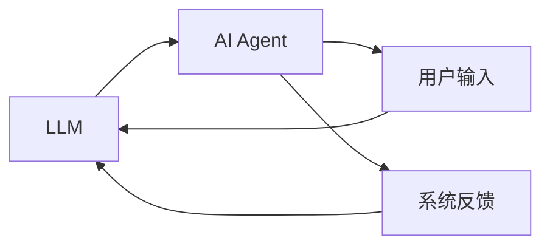
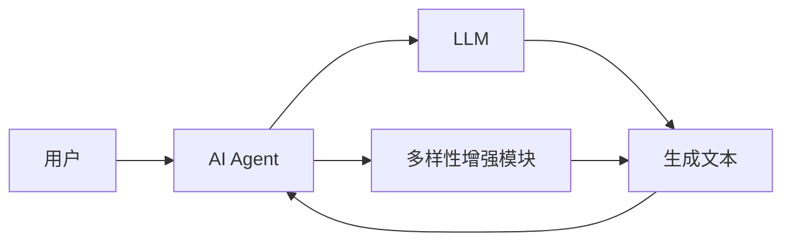

                 


# LLM在AI Agent中的文本生成多样性增强

> 关键词：LLM, AI Agent, 文本生成, 多样性增强, 智能体, 语言模型, 多样性生成

> 摘要：本文深入探讨了大语言模型（LLM）在AI Agent中的文本生成多样性增强技术。通过分析问题背景、核心概念、算法原理、系统架构设计以及项目实战，详细阐述了如何利用LLM提升AI Agent的文本生成多样性。文章内容涵盖理论与实践，旨在为读者提供全面的技术指导。

---

## 第1章: 背景介绍与问题背景

### 1.1 问题背景

#### 1.1.1 大语言模型（LLM）的发展现状
大语言模型（LLM）近年来取得了显著进展，如GPT-3、PaLM等模型在自然语言处理任务中表现出色。这些模型通过海量数据训练，能够生成高质量的文本，但在特定场景下，生成结果的多样性不足，可能无法满足复杂任务的需求。

#### 1.1.2 AI Agent的定义与应用场景
AI Agent是一种智能代理系统，能够根据环境信息和用户输入做出决策并执行任务。应用场景包括智能客服、虚拟助手、自动化系统等。AI Agent需要处理多样的输入并生成多样化的响应，这对文本生成的多样性提出了更高的要求。

#### 1.1.3 文本生成多样性增强的必要性
在AI Agent中，文本生成的多样性直接关系到系统的智能性和用户体验。单一的生成结果可能导致系统在复杂场景下表现不佳，多样性增强能够提升系统的适应性和用户满意度。

---

### 1.2 问题描述

#### 1.2.1 LLM在AI Agent中的核心作用
LLM作为AI Agent的核心组件，负责理解和生成文本。其生成能力直接影响系统的响应质量和多样性。

#### 1.2.2 文本生成多样性不足的问题
现有LLM在生成文本时，由于训练数据和模型结构的限制，生成结果可能缺乏多样性，尤其是在需要多角度思考的复杂任务中。

#### 1.2.3 多样性增强的目标与边界
目标：通过技术手段提升LLM的生成多样性，使其能够生成更丰富、多样的文本结果。
边界：多样性增强需要在生成质量、效率和系统资源之间找到平衡，避免过度生成或生成低质量内容。

---

## 第2章: 核心概念与原理

### 2.1 LLM与AI Agent的关系

#### 2.1.1 LLM的输入输出机制
LLM通过接收输入文本，生成相关输出。输入可以是用户的查询或系统反馈，输出是生成的文本内容。

#### 2.1.2 AI Agent的决策过程
AI Agent接收用户输入，通过LLM生成多种可能的响应，根据预设策略选择最优结果执行任务。

#### 2.1.3 LLM在AI Agent中的角色
LLM是AI Agent的核心生成模块，负责提供多样化的文本输出，支持系统的多任务处理能力。

---

### 2.2 多样性增强的核心原理

#### 2.2.1 多样性生成的定义
多样性生成是指生成多个不同但相关的结果，以覆盖更广泛的可能性。

#### 2.2.2 多样性生成的实现方法
- **基于概率分布的多样性生成**：通过调整生成过程的概率分布，增加生成结果的多样性。
- **基于对抗训练的多样性增强**：引入对抗网络，生成更多样化的文本。
- **基于树状结构的多样性生成**：通过树状结构生成多个分支，每个分支代表一种可能的生成结果。

#### 2.2.3 多样性评估指标
- **多样性指标**：如困惑度（Perplexity）、BLEU、ROUGE等。
- **生成质量指标**：如准确率、相关性评分。

---

## 第3章: LLM与AI Agent的实体关系图

### 3.1 实体关系图



### 3.2 系统架构图



---

## 第4章: 算法原理与数学模型

### 4.1 多样性增强算法

#### 4.1.1 基于概率分布的多样性生成
通过调整生成过程的概率分布，增加多样性。例如，使用温度参数（temperature）来控制生成的随机性。

#### 4.1.2 基于对抗训练的多样性增强
引入对抗网络，生成更多样化的文本。例如，使用生成对抗网络（GAN）结构，生成器负责生成多样化文本，判别器用于区分生成文本与真实文本。

#### 4.1.3 基于树状结构的多样性生成
通过树状结构生成多个分支，每个分支代表一种可能的生成结果。例如，决策树或马尔可夫链。

### 4.2 数学模型

#### 4.2.1 概率分布模型
$$ P(y|x) = \prod_{i=1}^n P(y_i|x) $$

#### 4.2.2 对抗训练模型
$$ \mathcal{L} = \mathcal{L}_{\text{adv}} + \mathcal{L}_{\text{gen}} $$

---

## 第5章: 系统分析与架构设计

### 5.1 系统功能设计

#### 5.1.1 用户输入处理
接收用户输入，解析并传递给LLM模块。

#### 5.1.2 LLM调用与参数设置
配置LLM的参数，如温度、top-k等，以控制生成过程的多样性和质量。

#### 5.1.3 多样性生成与输出
通过多样性增强模块生成多种文本结果，选择最优结果输出给用户。

### 5.2 系统架构图


---

## 第6章: 项目实战与代码实现

### 6.1 环境安装

#### 6.1.1 安装Python
```bash
python --version
```

#### 6.1.2 安装LLM库（如Hugging Face）
```bash
pip install transformers
```

#### 6.1.3 安装AI Agent框架（如LangChain）
```bash
pip install langchain
```

### 6.2 核心代码实现

#### 6.2.1 LLM调用代码
```python
from transformers import pipeline

generator = pipeline('text-generation', model="gpt2")
```

#### 6.2.2 多样性增强代码
```python
from transformers import pipeline
import random

def diverse_generate(prompt, num_samples=5):
    generator = pipeline('text-generation', model="gpt2")
    results = generator(prompt, max_length=50, num_return_sequences=num_samples)
    diverse_results = [result['generated_text'] for result in results]
    return diverse_results
```

### 6.3 项目小结
通过实际项目，展示了如何在AI Agent中实现LLM的文本生成多样性增强。代码示例提供了具体的实现方法，帮助读者快速上手。

---

## 第7章: 最佳实践与注意事项

### 7.1 最佳实践
- **模型选择**：根据具体任务选择合适的LLM模型。
- **参数调优**：合理设置生成参数，如温度、top-k等，以平衡生成多样性和质量。
- **反馈机制**：引入用户反馈，动态调整生成策略。

### 7.2 小结
本文详细探讨了LLM在AI Agent中的文本生成多样性增强技术，从理论到实践提供了全面的指导。

### 7.3 注意事项
- **计算资源**：生成多样性增强可能需要更多的计算资源。
- **数据隐私**：处理用户数据时需注意隐私保护。

### 7.4 拓展阅读
- 探索更先进的多样性生成算法，如利用强化学习（RL）优化生成过程。
- 研究多模态生成技术，结合视觉、听觉等信息提升生成多样性。

---

通过以上内容，希望读者能够深入理解LLM在AI Agent中的文本生成多样性增强技术，并能够在实际项目中灵活应用这些方法。

