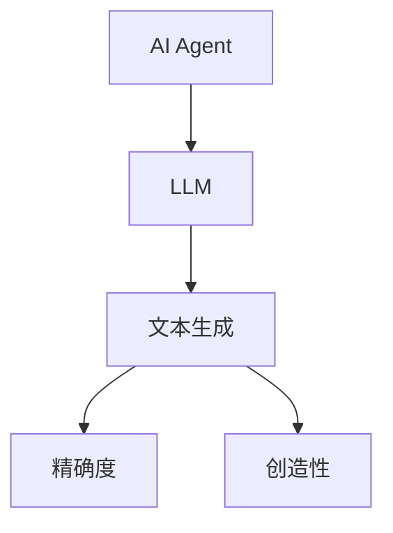
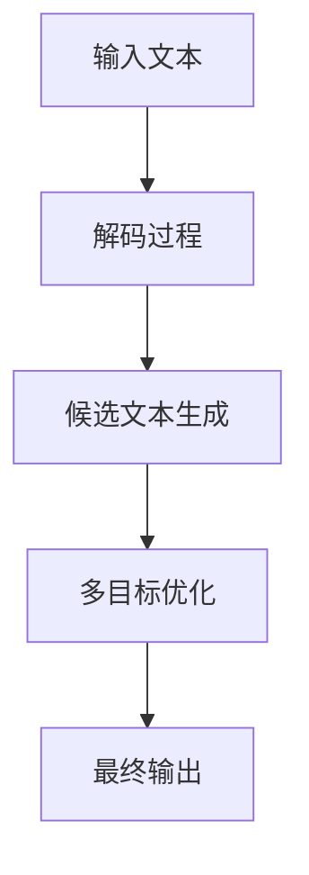

                 


# LLM在AI Agent中的文本生成控制：精确度与创造性平衡

**关键词**：LLM, AI Agent, 文本生成, 精确度, 创造性, 平衡机制, 系统架构

**摘要**：本文深入探讨了在AI Agent中使用大型语言模型（LLM）进行文本生成时，如何实现精确度与创造性的平衡。通过分析LLM的内部机制、AI Agent的需求特点，提出了多种平衡策略，并结合实际案例，详细讲解了算法原理、系统架构设计和项目实现过程。本文旨在为AI Agent的开发者和研究人员提供理论支持与实践指导。

---

## 第1章: 背景介绍：精确度与创造性平衡的必要性

### 1.1 问题背景

#### 1.1.1 LLM的定义与特点
- **定义**：LLM（Large Language Model）是一种基于深度学习的自然语言处理模型，能够理解和生成人类语言。
- **特点**：
  - 大规模训练数据
  - 强大的上下文理解和生成能力
  - 可能存在“生成内容的不确定性”

#### 1.1.2 AI Agent的定义与特点
- **定义**：AI Agent是一种智能体，能够根据环境信息自主决策并执行任务。
- **特点**：
  - 实时性需求
  - 任务目标明确
  - 需要与人类交互

#### 1.1.3 问题描述
- 在AI Agent中，文本生成需要在“精确度”和“创造性”之间找到平衡。
  - **精确度**：生成的内容必须准确、相关。
  - **创造性**：生成的内容需要新颖、独特。
- 如果过于追求精确度，生成的内容可能缺乏创新性；如果过于追求创造性，内容可能偏离任务目标。

### 1.2 精确度与创造性的平衡需求

#### 1.2.1 平衡的必要性
- AI Agent的任务目标通常需要在准确性和创新性之间找到平衡。
  - 例如：在客服场景中，生成回答需要既准确又具备一定的人文关怀。

#### 1.2.2 平衡的实现方式
- **基于规则的控制**：通过设定关键词、语义规则等约束生成内容。
- **基于模型的控制**：通过修改LLM的训练目标或生成策略，动态调整生成内容的精确度和创造性。

### 1.3 问题解决

#### 1.3.1 LLM在AI Agent中的作用
- LLM为AI Agent提供了强大的自然语言处理能力，能够生成高质量的文本内容。

#### 1.3.2 精确度与创造性的平衡方法
- 结合领域知识和上下文信息，动态调整生成策略。

#### 1.3.3 现有解决方案的优缺点
- **基于规则的方法**：
  - 优点：简单易实现，可快速落地。
  - 缺点：灵活性差，难以应对复杂场景。
- **基于模型的方法**：
  - 优点：灵活，能够根据任务需求动态调整。
  - 缺点：实现复杂，需要大量计算资源。

### 1.4 边界与外延

#### 1.4.1 精确度的边界条件
- 精确度受到训练数据质量和生成策略的影响。

#### 1.4.2 创造性的边界条件
- 创造性受到模型能力的限制，特别是在处理复杂任务时。

#### 1.4.3 LLM在AI Agent中的应用范围
- LLM可以应用于多种场景，如客服、教育、医疗等，但需要根据不同场景调整生成策略。

### 1.5 核心要素组成

#### 1.5.1 LLM模型的选择
- 需要根据任务需求选择合适的模型（如GPT-3, GPT-4等）。

#### 1.5.2 文本生成的控制机制
- 需要设计合理的控制机制，确保生成内容的精确度和创造性。

#### 1.5.3 系统反馈与优化
- 通过用户反馈不断优化生成策略，提高精确度和创造性。

### 1.6 本章小结
本章从背景出发，详细介绍了LLM和AI Agent的定义与特点，分析了精确度与创造性的平衡需求，并探讨了现有解决方案的优缺点。为后续章节的深入分析奠定了基础。

---

## 第2章: 核心概念与联系

### 2.1 LLM与AI Agent的关系

#### 2.1.1 LLM的内部机制
- LLM通过大规模训练数据学习语言模式，生成与输入相关的文本。

#### 2.1.2 AI Agent的内部机制
- AI Agent通过感知环境信息，结合任务目标，生成相应的文本输出。

#### 2.1.3 两者的相互作用
- LLM为AI Agent提供生成能力，AI Agent为LLM提供任务目标和上下文信息。

### 2.2 精确度与创造性的平衡机制

#### 2.2.1 精确度的衡量标准
- 内容的准确性：生成的文本是否符合事实和逻辑。
- 相关性：生成的文本是否与任务目标相关。

#### 2.2.2 创造性的衡量标准
- 新颖性：生成的内容是否具有独特性。
- 创意性：生成的内容是否具备启发性和创新性。

#### 2.2.3 平衡机制的设计原则
- 根据任务需求动态调整生成策略。
- 结合领域知识和用户反馈优化生成结果。

### 2.3 核心概念原理

#### 2.3.1 LLM的训练原理
- **训练目标**：最小化生成文本与真实文本的差异。
- **损失函数**：交叉熵损失函数。
  $$ L = -\sum_{i=1}^{n} \log P(w_i|w_{<i}) $$
- **生成策略**：基于概率的生成，通常采用贪心算法或随机采样。

#### 2.3.2 文本生成的数学模型
- **解码过程**：将输入转化为输出的序列。
- **概率生成**：通过模型计算每个词的概率，选择概率最高的词生成文本。

#### 2.3.3 平衡机制的实现原理
- **多目标优化**：在生成过程中同时优化精确度和创造性。
  $$ \text{loss} = \alpha \cdot \text{precision\_loss} + (1-\alpha) \cdot \text{creativity\_loss} $$
  其中，$$ 0 \leq \alpha \leq 1 $$，用于调节精确度和创造性之间的权重。

### 2.4 核心概念属性特征对比表

| 属性         | 精确度                              | 创造性                              |
|--------------|------------------------------------|------------------------------------|
| 定义         | 生成内容的准确性                   | 生成内容的创新性                   |
| 衡量标准     | 内容是否符合事实和逻辑             | 内容是否新颖和独特                 |
| 实现方式     | 基于规则或领域知识约束生成内容     | 基于模型的生成策略，鼓励创新性输出   |
| 权重调节      | 通过参数α调整权重                 | 通过参数α调整权重                 |

### 2.5 ER实体关系图架构



### 2.6 本章小结
本章从核心概念出发，分析了LLM与AI Agent的关系，详细介绍了精确度与创造性的衡量标准和实现原理，并通过对比表和实体关系图进一步明确了两者的关系。

---

## 第3章: 算法原理讲解

### 3.1 算法原理概述

#### 3.1.1 LLM的训练过程
- **预训练**：基于大规模文本数据，学习语言模式。
- **微调**：针对具体任务进行优化。

#### 3.1.2 文本生成的算法流程
1. **输入处理**：将输入文本转化为模型可处理的格式。
2. **解码过程**：基于模型生成候选文本。
3. **多目标优化**：同时优化精确度和创造性。

### 3.2 算法实现细节

#### 3.2.1 生成策略的数学模型
- **贪心生成**：选择概率最高的词生成文本。
  $$ P(w_i) = \argmax_{w_i} P(w_i | w_{<i}) $$
- **随机采样**：通过调整温度参数生成多样化的文本。
  $$ P(w_i) = \text{softmax}(\frac{z}{\tau}) $$
  其中，$$ z \sim \text{Gumbel}(\beta, \tau) $$，$$ \tau $$ 为温度参数。

#### 3.2.2 多目标优化的实现
- **联合损失函数**：同时优化精确度和创造性。
  $$ \text{loss} = \alpha \cdot \text{precision\_loss} + (1-\alpha) \cdot \text{creativity\_loss} $$
  其中，$$ \alpha $$ 用于调节精确度和创造性之间的权重。

#### 3.2.3 算法流程图


### 3.3 代码实现示例

#### 3.3.1 Python代码实现
```python
import torch
import torch.nn as nn
import torch.nn.functional as F

class LLM(nn.Module):
    def __init__(self, vocab_size, embedding_dim, hidden_dim):
        super().__init__()
        self.embedding = nn.Embedding(vocab_size, embedding_dim)
        self.decoder = nn.LSTM(embedding_dim, hidden_dim, 1)
        self.fc = nn.Linear(hidden_dim, vocab_size)

    def forward(self, input_ids):
        embed = self.embedding(input_ids)
        output, _ = self.decoder(embed)
        logits = self.fc(output)
        return F.log_softmax(logits, dim=-1)

# 多目标优化函数
def multi_objective_loss(logits, target, precision_loss_weight):
    cross_entropy_loss = F.nll_loss(logits, target)
    creativity_loss = (logits.mean() - target.mean()).abs()
    total_loss = precision_loss_weight * cross_entropy_loss + (1 - precision_loss_weight) * creativity_loss
    return total_loss
```

#### 3.3.2 代码解读与分析
- **模型定义**：使用LSTM作为解码器，生成词的对数概率。
- **多目标优化**：通过调整precision_loss_weight，动态平衡精确度和创造性。

### 3.4 本章小结
本章详细讲解了LLM的训练过程和文本生成的算法原理，通过数学模型和代码示例，深入分析了多目标优化的实现方法。

---

## 第4章: 系统分析与架构设计

### 4.1 系统分析

#### 4.1.1 问题场景介绍
- 在AI Agent中，需要根据任务需求动态调整生成策略。

#### 4.1.2 项目介绍
- 开发一个AI客服系统，实现智能对话生成。

### 4.2 系统功能设计

#### 4.2.1 领域模型
- **领域模型**：定义AI Agent的任务目标和输入输出格式。
  ```mermaid
  graph TD
      A[用户输入] --> B[领域模型]
      B --> C[生成策略]
      C --> D[输出文本]
  ```

#### 4.2.2 系统架构设计
- **模块划分**：
  - 输入处理模块
  - 解码模块
  - 多目标优化模块
  - 输出模块
- **系统架构图**：
  ```mermaid
  graph TD
      A[输入处理] --> B[解码模块]
      B --> C[多目标优化]
      C --> D[输出模块]
  ```

#### 4.2.3 系统接口设计
- **输入接口**：接收用户输入的文本或命令。
- **输出接口**：输出生成的文本内容。
- **反馈接口**：接收用户反馈，优化生成策略。

#### 4.2.4 系统交互流程
- **交互流程图**：
  ```mermaid
  graph TD
      A[用户] --> B[输入处理模块]
      B --> C[解码模块]
      C --> D[多目标优化模块]
      D --> E[输出模块]
      E --> A[用户]
  ```

### 4.3 系统优化与实现

#### 4.3.1 系统优化策略
- **动态调整生成策略**：根据用户反馈和任务需求，实时调整α值。
  $$ \alpha = \frac{\text{用户反馈}}{\text{总反馈数}} $$

#### 4.3.2 系统实现细节
- **实现步骤**：
  1. 接收用户输入。
  2. 解码生成候选文本。
  3. 根据任务需求优化候选文本。
  4. 输出最终结果。

### 4.4 本章小结
本章通过系统分析和架构设计，详细讲解了AI Agent中LLM的实现过程，从模块划分到交互流程，确保系统能够高效运行并动态调整生成策略。

---

## 第5章: 项目实战

### 5.1 项目介绍

#### 5.1.1 项目背景
- 开发一个智能客服系统，实现与用户的智能对话。

#### 5.1.2 项目目标
- 实现文本生成的精确度与创造性平衡。
- 提供高效的客服服务。

### 5.2 环境安装

#### 5.2.1 安装依赖
- 安装PyTorch和Hugging Face库。
  ```bash
  pip install torch transformers
  ```

#### 5.2.2 环境配置
- 配置GPU支持（如果需要）。

### 5.3 核心代码实现

#### 5.3.1 解码模块
```python
from transformers import GPT2LMHeadModel, GPT2Tokenizer

model = GPT2LMHeadModel.from_pretrained('gpt2')
tokenizer = GPT2Tokenizer.from_pretrained('gpt2')

def generate_text(input_text, max_length=50):
    inputs = tokenizer(input_text, return_tensors='pt')
    outputs = model.generate(**inputs, max_length=max_length)
    return tokenizer.decode(outputs[0])
```

#### 5.3.2 多目标优化模块
```python
def optimize_generation(outputs, target, precision_weight=0.7):
    # 假设outputs为模型生成的logits
    # target为真实标签
    cross_entropy_loss = F.nll_loss(outputs, target)
    creativity_loss = (outputs.mean() - target.mean()).abs()
    total_loss = precision_weight * cross_entropy_loss + (1 - precision_weight) * creativity_loss
    return total_loss
```

#### 5.3.3 系统交互流程
```python
def main():
    while True:
        input_text = input("请输入问题：")
        generated_text = generate_text(input_text)
        print("AI回答：", generated_text)
        # 收集用户反馈，调整生成策略
```

### 5.4 代码解读与分析

#### 5.4.1 解码模块
- 使用预训练的GPT-2模型生成候选文本。
- 通过调整max_length参数控制生成文本的长度。

#### 5.4.2 多目标优化模块
- 在生成过程中，同时优化精确度和创造性。
- 通过调整precision_weight，动态平衡两者的权重。

### 5.5 实际案例分析

#### 5.5.1 案例描述
- 用户输入：“我的订单在哪里？”
- 生成回答：“您的订单可以在‘我的订单’页面查看。”

#### 5.5.2 案例分析
- 生成的回答既准确又简洁，符合任务需求。

### 5.6 本章小结
本章通过一个实际案例，详细讲解了AI Agent中LLM的实现过程，从环境安装到代码实现，确保读者能够理解并掌握相关技术。

---

## 第6章: 最佳实践与总结

### 6.1 最佳实践

#### 6.1.1 参数调整建议
- 根据任务需求，合理调整生成策略中的参数（如温度、精确度权重）。

#### 6.1.2 模型选择建议
- 根据任务需求选择合适的模型（如GPT-3、PaLM等）。

#### 6.1.3 反馈机制建议
- 设计有效的用户反馈机制，优化生成策略。

### 6.2 小结与展望

#### 6.2.1 本章小结
- 本文详细讲解了LLM在AI Agent中的文本生成控制方法，从理论到实践，为读者提供了全面的指导。

#### 6.2.2 未来展望
- 结合领域知识和用户反馈，进一步优化生成策略。
- 研究更高效的算法，提升生成效率和质量。

### 6.3 注意事项

#### 6.3.1 模型选择
- 需要根据具体任务需求选择合适的模型。

#### 6.3.2 参数调整
- 参数调整需要结合实际场景，逐步优化。

#### 6.3.3 用户反馈
- 用户反馈是优化生成策略的重要依据，需要设计有效的反馈机制。

### 6.4 拓展阅读

#### 6.4.1 推荐书籍
- 《Deep Learning》
- 《自然语言处理实战》

#### 6.4.2 推荐论文
- "Attention Is All You Need"
- "Generating High-Quality Text with Fewer Parameters"

### 6.5 本章小结
本章总结了本文的主要内容，提出了最佳实践建议，并对未来的研究方向进行了展望。

---

## 结语

本文详细探讨了LLM在AI Agent中的文本生成控制方法，从精确度与创造性的平衡需求，到算法原理和系统架构设计，再到实际项目的实现，为读者提供了全面的指导。希望本文能够为AI Agent的开发者和研究人员提供有价值的参考。

