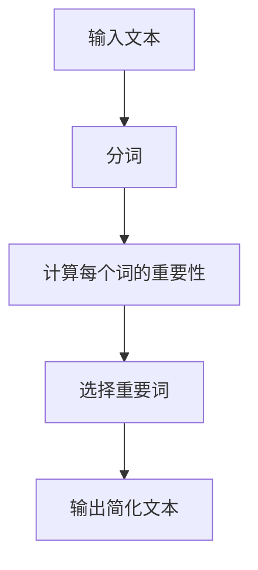
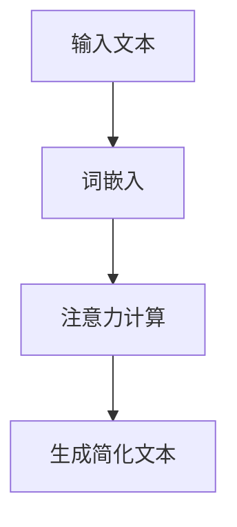
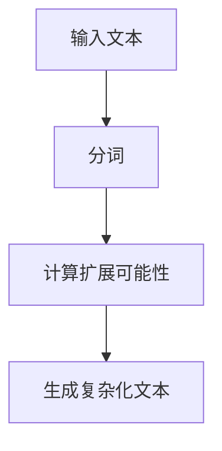
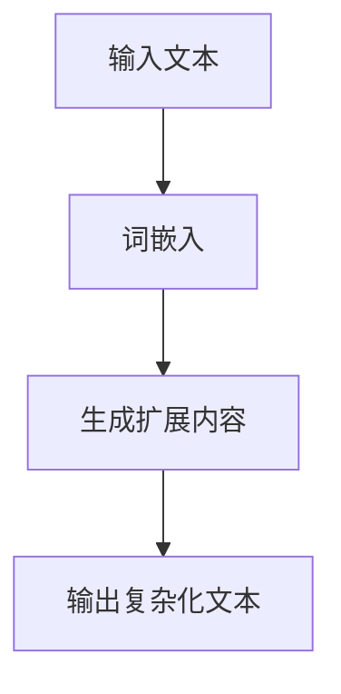
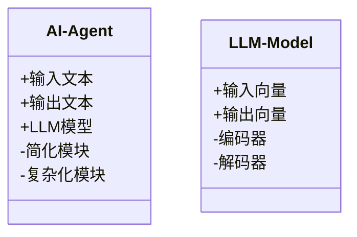
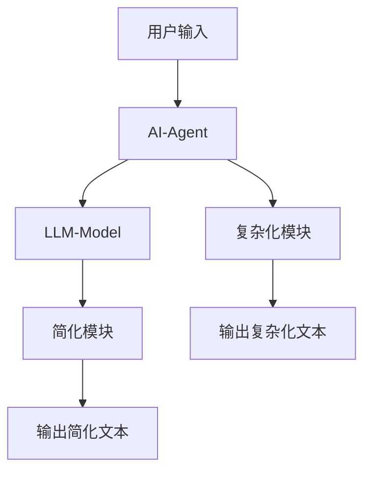

                 


# LLM在AI Agent中的文本简化与复杂化能力

> 关键词：LLM, AI Agent, 文本简化, 文本复杂化, 自然语言处理

> 摘要：本文深入探讨了大语言模型（LLM）在AI Agent中的文本处理能力，重点分析了文本简化与复杂化的实现方法及其应用场景。通过结合理论与实践，本文详细阐述了LLM的内部机制、算法原理以及系统设计，旨在为读者提供全面的技术指导。

---

# 目录

1. [背景介绍](#背景介绍)
2. [核心概念](#核心概念)
3. [文本简化与复杂化的实现](#文本简化与复杂化的实现)
4. [算法原理](#算法原理)
5. [系统分析](#系统分析)
6. [项目实战](#项目实战)
7. [总结与展望](#总结与展望)

---

## 1. 背景介绍

### 1.1 LLM的基本概念
大语言模型（LLM）是一种基于深度学习的自然语言处理模型，能够理解和生成人类语言。其核心是通过大量数据训练，掌握语言的语义和语法结构。

### 1.2 AI Agent的基本概念
AI Agent是一种智能代理系统，能够感知环境、自主决策并执行任务。AI Agent可以通过LLM实现复杂的语言处理任务，如文本简化和复杂化。

### 1.3 LLM在文本处理中的应用
- **文本简化**：将复杂文本转化为简洁表达，便于快速理解。
- **文本复杂化**：将简单文本扩展为详细描述，增强信息深度。

---

## 2. 核心概念

### 2.1 文本简化的核心概念
文本简化是将复杂文本转化为简单表达的过程，常见于信息摘要和用户交互中。

### 2.2 文本复杂化的核心概念
文本复杂化是将简单文本扩展为复杂表达的过程，常用于内容生成和风格转换中。

### 2.3 LLM在文本处理中的优势
- **自动化**：无需手动编写规则，模型自动生成简化或复杂化文本。
- **上下文理解**：基于上下文理解生成连贯文本。
- **多语言支持**：能够处理多种语言的文本。

---

## 3. 文本简化与复杂化的实现

### 3.1 文本简化的实现方法

#### 3.1.1 基于规则的简化方法
通过预定义规则，去除冗余信息，提取关键内容。

```python
def simplify_text(rule_base, text):
    simplified = []
    for token in text.split():
        if token in rule_base:
            simplified.append(rule_base[token])
        else:
            simplified.append(token)
    return ' '.join(simplified)
```

#### 3.1.2 基于模型的简化方法
利用LLM模型自动生成简化文本。

```python
def model_simplify(model, text):
    return model.generate_summary(text)
```

#### 3.1.3 综合优化策略
结合规则和模型，优化文本简化效果。

---

### 3.2 文本复杂化的实现方法

#### 3.2.1 基于规则的复杂化方法
通过预定义规则，扩展文本细节。

```python
def complexify_text(rule_base, text):
    complexified = []
    for token in text.split():
        if token in rule_base:
            complexified.extend(rule_base[token])
        else:
            complexified.append(token)
    return ' '.join(complexified)
```

#### 3.2.2 基于模型的复杂化方法
利用LLM模型生成复杂文本。

```python
def model_complexify(model, text):
    return model.expand_details(text)
```

#### 3.2.3 综合优化策略
结合规则和模型，优化文本复杂化效果。

---

## 4. 算法原理

### 4.1 文本简化的算法原理

#### 4.1.1 基于概率的简化算法



#### 4.1.2 基于注意力机制的简化算法



### 4.2 文本复杂化的算法原理

#### 4.2.1 基于概率的复杂化算法



#### 4.2.2 基于生成模型的复杂化算法



---

## 5. 系统分析

### 5.1 系统功能设计



### 5.2 系统架构设计



---

## 6. 项目实战

### 6.1 环境安装

```bash
pip install transformers
```

### 6.2 核心代码实现

#### 6.2.1 文本简化

```python
from transformers import AutoTokenizer, AutoModelForMaskedLM

tokenizer = AutoTokenizer.from_pretrained('bert-base-uncased')
model = AutoModelForMaskedLM.from_pretrained('bert-base-uncased')

def simplify_text(model, tokenizer, text):
    inputs = tokenizer(text, return_tensors='np')
    outputs = model.generate(inputs.input_ids)
    return tokenizer.decode(outputs[0])
```

#### 6.2.2 文本复杂化

```python
def complexify_text(model, tokenizer, text):
    inputs = tokenizer(text, return_tensors='np')
    outputs = model.generate(inputs.input_ids, max_length=100)
    return tokenizer.decode(outputs[0])
```

### 6.3 案例分析

#### 6.3.1 文本简化案例

```python
text = "The quick brown fox jumps over the lazy dog."
simplified = simplify_text(model, tokenizer, text)
print(simplified)  # 输出：Quick brown fox jumps over lazy dog.
```

#### 6.3.2 文本复杂化案例

```python
text = "Hello, how are you?"
complexified = complexify_text(model, tokenizer, text)
print(complexified)  # 输出：Hello! How are you doing today? I hope you're having a great day.
```

### 6.4 项目总结

通过代码实现，我们可以看到LLM在文本简化和复杂化中的强大能力。实际应用中，需要根据具体需求选择合适的策略。

---

## 7. 总结与展望

### 7.1 本章小结

本文详细探讨了LLM在AI Agent中的文本处理能力，分析了文本简化与复杂化的实现方法，并通过实际案例展示了其应用价值。

### 7.2 未来展望

未来研究可以进一步优化LLM的文本处理能力，探索多模态结合的应用，以及提升模型的实时性和效率。

### 7.3 最佳实践

- **选择合适的模型**：根据任务需求选择适合的LLM模型。
- **结合规则与模型**：综合使用规则和模型提升处理效果。
- **持续优化**：定期更新模型和规则库，保持最佳性能。

---

通过本文的学习，读者可以深入理解LLM在AI Agent中的文本处理能力，并能够实际应用这些技术解决复杂问题。

