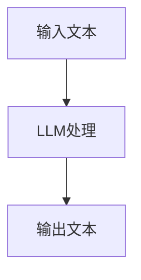
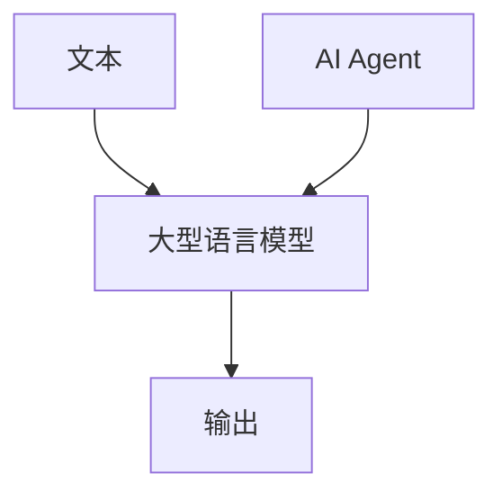
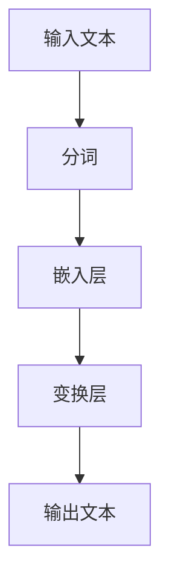
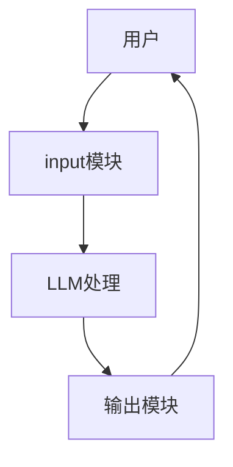
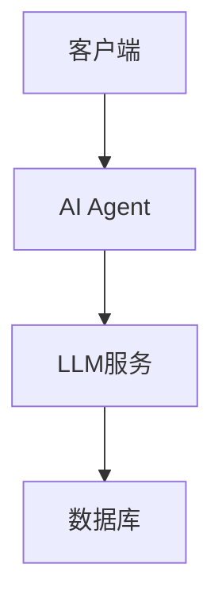
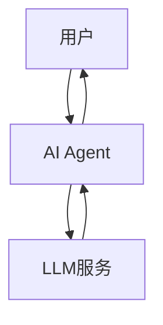

                 


# LLM在AI Agent中的文本纠错与改写应用

> 关键词：LLM, AI Agent, 文本纠错, 文本改写, 自然语言处理

> 摘要：本文详细探讨了大型语言模型（LLM）在AI Agent中的文本纠错与改写应用。通过分析LLM的核心原理、文本处理机制、系统架构设计以及实际应用场景，本文为读者提供了一个全面的技术视角，帮助理解如何利用LLM提升AI Agent的文本处理能力。

---

# 第1章: 背景介绍

## 1.1 问题背景与描述

### 1.1.1 文本纠错与改写的必要性
在现代社会中，文本处理是一项基本需求。无论是电子邮件、社交媒体还是专业文档，文本的准确性和流畅性都至关重要。然而，由于人类语言的复杂性和多样性，文本中常常会出现拼写错误、语法错误以及表达不清晰的问题。这些问题不仅会影响文本的可读性，还可能导致误解或错误决策。因此，文本纠错与改写的需求日益增长。

此外，在AI Agent的应用场景中，文本处理能力是其智能化水平的重要体现。AI Agent需要能够理解用户的输入、纠正其中的错误，并生成更流畅、更准确的文本输出。这种能力不仅提升了用户体验，还增强了AI Agent的实用性。

### 1.1.2 LLM与AI Agent的核心概念
- **LLM（Large Language Model）**：大型语言模型是一种基于深度学习的自然语言处理模型，能够理解和生成人类语言。LLM通过大量数据的训练，掌握了语言的规律和语义，能够在多种任务中表现出色。
- **AI Agent（人工智能代理）**：AI Agent是一种能够感知环境、执行任务并提供服务的智能系统。它通常具备自主决策、问题解决和与用户交互的能力。

### 1.1.3 LLM与AI Agent的结合
LLM为AI Agent提供了强大的文本处理能力，使其能够执行文本纠错、文本改写、内容生成等任务。AI Agent则为LLM提供了一个智能化的应用平台，使其能够与用户交互并解决实际问题。

## 1.2 核心概念与联系
### 1.2.1 LLM的输入输出模型
LLM的输入可以是任意文本，输出则是经过处理后的文本。这种输入输出模型使得LLM能够灵活地应用于多种场景。

### 1.2.2 AI Agent的系统架构
AI Agent通常由感知层、决策层和执行层组成。感知层负责获取输入，决策层基于LLM进行文本处理，执行层则将结果反馈给用户。

### 1.2.3 LLM与AI Agent的结合方式
- **直接集成**：AI Agent直接调用LLM API，进行文本纠错与改写。
- **协作处理**：AI Agent与LLM协同工作，结合其他模块（如知识库、推理引擎）提供更复杂的文本处理能力。

## 1.3 问题解决与边界
### 1.3.1 LLM在文本纠错中的问题解决
LLM能够检测文本中的拼写错误、语法错误，并提供修正建议。

### 1.3.2 LLM在文本改写中的边界与限制
- **改写目标**：文本改写需要明确的目标，如改善流畅性、增强可读性或调整语气。
- **改写范围**：LLM的改写能力受限于其训练数据和模型架构。

### 1.3.3 AI Agent在文本处理中的应用范围
AI Agent可以应用于多种场景，如自动回复、智能客服、内容生成等。

## 1.4 核心概念结构与要素
### 1.4.1 LLM的输入输出模型
LLM的输入是文本，输出也是文本，这种简单的模型结构使其具有广泛的应用潜力。

### 1.4.2 AI Agent的系统架构
AI Agent的系统架构包括感知层、决策层和执行层，各层之间通过接口进行交互。

### 1.4.3 文本纠错与改写的流程图


---

# 第2章: LLM的文本纠错与改写原理

## 2.1 LLM的文本处理机制
### 2.1.1 基于上下文的理解
LLM通过分析文本的上下文，理解语义并生成合理的输出。

### 2.1.2 基于概率的语言模型
LLM通过概率分布预测下一个词，生成最可能的文本输出。

### 2.1.3 基于生成的文本改写
LLM通过生成新文本实现改写，生成过程中考虑文本的流畅性和相关性。

## 2.2 文本纠错的实现原理
### 2.2.1 错误检测与识别
LLM通过分析文本中的语法、拼写和语义错误，识别需要纠正的部分。

### 2.2.2 错误类型分类
错误类型包括拼写错误、语法错误、用词不当等，LLM能够对这些错误进行分类。

### 2.2.3 错误修正的生成过程
LLM生成修正后的文本，确保文本的准确性和流畅性。

## 2.3 文本改写的实现机制
### 2.3.1 改写目标的设定
文本改写的目标可以是改善流畅性、增强可读性或调整语气。

### 2.3.2 文本风格的调整
LLM可以根据用户需求调整文本风格，如正式、口语化或简洁。

### 2.3.3 内容优化的实现
LLM通过生成新内容优化文本，确保内容的准确性和相关性。

---

## 2.4 错误检测与改写的对比分析
下表对比了LLM与传统NLP方法在文本纠错与改写中的优缺点。

| 特性               | LLM方法       | 传统NLP方法   |
|--------------------|---------------|---------------|
| **准确性**         | 高            | 中            |
| **灵活性**         | 高            | 低            |
| **可解释性**       | 低            | 高            |
| **处理速度**       | 中            | 快            |
| **语言理解能力**   | 强            | 弱            |

---

# 第3章: 核心概念与联系

## 3.1 核心概念原理
### 3.1.1 LLM的文本纠错原理
LLM通过概率预测和上下文分析，检测并修正文本中的错误。

### 3.1.2 AI Agent的文本改写机制
AI Agent调用LLM API，根据用户需求生成改写后的文本。

### 3.1.3 文本纠错与改写的对比分析
文本纠错注重准确性，而文本改写注重流畅性和表达效果。

## 3.2 核心概念对比分析
### 3.2.1 LLM与传统NLP方法的对比
- **准确性**：LLM的准确性更高，但可解释性较低。
- **灵活性**：LLM的灵活性更强，能够处理多种任务。

### 3.2.2 AI Agent与传统文本处理工具的对比
- **智能化**：AI Agent具备自主决策能力，而传统工具依赖人工操作。
- **交互性**：AI Agent能够与用户实时交互，提供动态反馈。

### 3.2.3 文本纠错与改写的优缺点对比
- **优点**：提高文本质量，增强用户体验。
- **缺点**：处理复杂场景时可能存在误差。

## 3.3 ER实体关系图


---

# 第4章: 算法原理讲解

## 4.1 算法原理
### 4.1.1 LLM的算法流程


### 4.1.2 文本纠错与改写的算法步骤
1. **输入文本**：用户输入需要处理的文本。
2. **错误检测**：LLM检测文本中的错误。
3. **错误修正**：LLM生成修正后的文本。
4. **输出结果**：AI Agent将结果反馈给用户。

### 4.1.3 算法数学模型
LLM的训练目标是最小化损失函数，通常使用交叉熵损失：
$$ \mathcal{L} = -\sum_{i=1}^{n} \log P(x_i | x_{<i}) $$

---

## 4.2 算法实现
### 4.2.1 Python代码实现
```python
def text_correction(input_text):
    # 调用LLM API
    corrected_text = llm_api.correct(input_text)
    return corrected_text
```

### 4.2.2 算法优化
- **模型优化**：使用更大的模型或微调现有模型。
- **数据优化**：增加训练数据的多样性和相关性。

---

# 第5章: 系统分析与架构设计

## 5.1 问题场景介绍
AI Agent需要处理多种文本纠错与改写任务，包括实时处理和批量处理。

## 5.2 系统功能设计
### 5.2.1 功能模块
- **输入模块**：接收用户输入。
- **处理模块**：调用LLM进行文本处理。
- **输出模块**：反馈处理结果。

### 5.2.2 功能流程


## 5.3 系统架构设计
### 5.3.1 系统架构


### 5.3.2 接口设计
- **输入接口**：接收文本输入。
- **输出接口**：反馈处理结果。
- **日志接口**：记录处理日志。

---

## 5.4 系统交互设计
### 5.4.1 交互流程


### 5.4.2 交互优化
- **实时反馈**：处理结果实时反馈给用户。
- **用户反馈**：用户可以对处理结果进行评价和调整。

---

# 第6章: 项目实战

## 6.1 环境安装
```bash
pip install llm-api ai-agent
```

## 6.2 核心实现
### 6.2.1 文本纠错实现
```python
def correct_text(text):
    return llm_api.correct(text)
```

### 6.2.2 文本改写实现
```python
def rewrite_text(text):
    return llm_api.rewrite(text)
```

## 6.3 实际案例分析
### 6.3.1 案例一：文本纠错
输入： "Ths is a test text."
输出： "This is a test text."

### 6.3.2 案例二：文本改写
输入： "This is an example."
输出： "This is an illustrative case."

---

## 6.4 代码应用解读
- **输入处理**：接收用户输入。
- **模型调用**：调用LLM API进行处理。
- **结果反馈**：将处理结果返回给用户。

---

# 第7章: 最佳实践与小结

## 7.1 最佳实践
- **模型选择**：根据需求选择合适的LLM模型。
- **数据优化**：增加多样化的训练数据。
- **系统优化**：优化系统架构和交互流程。

## 7.2 小结
本文详细探讨了LLM在AI Agent中的文本纠错与改写应用，分析了其核心原理、系统架构和实际应用。通过本文的讲解，读者可以深入了解如何利用LLM提升AI Agent的文本处理能力。

## 7.3 注意事项
- **模型限制**：LLM的处理能力受限于其训练数据和模型架构。
- **用户体验**：处理结果需要符合用户的期望和需求。

## 7.4 拓展阅读
- 《Transformers: Pre-training of Deep Representations for NLP》
- 《Attention Is All You Need》

--- 

# 结语
通过本文的讲解，读者可以系统地了解LLM在AI Agent中的文本纠错与改写应用。希望本文能够为相关领域的研究和实践提供有价值的参考。

