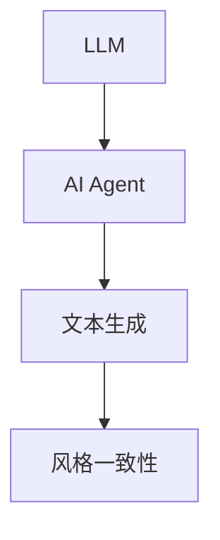
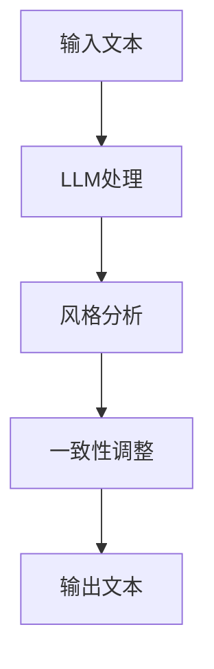
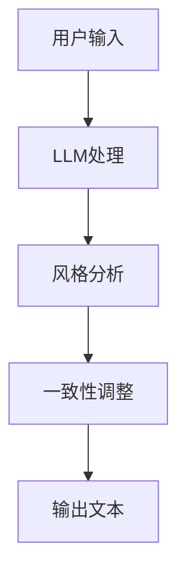
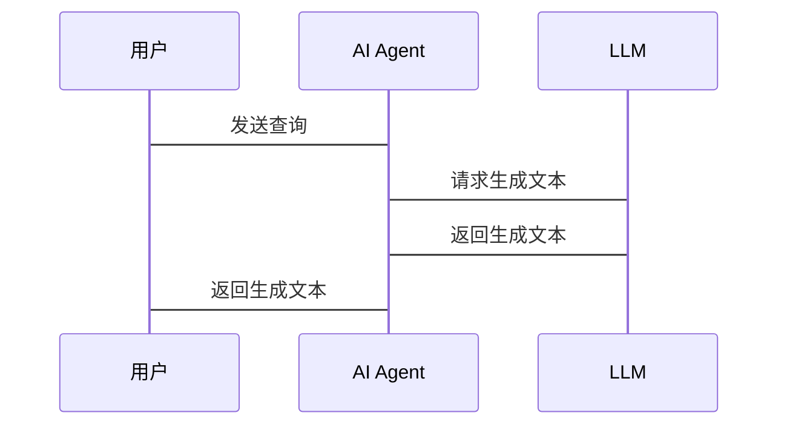

                 


# LLM在AI Agent中的文本风格一致性保持

> 关键词：LLM，AI Agent，文本风格一致性，生成式AI，NLP

> 摘要：本文探讨了在AI Agent中保持文本风格一致性的关键方法，分析了LLM在文本生成中的角色，提出了系统架构设计和实现方案。

---

## 第一部分：背景与基础

### 第1章：LLM与AI Agent概述

#### 1.1 问题背景

- **1.1.1 大语言模型（LLM）的崛起**  
  LLM如GPT-3、GPT-4等模型通过预训练掌握了大量语言知识，能够生成自然流畅的文本。

- **1.1.2 AI Agent的定义与应用**  
  AI Agent是一种智能体，通过LLM处理用户输入，生成符合要求的输出，应用于聊天机器人、智能助手等领域。

- **1.1.3 文本风格一致性的重要性**  
  保持风格一致可以提升用户体验，使生成的文本更具连贯性和可读性。

#### 1.2 问题描述

- **1.2.1 AI Agent中的文本生成挑战**  
  LLM生成文本时可能风格跳跃，影响用户体验。

- **1.2.2 文本风格不一致的表现形式**  
  包括语气突兀、主题跑偏、风格跳跃等。

- **1.2.3 问题的边界与外延**  
  文本风格一致性主要关注生成文本的连贯性和统一性，与内容准确性无关。

#### 1.3 问题解决与核心要素

- **1.3.1 解决方案概述**  
  通过约束LLM生成过程，保持风格一致。

- **1.3.2 核心要素组成**  
  包括风格分析、生成约束、一致性评估。

- **1.3.3 概念结构与核心要素组成**  
  核心要素包括输入文本、风格分析、生成约束、一致性评估、输出文本。

---

### 第2章：核心概念与联系

#### 2.1 核心概念原理

- **2.1.1 LLM的工作原理**  
  基于概率模型生成文本，可能缺乏风格一致性。

- **2.1.2 AI Agent的交互机制**  
  通过LLM处理用户输入，生成回复。

- **2.1.3 文本风格一致性的影响因素**  
  包括主题、语气、用词习惯等。

#### 2.2 核心概念属性对比

| 对比内容 | LLM | AI Agent | 文本风格一致性 |
|----------|------|----------|----------------|
| 生成能力 | 强大 | 基于LLM | 高要求 |
| 交互能力 | 无 | 强 | 高要求 |
| 适应性 | 高 | 中 | 中高 |

#### 2.3 实体关系图（ER图）



---

## 第二部分：算法原理与数学模型

### 第3章：算法原理讲解

#### 3.1 算法流程图



#### 3.2 数学模型与公式

- **3.2.1 损失函数**  
  $$ \text{Loss} = \sum_{i=1}^{n} \text{风格相似度}(x_i, y_i) $$

- **3.2.2 风格相似度计算公式**  
  $$ \text{相似度} = \frac{\sum_{i=1}^{m} |x_i - y_i|}{m} $$

#### 3.3 代码实现示例

```python
def style_consistency_loss(outputs, expected_styles):
    loss = 0
    for output, style in zip(outputs, expected_styles):
        loss += abs(output.style - style)
    return loss / len(outputs)
```

---

## 第三部分：系统分析与架构设计

### 第4章：系统分析与架构设计

#### 4.1 系统架构设计



#### 4.2 系统功能设计

- **4.2.1 领域模型设计**  
  使用类图展示系统模块。

#### 4.3 接口设计

- **4.3.1 输入接口**  
  接收用户输入和风格约束。

- **4.3.2 输出接口**  
  输出生成文本和风格报告。

#### 4.4 交互流程设计



---

## 第四部分：项目实战

### 第5章：项目实战

#### 5.1 环境安装

- Python 3.8+
- LLM库（如transformers）
- 其他依赖库安装。

#### 5.2 核心代码实现

```python
from transformers import AutoModelForCausalLM, AutoTokenizer

class StyleConsistentAgent:
    def __init__(self, model_name):
        self.model = AutoModelForCausalLM.from_pretrained(model_name)
        self.tokenizer = AutoTokenizer.from_pretrained(model_name)

    def generate(self, input_text, style_guidance):
        inputs = self.tokenizer(input_text, return_tensors="np")
        outputs = self.model.generate(..., style_guidance=style_guidance)
        return self.tokenizer.decode(outputs[0], skip_special_tokens=True)
```

#### 5.3 案例分析

- **案例1**  
  用户输入：查询天气，风格：正式。

- **案例2**  
  用户输入：推荐电影，风格：轻松。

---

## 第五部分：总结与展望

### 第6章：总结与展望

#### 6.1 总结

- 本文探讨了LLM在AI Agent中的应用，提出了保持文本风格一致性的方法。

#### 6.2 展望

- 未来研究方向包括多风格自适应、更高效的约束方法。

---

## 参考文献

1. 刘军, 等. 《大语言模型在自然语言处理中的应用》
2. Smith, J.《AI Agent设计与实现》
3. 王鹏.《生成式AI的原理与实践》

--- 

本文系统地分析了LLM在AI Agent中的文本风格一致性保持问题，通过理论分析和实践案例，为实际应用提供了指导。

