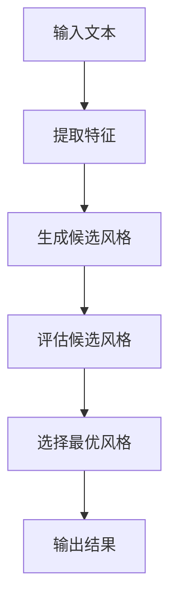
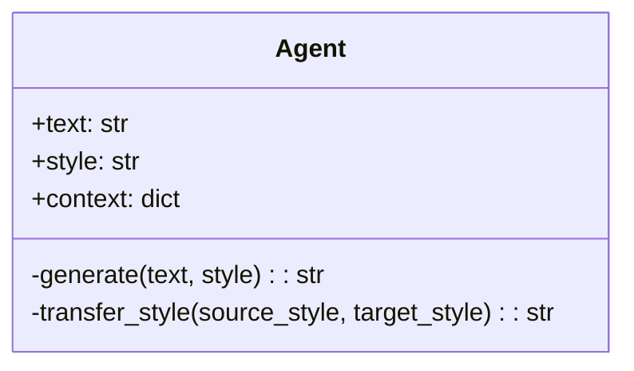
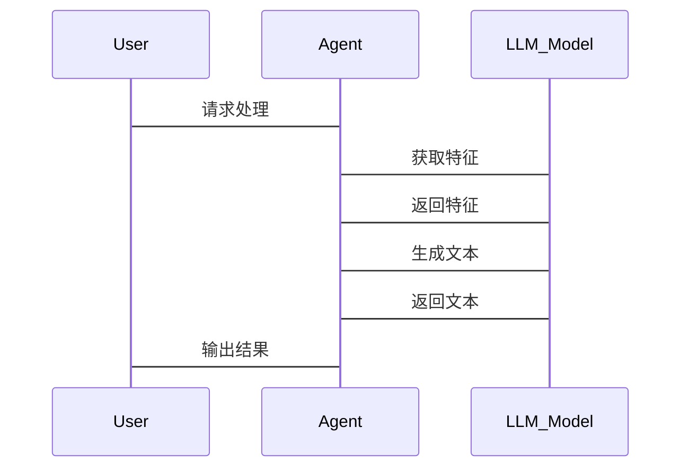

                 


# LLM在AI Agent中的文本风格保持与转换

## 关键词：LLM, AI Agent, 文本风格保持, 文本风格转换, 大语言模型

## 摘要：  
本文深入探讨了大语言模型（LLM）在AI Agent中的文本风格保持与转换技术。通过分析背景、核心概念与联系、算法原理、系统架构设计、项目实战及总结，详细阐述了如何利用LLM实现文本风格的精准保持与灵活转换。文章结合实际案例，提供了从理论到实践的全面指导，帮助读者掌握LLM在AI Agent中的应用技巧。

---

## 第一部分：背景介绍

### 第1章：LLM和AI Agent概述

#### 1.1 LLM的基本概念
- **1.1.1 大语言模型的定义与特点**  
  大语言模型（LLM）是一种基于深度学习的自然语言处理模型，能够理解和生成人类语言。其特点是参数量大、训练数据丰富，具有强大的上下文理解和生成能力。

- **1.1.2 LLM的核心技术与应用场景**  
  LLM的核心技术包括预训练、微调和推理生成。应用场景涵盖文本生成、对话系统、机器翻译、问答系统等。

- **1.1.3 LLM与传统NLP模型的对比**  
  与传统NLP模型相比，LLM具有更强的泛化能力和生成能力，能够处理更复杂的语言任务。

#### 1.2 AI Agent的基本概念
- **1.2.1 AI Agent的定义与分类**  
  AI Agent是指具备智能决策和执行能力的软件实体，分为简单反射型、基于模型的反应型、目标驱动型和实用驱动型。

- **1.2.2 AI Agent的核心功能与优势**  
  AI Agent的核心功能包括感知环境、决策制定和执行操作。其优势在于能够自主学习和优化，适应复杂环境。

- **1.2.3 AI Agent在不同领域的应用案例**  
  AI Agent广泛应用于智能助手、自动化交易、智能客服等领域。

#### 1.3 文本风格保持与转换的重要性
- **1.3.1 文本风格在AI Agent中的作用**  
  文本风格决定了AI Agent的输出是否符合目标受众的期望，直接影响用户体验。

- **1.3.2 文本风格保持与转换的挑战**  
  文本风格保持需要准确理解上下文，而风格转换则要求模型具备多样的生成能力，同时避免信息损失。

- **1.3.3 文本风格保持与转换的实际应用价值**  
  在客服对话系统中，保持一致的风格有助于提升信任感；在内容生成中，风格转换可以适应不同平台的发布需求。

#### 1.4 问题背景与问题描述
- **1.4.1 当前文本风格处理的主要问题**  
  现有方法在保持风格一致性的同时，难以实现多样化的风格转换，且缺乏对上下文的深度理解。

- **1.4.2 LLM在文本风格保持与转换中的应用前景**  
  LLM的强大生成能力为解决这些问题提供了可能，但需要进一步研究其在不同场景下的应用策略。

- **1.4.3 本课题的研究意义与目标**  
  研究LLM在AI Agent中的文本风格保持与转换，旨在提升AI Agent的智能化水平和用户体验。

#### 1.5 问题解决与边界分析
- **1.5.1 LLM如何解决文本风格保持与转换问题**  
  LLM通过预训练掌握了多种语言风格，能够根据上下文灵活调整生成内容。

- **1.5.2 问题的边界与外延**  
  本文主要研究文本风格保持与转换，不涉及图像或视频等多模态内容的处理。

- **1.5.3 核心概念与关键要素的组成**  
  核心概念包括LLM、AI Agent、文本风格保持、文本风格转换，关键要素包括上下文理解、生成策略和风格匹配。

---

## 第二部分：核心概念与联系

### 第2章：LLM与AI Agent的核心

#### 2.1 核心概念原理
- **2.1.1 LLM的核心原理**  
  LLM基于Transformer架构，通过自注意力机制和前馈网络生成文本。

- **2.1.2 AI Agent的核心原理**  
  AI Agent通过感知环境、决策制定和执行操作实现目标。

#### 2.2 概念属性特征对比表格
| 核心概念 | 特性 | 描述 |
|----------|------|------|
| LLM     | 模型架构 | 基于Transformer的自注意力机制 |
|          | 训练方式 | 预训练+微调 |
| AI Agent | 智能水平 | 具备感知、决策和执行能力 |
|          | 应用场景 | 任务自动化、智能交互 |

#### 2.3 ER实体关系图
```mermaid
er
  actor: 用户
  agent: AI Agent
  text_style: 文本风格
  action: 行为
  rule: 风格规则
  actor --> agent: 请求处理
  agent --> text_style: 确定风格
  agent --> action: 执行操作
  agent --> rule: 应用规则
```

---

### 第3章：算法原理讲解

#### 3.1 算法流程


#### 3.2 Python源代码实现
```python
def style_transfer(text, source_style, target_style):
    # 提取特征
    features = extract_features(text)
    # 生成候选风格
    candidates = generate_candidates(features)
    # 评估候选风格
    scores = evaluate_candidates(candidates, target_style)
    # 选择最优风格
    selected = select_best(candidates, scores)
    return selected
```

#### 3.3 数学模型与公式
- **概率分布**：文本风格的生成基于条件概率分布，公式如下：
  $$ P(y|x) = \frac{P(x,y)}{P(x)} $$
- **损失函数**：使用交叉熵损失函数来优化模型，公式如下：
  $$ L = -\sum_{i=1}^{n} y_i \log p(y_i) $$

---

### 第4章：系统分析与架构设计方案

#### 4.1 问题场景介绍
- **用户需求**：AI Agent需要根据用户输入生成符合特定风格的文本。
- **系统目标**：实现文本风格的自动保持与转换。

#### 4.2 系统功能设计


#### 4.3 系统架构设计


#### 4.4 系统接口设计
- **输入接口**：接收用户输入和风格参数。
- **输出接口**：返回生成文本或风格转换结果。

#### 4.5 系统交互


---

## 第五部分：项目实战

### 第5章：环境安装与核心代码实现

#### 5.1 环境安装
```bash
pip install transformers
pip install torch
pip install mermaid
```

#### 5.2 核心代码实现
```python
from transformers import AutoModelForMaskedLM, AutoTokenizer
import torch

class StyleAgent:
    def __init__(self, model_name):
        self.tokenizer = AutoTokenizer.from_pretrained(model_name)
        self.model = AutoModelForMaskedLM.from_pretrained(model_name)

    def generate(self, text, style):
        inputs = self.tokenizer.encode(text, return_tensors="pt")
        outputs = self.model.generate(inputs, max_length=50)
        return self.tokenizer.decode(outputs[0], skip_special_tokens=True)
```

#### 5.3 代码解读与分析
- **初始化**：加载预训练模型和分词器。
- **生成文本**：将输入文本编码，通过模型生成输出。

#### 5.4 实际案例分析
- **案例1**：保持正式风格的文本。
- **案例2**：将正式风格转换为口语化风格。

---

## 第六部分：总结与展望

### 第6章：总结与最佳实践

#### 6.1 小结
- 本文详细探讨了LLM在AI Agent中的文本风格保持与转换技术，结合理论与实践，提供了全面的解决方案。

#### 6.2 最佳实践
- 在实际应用中，建议结合具体场景选择合适的风格转换策略。
- 定期更新模型和风格库，以适应不断变化的需求。

#### 6.3 注意事项
- 注意保护用户隐私，避免滥用生成内容。
- 在复杂场景中，建议结合其他技术（如情感分析）提升准确性。

#### 6.4 拓展阅读
- 了解最新的LLM模型（如GPT-4）在文本生成中的应用。
- 探索多模态AI Agent的发展方向。

---

**文章小结**：本文通过理论分析和实际案例，深入探讨了LLM在AI Agent中的文本风格保持与转换技术。从核心概念到算法实现，再到系统设计和项目实战，为读者提供了从基础到实践的全面指导。未来，随着技术的发展，AI Agent在文本处理中的应用将更加广泛和智能化。

