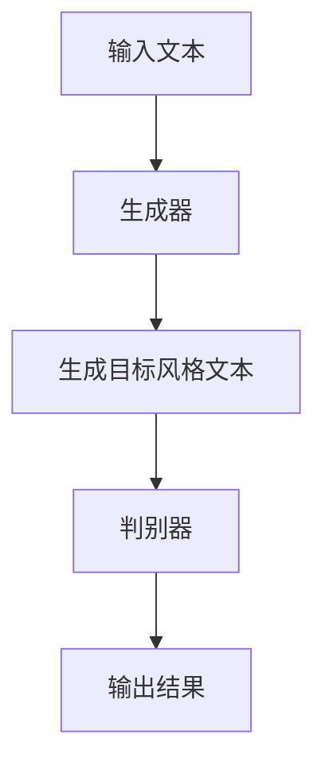
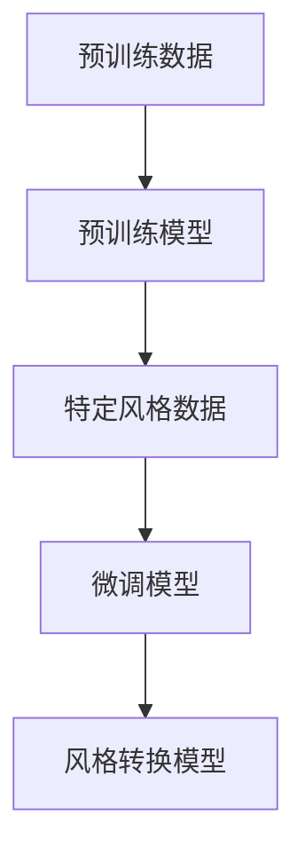
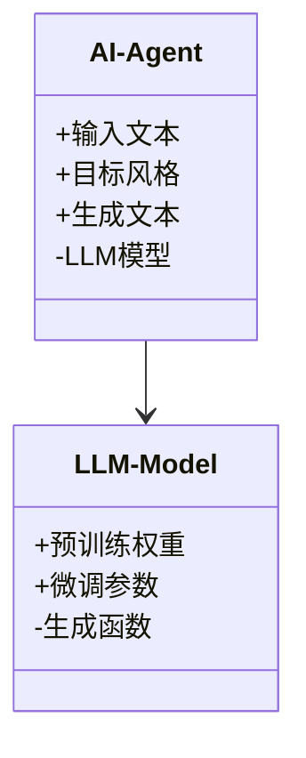
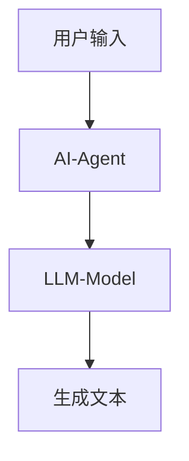
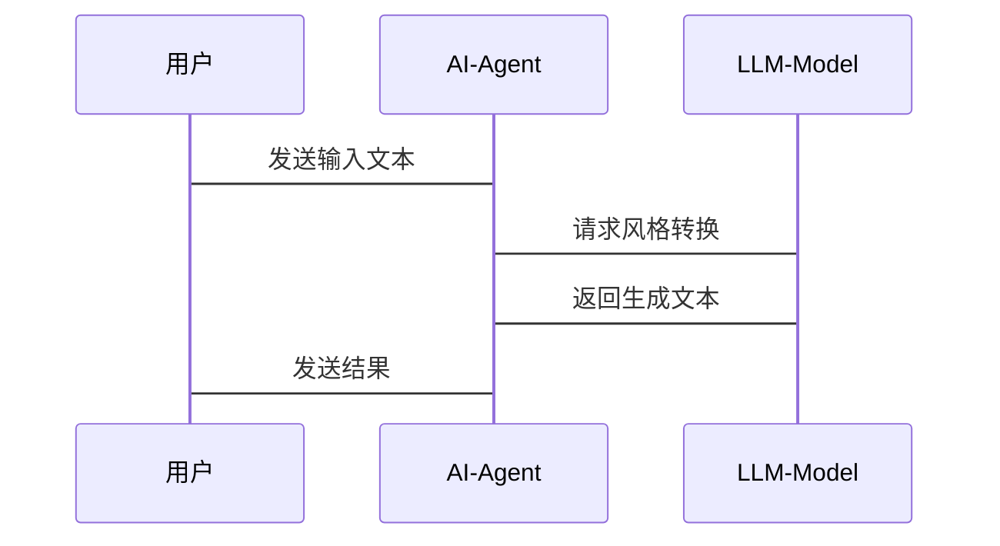

                 


# LLM在AI Agent中的文本风格转换与保持

## 关键词：LLM, AI Agent, 文本风格转换, 文本风格保持, 生成式AI, 大语言模型

## 摘要：
本文深入探讨了大语言模型（LLM）在AI Agent中的文本风格转换与保持技术。文章首先介绍了LLM和AI Agent的基本概念，分析了文本风格转换与保持的重要性和挑战。接着，详细讲解了基于LLM的文本风格转换算法原理，包括生成对抗网络和预训练模型的微调方法。然后，通过实际案例分析，展示了如何在AI Agent中实现文本风格的转换与保持，并探讨了系统架构设计和项目实战中的关键问题。最后，总结了当前技术的优缺点，并提出了未来的研究方向。

---

# 第一部分: LLM与AI Agent概述

## 第1章: LLM的基本概念

### 1.1 大语言模型（LLM）的定义
大语言模型（Large Language Model, LLM）是一种基于深度学习的自然语言处理模型，通常采用Transformer架构，通过大量真实文本数据进行预训练，能够理解和生成人类语言。LLM的核心在于其巨大的参数规模和强大的上下文理解能力。

### 1.2 LLM的核心特点
- **大规模预训练**：LLM通过在海量数据上进行无监督预训练，学习语言的语法、语义和上下文关系。
- **生成能力强**：LLM能够生成自然流畅的文本，适用于对话、翻译、内容生成等多种任务。
- **可微调性**：LLM可以通过微调（Fine-tuning）适应特定领域或任务的需求。

### 1.3 LLM与传统NLP模型的区别
| 特性 | LLM | 传统NLP模型 |
|------|------|--------------|
| 参数规模 | 大（百万到百亿参数） | 小（十万到百万参数） |
| 预训练数据 | 海量（互联网数据） | 有限（特定领域数据） |
| 任务适应性 | 强（通用性强） | 弱（任务专用性高） |

---

## 第2章: AI Agent的基本概念

### 2.1 AI Agent的定义
AI Agent（人工智能代理）是一种智能系统，能够感知环境、理解用户需求，并通过决策和执行来完成特定任务。AI Agent可以是软件程序、智能助手或机器人，广泛应用于客服、智能家居、自动驾驶等领域。

### 2.2 AI Agent的核心功能
- **感知**：通过传感器或用户输入获取信息。
- **理解**：利用NLP技术解析用户意图。
- **决策**：基于理解和知识库生成行动计划。
- **执行**：通过执行模块完成任务。

### 2.3 AI Agent的应用场景
- **智能客服**：通过对话理解用户需求，提供个性化的服务。
- **智能家居**：根据用户习惯和指令控制家电。
- **自动驾驶**：通过感知和决策实现车辆控制。

---

## 第3章: 文本风格转换与保持的背景

### 3.1 文本风格转换的定义
文本风格转换是指将一段文本从一种风格或语气转换为另一种风格，例如将正式语言转换为口语，或将幽默风格转换为严肃风格。

### 3.2 文本风格保持的定义
文本风格保持是指在生成文本时，保持原文的风格、语气和语境一致，避免风格漂移。

### 3.3 LLM在文本风格转换中的作用
- **多风格生成**：LLM可以通过微调或提示工程技术生成多种风格的文本。
- **风格保持优化**：通过训练数据的风格标注，LLM能够更好地保持目标风格。

---

# 第二部分: LLM在AI Agent中的核心概念

## 第4章: LLM与文本风格转换的关系

### 4.1 LLM如何实现文本风格转换
1. **基于生成对抗网络（GAN）的风格转换**：LLM通过生成器和判别器的对抗训练，实现风格的转换。
2. **基于预训练模型的微调方法**：通过在特定风格数据上微调模型，使其能够生成目标风格的文本。

### 4.2 LLM在风格转换中的优势
- **通用性**：LLM可以适应多种风格转换任务。
- **高质量生成**：LLM生成的文本质量高，语义连贯。

### 4.3 LLM在风格保持中的挑战
- **风格漂移**：在复杂场景下，LLM可能偏离目标风格。
- **风格混淆**：在多风格混合的情况下，模型难以准确保持单一风格。

---

## 第5章: AI Agent中的文本风格转换需求

### 5.1 不同场景下的风格转换需求
- **客服对话**：根据用户风格调整回复语气。
- **内容生成**：根据目标读者风格生成文章。

### 5.2 用户对文本风格保持的期望
- **一致性**：生成文本与原始文本风格一致。
- **适应性**：根据上下文动态调整风格。

### 5.3 AI Agent中的风格转换目标
- **用户友好**：通过风格转换提升用户体验。
- **任务适应性**：根据任务需求调整文本风格。

---

# 第三部分: LLM文本风格转换的算法原理

## 第6章: 基于LLM的文本风格转换算法

### 6.1 基于生成对抗网络的风格转换
1. **生成器**：负责将输入文本转换为目标风格。
2. **判别器**：区分真实文本和生成文本。

### 6.2 基于预训练模型的微调方法
1. **预训练**：在通用数据集上预训练LLM。
2. **微调**：在特定风格数据上进行微调。

### 6.3 基于语言模型的风格保持策略
1. **风格标记**：在生成文本时，加入风格标记。
2. **风格监督**：通过监督学习优化风格保持。

---

## 第7章: 算法流程图

### 7.1 生成对抗网络流程图


### 7.2 预训练与微调流程图


---

## 第8章: 数学模型与公式

### 8.1 概率生成模型
$$ P(y|x) = \text{模型输出概率} $$

### 8.2 损失函数
$$ \text{损失函数} = \text{生成器损失} + \text{判别器损失} $$

---

# 第四部分: 系统分析与架构设计

## 第9章: 问题场景介绍

### 9.1 问题背景
在AI Agent中，文本风格转换与保持是实现用户交互和任务执行的重要环节。

### 9.2 项目介绍
本项目旨在开发一个基于LLM的AI Agent，能够根据用户需求生成不同风格的文本。

---

## 第10章: 系统功能设计

### 10.1 领域模型（类图）


### 10.2 系统架构设计


### 10.3 系统交互（序列图）


---

## 第11章: 系统接口设计

### 11.1 接口定义
- **输入接口**：接收用户输入文本和目标风格。
- **输出接口**：返回生成文本。

### 11.2 接口实现
```python
class AI-Agent:
    def __init__(self, model):
        self.model = model

    def convert_style(self, input_text, target_style):
        # 调用LLM模型进行风格转换
        return self.model.generate(input_text, target_style)
```

---

# 第五部分: 项目实战

## 第12章: 环境安装

### 12.1 安装依赖
```bash
pip install transformers torch
```

---

## 第13章: 核心代码实现

### 13.1 LLM模型加载
```python
from transformers import AutoModelForCausalLM, AutoTokenizer

model_name = "gpt2"
model = AutoModelForCausalLM.from_pretrained(model_name)
tokenizer = AutoTokenizer.from_pretrained(model_name)
```

### 13.2 文本风格转换
```python
def convert_style(input_text, target_style):
    inputs = tokenizer.encode(input_text, return_tensors="pt")
    outputs = model.generate(inputs, max_length=50, do_sample=True)
    return tokenizer.decode(outputs[0], skip_special_tokens=True)
```

---

## 第14章: 案例分析

### 14.1 实际案例
- **输入文本**：正式风格的合同文本。
- **目标风格**：口语化的合同解释。

### 14.2 案例结果
- **生成文本**：将正式合同转换为易于理解的口语化解释。

---

## 第15章: 项目小结

### 15.1 核心知识点回顾
- LLM在AI Agent中的应用。
- 文本风格转换与保持的算法原理。
- 系统架构设计与实现。

### 15.2 实践建议
- 根据具体需求选择合适的模型和方法。
- 通过实验优化模型性能。

---

# 第六部分: 总结与展望

## 第16章: 总结

### 16.1 核心知识点总结
- LLM在AI Agent中的文本风格转换与保持是实现智能化交互的关键技术。
- 基于LLM的风格转换算法具有高效性和通用性。

### 16.2 实践建议
- 在实际应用中，根据需求选择合适的模型和方法。
- 通过实验优化模型性能。

---

## 第17章: 注意事项

### 17.1 模型选择
选择合适的LLM模型，考虑其计算资源和任务需求。

### 17.2 数据质量
确保训练数据的质量和多样性，避免模型偏差。

---

## 第18章: 拓展阅读

### 18.1 推荐书籍
- 《Deep Learning》
- 《自然语言处理实战》

### 18.2 推荐论文
- "Generating Text with Neural Networks"
- "Large Language Models: The New Frontier in AI"

---

# 附录: 代码示例

```python
import torch
from transformers import AutoModelForCausalLM, AutoTokenizer

class StyleConverter:
    def __init__(self, model_name):
        self.model = AutoModelForCausalLM.from_pretrained(model_name)
        self.tokenizer = AutoTokenizer.from_pretrained(model_name)

    def convert_style(self, input_text, target_style):
        inputs = self.tokenizer.encode(input_text, return_tensors="pt")
        outputs = self.model.generate(inputs, max_length=50, do_sample=True)
        return self.tokenizer.decode(outputs[0], skip_special_tokens=True)

# 使用示例
converter = StyleConverter("gpt2")
input_text = "Please provide a detailed analysis of the current market trends."
target_style = "informal"
result = converter.convert_style(input_text, target_style)
print(result)
```

---

# 结语

本文系统地探讨了LLM在AI Agent中的文本风格转换与保持技术，从理论到实践，为读者提供了全面的指导。通过实际案例分析和系统设计，展示了如何将LLM应用于AI Agent中，实现高效的文本风格转换与保持。未来的研究可以进一步优化算法，提升模型的风格保持能力，推动AI Agent在更多领域的应用。

