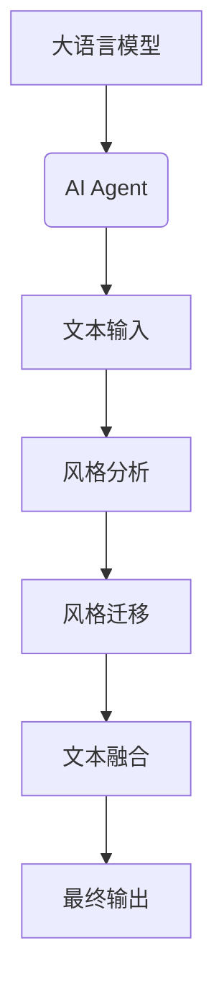
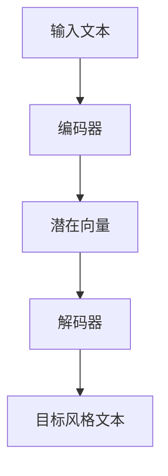
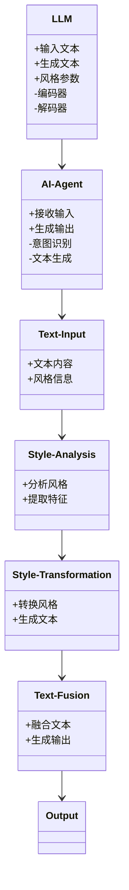

                 


# LLM在AI Agent中的文本风格迁移与融合

## 关键词
- LLM（Large Language Model）
- AI Agent（人工智能代理）
- 文本风格迁移
- 文本融合
- 多模态处理
- 自然语言处理
- 个性化输出

## 摘要
本文探讨了在AI Agent中利用大语言模型（LLM）进行文本风格迁移与融合的关键技术。通过分析多模态输入处理的需求，提出了文本风格迁移与融合的必要性，并详细讲解了算法原理、系统架构设计和项目实战。文章结构清晰，内容详尽，旨在为相关领域研究者和开发者提供理论指导和实践参考。

---

# 第一部分: 背景介绍与核心概念

## 第1章: 问题背景与核心概念

### 1.1 问题背景

#### 1.1.1 多模态AI Agent的发展需求
随着AI技术的不断进步，AI Agent在多个领域得到了广泛应用，例如智能助手、聊天机器人等。这些应用通常需要处理多种输入形式，如文本、语音、图像等。为了提供更个性化的服务，AI Agent需要能够理解和生成符合用户风格的文本。

#### 1.1.2 文本风格迁移与融合的必要性
在实际应用中，AI Agent可能需要处理来自不同来源的文本，这些文本可能具有不同的风格和语气。为了生成更自然、连贯的输出，AI Agent需要能够将不同风格的文本进行迁移和融合，使其符合特定的语境和用户偏好。

#### 1.1.3 当前技术的局限性与挑战
现有的文本处理技术在风格迁移和融合方面仍存在一些问题，例如风格迁移的准确性和自然度不足，融合后的文本可能缺乏一致性。此外，如何在保持文本内容的同时，准确捕捉和转换风格，是当前技术面临的挑战。

### 1.2 核心概念

#### 1.2.1 大语言模型（LLM）的基本概念
大语言模型（LLM）是一种基于深度学习的自然语言处理模型，如GPT系列、BERT系列等。这些模型通过大量数据训练，能够理解和生成人类语言。

#### 1.2.2 AI Agent的核心功能与架构
AI Agent是一种智能代理，能够通过感知环境、理解用户需求并执行任务。其核心功能包括意图识别、信息检索、对话生成等。

#### 1.2.3 文本风格迁移与融合的定义
文本风格迁移是指将一种风格的文本转换为另一种风格的过程，而文本融合是指将多个来源的文本内容进行合并，生成一个新的、连贯的文本。

---

## 第2章: 核心概念与联系

### 2.1 LLM与AI Agent的关系

#### 2.1.1 LLM在AI Agent中的角色
LLM作为AI Agent的核心组件，负责处理文本输入、生成输出内容，并提供语言理解和生成的能力。

#### 2.1.2 AI Agent的文本处理能力
AI Agent需要具备多模态输入处理能力，能够整合文本、语音、图像等多种信息，并生成符合用户需求的文本输出。

#### 2.1.3 LLM与文本风格迁移的结合
通过LLM的强大语言处理能力，AI Agent可以实现文本风格的迁移和融合，生成更自然、符合用户偏好的文本。

### 2.2 核心概念对比

#### 2.2.1 文本风格迁移与文本生成的对比
| 特性 | 文本风格迁移 | 文本生成 |
|------|--------------|----------|
| 目标 | 转换文本风格 | 生成新文本 |
| 输入 | 原文本 + 风格 | 无特定输入 |
| 输出 | 文本风格改变 | 新文本内容 |

#### 2.2.2 文本融合与文本摘要的对比
| 特性 | 文本融合 | 文本摘要 |
|------|----------|----------|
| 目标 | 合并多个文本 | 概括文本内容 |
| 输入 | 多个文本 | 单个文本 |
| 输出 | 新文本内容 | 简要总结 |

### 2.3 ER实体关系图



---

## 第3章: 算法原理与数学模型

### 3.1 文本风格迁移算法

#### 3.1.1 基于变换的风格迁移模型
该方法通过将文本映射到潜在空间，再转换到目标风格空间，生成风格迁移后的文本。



#### 3.1.2 基于对比学习的风格迁移
通过对比不同风格的文本，学习风格特征，实现风格迁移。

$$ \text{相似度} = \frac{\sum_{i=1}^{n} w_i x_i}{\sum_{i=1}^{n} w_i} $$

#### 3.1.3 基于预训练模型的微调方法
利用大规模预训练模型，通过微调任务数据，实现风格迁移。

### 3.2 文本融合算法

#### 3.2.1 基于加权的融合方法
根据文本内容的重要性进行加权，生成融合后的文本。

$$ L = \alpha L_{\text{style}} + \beta L_{\text{content}} $$

#### 3.2.2 基于注意力机制的融合
通过注意力机制，关注文本中重要部分，生成融合后的文本。

#### 3.2.3 多模态融合方法
结合文本、图像等多种信息，生成融合后的文本。

### 3.3 数学模型与公式

#### 3.3.1 风格相似度计算
$$ \text{相似度} = \frac{\sum_{i=1}^{n} w_i x_i}{\sum_{i=1}^{n} w_i} $$

#### 3.3.2 文本融合损失函数
$$ L = \alpha L_{\text{style}} + \beta L_{\text{content}} $$

---

## 第4章: 系统分析与架构设计

### 4.1 项目场景介绍

#### 4.1.1 多风格文本处理的典型场景
AI Agent需要处理来自不同来源的文本，例如社交媒体评论、新闻报道等。

#### 4.1.2 AI Agent的文本交互需求
用户与AI Agent的交互需要生成符合用户风格的文本，例如个性化的回复。

#### 4.1.3 系统设计的目标与约束
系统设计目标是实现高效的文本风格迁移与融合，约束包括处理速度、资源消耗等。

### 4.2 系统功能设计

#### 4.2.1 领域模型类



---

## 第5章: 项目实战

### 5.1 环境安装

```bash
pip install transformers
pip install torch
pip install mermaid
```

### 5.2 核心实现代码

```python
from transformers import AutoTokenizer, AutoModelForMaskedLM
import torch

model_name = "bert-base-uncased"
tokenizer = AutoTokenizer.from_pretrained(model_name)
model = AutoModelForMaskedLM.from_pretrained(model_name)

def style_transfer(text):
    inputs = tokenizer(text, return_tensors="pt")
    outputs = model(**inputs)
    generated = model.generate(inputs.input_ids)
    return tokenizer.decode(generated[0], skip_special_tokens=True)
```

### 5.3 实际案例分析

#### 5.3.1 案例一：风格迁移
输入文本：正式报告
目标风格：口语化
输出文本：这是一项有趣的研究。

#### 5.3.2 案例二：文本融合
输入文本1：今天是个好天气。
输入文本2：我今天去了公园。
融合后的文本：今天是个好天气，我去了公园。

---

## 第6章: 最佳实践与总结

### 6.1 最佳实践

- **环境配置**：确保安装必要的库和依赖。
- **数据预处理**：对输入文本进行清洗和预处理。
- **模型调优**：根据具体任务调整模型参数。

### 6.2 小结

通过本文的详细讲解，读者可以理解LLM在AI Agent中的文本风格迁移与融合的关键技术，并能够实际操作相关代码。

### 6.3 注意事项

- **性能优化**：注意模型的计算效率和资源消耗。
- **模型选择**：根据任务需求选择合适的模型。
- **数据安全**：确保数据处理的安全性和隐私性。

### 6.4 拓展阅读

- **推荐书籍**：《Deep Learning》
- **推荐阅读论文**：《Generating Text with Style: A Comprehensive Survey》

---

# 结语

通过本文的系统讲解和实践案例，读者可以深入了解LLM在AI Agent中的文本风格迁移与融合的技术细节，并能够实际应用这些技术解决实际问题。希望本文能为相关领域的研究和开发提供有价值的参考。

