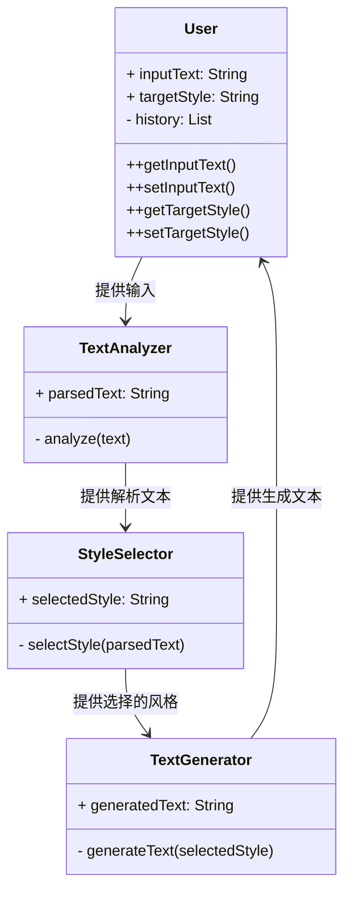
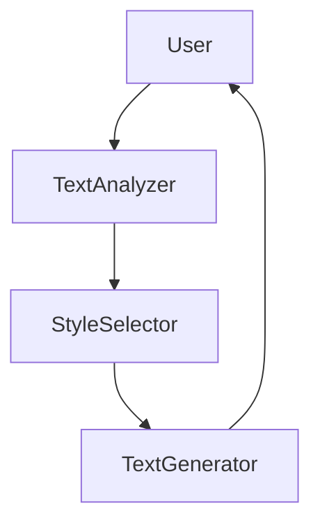
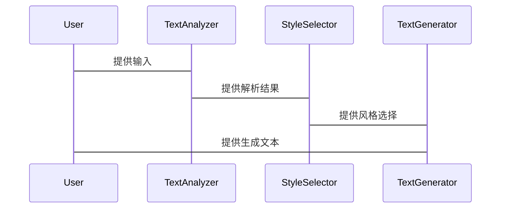

                 


好的，现在我来逐步分析和撰写《LLM在AI Agent中的文本风格迁移应用》这篇文章。我将按照以下结构进行，确保逻辑清晰、内容详尽。

---

# LLM在AI Agent中的文本风格迁移应用

**关键词：** 大语言模型（LLM）、人工智能代理（AI Agent）、文本风格迁移、自然语言处理（NLP）、系统架构设计

**摘要：**  
本文探讨了大语言模型（LLM）在人工智能代理（AI Agent）中的文本风格迁移应用。首先，我们介绍了LLM和AI Agent的基本概念，分析了文本风格迁移的必要性及其在AI Agent中的作用。接着，详细阐述了文本风格迁移的核心原理、算法实现及其在系统架构中的设计。最后，通过实际案例展示了如何在AI Agent中实现文本风格迁移，并提出了相关的最佳实践和未来研究方向。

---

## 第一章: 背景介绍

### 1.1 问题背景
#### 1.1.1 LLM与AI Agent的定义
- **大语言模型（LLM）**：基于深度学习的模型，如GPT-3、GPT-4，能够生成与人类类似的文本。
- **人工智能代理（AI Agent）**：智能系统，能够感知环境、理解用户需求并执行任务，如对话生成、文本编辑。

#### 1.1.2 文本风格迁移的必要性
- 用户需求多样化：不同场景下需要不同的文本风格。
- 提高用户体验：根据用户偏好生成个性化文本。
- 扩展应用范围：使AI Agent能够适应更多领域和场景。

#### 1.1.3 当前技术的局限性与挑战
- 现有模型在特定领域或风格转换上效果有限。
- 数据隐私和模型安全问题。

### 1.2 问题描述
#### 1.2.1 文本风格迁移的核心问题
- 如何保持原文含义的同时，改变文本风格。
- 如何处理复杂语境下的风格转换。

#### 1.2.2 AI Agent在文本处理中的角色
- **输入处理**：接收用户请求并解析需求。
- **风格转换**：根据需求选择合适的风格迁移模型。
- **输出生成**：生成符合用户需求的文本。

#### 1.2.3 LLM在文本风格迁移中的优势
- 强大的上下文理解和生成能力。
- 跨领域适应性。

### 1.3 问题解决
#### 1.3.1 LLM如何实现文本风格迁移
- 通过微调模型或提示工程技术。
- 利用预训练的风格特征进行迁移。

#### 1.3.2 AI Agent在文本风格迁移中的具体应用
- **内容创作**：根据用户风格偏好生成文章。
- **文本编辑**：将学术论文转换为通俗易懂的语言。
- **客户服务**：生成符合客户风格的沟通文本。

#### 1.3.3 技术实现的边界与外延
- 边界：特定领域和风格转换效果有限。
- 外延：未来可能扩展到多语言风格迁移。

---

## 第二章: 核心概念与联系

### 2.1 LLM的基本原理
#### 2.1.1 模型训练机制
- 监督学习：基于大量文本数据进行训练。
- 无监督学习：利用数据分布学习语言结构。

#### 2.1.2 模型输入输出机制
- 输入：文本序列。
- 输出：生成的文本序列。

#### 2.1.3 模型的文本生成原理
- 基于概率分布生成下一个词。

### 2.2 文本风格迁移的核心原理
#### 2.2.1 文本风格的定义与分类
- 风格类型：正式、口语化、技术性等。
- 分类方法：基于词汇、句式、主题等因素。

#### 2.2.2 风格迁移的实现方法
- 基于规则的转换：如替换特定词汇。
- 基于机器学习的迁移：如使用循环神经网络（RNN）或变换器（Transformer）模型。

#### 2.2.3 LLM在风格迁移中的作用
- 提供强大的特征提取和生成能力。

### 2.3 AI Agent与文本风格迁移的关系
#### 2.3.1 AI Agent的基本功能
- 接收输入、解析需求、执行任务、生成输出。

#### 2.3.2 文本风格迁移在AI Agent中的应用
- 根据用户需求选择合适的风格转换模型。
- 生成符合用户偏好的文本。

#### 2.3.3 LLM与AI Agent的协同工作
- LLM负责文本生成，AI Agent负责任务管理和风格选择。

### 2.4 核心概念对比分析
#### 2.4.1 LLM与传统NLP模型的对比
| 特性 | LLM | 传统NLP模型 |
|------|------|------------|
| 数据需求 | 大量数据 | 较小数据 |
| 模型复杂度 | 高 | 较低 |

#### 2.4.2 文本风格迁移与其他文本处理任务的对比
| 任务 | 文本分类 | 文本生成 | 风格迁移 |
|------|----------|----------|----------|
| 目标 | 分类文本 | 生成文本 | 改变风格 |
| 输入 | 文本 | 文本 | 文本+风格 |

#### 2.4.3 AI Agent与传统文本处理工具的对比
| 功能 | AI Agent | 传统工具 |
|------|----------|-----------|
| 交互性 | 实时交互 | 批处理 |
| 智能性 | 可定制风格 | 无 |

### 2.5 本章小结
通过对比分析，明确了LLM、文本风格迁移和AI Agent之间的关系及其在实现中的作用。

---

## 第三章: 算法原理讲解

### 3.1 LLM的训练与推理过程
#### 3.1.1 模型训练流程
- 数据预处理：清洗、分词、去除停用词。
- 模型训练：使用交叉熵损失函数优化模型参数。

#### 3.1.2 模型推理过程
- 接收输入：用户提供的文本和目标风格。
- 生成输出：根据模型参数生成目标风格文本。

#### 3.1.3 模型调优方法
- 微调模型：在特定领域数据上进行微调。
- 使用提示工程技术：引导模型生成特定风格的文本。

### 3.2 文本风格迁移的算法实现
#### 3.2.1 基于Transformer的风格迁移模型
- 使用预训练的BERT模型进行风格特征提取。
- 通过交叉注意力机制进行风格迁移。

#### 3.2.2 算法流程
1. 输入原始文本和目标风格。
2. 模型提取文本内容特征和目标风格特征。
3. 进行特征融合，生成目标风格文本。

#### 3.2.3 数学模型与公式
- **损失函数**：交叉熵损失函数。
  $$ \mathcal{L} = -\sum_{i=1}^{n} y_i \log p(y_i) $$
- **注意力机制**：多头注意力。
  $$ \text{Attention}(Q, K, V) = \text{softmax}\left(\frac{QK^T}{\sqrt{d_k}}\right)V $$

#### 3.2.4 举例说明
- 输入：一篇学术论文。
- 输出：改写为口语化的文章。

### 3.3 本章小结
通过数学公式和算法流程，详细阐述了基于LLM的文本风格迁移实现原理。

---

## 第四章: 系统分析与架构设计

### 4.1 问题场景介绍
- 用户希望AI Agent能够生成符合特定风格的文本。
- AI Agent需要支持多种风格转换，并根据用户输入自动选择合适的风格。

### 4.2 系统功能设计
#### 4.2.1 功能模块
- 文本解析模块：解析用户输入并识别需求。
- 风格选择模块：根据需求选择合适的风格迁移模型。
- 文本生成模块：生成目标风格文本。

#### 4.2.2 领域模型类图


### 4.3 系统架构设计
#### 4.3.1 系统架构图


#### 4.3.2 系统接口设计
- 输入接口：用户输入文本和目标风格。
- 输出接口：生成的文本。

#### 4.3.3 系统交互流程图


### 4.4 本章小结
通过系统架构设计，明确了AI Agent在文本风格迁移中的各部分协作关系。

---

## 第五章: 项目实战

### 5.1 环境安装
- 安装Python和必要的库：transformers、numpy。
- 安装Hugging Face的库：pip install transformers。

### 5.2 系统核心实现
#### 5.2.1 文本解析模块
```python
from transformers import AutoTokenizer, AutoModelForMaskedLM

class TextAnalyzer:
    def __init__(self):
        self.tokenizer = AutoTokenizer.from_pretrained('bert-base-uncased')
        self.model = AutoModelForMaskedLM.from_pretrained('bert-base-uncased')
    
    def analyze(self, text):
        # 分析文本并返回解析结果
        pass
```

#### 5.2.2 风格选择模块
```python
class StyleSelector:
    def __init__(self):
        pass
    
    def select_style(self, parsed_text):
        # 根据解析结果选择合适的风格
        return 'formal'  # 示例返回
```

#### 5.2.3 文本生成模块
```python
class TextGenerator:
    def __init__(self):
        self.tokenizer = AutoTokenizer.from_pretrained('gpt2')
        self.model = AutoModelForCausalLM.from_pretrained('gpt2')
    
    def generate_text(self, style):
        # 根据风格生成文本
        pass
```

### 5.3 代码应用解读
- **TextAnalyzer**：使用BERT模型进行文本分析。
- **StyleSelector**：基于分析结果选择风格。
- **TextGenerator**：使用GPT-2生成目标风格文本。

### 5.4 实际案例分析
- 输入：学术论文。
- 输出：口语化文章。

### 5.5 项目小结
通过实际案例，展示了AI Agent在文本风格迁移中的具体实现过程。

---

## 第六章: 总结与展望

### 6.1 最佳实践 tips
- 确保数据多样性和代表性。
- 定期更新模型以适应新的风格需求。

### 6.2 小结
本文详细探讨了LLM在AI Agent中的文本风格迁移应用，从概念、算法到系统设计和项目实现进行了全面分析。

### 6.3 注意事项
- 数据隐私问题。
- 模型的泛化能力。

### 6.4 拓展阅读
- 探索多语言风格迁移。
- 研究实时风格迁移技术。

---

## 附录: 参考文献
- BERT论文。
- GPT-3论文。
- 相关NLP论文。

---

**结语：** 通过本文的详细分析，读者可以全面理解LLM在AI Agent中的文本风格迁移应用，从理论到实践都能获得深刻的认识。

