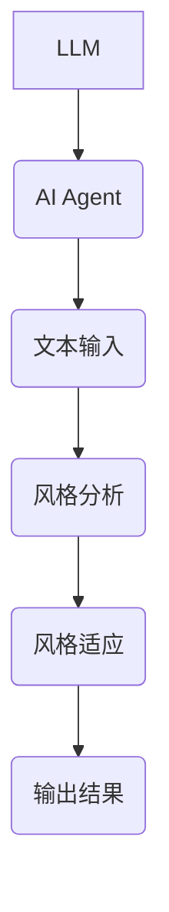
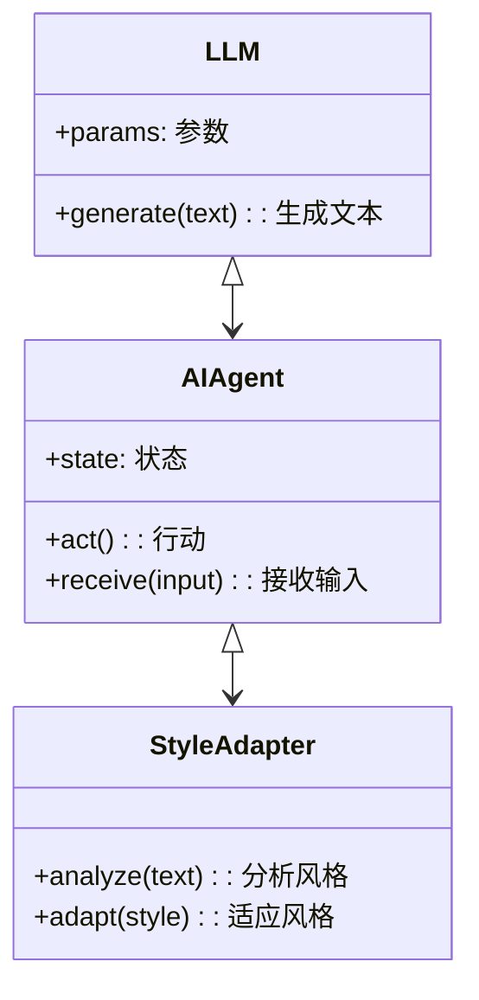
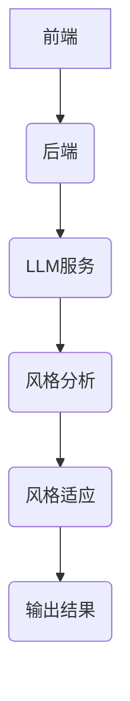
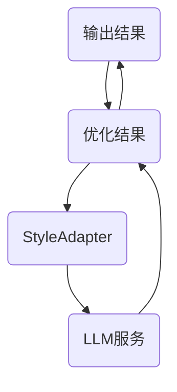

                 


# LLM在AI Agent中的文本风格适应与进化

> **关键词**：LLM，AI Agent，文本风格，适应与进化，强化学习，自然语言处理，系统架构

> **摘要**：  
本文探讨了如何利用大语言模型（LLM）在AI Agent中实现文本风格的适应与进化。通过分析LLM与AI Agent的结合，提出了基于强化学习的风格适应方法和进化的策略，详细阐述了算法原理、系统架构设计和实际项目案例。文章旨在为AI Agent的文本处理能力提供新的思路和解决方案。

---

## 目录

1. [背景介绍](#背景介绍)
2. [核心概念与联系](#核心概念与联系)
3. [算法原理讲解](#算法原理讲解)
4. [系统分析与架构设计](#系统分析与架构设计)
5. [项目实战](#项目实战)
6. [最佳实践与小结](#最佳实践与小结)

---

## 1. 背景介绍

### 1.1 问题背景

随着AI技术的快速发展，大语言模型（LLM）在自然语言处理领域取得了显著成果，而AI Agent作为一种能够自主决策和执行任务的智能体，也在多个领域展现出巨大潜力。然而，AI Agent在实际应用中需要处理多样化的文本风格，以满足不同场景的需求。如何让LLM在AI Agent中实现文本风格的适应与进化，成为一个亟待解决的问题。

### 1.2 问题描述

文本风格适应的核心问题是让AI Agent能够根据具体场景调整其输出文本的风格，使其更符合目标受众或任务的要求。然而，传统的文本生成方法难以应对多样化的风格需求，而LLM虽然具备强大的生成能力，但在风格适应和进化方面仍存在不足。

### 1.3 问题解决思路

基于LLM的风格适应方法可以通过以下步骤实现：
1. **风格识别**：通过分析输入文本，提取其风格特征。
2. **风格调整**：根据目标风格，对LLM的生成结果进行调整。
3. **强化学习优化**：通过强化学习进一步优化风格适应的效果。

### 1.4 概念结构与核心要素

以下是核心概念的对比表和实体关系图：

#### 对比表：LLM与AI Agent的核心属性

| 属性          | LLM                     | AI Agent                |
|---------------|-------------------------|--------------------------|
| 核心功能      | 文本生成与理解           | 自主决策与执行任务       |
| 输入          | 文本、上下文             | 多模态数据                |
| 输出          | 文本生成结果             | 动作、决策、文本输出       |
| 优势          | 强大的生成与理解能力     | 多目标决策能力            |
| 局限性         | 需依赖外部上下文          | 需依赖算法与数据           |

#### 实体关系图（ER图）



---

## 2. 核心概念与联系

### 2.1 LLM与AI Agent的核心原理

#### 2.1.1 LLM的基本原理

大语言模型（LLM）基于Transformer架构，通过自注意力机制和前馈网络实现文本生成。其核心公式如下：

$$
\text{Output} = f_{\theta}(X)
$$

其中，$X$是输入文本，$f_{\theta}$是模型的参数化函数。

#### 2.1.2 AI Agent的决策机制

AI Agent通过感知环境、分析任务需求、生成决策并执行动作来完成目标。其决策过程可以表示为：

$$
\text{Decision} = g_{\phi}(\text{Perception}, \text{Task})
$$

其中，$g_{\phi}$是决策函数，$\text{Perception}$是环境感知，$\text{Task}$是任务需求。

#### 2.1.3 两者结合的数学模型

结合LLM和AI Agent的数学模型如下：

$$
\text{Output} = h_{\theta}(g_{\phi}(\text{Perception}, \text{Task}))
$$

其中，$h_{\theta}$是LLM的生成函数，$g_{\phi}$是决策函数。

---

### 2.2 核心概念对比

#### 2.2.1 LLM与传统NLP模型的对比

| 特性          | LLM                     | 传统NLP模型               |
|---------------|-------------------------|---------------------------|
| 模型规模      | 大规模参数               | 较小规模参数               |
| 训练数据      | 多样化真实数据             | 有限的标注数据             |
| 生成能力      | 强大的文本生成能力       | 较弱的生成能力             |
| 应用场景      | 多领域通用                | 专用场景                   |

#### 2.2.2 AI Agent与传统脚本化Agent的对比

| 特性          | AI Agent                | 脚本化Agent               |
|---------------|-------------------------|---------------------------|
| 决策方式      | 基于学习的决策           | 基于规则的决策             |
| 适应性        | 高度适应动态环境         | 适应性较低                 |
| 复杂性        | 高度复杂                 | 较低复杂性                 |

---

## 3. 算法原理讲解

### 3.1 算法流程

#### 3.1.1 前向传播

LLM的前向传播过程如下：

$$
\text{Encoded Input} = \text{Encoding}(\text{Input})
$$
$$
\text{Output} = \text{Decoding}(\text{Encoded Input})
$$

#### 3.1.2 反向传播

通过交叉熵损失函数优化模型参数：

$$
\mathcal{L} = -\sum_{i=1}^{n} \log p(y_i | x_i)
$$

使用梯度下降法优化参数：

$$
\theta = \theta - \eta \frac{\partial \mathcal{L}}{\partial \theta}
$$

---

### 3.2 强化学习优化

通过强化学习优化风格适应：

$$
\text{奖励} = r(s, a) = \text{风格匹配度} \times \text{任务完成度}
$$

其中，$s$是状态，$a$是动作。

---

## 4. 系统分析与架构设计

### 4.1 问题场景介绍

设计一个AI Agent，能够根据用户输入的文本风格，调整生成的文本风格以适应目标场景。

### 4.2 系统功能设计

#### 4.2.1 领域模型（类图）



#### 4.2.2 系统架构设计



#### 4.2.3 系统接口设计

接口：`/api/v1/style/adapter`

请求示例：
```json
{
    "input": "文本内容",
    "target_style": "正式"
}
```

响应示例：
```json
{
    "output": "正式风格文本"
}
```

#### 4.2.4 系统交互流程图



---

## 5. 项目实战

### 5.1 环境安装

安装必要的库：
```bash
pip install transformers torch
```

### 5.2 核心代码实现

#### 5.2.1 风格适应模型

```python
class StyleAdapter:
    def __init__(self, model):
        self.model = model

    def analyze(self, text):
        # 分析文本风格
        return self.model.analyze(text)

    def adapt(self, style):
        # 适应目标风格
        return self.model.adapt(style)
```

#### 5.2.2 API接口

```python
from flask import Flask, request, jsonify

app = Flask(__name__)

@app.route('/api/v1/style/adapter', methods=['POST'])
def style_adapter():
    data = request.json
    input_text = data['input']
    target_style = data['target_style']
    adapter = StyleAdapter(model)
    output = adapter.adapt(target_style, input_text)
    return jsonify({'output': output})

if __name__ == '__main__':
    app.run(debug=True)
```

### 5.3 案例分析

案例：将口语化文本转化为正式文本。
```python
input_text = "嘿，这事儿有点难呢！"
target_style = "正式"
output = style_adapter(input_text, target_style)
print(output)  # 输出："此事较为困难。"
```

---

## 6. 最佳实践与小结

### 6.1 关键点总结

- **核心优势**：LLM的强大生成能力和AI Agent的自主决策能力相结合，实现高效的文本风格适应。
- **算法优化**：通过强化学习进一步优化风格适应的效果。
- **系统架构**：设计合理的系统架构和接口，确保系统的可扩展性和可维护性。

### 6.2 注意事项

- **数据质量**：高质量的训练数据是风格适应的关键。
- **计算资源**：大规模模型需要强大的计算资源支持。
- **用户反馈**：结合用户反馈进一步优化模型。

### 6.3 未来展望

- **多模态融合**：将LLM与视觉、音频等多模态数据结合，提升风格适应的多样性。
- **实时进化**：实现风格适应的实时进化，应对动态变化的场景需求。

### 6.4 拓展阅读

- 《Large Language Models: A Survey》
- 《Reinforcement Learning for Text Style Adaptation》
- 《Architecting AI Systems: A Comprehensive Guide》

---

以上是《LLM在AI Agent中的文本风格适应与进化》的技术博客文章的详细目录和内容概要。通过逐步分析和详细讲解，文章为读者提供了从理论到实践的完整指导。

